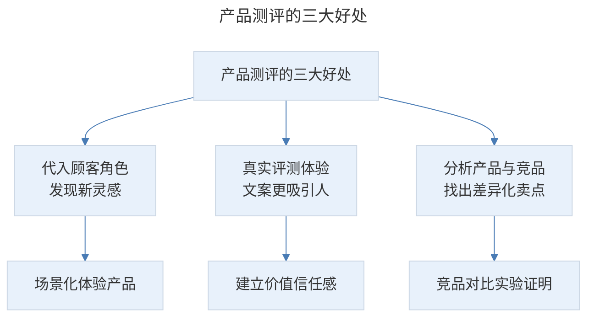
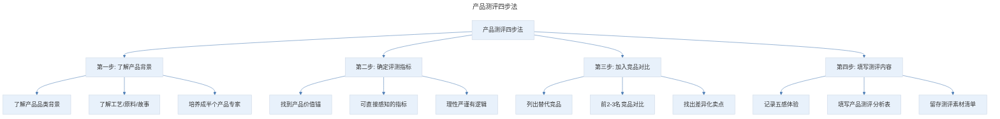

# 产品测评：20 分钟测评你的产品，如何让文案分分钟打动消费者

## 1. 导言

本节知识点：4 个步骤，1 个测评表，让你的文案先成功一半。

拿到一款产品之前，别忙着下笔，花一些时间测试和研究，对你之后写卖货文案非常有帮助，因为在测评产品过程中，更容易让你代入顾客的角色，发现一些非常棒的场景和灵感。

同时，你也会对产品的实际效果有了清晰的认知，这种真实体验能让你把文案写的更吸引人，更容易与顾客建立有价值的信任感。

写卖货文案千万不能只看图片和详情页介绍，就下判断。也不能商家说啥就是啥。如果商家说，我家的橙子比哈密瓜还甜，你就要去试吃，除了主观试吃也要有客观依据，比如用仪器测试一下它的甜度。

不然你在文案里宣称"比哈密瓜还甜"，实际酸到掉牙，顾客以后再也不会信你了。

## 2. 核心概念：为什么顾客要购买你的产品

**测评产品不能只停留在产品颜色、大小、口感、功能等基本信息的层面，还要注意一个信息：竞品。**

测评还有个好处就是，利用竞品对比，能帮你更准确把握住产品差异化卖点。并通过顾客可直接感知的方式，比如相应测评试验，证明差异化卖点的真实可靠性。

圈里有位很要好的朋友涛哥，他现在一篇推文 10 万起。曾经他接了一个卫生巾的案子，不仅看商家的产品报告，还拜托身边的女性朋友来试用这款卫生巾，同时他还买来市面上其他品牌的卫生巾做吸水性、透气性等对比实验。

他通过这一系列试用和实验评测，证明了这款卫生巾比竞品优秀的地方，帮顾客找到了放心购买的理由。

写卖货文案，下笔之前你必须要问清楚自己一个问题："为什么顾客要购买我的产品，而不是竞争对手的？"如果你没有仔细研究、测评过，在实际的文案卖货当中就会遇到很大的困难，写不出差异化和真实感，无法打动顾客掏钱购买。

> 产品测评的三大好处：代入顾客角色发现新灵感、真实评测体验让文案更吸引人、分析产品与竞品找出差异化卖点。

## 3. 关键方法：如何正确地做好产品测评

**那我们到底要如何正确地做好产品测评呢？有 4 个步骤，下面我一项一项给你讲解。**

> 产品测评四步法：了解产品背景（品类背景、工艺原料故事、成为半个产品专家）→ 确定评测指标（找到可直接感知的价值锚）→ 加入竞品对比（列出前 2-3 名替代竞品、找出差异化卖点）→ 填写测评内容（记录五感体验、填写测评分析表、留存素材清单）。

**第一步，了解产品背景**

如果是你完全不了解、不熟悉的产品，体验起来是无感的。就像很多人第一次喝红酒会觉得怎么会这么难喝，是一样的道理。那你怎样去描述其中的韵味和美感呢？我就有一次这样的经历：

曾经我接了一个黄酒的文案，因为我是从来不喝酒的，所以商家说的什么手工酿造，有糯米的甜香，我试喝了几口之后，是完全感知不到的。怎么办？我就先去了解黄酒这个品类的背景，了解它的工艺，原料以及流传的故事等。

当我了解了这些内容，再倒一杯去品尝体验，就找到那种感觉了。所以，了解产品的品类，把自己培养成半个产品专家是第一步。

**第二步，确定评测指标**

产品测评的核心是找到产品的价值锚，这个价值锚一定是可直接感知的，而不能仅仅是笼统的描述。

消费者越来越理性，你要通过理性、严谨、有逻辑的方式支撑你的这种主观体验。所以，在了解产品之后，你还要确定下来核心的评测指标。

如果，你测评的是一款 T 恤，根据产品属性和顾客群的偏好，就可以确定评测指标：

- 透气性如何？把 T 恤罩在装了热水的杯子上，看穿透过来的雾气大小。
- 吸汗性如何？滴上水，看面料吸收的快慢程度。
- 色牢度如何？黑色 T 恤洗了之后会不会掉色等等。

**第三步，加入竞品对比**

不仅要做好自家产品测评，还要做竞品的对比评测。因为，顾客在进行购买决策时，面对的除了你家的产品，还有形形色色的竞品。所以，你要列出顾客常用的替代竞品。一般是市面上同品类、同价格区间的前 2-3 名竞品。比如黄酒就有绍兴黄酒，还有北方小米黄酒，广东客家黄酒。

然后，根据你确定的评测指标，去了解替代竞品的情况。通过与同类竞品的横纵向对比，找出产品的差异化卖点。

这时候可能有小伙伴会说：兔妈，我写一篇推文可能就收几百块，如果把竞品都买回来，岂不是倒贴钱的节奏。

你不需要把竞品一一买回来，可以去和身边使用过同类竞品的人聊聊，去超市同类竞品柜台和售货员或者前来购买的顾客聊聊。另外，还有一点就是去竞品的官方页面看看，了解它们的具体情况，比如配方、工艺和原料等。

**第四步，填写测评内容**

记录下你看到的、听到的、闻到的、尝到的、触摸到的、心理感受……等等这些体验，方便后续写推文。

比如，测评完黄酒后我的记录就是：琥珀色的金黄，晶莹剔透，香气浓郁却不苦，喝到嘴里有点类似陈皮、香草、巧克力的复合味道，不辣口，胃里暖暖的。

你可以参考我的模板做一份**产品测评分析表**，方便以后做产品测评时，帮你理清思路。

## 4. 实践落地：产品测评的四个要点

为了帮助你更好地掌握，我结合产品测评分析表，再强调四个要点：

**第一个要点：在评测基础信息时，要与熟悉事物作对比。**

比如大小、重量、厚度等，不仅是通过尺子、电子秤等测量出精确的数据，更要通过与拳头、鸡蛋、A4 纸等顾客熟知的事物进行对比，让顾客更容易直接感知到。

通过具体的场景测评，给出直接可感知的效果描述。比如你测评的产品是粉底液，差异化卖点是防汗防水效果好，你在测评时就可以代入顾客日常的场景，比如，游泳，跑步的时候，测评是否花妆。

但这里可能会有个问题，就是稿子要得比较急，你真的抽不出时间去体验，怎么办？你可以把这个需要测评的场景列出清单，让商家辅助完成。也可以根据产品的属性和确定的评估指标，做类似实验。

举个例子：你要测评粉底液的防水性，就可以把粉底液涂在手上或脸上，然后用小喷壶喷水，测评是否脱妆。测评卫生巾的吸水性，可以用蓝墨水倒在上面，对比和其他品牌的吸收度。测评强力粘钩是否粘得牢，也没必要等上一周看是否掉落，只需把一桶水挂上去，看承受能力。

**第二个要点：表格第二项的特色功能，这里需要说明的是，不同产品的特色功能是不一样的。**

比如水果是甜度、水分等。护肤品是滋润度、遮瑕度、持久度、吸收度、妆感等。服装就是材质、塑形效果。养生保健类的产品，则是 XX 时间，针对某症状的实际改善程度。

另外，基础属性和特色功能不同，对应第三项测评内容【使用体验】的侧重点也不同。比如，水果要侧重描写视觉、味觉和触觉；而服饰类产品则要侧重视觉和触觉，养生保健类则要侧重味觉和心理感受的描述。

如果是课程类的产品，特色功能就是：课程内容设计方式、方法易操作度、案例丰富程度、讲师授课特点等。

**第三个要点：表格第四项的测评实验，有些简单易操作的，你可以自己来完成。**

有些需要借助专业设备，比如苹果的甜度测试仪等，你就要根据测评指标，列出测评实验，让商家辅助完成。

**第四个要点：最后一项测评总结和分析，主要包含 3 个内容：**

- 产品差异化卖点。
- 试用体验的感官描述。
- 也是最容易被人忽视的一点，测评素材清单。

不管是和拳头的大小对比，还是相关的测评试验，重要的是要把照片或实验 gif 图存下来，以便推文中使用。

比如，食品的需要颗粒特写，膏状要挤压出来，液体状、粉末状的要盛容器拍摄。玩具类的，要拍摄孩子玩耍过程，安全测试等。

总之，产品测评不外乎包含了包装、细节、对比等，加上自己对产品体验的真实感受。不过分夸大自己，也不过分抹黑竞品，而是通过具体的感官体验和有理有据的对比试验，让读者感受到你和产品的真诚。

## 5. 实践指南：产品测评的流程与总结

### 5.1 产品测评的完整流程

假如你要给一个商务笔记本写推文，商家给到你一份样品，从哪里着手呢？下面我会通过一个小案例带你回顾下产品测评的流程：

- 第一步，你要简单了解下商务笔记本这个品类，毕竟商务的和普通笔记本是不一样的。
- 第二步，要根据产品的特色功能，确定核心的评测指标：比如，是否好书写，是否挑笔，便携性，以及内页设计是否便于商务人士记录日程等。
- 第三步，记录试用体验。
- 第四步，了解竞品情况。并通过相关实验进行对比，比如，通过水笔、钢笔进行"油墨测试"对比，呈现产品的不挑笔、好书写的差异化卖点。
- 第五步，填写产品测评分析表。关于产品的大小、颜色、厚度等基本信息，可以用顾客熟知的 ipad、商务包进行直观化对比呈现。另外，最重要的一点，列出产品测评素材清单。

当你把产品测评做到位，你会发现写卖货推文更顺畅。

### 5.2 总结

知识点一：产品测评的 3 大好处

- **更容易让你代入顾客角色，发现新灵感**
- **真实的评测体验能让你把卖货文案写的更加吸引人**
- **准确分析产品和竞品，找出差异化卖点**

知识点二：产品测评的 4 个步骤

- **了解产品背景**
- **确定评测指标**
- **加入竞品对比**
- **填写测评内容**

我把这节课的重点内容做成一张知识卡片，你可以保存下来方便复习。

最后，给大家留了一个练习作业，题目是：**请找一个你喜欢的数码产品，并为其制作详细的产品测评表。**

## 6. 进阶延展：核心要点回顾

### 6.1 核心要点回顾

产品测评是写卖货文案前的基础工作，其核心价值在于代入顾客角色发现新灵感、真实评测体验让文案更吸引人、分析产品与竞品找出差异化卖点。产品测评四步法为：了解产品背景（把自己培养成半个产品专家）、确定评测指标（找到可直接感知的价值锚）、加入竞品对比（前 2-3 名替代竞品找差异化）、填写测评内容（记录五感体验并留存素材清单）。四个要点包括：基础信息与熟悉事物对比、不同产品特色功能不同、简单实验自己完成专业实验让商家辅助、测评总结分析含差异化卖点/感官描述/素材清单。通过具体的感官体验和有理有据的对比试验，让读者感受到真诚。

### 6.2 延伸思考

- 如何在时间紧迫的情况下高效完成产品测评？
- 产品测评如何与用户画像、痛点诊断等环节衔接，形成完整的文案写作流程？

---

## 参考资料

- 本案例内容来源于"极客时间"文案高手专栏第 02 节。