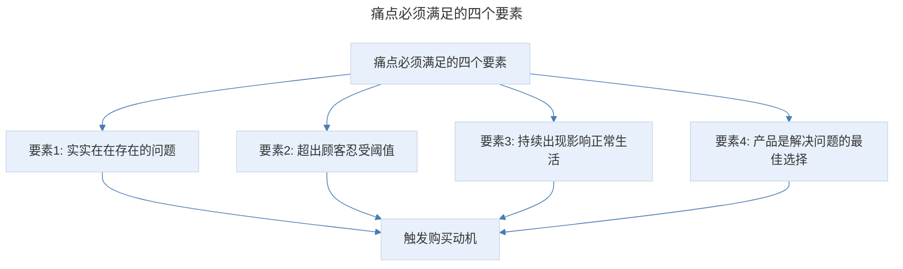
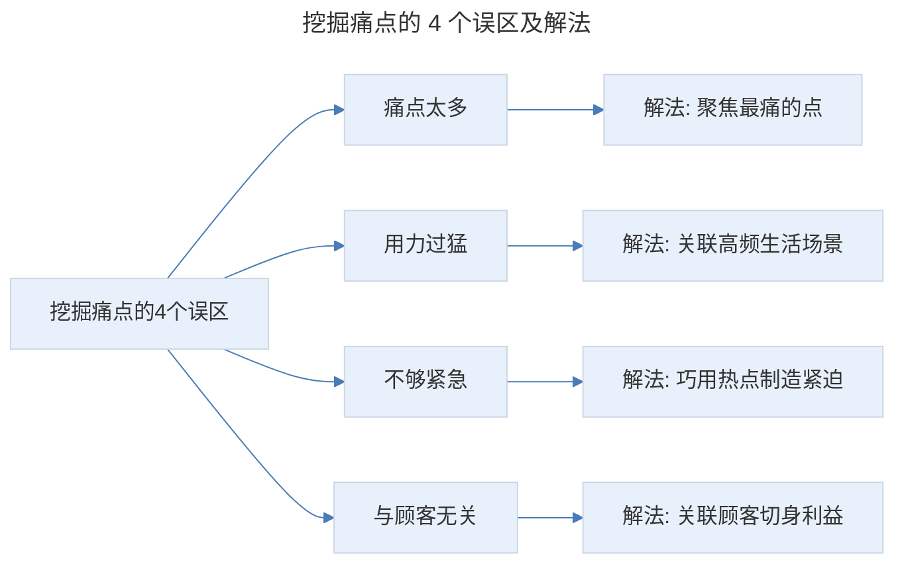
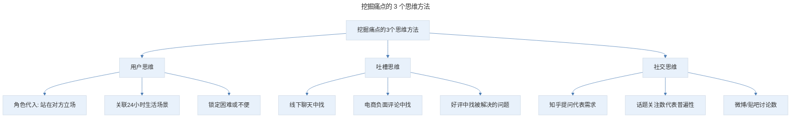
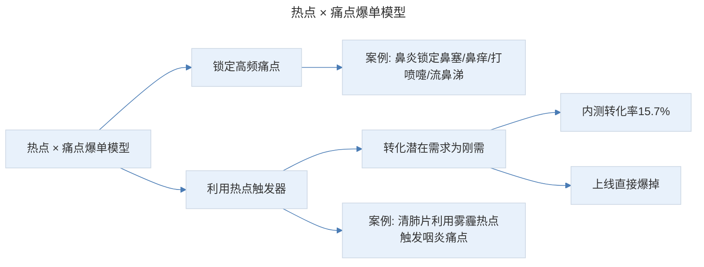

# 深挖痛点：3 招深挖顾客极痛点，如何写出有说服力的购买理由

## 1. 导言

本节知识点：3 个方法，2 个工具教你深挖痛点，透过表象看本质。

"要找到顾客的痛点"，这是无数营销人、文案人每天都在说的问题。但为什么用了同样的着数，别人卖爆了，顾客对你的产品却无动于衷呢？问题到底出在哪里？

其实，很多时候，你认为的痛点大多都是伪痛点，或者说不是顾客最痛的那根针。

## 2. 核心概念：痛点必须满足的四个要素

要找准痛点，首先你要知道什么是痛点？接下来我们先来讲第一个知识点：痛点必须满足的四个要素：

- 它是顾客生活中实实在在存在的问题。
- 超出顾客忍受阈值。这个问题超出了顾客的忍受程度，让他害怕面对。
- 问题持续出现，影响顾客正常生活。这个问题持续或反复出现，对顾客的正常生活造成了严重影响。
- 你的产品是解决这个问题的最佳选择。也就是产品卖点和顾客痛点匹配。

就拿我自己举例，我每天对着电脑写文案，有严重的颈椎病，很难受。那请问：颈椎病是我的痛点吗？事实上，刚开始，偶尔难受一下不影响生活，我也没采取任何行动，每天还是习惯性低头看手机、电脑前一坐就是几个小时，所以，刚开始的时候它并不是我的痛点。

但时间长了，疼的严重了，一低头就头晕，晚上疼的觉也睡不好，已经超出了我的忍受程度。而且不是一天睡不好，是每天都睡不好，严重影响了我的正常生活。这时候，颈椎病才成了我的痛点。我开始放下手机、坐一小时起来运动几分钟，还办了按摩卡、买了颈椎枕和颈椎仪。

在这里需要注意，挖掘痛点的目的是卖货，但你不能挖出来一个对顾客很痛的点，你的产品却无法解决。这时候，这个痛点并不能帮你达成卖货的目的。**所以，你的产品提供的解决方案，一定要与目标顾客的痛点相匹配，也就是说，你的产品是顾客解决痛点的最佳选择。**

曾经一位客户拿着刚推出的美白饮品来找我，当时他主打的是"好喝到逆天的新国货"，但我收到样品发现，并不好喝，又酸、又苦，而他吐槽竞品的味道难喝。"难喝"这个点确实是用户的痛点，但问题是你的产品也不好喝。顾客的这个痛点你解决不了，这就搬起石头砸了自己的脚。

所以，只有满足以上 4 个要素，才能触发顾客购买产品的动机，点燃顾客的购买欲望。以后在你写推文时，要先对照一下这 4 个要素，这样可以让你大概率避开伪痛点。

有人说，痛点不就是恐吓吗？我用过，现在客户都免疫了，根本没效果！我分析了大多数人的情况，发现在挖掘痛点上，99% 的人都错了！

> 痛点必须满足的四个要素：实实在在存在的问题、超出顾客忍受阈值、持续出现影响正常生活、产品是解决问题的最佳选择。只有四个要素都满足，才能触发顾客购买动机，大概率避开伪痛点。

## 3. 关键方法：挖掘痛点常见的 4 个误区

接下来，我们来讲第二个知识点：挖掘痛点，新手老手常见的 4 个误区。

**第一个误区：痛点太多。**

想象一下，如果你批判一个人又胖，又黑，又懒，又笨....他会是什么反应？立马翻脸对不对。因为改变的门槛太高了，所以，干脆老样子好了。这时候，你也不能唤起他对胖、懒这些问题的重视。痛点太多也是一样。

**第二个误区，用力过猛。**

这个也是最普遍的。夏天的时候，驱蚊产品扎堆出现，其中很多打的痛点是"叮几个小小的包，看起来可能没啥大事，但分分钟让你生命垂危"。如果是你，你会买单吗？我想大部分人不会吧！你会觉得这概率太低了。这也是为什么"吸烟致癌"说了很多年，并不能说服烟民成功戒烟的原因。

那如何拿捏恐吓的力度呢？有个关键点是：关联消费者高频发生的生活场景。同样是驱蚊产品，你就可以这样说："刚刚去过厕所、爬过垃圾桶的苍蝇、蚊子有可能飞上你的餐桌，爬上你的面包，溜进你的水杯，然后把它那根携带着千千万万病菌的针扎进宝宝娇嫩的皮肤。"是不是这样，就要比"生命垂危"让人更痛。

**第三个误区，不够紧急。**

减肥产品什么时候最好卖？入春入夏！为什么？因为脱掉了厚重的棉衣，换上短裙单衣，肥肉藏不住了，减肥迫在眉睫。所以，要学会巧用热点，让你的痛点看起来更紧急。

**第四个误区，与你的顾客无关。**

曾经看到一个无磷洗衣粉的推文，它的痛点是：普通洗衣粉中含有磷，排入地下水后，会污染饮用水，而一位 70 多岁的院士老爷爷历经几年研发，终于研究出了不污染地下水的无磷洗衣粉。故事很匠心，但顾客会为"污染地下水"的痛点买单吗？也许会，但我们大部分人都是俗人，他们更关心的是自己切身的利益！

如果你改成"洗衣粉中的磷，残留在衣服上，伤害宝宝娇嫩的皮肤，还会导致钙质流失，出现软骨病"，相信这样更能激发妈妈买单。

> 挖掘痛点的 4 个误区及解法：痛点太多（解法是聚焦最痛的点）、用力过猛（解法是关联高频生活场景而非夸大后果）、不够紧急（解法是巧用热点制造紧迫感）、与顾客无关（解法是关联顾客切身利益而非宏大叙事）。

## 4. 实践落地：挖掘目标顾客极痛点的 3 个思维方法和 2 个工具

搞懂了痛点的定义，也了解了痛点的误区。接下来，我们就讲本文第三个知识点。

### 4.1 3 个思维方法

**挖掘痛点第一个方法，用户思维。** 用户思维又有三个步骤：

- 第一步，角色代入。
- 第二步，关联用户 24 小时生活场景。
- 第三步，锁定用户在不同的场景，可能遇到的难题或不便。

下面我逐一给你讲解。

**第一步，角色代入是需要你要站在对方立场去理解他的处境。**

身边有孩子的朋友肯定发现了：现在的婴儿车都很高，而且推杆可以前后调节，但最初并不是这样的。原来的婴儿车很矮，推杆也不能调节，但上市后卖得不好，去调查宝妈，他们说婴儿不愿意坐。领导就很纳闷，就让研发人员去找问题。

然后，研发人员就坐到婴儿车里，让另一个人推着在街上走，走了几圈他们就吐槽：换作是我，我也不愿意坐这样的车。因为看到的全是脚，空气也不好，更重要的是，看不到妈妈的脸，没有安全感。

**第二步，关联用户 24 小时生活场景。**

这里给你个好用的场景坐标分析模型，横轴是时间轴，竖轴是空间地点。这样就可以发散出很多场景，7 点在家吃早饭，8 点挤地铁，9 点在办公室开会，周末在家追剧等。

**第三步，锁定用户在不同场景下，可能遇到的困难或不便。**

比如挤地铁时流鼻涕没带纸巾，开会流鼻涕很尴尬等。这样就很容易引发顾客共鸣，因为我写的就是他本身。

**挖掘痛点的第二个方法是，吐槽思维。** 就是要善于捕捉目标顾客的吐槽。你可以去线下店，到竞品柜台与目标顾客聊天，听听他们在使用竞品中的不满。

另外一个被用到最多的途径是，去电商平台，比如京东、天猫、淘宝等搜集竞品的负面评论，了解目标顾客哪些问题没有得到解决，以及好评里反馈被解决最多的问题，这些就是顾客最在意的点。

**挖掘痛点的第三个方法是，社交思维。**

拿知乎来说，提问就代表需求，话题的关注数和点赞数就代表普遍性。比如，失眠这个话题的关注数、浏览数都很高，说明失眠就是个普遍痛点。同样，还有微博、贴吧等，通过话题的参与讨论数来判断痛点的普遍性。每条回答，还会有很多关于失眠的痛苦描述，这些都是挖掘顾客痛点的灵感来源。

> 挖掘痛点的 3 个思维方法：用户思维（角色代入、关联 24 小时生活场景、锁定困难或不便）、吐槽思维（线下聊天中找、电商负面评论中找、好评中找被解决的问题）、社交思维（知乎提问代表需求、话题关注数代表普遍性、微博/贴吧讨论数）。

### 4.2 2 个验证方法

通过以上 3 种方法，你会搜集到很多痛点。那如何选出顾客的极痛点呢？

**第一个方法，是工具验证。**

主要有百度指数、微信指数。输入你搜集的痛点关键词，查看指数排序，越靠前的痛点就越高频、越普遍、越痛。

举个例子：如果公司上新一款面膜，老板让你写一篇卖货推文。老板说产品效果很好，可以美白、去黄、还能去掉脸上的小细纹、淡化法令纹。你搜集了顾客痛点，发现美白、去黄、法令纹，这些都是女性非常在意的点，怎么办呢？

你就可以把这些痛点关键词输入百度指数，发现最近这 2 年，法令纹的搜索指数呈攀升趋势，你就可以考虑把法令纹作为一级痛点。当然，这只是个参考，你还要通过本节讲的系统方法进行判断。

**第二个方法，是圈子调研。**

这也是我写推文常用的方法。当时我做鼻喷和清肺片时，为了验证对痛点的初步判断，我在朋友圈发起红包调研，8 个红包，得到 30 多条有效评论，排名前 4 位的是：鼻塞、鼻痒、打喷嚏流鼻涕、头疼。和我的推断一致。

所以，通过这 2 个方法，能快速筛选出顾客的极痛点，还可以给痛点进行优先级排序。

## 5. 实践指南：如何用痛点提升文案的销售力

那在写推文时，具体要如何用痛点提升文案的销售力呢？我给你一个非常好用的技巧：热点 × 痛点爆单模型，让你的推文转化率提升 50%。接下来，我通过实际操盘的 2 个案例，给你详细讲解下。

> 热点 × 痛点爆单模型：锁定高频痛点 + 利用热点触发器，将潜在需求转化为不得不立马解决的刚需。案例：鼻炎喷雾锁定鼻塞/鼻痒/打喷嚏/流鼻涕四个高频痛点；清肺片利用雾霾热点触发咽炎、干咳痛点。

**第一个案例：还是鼻炎喷雾的案例。**

鼻炎引发的症状有 10 多种，比如鼻塞、鼻痒、流鼻涕、浑身乏力、脸部变形、牙齿变形，还有嗅觉减退等。当时很多产品，打的点是：鼻炎导致脸部牙齿变形，嗅觉丧失，还有的列出各种鼻咽癌的新闻。这就陷入了 4 个误区，转化很惨。

我是如何做到 3 个月销售额突破 1000 万的呢？秘诀就是：聚焦高频痛点，直击要害。

当时我锁定了 4 个高频痛点，分别是：鼻塞、鼻痒、打喷嚏、流鼻涕。但光戳痛还不够，因为大多数人意识不到表面问题引发的后果，也不清楚这些痛苦经常发生会对他们的生活造成什么样的影响。

所以，我就指出鼻炎不解决会导致：影响工作和睡眠，发展成鼻窦炎，还会遗传给下一代。如果是孩子的话，导致记忆力减退，影响学习成绩。很成功，内测转化率 15.7%，复推一天的销量比原来一周还要高。

这里要强调的是，如果是针对孩子专用的盐水喷雾，脸部变形这个点就可以作为核心痛点，因为孩子的形象有非常大的可塑性，而每个家长都不希望孩子出现形象缺陷和社交障碍。这时候，脸部变形就是个极痛点。

**第二个案例是清肺片。**

上线 3 个月卖破 17 万单，单品销售额 2500 多万。但你知道吗？刚开始客户并不看好。

初步分析后，我决定操盘这个产品。但初稿出来，客户与我有了分歧，他建议主打雾霾，理由是：人们为了雾霾，买几千块的空气净化器，买上百元的防霾口罩，所以，雾霾是个极痛点。

事实上，这就是典型的需求和痛点不匹配。雾霾的最佳选择是防霾口罩，这是几年市场教育的结果。当时我就问他：如果你早上推开窗，能见度只有 50 米，你会干啥？他说：戴口罩。如果给你清肺片，告诉你：不用戴口罩，只需吃清肺片，就能把吸进去的雾霾清除掉。你会不会这样做？他说：不会。

所以，雾霾并不是痛点，它只是激发人们对某个问题在意的触发因素，是导火索。

当时是 11 月份，咳嗽非常普遍，最遭罪的是咽炎，遇上雾霾，嗓子干痒难受，我深有体会。所以，最终我采取的策略是，主打：咽炎、咳嗽的痛点，而雾霾是个痛点触发器。通过雾霾这个热点，把咽炎、干咳的潜在需求，转化成用户不得不立马解决的刚需。上线就直接爆掉了！

我用"热点 × 痛点爆单模型"，通过以上方法轻松找准痛点，让顾客购买欲望大大提升。

## 6. 进阶延展：总结与核心要点回顾

### 6.1 总结

知识点一：什么是痛点？痛点必须满足的 4 个元素

- **顾客生活中实实在在存在的问题。**
- **超出顾客忍受阈值。**
- **问题持续出现，影响顾客正常生活。**
- **你的产品是解决这个问题的最佳选择。**

知识点二：挖掘痛点常见的 4 个误区

- **痛点太多。**
- **用力过猛。**
- **不够紧急。**
- **与目标顾客无关。**

知识点三：3 个思维方法列出目标顾客可能存在的痛点

- **用户思维**：角色代入是站在对方立场理解处境；关联用户 24 小时生活场景；锁定用户在不同场景下可能遇到的困难或不便。
- **吐槽思维**：聊天中找；评价留言中找。
- **社交思维**：社交、娱乐网站上关注热门话题。

知识点四：如何选出顾客的极痛点呢？用这 2 个验证工具

通过百度指数、微信指数等数据工具和圈子调研这 2 个技巧，筛选顾客极痛点，并做好痛点的优先级排序。提升推文转化率的小技巧：**热点 × 痛点爆单模型。**

我把这节课的重点内容做成一张知识卡片，你可以保存下来方便复习。

最后，给大家留了一个练习作业，题目是：**请以眼药水为例，做一个目标人群的痛点分析，并选出最痛的 2 个点。**

### 6.2 核心要点回顾

深挖痛点的核心在于透过表象看本质，找到顾客最痛的那根针。痛点必须满足四个要素（实实在在的问题、超出忍受阈值、持续影响正常生活、产品是最佳解决方案），避开四个误区（痛点太多、用力过猛、不够紧急、与顾客无关）。挖掘痛点可通过 3 个思维方法（用户思维：角色代入+24 小时生活场景+锁定困难；吐槽思维：线下聊天+电商评论；社交思维：知乎/微博话题）和 2 个验证工具（百度指数/微信指数、圈子调研）筛选极痛点并排序。最后通过"热点 × 痛点爆单模型"（如鼻炎锁定高频痛点、清肺片利用雾霾热点触发咽炎痛点）提升推文转化率。

---

## 参考资料

- 本案例内容来源于"极客时间"文案高手专栏第 03 节。