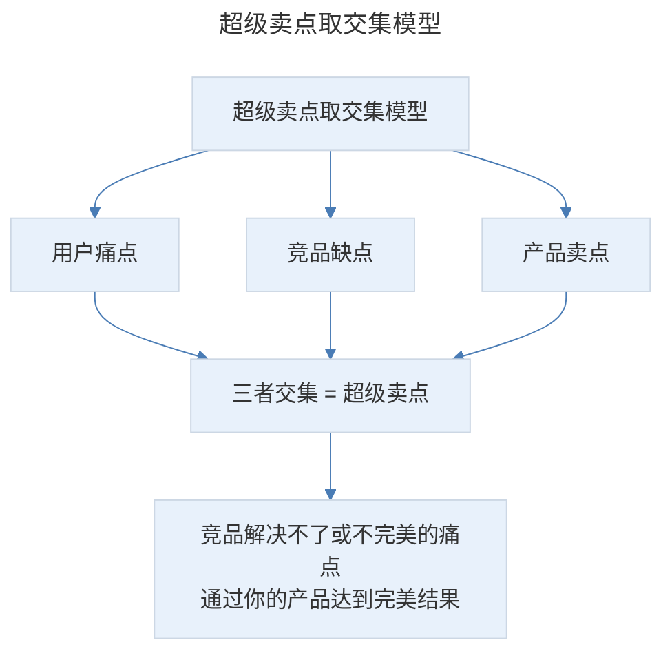
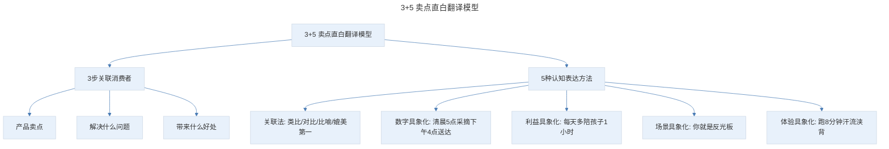

# 超级卖点：用 3+5 模型打造产品超级卖点，让顾客看了秒下单

## 1. 导言

本节知识点：打造产品超级卖点的模型，让卖点直白化的 5 个技巧。

通过推文把产品卖爆，是对文案的最大肯定。我复盘了市面上几乎所有的爆款，发现它们都满足了 3 大要素：

- **必要性**。人们只有在认同产品必要性的前提下，才有可能对产品感兴趣。
- **紧急性**。人们都喜欢拖延，所以，你要为顾客找到立即购买产品的理由。
- **不可替代性**。如果全世界只有你拥有饮用水资源或者是攻克某项疾病的专利技术，其他地方都没有，可以想象你会将它卖到什么价格？

其中，必要性和紧急性这 2 点，我们可以通过前面学过的深挖顾客极痛点，和热点 × 痛点爆单模型来实现。那如何让你的产品具有不可替代性呢？就需要打造产品的超级卖点。

## 2. 核心概念：什么是超级卖点

一句话总结就是，人无我有，人有我优，人优我质优价廉/我服务好/我性价比高/我有格调。

这也是为什么很多产品表面上面面俱到，卖点很多，转化成交却远远达不到预期的原因。因为竞品也是这样说的，甚至比你卖得还便宜，顾客为什么要买你的呢？

比如，一款洗面奶能清除毛孔污垢，请问：这是超级卖点吗？不是！因为市面上清洁强的洗面奶很多。这时候，你为了提高竞争力，升级成了氨基酸配方。与普通洗面奶相比，不仅清洁力足够，而且温和不伤肤。这时候氨基酸配方的洗面奶是超级卖点吗？刚推出时，的确能火一阵，但这种特色很容易被模仿，且成本不高。所以，也不算超级卖点。

这时候，有个品牌在氨基酸配方基础上，加入 2% 的烟酰胺，不仅洗得干净，还越洗越白。更重要的是，它的氨基酸和烟酰胺是和 SK-II 同一个供应商，价格却只有大牌的 1/10 不到。区别于一般的氨基酸洗面奶，它越洗越白，大牌成分，却是平民价格。这就是一个超越同行的超级卖点。

假如你的产品真的很普通，和市面上的差别不是很大，怎么办？没关系！通过操盘多个爆款，我提炼总结了**一个打造产品超级卖点的模型，教你如何提炼产品的超级卖点。** 它很简单，也非常有效，只要按这个方法去做，你就能轻松找到比竞品稍微优秀的超级卖点，让顾客面对千万竞品只选你。

## 3. 关键方法：打造产品超级卖点的取交集模型

什么是取交集模型呢？就是在一张空白纸上画 3 个正圆，分别列出用户痛点、竞品缺点和产品卖点，然后取三者的交集。简单理解就是，竞品解决不了或者解决不完美的顾客痛点，通过你的产品却能达到完美结果。这也是超级卖点遵循的基本策略。

> 超级卖点取交集模型：在空白纸上画 3 个正圆，分别列出用户痛点、竞品缺点和产品卖点，取三者交集。即竞品解决不了或者解决不完美的顾客痛点，通过你的产品却能达到完美结果。

为了方便大家的消化和吸收，下面我通过鼻炎喷雾的案例给你具体讲解。

鼻炎顾客的核心痛点是：

- 症状痛点：鼻塞鼻痒、打喷嚏、流鼻涕、头疼。
- 选品痛点：没有效果，刺激性大，害怕药物依赖。

竞品的缺点主要有 3 个：

- 生理盐水只能清洁，不能有效缓解症状。
- 激素类，一天要反复喷 10 多次，很麻烦，长期用还会产生药物性鼻炎，不安全。
- 中医偏方，味道刺激性强，使用体验很差。

鼻炎喷雾的卖点主要有：

- 植物配方，安全。
- 能清除鼻炎反复发作的细菌，从根本上缓解鼻炎。
- 喷一次，鼻塞就通了，效果比较明显。
- 无色无味，使用温和。
- 安全无依赖等。

竞品缺点和用户痛点重合的点，也就是竞品解决不了或者解决不完美的点是什么呢？起效慢，不安全。

所以，超级卖点就是"起效慢，不安全"的解决方案。一句话总结就是：10 秒疏通鼻塞。喷一次，鼻子舒服一整天。小孩也能用。这是推文的主线，也是要论证的核心观点。然后，使用体验，无色无味、大厂生产等就是辅助卖点。

这个提炼超级卖点的方法很简单，也很有效。在你写推文时，可以先用这个方法找到产品的超级卖点，这样你的推文就有了灵魂。

但这时候你会发现，有些产品的超级卖点很独特，但推文投放出去转化还是很惨。问题出在哪里呢？

当你看它的文案就会发现，内容很干，专业术语扎堆，让人很难有读下去的欲望，这也是心理学上有名的"知识的诅咒"现象。我们在写文案时，常常陷入一个误区，以为顾客和我们一样懂产品，导致写的文案读者理解不了，很难读下去。

**小知识点：知识的诅咒（The Curse of Knowledge）**，即：我们一旦知道了某事，就无法想象这件事在未知者眼中的样子。当我们把自己知道的知识解释给别人的时候，因为信息的不对等，我们很难把自己知道的完完全全给对方解释清楚。

所以，光有灵魂还不行，你还要站在顾客的角度，替他考虑，用他喜欢的语言风格、用他更易理解的认知表达方式，让他能秒懂你的好。

举个大家都熟悉的案例：在小米手机 2 发布时，核心卖点是性能翻倍，全球首款四核。"快"是核心关键词，也是它的超级卖点。但如何用一句话让顾客秒懂呢？据内部朋友说，当时他们出了十几个方案，有"唯快不破""性能怪兽"等，但最后选择的是"小米手机就是快"。因为够直接，能让顾客秒懂。

## 4. 实践落地：3 + 5 卖点直白翻译模型

如何写出让顾客秒懂、又不俗气的产品卖点呢？**接下来，我们就来讲本文第二个知识点：3 + 5 卖点直白翻译模型，让顾客秒懂你的好。**

**三步关联消费者**，这里的 3 指的是三步关联消费者，找到顾客的价值利益点。5 指的是，五种常见的文案表达方式，把价值量化，让顾客秒懂。

### 4.1 三步关联消费者

什么是三步关联呢？就是通过产品卖点，卖点解决了顾客什么问题，给顾客带来了什么好处，三步翻译，找到这个卖点对顾客的价值利益点。

具体如何用呢？你拿出一张白纸，画上一个四列表格，分别写下产品卖点，解决什么问题，带来什么好处。最后一列是认知表达，就是通过哪种文案表达方法写出来，如下表所示：

| 产品卖点 | 解决问题 | 带来好处 | 认知表达 |
| --- | --- | --- | --- |
| | | | |

举个例子：如果你卖的是胶原蛋白：

- 第一步：卖点是：有效成分含量高，能迅速补充皮肤流失的胶原蛋白。
- 第二步：帮顾客解决的问题是：解决害怕皮肤衰老、想拥有水嫩肌的需求。
- 第三步：给顾客带来的好处是：让肌肤变得水嫩嫩，气色变好。

最后，如何用文案表达出来呢？可以说：坚持一段时间，感觉皮肤就"pong"起来了，变得饱满有弹性，手感好到自己都爱不释手，娇嫩的像剥壳鸡蛋般吹弹可破。

### 4.2 5 种常见的认知表达方法

**第一种方法：关联法。**

简单理解就是与顾客大脑中已有的事物建立关联，常用的有类比、对比、比喻、媲美第一等。

举个例子：鼻炎喷雾"安全"这个卖点，解决的问题是，消除顾客对激素产生依赖的恐惧。带来的好处是放心。文案认知表达这里我用的是"小孩也能用"。这里就是媲美第一。因为大家有个共识，孩子用的东西安全检测级别是最高的。当然，这个产品确实是 4 岁以上小孩能用的。

再举个例子：假如你卖一款运动鞋，它的卖点是很轻。解决鞋子重，穿上累脚的问题。带来的好处是：走路很轻便。但这里如果你只说很轻，消费者的感知就很模糊，不知道到底有多轻。但如果你通过类比的方法说："轻如鸡蛋"来凸显鞋子的轻就能让顾客秒懂，不需要多余的解释。

**第二种方法：数字具象化。**

假如你开了一家水果店，如果说你家水果非常新鲜，都是果园直采的，虽然也能凸显水果的新鲜，但新鲜到什么程度呢？顾客是感知不到的。但通过数字具象化的方法，你就可以说"清晨 5 点采摘，下午 4 点送到你手中"。

**第三种方法，利益具象化。**

什么意思呢？如果女朋友问你爱不爱她。你只说一句：爱。她会觉得你是敷衍。但如果你说：爱。我愿意把工资卡交给你，每天早上做好早餐端到你面前，然后送你上下班。这时候她就会很感动。

再比如，你卖洗碗机，卖点是：全自动洗碗。但自动到什么程度呢？给我带来什么好处呢？这是个很模糊的概念，但通过利益具象化的方法，你就可以说：自动洗碗，每天让你多陪孩子 1 小时。"每天多陪孩子 1 小时"就让顾客看到购买产品后，实实在在的利益。

**第四种方法，场景具象化。**

场景具象化也是非常有效的方法。很多时候，顾客明白了这个产品的好处，但并不知道能给他的生活带来什么具体的改变，想来想去干脆就不买了。这时候，你要帮他构建一个清晰的梦境，让他在大脑中能看到购买产品后给生活带来的变化和美好体验。

比如，卖美白面膜，如果你只说"让你白一个度"，就不如说"和闺蜜拍照时，你就是反光板！"有冲击力。因为她脑海中会想象自己与闺蜜在一起时，比闺蜜更美的快感。

如何挖掘巧妙的场景呢？你可以从 3 个维度找灵感：

- 第一个维度：时间上，就是工作日，节假日，周末等。
- 第二个维度：地点上，比如公园，家里，办公室、地铁、车里等。
- 第三个维度：顾客糟心的症状，比如，一个鼻炎患者，入秋后他在家里有哪些糟心症状。在办公室会有哪些困扰等等。

**第五个方法，体验具象化。**

给大家看一个发汗服的案例：穿上它，我在跑步机上，配速为 10 分钟一公里，跑了 8 分钟的时候，汗就开始从我的额头和脸颊流了下来。30 分钟时，我已经汗流浃背，手里捏着毛巾边跑边擦。又坚持了 10 分钟，40 分钟时我从跑步机上下来，正常垂下手在身体两侧，汗水会自己从袖子里流出来。

这段文案就比你单一强调"发汗效果超级棒"更有感染力和冲击力。因为它满足了 2 个要点：

- 细节。他不说"出去跑一圈，汗就出来了"，而是说"跑了 8 分钟"。
- 画面感。"手里捏着毛巾边跑边擦""汗水自己从袖子里流出来"，顾客就像亲眼看到你试穿后流汗的画面，让他觉得更真实，而不是忽悠他。

> 3+5 卖点直白翻译模型：3 步关联消费者（产品卖点、解决什么问题、带来什么好处，找到对顾客的价值利益点）+ 5 种认知表达方法（关联法、数字具象化、利益具象化、场景具象化、体验具象化），把价值量化让顾客秒懂。

## 5. 实践指南：打造卖点的重要思维模式——用户思维

**最后我再强调一下，打造卖点其中一个非常重要的思维模式——用户思维。**

我遇到很多客户，急吼吼拿着新品来找我：兔妈，我需要你帮我打造一篇爆文。如果问他卖什么？产品有何亮点，他就说：面膜，顶多加上补水面膜，或是美白面膜。然后就接着说，原料有多棒，得了多少大奖等。

你肯定发现了，他一直在说产品的好，却从未考虑用户为什么要买他的面膜。这是典型的产品思维。

但这里我告诉你一个真相：你用 100% 的精力来策划产品的卖点，其实只有 20% 的顾客会看到，因为 80% 的用户只会关注卖点与自己的直接关系。卖点只有打动顾客的核心利益才会促使其下单，不从顾客核心需求出发的卖点文案无法达成转化。

**那正确的方法是什么呢？就是从你的目标顾客出发，针对他的痛点，给出解决方案。这是文案人必须修炼的用户思维，也是打造卖点的前提。**

拿鼻喷的案例来说，原来只罗列了清洁鼻腔、修复鼻黏膜等产品功能，但这些和用户什么关系呢？竞品也是这样说的呀？为啥要买你的呢？所以，我就站在顾客立场，针对他的痛点替他着想。

比如，考虑他感冒鼻塞时，能帮他 10 秒通气。晚上睡觉时，不打喷嚏、不流鼻涕，能让一家人都睡个好觉。见客户时，不用反复揉鼻子，也不会被扣印象分。

**当你掌握打造产品卖点的这 2 个模型，你就能避开自嗨、生硬的文案写作误区，轻松写出让顾客秒懂、忍不住下单的卖货推文。**

## 6. 进阶延展：总结与核心要点回顾

### 6.1 总结

知识点一：什么是超级卖点呢？

**一句话总结就是，人无我有，人有我优，人优我质优价廉/我服务好/我性价比高/我有格调。**

知识点二：如何打造产品的超级卖点？

- **要建立用户思维。站在顾客立场，思考你的产品能给他带来什么好处，解决什么问题。**
- **通过找到用户痛点、竞品缺点和产品卖点的交集，挖掘出产品不可替代性的超级卖点。**

知识点三：用 3+5 卖点直白翻译模型，写出让顾客秒懂的走心文案。

- **3 步找到产品对顾客的核心利益点。**
- **通过 5 种常见的文案表达方法：关联法、数字具象化、场景具象化、利益具象化、体验具象化，把对顾客的利益价值量化出来，让顾客秒懂。**

我把这节课的重点内容做成一张知识卡片，你可以保存下来方便复习。

最后，给大家留了一个练习作业，题目是：**请用卖点直白翻译模型中讲到的认知表达方法，为一款键盘，重新写一段卖点描述。**

### 6.2 核心要点回顾

爆款产品满足 3 大要素：必要性、紧急性、不可替代性。打造产品的超级卖点（人无我有、人有我优）需通过取交集模型——列出用户痛点、竞品缺点和产品卖点的交集，找到竞品解决不了或不完美而你的产品能达到完美结果的点（如鼻炎喷雾"10 秒疏通鼻塞"）。同时避免"知识的诅咒"，用 3+5 卖点直白翻译模型（3 步关联消费者找到价值利益点 + 5 种认知表达方法：关联法、数字具象化、利益具象化、场景具象化、体验具象化）让顾客秒懂。核心前提是建立用户思维——80% 的用户只关注卖点与自己的直接关系，从目标顾客出发针对痛点给出解决方案。

---

## 参考资料

- 本案例内容来源于"极客时间"文案高手专栏第 04 节。