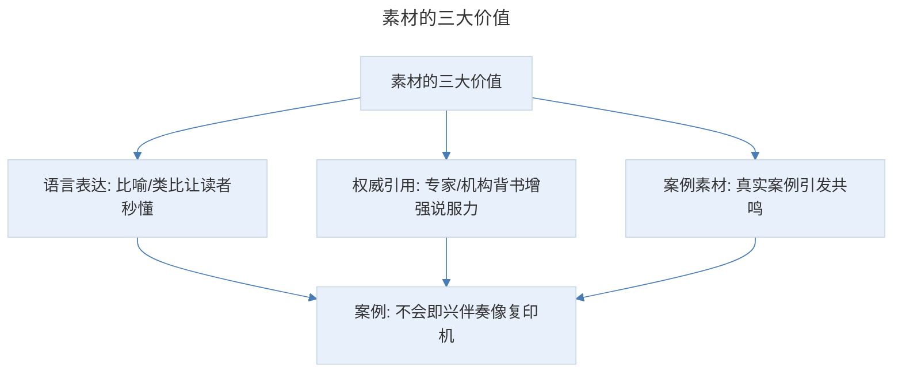
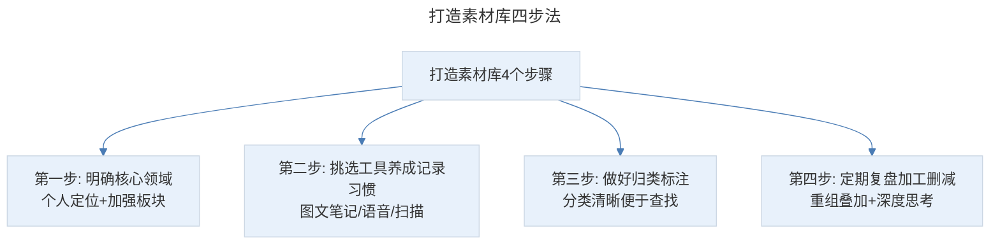
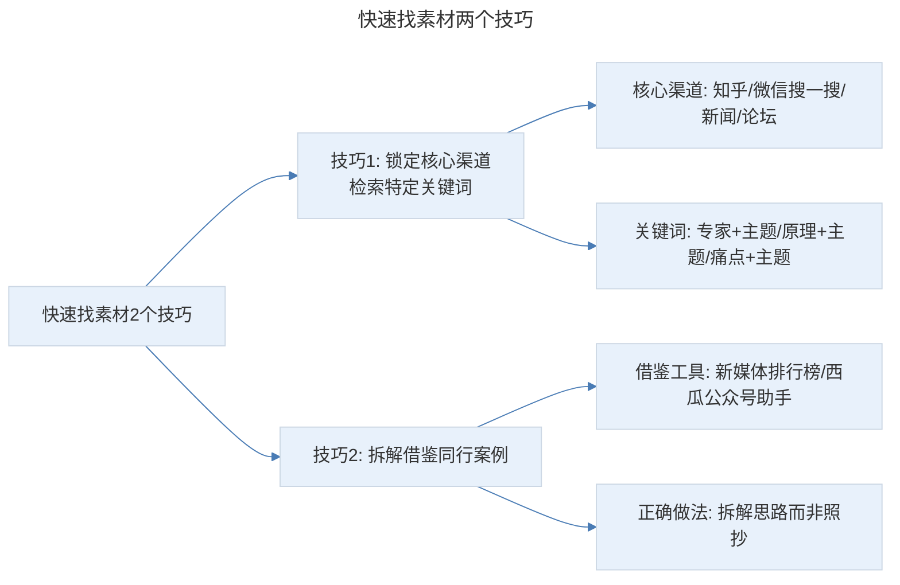

# 搜集素材：拿到产品无从下笔？学会这两招充实你的话题素材库

## 1. 导言

本节知识点：2 个技巧，3 个步骤解决写稿没思路的难题。

懂得搜集素材的人，他们总能找出恰当的案例、巧妙的表达，把复杂问题简单表达清楚。而素材少的人，经常有种弹尽粮绝的感觉，没案例可用，也不知道用什么表达方法。半天憋不出一句话，只能干巴巴地讲道理，这样的文案，阅读体验肯定不会太好。

先看一个案例：学习即兴伴奏真的很重要吗？如今，会弹钢琴的孩子非常多，但真正能够将技巧变为能力的确不多。我们经常会遇到这样的情况：有些孩子已经能够弹奏八九级的曲子了，但是如果给其一首非常简单的歌曲时，他却不能在钢琴上弹出伴奏来。

这其中一个重要的原因就在于学习弹钢琴的孩子往往疏忽了一项非常重要的技能——即兴伴奏。

这段文字道理是讲清楚了，但是阅读体验为零。我帮他重新写时，就进行了简单加工，再加上学员素材，变成了下面这样：

毫无创造力的学法，让大部分学员掌握了看谱弹琴，但却不会即兴伴奏，就像复印机一样，只会复制前人作品，手上做的只是没有感情的机械运动。

上海音乐学院教授孙维权说："中国学琴者的长项在手头上，这在世界上都是有名的，一听弹得十分熟练清晰，就知道是中国来的。但弹琴时动脑动耳不够，音乐里缺乏情感。我在全国范围内推广钢琴即兴伴奏教学，就是要扭转这个局面。"

曾经一个学习 1 年的学员，为了打好基础，坚持不学即兴伴奏，总觉得即兴伴奏会影响她的 299 计划，但现在已经按部就班的开始即兴伴奏学习了。问她怎么想通了？她说什么什么……那一刻我醒悟了，弹钢琴绝对不应该只会照着谱子弹。

**你发现这 2 个案例，加入素材前后的差别了吗？主要是 3 个方面：**

- 语言表达：我用到一个比喻，不会即兴伴奏就像复印机，让读者认识到重要性。
- 权威引用：引用上海音乐学院教授的话，而不是干巴地大喊"你要学即兴伴奏"。
- 案例素材：通过一位学员的案例，间接告诉读者想弹好钢琴就要学即兴伴奏。

在写推文之前，我对钢琴的了解是 0。灵感是哪里来的呢？两个字：素材！

可能大多数人意识到了素材的重要性，但就是不知道去哪里找素材！别慌！接下来，我们就来详细讲解。

## 2. 核心概念：素材的价值

素材是写卖货推文的基础，通过恰当案例和巧妙表达把复杂问题讲清楚。素材的价值体现在三个维度：

> 素材的三大价值：语言表达（比喻/类比让读者秒懂）、权威引用（专家/机构背书增强说服力）、案例素材（真实案例引发共鸣）。即兴伴奏案例通过"复印机"比喻、孙维权教授引用、学员案例三个素材实现增值。

## 3. 关键方法：打造千万级素材库的 4 个步骤

### 第一步：明确自己的核心领域，时刻准备着

很多时候，你找不到素材，不是因为搜集方法不对，而是没有意识到哪些内容能成为我们写推文的素材。所以，你要先明确自己的核心领域，这样能提升对素材的敏感性。核心领域有两层含义：

- **第一是个人定位层面**。比如，你主要写护肤推文，就可以多留意时尚节目、权威大号，以及闺蜜对皮肤保养的方法和吐槽。就拿我来说，平时写的推文类型主要集中在：养生、功能食品、母婴、护肤等，就会多关注养生类的综艺节目、新闻以及垂直大号。
- **第二是需要加强的板块**。拿我来说，不管是养生类还是护肤类，这些推文成败的关键是：痛点是否找准。所以，我就特别留意痛点素材的搜集。比如，前段时间，刷朋友圈看到一位好友发的换房无奈，中年人上有老、下有小的焦虑描述得淋漓尽致，很有情境感，我就截屏放入素材库。过了几天，恰好有位客户要写一篇教人买房的课程推文，我就把这个素材给他发过去，他觉得很受用。

另外，我们都有个弱点，就是本能地抗拒那些复杂的、不习惯的内容。所以，除了关注轻松的护肤节目，还要了解一些皮肤结构、产品成分和原理。

### 第二步：挑选适合自己的工具，养成随时随地记录的习惯

我们都是普通人，看过的东西很快就忘记。所以，你要把有价值的素材存储起来。工具主要有 3 类：

- **第一类：图文笔记**，比如石墨、有道云笔记、印象笔记。
- **第二类：语音类 app**，比如讯飞语记、录音宝等。如果你在等地铁、或公交时，突然看到或想到某个灵感，打字太慢又不方便，就可以用讯飞语记记录下来。
- **第三类是：扫描类 app**，比如 pdf 阅读器、微信小程序迅捷文字识别、萝卜书摘等。

常用的存储小方法有：

- **把灵感发给自己**。把自己的小号置顶，在等地铁或等人时，突然有了灵感，就记下来发给自己，然后到办公室整理进素材库。
- **微信收藏**。微信收藏一般用于短暂性素材的存储，用完觉得没价值了就删除掉；留下来的内容一定要做好标签分类。
- **拍照、截屏**。看到文章的开头、痛点描述、场景画面等觉得不错，就可以拍照、截屏保存下来。
- **公众号存储**。把优秀案例存在公众号，备注清楚价格、销售数据和自己的拆解思考，根据产品名称设置关键词自动回复清单，写同类产品时回复关键词即可弹出。

### 第三步：做好归类和标注，把好素材库第一关

素材库的重要属性就是分类清晰、便于查找。否则，找起来太费时间，也就失去了意义。我是按照写推文的核心要点和素材来源划分的，主要有顾客分析、痛点挖掘、秒懂卖点、标题、开场、激发欲望、信任背书、引导下单，以及公众号关键词清单、聊天启发等。

在大类下面还会有二次细分，比如标题，根据素材类型分为灵感、案例等；再对案例进行细分：根据领域分为养生、母婴、食品等；根据渠道分为海报标题、信息流标题等；根据套路分为故事类、实用锦囊标题等。总之，分类越精准，找素材的效率也越高！

### 第四步：定期对素材进行复盘、加工、删减

很多人搜集、分类工作都做了，但写稿时还是没思路、找不到切入点。问题就出在：缺乏对素材的定期复盘和加工。你只是存进去，把素材库变成了冷宫。所以，完成素材的搜集和分类后，还要养成一个习惯：定期对素材进行复盘、加工，必要时对没用的素材大胆删减。

一篇有新意的、有共鸣的卖货推文，并不是靠单一的某个素材，而是很多素材的重组、叠加，再加上自己的深度思考。比如我经常拆解案例，就会定期去素材库看一看。如果拆解标题，就会挑选几个案例，把不同方法提炼出来，进行重组、加工，然后举一反三，写出 1~3 个延伸案例。自己用过 2、3 次的方法，我就会删除掉，因为它已经内化成自己的一部分了，没必要占用内存。

> 打造素材库四步法：明确核心领域（个人定位+加强板块，提升素材敏感性）→ 挑选工具养成记录习惯（图文笔记/语音/扫描三类工具）→ 做好归类标注（分类清晰便于查找）→ 定期复盘加工删减（素材重组叠加+深度思考）。

## 4. 实践落地：如何快速高效找到有用的素材

结合我的经验和方法，给你 2 个技巧。

### 第一个技巧：锁定核心渠道，检索特定关键词

搜集素材的渠道有很多，包括微信体系、微博体系、行业网站、百度、知乎、论坛贴吧问答平台、媒体新闻、视频、书籍等。但如此多的信息，要一一看完吗？其实，根据二八法则，80% 的优秀素材集中在 20% 的核心渠道。我每次必看的是：知乎、微信搜一搜、媒体新闻、论坛这 4 个渠道。

为什么？知乎、媒体新闻具有专业性，论坛则能看到目标顾客的故事和心声。那具体怎么找呢？用特定关键词检索。常用的有：

- **专家 + 主题关键词检索**。拿减肥产品举例，先通过自媒体、书籍排行等找到领域专家，再用"专家 + 主题"关键词进行检索。这里专家可以是人，也可以是权威机构，比如可以搜"丁香医生+主题"。
- **原理+主题关键词检索**。写推文不能乱写，要有科学的理论依据，所以可以用"健康瘦身原理"来检索，也可以继续延展，加上成分，比如"酵素健康瘦身原理"。
- **痛苦体验 / 误区+主题关键词检索**。不管卖什么产品，想要顾客下单，必须让他主动放弃竞品，所以你要了解竞品有哪些，痛苦体验是什么。可以搜索"减肥误区"或"减肥的痛苦体验"。

### 第二个技巧：拆解、借鉴同行案例

你可以借鉴素材库里的案例，或者通过新媒体排行榜、西瓜公众号助手等第三方工具，查到各领域公众号排行榜，这些号一般都有同行的卖货推文。

切忌：不能照抄，否则可能会被投诉。正确的做法是，拆解同行案例，看哪些点是你没想到的，挖掘他们的思路为你所用。另外，记得把优秀案例存入你的素材库，以便下次查找应用。

> 快速找素材两个技巧：锁定核心渠道（知乎/微信搜一搜/新闻/论坛 4 个渠道）检索特定关键词（专家+主题、原理+主题、痛点+主题）；拆解借鉴同行案例（借助新媒体排行榜等工具，拆解思路而非照抄）。

## 5. 实践指南：素材库打造总结

### 5.1 知识点总结

**知识点一：打造素材库的 4 个步骤**

- 明确自己的核心领域，时刻准备着。主要是常写的推文领域和要加强的板块。
- 挑选适合自己的工具，养成随时随地记录的习惯。
- 做好归类和标注，把好素材库第一关。
- 定期对素材进行复盘、加工、删减。

**知识点二：如何快速高效地找到有用的素材？**

- 锁定核心渠道，检索特定关键词。如：微信、微博、百度、知乎、今日头条等。
- 拆解、借鉴同行案例，快速筛选出有用的素材。比如新媒体排行榜等。

### 5.2 练习作业

**梳理自己的核心领域，为自己做一个素材清单。**

## 6. 进阶延展：核心要点回顾

### 6.1 核心要点回顾

搜集素材是解决写稿没思路的基础，其价值体现在语言表达（比喻类比）、权威引用（专家背书）、案例素材（真实共鸣）三个维度。打造千万级素材库的 4 个步骤为：明确核心领域（个人定位+加强板块，提升素材敏感性）、挑选工具养成记录习惯（图文笔记/语音/扫描三类工具 + 灵感发自己/微信收藏/拍照截屏/公众号存储等方法）、做好归类标注（按推文核心要点和来源分类并二次细分）、定期复盘加工删减（素材重组叠加+深度思考，内化的方法果断删除）。快速找素材的两个技巧是锁定核心渠道（知乎/微信搜一搜/新闻/论坛）检索特定关键词（专家+主题/原理+主题/痛点+主题），以及拆解借鉴同行案例（拆解思路而非照抄）。

### 6.2 延伸思考

- 如何根据不同的产品类型（食品/护肤/课程/母婴）建立差异化的素材标签体系？
- 素材库如何与用户画像、痛点挖掘、卖点打造等环节形成闭环？

---

## 参考资料

- 本案例内容来源于"极客时间"文案高手专栏第 05 节。