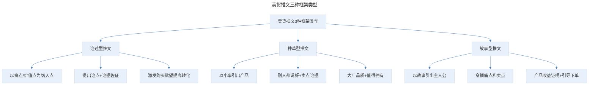
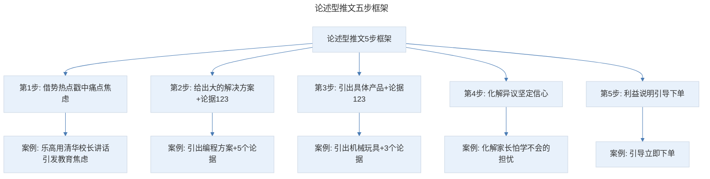
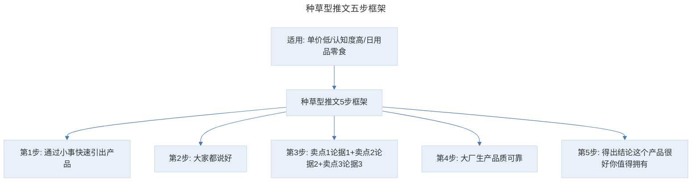
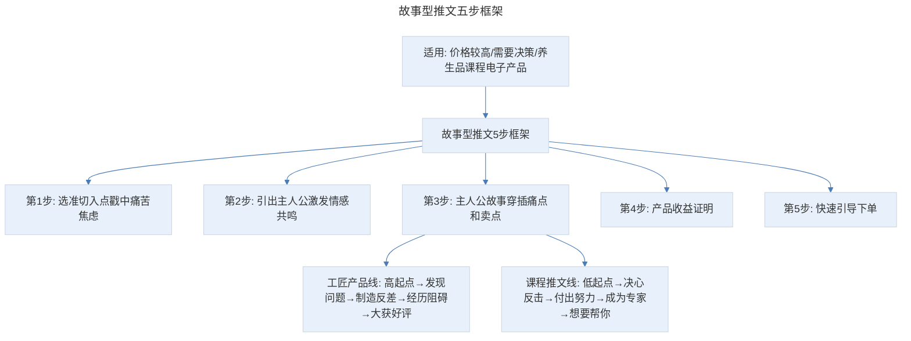

# 搭建框架：如何搭建一个逻辑清晰、吸引人的"文章框架"？

## 1. 导言

本节知识点：1 个方法，3 种类型教你搭建逻辑清晰、吸引人的文章框架。

很多文案新手甚至资深文案都容易陷入一个误区，就是忽视底层框架——逻辑。比如，你有没有感觉脑子里一大堆想法，写的时候却不知道如何下笔。就算写出来了，也条理不通畅，自己都读不下去。

抑或是洋洋洒洒写了一堆理由，加了有共鸣的故事，却没有明确的结论，更给不出足够有力、强关联的论据支撑。这样的文案，即便戳中了顾客痛点，也不能成为顾客购买你产品的理由。

文案就像一位辩论高手，你要知道：从什么角度切入？核心论点是什么？通过什么样的论据佐证你的论点？如何把论点和论据严丝合缝地链接起来。只有这样，你写出来的推文逻辑是清晰、顺畅的，能说服用户让他们下单。

## 2. 核心概念：推文的 3 种框架类型

不同类型的推文有不同的框架，我拆解市面上 300 多篇卖货爆文，总结出 3 种类型，分别是：论述型推文、种草型推文、故事型推文。掌握这 3 种框架结构，基本上能搞定 80% 的卖货推文。

> 卖货推文三种框架类型：论述型（以痛点/价值点为切入点，提出论点+论据佐证）、种草型（以小事引出产品，别人都说好+卖点论据）、故事型（以故事引出主人公，穿插痛点和卖点）。

## 3. 关键方法：论述型推文框架

论述型推文主要是以顾客的痛点和产品的价值点为切入点，提出论点（也就是，产品能帮你解决什么问题）。然后，通过一系列证据，证明产品是解决痛点的最佳选择，从而激发顾客购买欲望，提高下单转化率。

这种结构是一环套一环，层层递进的，也是最普遍、最容易爆的。但如果你按照正常的论述文逻辑，"提出论点—摆出证据—进行论述"，读者还没看就知道是广告，往往就没了兴趣。

那怎样才能写好论述型卖货文，让顾客不但想看，还会产生购买欲呢？我帮你提炼了 5 个步骤：

> 论述型推文五步框架：借势热点戳中痛点焦虑 → 给出大的解决方案+论据 123 → 引出具体产品+论据 123 → 化解异议坚定信心 → 利益说明引导下单。乐高案例完整呈现了这五步。

**第 1 步，借势热点或事件，戳中痛点或焦虑。** 就是用热点或新闻事件作为切入点，引起顾客对某个问题的痛苦或焦虑。

**第 2 步，给出大的解决方案 + 论据 123。** 针对这个问题给出一个大的解决方案。为什么不直接引到产品上呢？试想一下，如果推销员一上来就告诉你，这个产品很适合你，你的第一反应是什么？拒绝，抵触，对吧。所以，你要先跟顾客聊，聊到她心坎里了，再告诉她，其实有一款产品可以帮你成功减肥，这样她才有兴趣了解。

**第 3 步，引出具体产品 + 论据 123。** 减肥的方法有很多，为什么要选你呢？这时候，你要通过论据 1、论据 2、论据 3，让顾客相信你的产品是最佳选择。

**第 4 步，化解异议，坚定信心。** 你讲的很有道理，但顾客会担心：安全吗？没效果怎么办？所以，你要主动化解她的担忧，让她坚信真能帮她减肥成功。

**第 5 步，利益说明，引导下单。** 在做决定时，人是很犹豫的。如果没有明确的行动指引，即使你超级信任一款产品，也会犹豫。利益引导，就是让顾客知道你的产品非常值得，而且非得现在买不可。

### 3.1 案例：儿童乐高玩具

这是一个儿童乐高玩具的推文，单价 998 元，卖出 5700 多单，销售额 500 多万。

- 案例第一步，它首先通过清华大学校长讲话的热点事件，引发父母对孩子"学什么才有竞争力，才不会落伍"的教育焦虑。
- 案例第二步，它没说乐高可以提升孩子创造力，而是引出大的解决方案——编程，并通过以下 5 个论据来佐证学习编程可以提高孩子的创造力和竞争力：广东中山 13 岁小孩学习编程后研发出喂鸡投食器、教育部把编程列为必修课、16 岁少年学习编程被保送清华、成绩平平的高三学生从小接触编程被北大破格录取、编程小天才获得 56 万奖学金。
- 案例第三步，引出具体产品"机械玩具"，不懂编程的家长如何为孩子选择编程课程呢？推荐学乐高机器人就是学编程+学机械。编程是抽象思维，很难上手；相比编程，机械比较具象，看得见摸得着，在家就能学。并通过 3 个论据证明产品权威可靠：玩乐高的顶尖高手写的书、乐高教育参赛选手培训教材、国内最高水准代工厂生产。
- 案例第四步，化解异议。家长会担心：大神级别的书太难，挫伤孩子积极性怎么办？他告诉你：5 岁的孩子都能很快拼出。
- 案例第五步，通过成本算账，以及与淘宝同标准乐高的价格对比，让你看到究竟有多值，进而冲动下单。

总之，论述型推文就是通过痛点铺垫，激发需求，给出解决方案，然后用一系列论据证明方案的可靠性，逻辑非常严密。一般用于价格偏贵，目标顾客又比较严谨的产品。比如，健康类、功能类产品。

## 4. 实践落地：种草型与故事型推文框架

### 4.1 种草型推文框架

什么是种草型推文呢？像现在很多网红达人会告诉你：他与某个产品如何结缘，为何百里挑一选了它，用后的体验是什么，然后给你讲产品有这个好处，有那个好处，最后得出结论"这个产品很好，你值得拥有"，这就是种草推文的惯用套路。

种草型推文比较适合单价比较低、认知度高、大家都有大致了解的产品，比如日用品、零食等。它的结构是 5 步：

- **第 1 步：通过小事，快速引出产品。** 借助一件小事、一个场景，快速切入产品。
- **第 2 步：大家都说好。** 通过身边人、口碑等证明产品受欢迎。
- **第 3 步：卖点 1 论据 1 + 卖点 2 论据 2 + 卖点 3 论据 3……** 逐条展示产品卖点，并给出对应的论据支撑。
- **第 4 步：大厂生产，品质可靠。** 用品牌、厂家等背书增强信任。
- **第 5 步：得出结论：这个产品很好，你值得拥有。**

> 种草型推文五步框架：通过小事快速引出产品 → 大家都说好 → 卖点论据逐条展示 → 大厂生产品质可靠 → 得出结论值得拥有。适用于单价低、认知度高、日用品零食等产品。

### 4.2 故事型推文框架

故事型推文比较适合价格相对较高、需要决策的产品，比如养生品、课程、电子产品等。它的结构是 5 步：

- **第 1 步：选准切入点，戳中痛苦或焦虑。**
- **第 2 步：引出主人公，激发情感的共鸣。**
- **第 3 步：主人公故事（穿插顾客痛点和产品卖点）。** 工匠产品故事线：高起点——发现问题——制造反差——经历阻碍——大获好评；课程推文故事线：低起点——决心反击——付出努力——成为专家——想要帮你。
- **第 4 步：产品收益证明。**
- **第 5 步：快速引导下单。**

> 故事型推文五步框架：选准切入点戳中痛苦焦虑 → 引出主人公激发情感共鸣 → 主人公故事穿插痛点和卖点 → 产品收益证明 → 快速引导下单。工匠产品线和课程推文线两条故事主线不同。

**案例一：女士抑菌内裤。** 首先，选准切入点：内裤选不对，导致女性经常饱受妇科病困扰。然后，事业小成的主人公决心做不起眼的女士内裤，制造反差。接下来，费时费力：花了 2 年时间，造访各地妇科专家，研究妇科病的前因后果。最后，终于找到完美面料，成功研发出水洗 50 次，抑菌率依然 AAA 级的女士内裤。他并不是单独讲故事，而是穿插了痛点：妇科病，以及产品卖点：医用级天然面料，不像其他抑菌内裤，效果越穿越差。讲故事的目的是卖货。

**案例二：减肥课。** 首先，是主人公的低起点：一度胖到 160 斤。其次，决心反击：发誓一定要减肥。然后，付出努力：节食减肥、健身跑步、吃减肥药，研究减肥知识。接下来，成为专家：研究出一套科学减肥方法，边吃边瘦，3 个月成功减肥 50 斤。但问题是，你成功减肥后和顾客没有关系呀。所以，最后一步：想要帮助更多减肥的姐妹。她也不是单独讲故事，而是穿插痛点：不敢拍照、害怕出门见人、看到镜中的大胖子特别烦躁，同时穿插了与竞品的对比：节食、跑步、减肥药，伤身又容易反弹。

**因此，在搭建故事框架时，一定要把顾客痛点和产品卖点穿插进去，否则，你的故事就没有销售力。**

## 5. 实践指南：搭建框架时的 2 个注意事项与小标题技巧

### 5.1 搭建框架的 2 个注意事项

**第一，认真对待提纲。** 很多人写提纲时，就简单写了大体的想法，非常粗糙。结果写稿时，还是思路混乱。拿我来说，提纲基本就写了 1000 字，每一步框架就写了一小段，知道这段写哪个卖点，用什么方法和案例论证，有哪些场景等，所以，我写提纲很耗时间。但提纲好了把每段内容扩充开，再稍加润色优化，一篇推文就完成了。

**第二，重视小标题。** 小标题就像一个个台阶，可以吸引并引导顾客一直往下阅读。但很多人写小标题就是简单地把之前段落的内容总结复述一遍，非常平淡，只能起到装饰的作用，意义不大。

### 5.2 写好小标题的 3 个技巧

- **用疑问句**，使读者对下文产生好奇心和兴趣。比如，有没有办法可以缓解失眠，又不用担心安眠药物的危害？眼唇、脸部卸妆清洗，能不能一瓶搞定？
- **故事索引**。把小标题做成循序渐进的，这种方法适合故事型推文。比如：为了减肥，她掉坑无数，终于，3 个月减掉 50 斤！一句话就是一个小故事，吸引你继续阅读。
- **核心卖点**。把产品核心卖点和卖点获得的好处，用小标题凸显出来。比如"1 袋 = 3g 鲜人参 + 480 粒鲜枸杞""专利高活性精华，15 分钟吸收""400 多年御用古方升级，不上火，好吸收"等，小标题本身就是产品的核心卖点。这样对那些不细看、只是快速浏览的顾客来说，能轻松 get 到购买理由。

## 6. 进阶延展：总结与核心要点回顾

### 6.1 知识点总结

**知识点一：3 种常见推文的框架搭建步骤**

- **论述型推文**：借势热点戳中痛点焦虑 → 给出大的解决方案+论据 123 → 引出具体产品+论据 123 → 化解异议坚定信心 → 利益说明引导下单。
- **种草型推文**：通过小事快速引出产品 → 大家都说好 → 卖点 1 论据 1 + 卖点 2 论据 2 + 卖点 3 论据 3 → 大厂生产品质可靠 → 得出结论这个产品很好你值得拥有。
- **故事型推文**：选准切入点戳中痛苦焦虑 → 引出主人公激发情感共鸣 → 主人公故事（穿插顾客痛点和产品卖点）→ 产品收益证明 → 快速引导下单。

**知识点二：搭建框架时的 2 个注意事项**

- 认真对待提纲。
- 重视小标题。

**知识点三：3 个技巧帮你写好小标题**

- 用疑问句。
- 故事索引。
- 核心卖点。

### 6.2 核心要点回顾

文案框架的核心是底层逻辑——像辩论高手一样明确切入点、核心论点、论据和逻辑链接。我拆解 300 多篇卖货爆文，总结出 3 种推文框架：论述型（借势热点戳痛点→大方案+论据→具体产品+论据→化解异议→利益引导下单，最普遍最容易爆，适用于价格偏贵且顾客严谨的健康类/功能类产品）、种草型（小事引出产品→大家都说好→卖点论据→大厂品质→值得拥有，适用单价低认知度高的日用品/零食）、故事型（选切入点→引主人公→穿插痛点和卖点的故事→收益证明→引导下单，适用高价需决策的养生品/课程/电子产品）。搭建框架需认真对待提纲、重视小标题，并通过疑问句、故事索引、核心卖点 3 个技巧写好小标题。

### 6.3 练习作业

**请找一款产品，分析它适合哪种推文类型，并试着搭建推文框架。**

---

## 参考资料

- 本案例内容来源于"极客时间"文案高手专栏第 06 节。