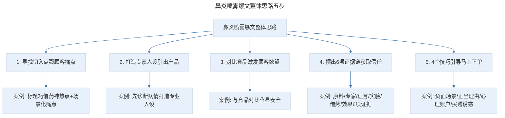
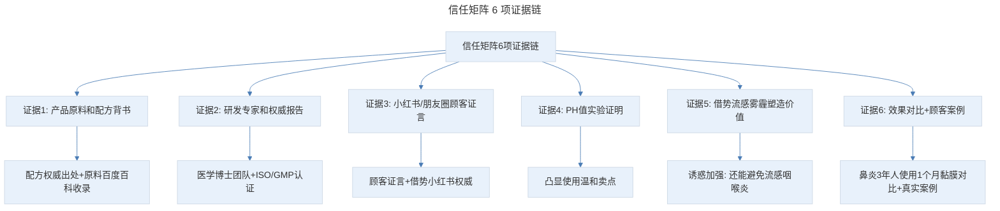
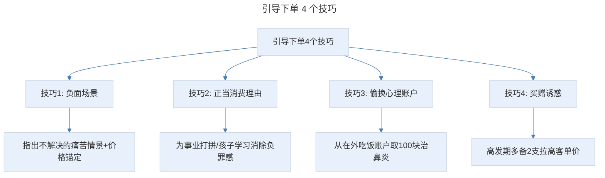

# 案例拆解 A：揭秘千万级爆款案例使用的 6 大狠招，手把手教你做爆款

## 1. 导言

本节知识点：1 个方法，6 个狠招手把手带你拆解爆款文案。

有些人学了很多套路，每天也很辛苦地练习，但总感觉提升不明显。问题就出在：缺少案例拆解这步整合训练。今天，我会手把手，从头到尾带你来拆解一篇爆款文案，案例是我操盘的一篇鼻炎喷雾的推文。

去年 9 月入秋，我感冒诱发鼻炎，晚上鼻塞睡不着，白天头疼没法写稿。当时的合作方给我带了 2 支鼻喷，说效果非常好。结果我用了不到一周，鼻塞缓解了。

他说产品复购很高，但首次购买一直上不去，我让他发来推广文案，发现优化空间很大，就这样，我重新给他操盘了这个产品。他的原话是："姐，你能帮我把仓库里的一万支卖完，我就谢天谢地了。"

果不其然，重新上线后真的很火爆，复推第一天就超过了原来一周的销量。一万支，不到一周就断货了。3 个月卖破 10 万单。ROI 1:9，也就是投 1 块广告费，可以赚回 9 块钱！

拆解之前你首先要知道：我们要拆解什么？主要包括 3 部分：框架架构、卖货逻辑（也就是证据链）、文案表达。

## 2. 核心概念：拆解爆文的 3 项内容与整体思路

正确拆解爆文包含 3 项内容：框架架构、证据链（卖货逻辑）、文案表达。鼻炎喷雾这篇爆文的整体思路如下：

> 鼻炎喷雾爆文整体思路五步：寻找切入点戳顾客痛点 → 打造专家人设引出产品 → 对比竞品激发顾客欲望 → 摆出 6 项证据链获取信任 → 4 个技巧引导马上下单。案例完整呈现了这五步的落法。

## 3. 关键方法：标题与开场白拆解

### 3.1 标题拆解

首先，我们来看标题："鼻炎界的'印度药神'！传承 440 年的草本配方，10 秒疏通鼻塞，喷一喷舒服一整天！小孩也能用！"

接下来，我们一起分析下这个标题：

- **巧借热点，抓人眼球。** 当时电影"我不是药神"热映，所以我就用这个热点来吸引眼球，并凸显产品效果好。
- **用"鼻炎界"这个关键词筛选目标顾客。** 就像我，接到其他广告会丢垃圾桶，但只要是鼻炎的，不管是小卡片，还是宣传单，都会收起来。为什么？因为这个话题是与我有关的。
- **"10 秒疏通鼻塞，喷一喷舒服一整天"，用"数字+结果"量化产品价值。** 用的是"急功近利"的行为驱动因素。并且数字本身也更容易吸引注意。
- **"小孩也能用"，用到了卖点认知表达中媲美第一的技巧。** 把"安全、无添加"的卖点，翻译成顾客秒懂的人话，凸显产品安全性。

当时这篇推文的打开率比此前提升 1.47 倍！这意味着花同样的广告费，能获得比原来高 1.47 倍的业绩！

### 3.2 开场白拆解

"秋天来啦！没那么燥热了，但对于鼻炎朋友来说，苦逼才刚刚开始……鼻子不通气，一会左鼻孔，一会右鼻孔，一会两个鼻孔都塞住了~"

同事林子是个老鼻炎，每年 9 月前后，鼻炎就加重，尤其阴天下雨，打喷嚏流鼻涕不说，鼻子不通气说话也嘟嘟囔囔，就像感冒永远好不了，部门开会他永远在揉鼻子、擤鼻涕……

发现了吗？我用了热点 × 痛点爆单模型和故事开场的技巧。其实，这个故事就是鼻炎群体的用户画像。通过故事描绘出鼻炎 3 大痛点：鼻塞、流鼻涕、打喷嚏。

### 3.3 场景化痛点引发用户共鸣

接下来，列出 4 个场景的痛苦经历："办公室开会""晚上睡觉""上班挤地铁""头疼"。这几个痛点是顾客群中普遍、高频发生的。

你注意到了吗？我没有直接写出痛点，而是结合具体场景来描述痛点。没有说"难受得要死"等主观描述，而是用具体动作和感受"揉鼻子、擤鼻涕""脑袋要炸开"，这样顾客更容易代入，引发共鸣。

戳完痛点就行了吗？不行！顾客可能会想：忍一忍就过去了，这样就失去了成交他的机会。所以，要明确告诉他：鼻炎不解决的严重后果。并且引出中小学生群体，指出对孩子造成的严重后果：孩子处于学习关键期，鼻炎不仅头晕、头疼影响学习成绩，还会导致记忆力减退！父母最怕的是什么？孩子成绩差！所以，我锁定的痛点就是"头晕""头疼"，导致孩子"记忆力减退，影响学习成绩"，成功激发顾客解决鼻炎的欲望。

此时，站在顾客角度，他会想什么呢？就是鼻炎这么可怕，我能用什么方法解决？

## 4. 实践落地：从客观评测到构建信任矩阵

### 4.1 客观评测：与顾客站到统一战线

接下来，我就给他客观评测各种方法的优劣。客观评测各种治疗方法的优劣，与顾客站到统一战线。这里我没有盲目打击竞品，而是"与顾客站到统一战线"讲人话，让他觉得我是真心替他考虑，考虑效果、性价比、使用体验，目的只为帮他选一款好产品。尤其是"谁用谁知道"，就像好朋友聊天，拉近与顾客距离，获取信任。

### 4.2 引出产品与产品论证

我没有直接说最好的就是某某某，而是说最好的还是喷雾，先指出喷雾这个大品类，接下来再过渡到产品"给你推荐一款好用又不贵的喷雾"。让顾客觉得：我是测评很多，才为他选出来这一款。

再然后，就要论证：为什么它是最好的解决方案？

- **第一个证据："在说它神奇之前，你一定要知道，鼻炎的源头在病毒真菌感染！"** 讲诱发鼻炎的因素有哪些？这里我在打造专家人设。就像医生看病一样：先诊断病情，问你是不是有这些症状，接下来告诉你是什么病，为什么得病。这样你就会觉得大夫很专业，也更容易接受他推荐的治疗方案。并且顺势用专家人设指出"鼻炎不解决"会导致的严重后果，比如"导致鼻窦炎，哮喘、习惯性头晕头疼甚至遗传给下一代"等，这里没有过度恐吓。
- **第二个证据：竞品对比。** "相比于市面上普通的鼻炎喷剂，它究竟有什么不同之处呢？"市面上有很多鼻炎喷剂、滴鼻剂都有什么成分，这是常用的减充血剂，喷上去效果明显，但很快又反复，一天要喷 10-15 次。通过与竞品的对比，凸显产品安全的卖点。并再一次用到"痛点恐惧"——使用竞品的痛苦经历。这里指出使用竞品的后果，并展示一些负面案例。我还搬出了丁香园的权威言论，告诉顾客：这不是我胡编乱造的，是有事实依据的。

### 4.3 描述使用体验与再次竞品对比

我通过展示产品的配方，以及身边朋友和自己的使用体验，强化产品"安全有效"的卖点！与竞品的不安全形成鲜明对比，凸显产品的好。

接下来，我再一次用"竞品对比"。打击了激素类喷雾，并用到了知乎上搜集来的素材，让读者看到用过激素的人是怎么说的。为什么要强调这一点呢？当时扒了市面上的竞品，发现有很多国外品牌的喷雾，比如泰国、新加坡等。很多人会选择找代购，或网上购买。

但到这里你会发现，不管是痛点恐惧，还是竞品对比，我调动的都是顾客的感性情绪。当顾客蠢蠢欲动，想要下单时，他可能还会犹豫，这款鼻喷真的像你说的一样好吗？所以，要构建信任矩阵，让顾客相信产品真的安全、有效。

### 4.4 构建信任矩阵：6 项证据链

> 信任矩阵 6 项证据链：产品原料和配方背书（配方权威出处+原料百度百科收录）、研发专家和权威报告（医学博士团队+ISO/GMP 认证）、小红书/朋友圈顾客证言（顾客证言+借势小红书权威）、PH 值实验证明（凸显使用温和卖点）、借势流感雾霾塑造价值（诱惑加强，还能避免流感咽喉炎发作）、效果对比+顾客案例（鼻炎 3 年人使用 1 个月黏膜对比+真实案例）。

经过 2 轮竞品对比，和 6 项证据链佐证，打消了顾客的顾虑。站在他的角度，此刻会考虑什么呢？就是：我买回去，能给我带来什么好处？

所以，我列出了顾客生活中的 5 个场景，并描绘出不同场景下带来的具体好处，让他觉得：这么多场合都能享受到鼻喷带来的便利，还是买一只吧。其实，"使用场景"的本质是"假设成交"。假设顾客已经拥有了这个东西，让顾客在具体场景中不断感受它带来的好处。如果不买，就会觉得很糟糕，刺激马上下单。

## 5. 实践指南：4 个技巧引导马上下单

最后一步：引导下单我用了 4 个技巧：

> 引导下单 4 个技巧：负面场景（指出不解决的痛苦情景+检查费价格锚定凸显 99 元更便宜）、正当消费理由（为事业打拼/孩子学习，消除花钱负罪感）、偷换心理账户（从"在外吃饭"账户取 100 块治鼻炎，降低花钱难度）、买赠诱惑（利用占便宜心理，高发期多备 2 支拉高客单价）。

**第一：负面场景。** 先指出鼻炎不解决可能会遭遇的痛苦情景，让顾客觉得现在不重视，付出的代价可能会更高。另外，检查一次几百块，这也是价格锚定，凸显 99 元的鼻喷更便宜。

**第二：正当消费理由。** 我告诉顾客购买产品，是为了让他更好地为事业打拼，让孩子提高学习效率，消除花钱的负罪感，促使尽快下单！

**第三：偷换心理账户。** 让顾客从"在外吃饭"的心理账户中取出 100 块钱用于治疗鼻炎，他心理上花钱的难度就降低了，更容易做出购买决策。

**第四：买赠诱惑。** 为了提升销售额，我告诉他，现在是鼻炎高发期，趁着活动多备 2 支，这样明年春天花粉季，鼻炎就不容易发作了。利用顾客占便宜心理，拉高客单价。

## 6. 进阶延展：总结与核心要点回顾

### 6.1 知识点总结

**知识点一：正确拆解爆文的 3 项内容**

- 框架架构。
- 证据链。
- 文案表达。

**知识点二：鼻炎喷雾这篇爆文的整体思路**

- 首先，寻找切入点，戳顾客痛点。
- 其次，打造专家人设，引出产品。
- 然后，对比竞品，激发顾客欲望。
- 接着，摆出 6 项证据链，获取顾客信任。
- 最后，4 个技巧引导马上下单。

当你掌握要领，你会发现写好卖货推文没那么难。

### 6.2 核心要点回顾

案例拆解是提升文案能力的整合训练，需拆解框架架构、证据链、文案表达 3 项内容。鼻炎喷雾爆文的整体思路是：寻找切入点戳顾客痛点（标题巧借"我不是药神"热点+用"鼻炎界"筛选目标顾客+"数字+结果"量化价值+"小孩也能用"媲美第一）、打造专家人设引出产品（先诊断病情）、对比竞品激发欲望（与竞品对比凸显安全+搬出丁香园权威）、摆出 6 项证据链获取信任（原料配方背书、研发专家权威报告、小红书/朋友圈证言、PH 值实验、借势流感雾霾、效果对比顾客案例）、4 个技巧引导下单（负面场景+价格锚定、正当消费理由、偷换心理账户、买赠诱惑）。最终实现 3 个月卖破 10 万单、ROI 1:9 的成绩。

### 6.3 练习作业

**请在公众号挑选一篇吸引你、并且让你有点想买的产品推文，试着对其拆解。**

---

## 参考资料

- 本案例内容来源于"极客时间"文案高手专栏第 07 节。