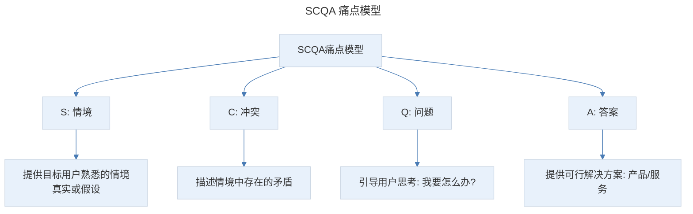
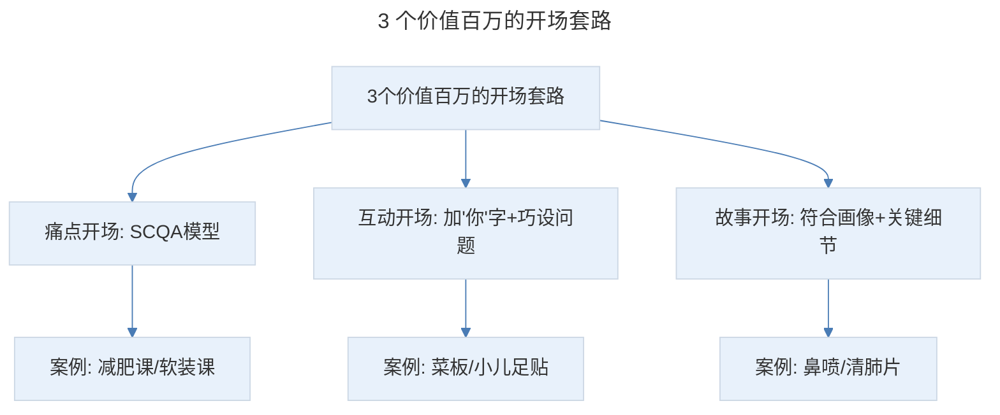
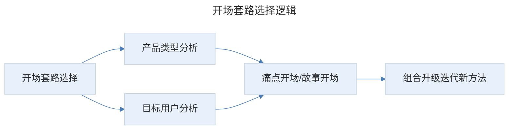

# 勾魂开场：如何写出吸引顾客眼球的开场白，让他 10 秒上瘾戒不掉？

## 1. 导言

本节知识点：3 大法则，3 个开场套路。

一个好标题，能吸引比普通标题多 3~5 倍的流量。但打开后读者就一定会认真阅读吗？绝大多数时候，都不会！而能否让读者留下来的决定性因素，就是你的开场白。

如果把文案人比做狙击手的话，开场就是你射出的第一颗子弹。第一颗子弹射偏或哑火，读者就会立马点击右上角的叉叉按钮，再也不回来了。那你正文写得再精彩都毫无意义。

然而，想要写出一个留住读者的好开场并不容易。没有方法的人，往往要花 2-3 个小时想开头，结果还是转折生硬。没关系，今天我就来给你一套简单有效的方法，教你如何让顾客愿意读下去的勾魂开场。

## 2. 核心概念：极具吸引力开场的 3 大法则

- **要简单易读**，要让读者在几秒钟内就能读懂、理解。
- **要关联用户**，读者只关心他自己，所以，你要让读者认为与他有关。
- **要投其所好**，根据读者的兴趣喜好找切入点。

先来回忆一下：你拿出手机看一篇推文的情况？你可能是睡眼惺忪刚醒来、也可能在地铁上，或是正在和朋友聊天、在吃饭，你被标题吸引着点了进去，不管在哪里在干什么，此时的你都是心不在焉的。你快速的瞄了一眼，心理是这样的："哎呀，这文章好烧脑啊，看不懂"，关掉！"呵呵，农药防病虫和我没半毛钱关系啊，浪费时间"，关掉！

每天面对海量的内容，我们是以一种机械的方式在浏览。你不知道今天要看什么，要买什么，你只是机械地刷刷刷，但潜意识里你是有个筛选标准的：晦涩难懂的不看，浪费脑细胞；和我没关系不看，浪费时间。

而唯有简单易懂的、与你有关的内容，才能打断你这种机械反应，迅速吸引你进入"短暂的沉浸状态"。对于读者也一样，你要投其所好，吸引他进入"短暂的沉浸状态"。此时，他的大脑才能敞开，你才能把广告信息输入给他，成交也就变得水到渠成了。

**一个好开场要遵循的 3 大法则：简单易读，关联用户，投其所好。**

## 3. 关键方法：痛点开场——SCQA 痛点模型

### 3.1 痛点法的核心

什么是痛点法呢？就是戳他的软肋，激发他的恐惧和焦虑。比如，比闺蜜长得丑，比同学混得差，喜欢的裙子拉不上拉链，一到冬天皮肤就干燥起皮等等，让读者内心中产生一种自我映射，"对对对，我就是这样"。

这里的关键是：痛点要找准。挖出了痛点，那么在实际中，我们如何将用户的痛点精准地描述出来呢？

**这里给大家推荐一个屡试不爽的方法——SCQA 痛点模型。这是麦肯锡公司提出的一种逻辑思维方法，包括 S：情境，C：冲突，Q：问题，A：答案这四个部分。**

> SCQA 痛点模型：S 情境（提供目标用户熟悉的情境，真实或假设）→ C 冲突（描述情境中存在的矛盾）→ Q 问题（引导用户思考"我要怎么办？"）→ A 答案（提供可行解决方案，即你要卖的产品或服务）。该结构一直引导你站在目标用户角度思考，避免自嗨。

- 我们先提供一个目标用户熟悉的情境，这个情景可以是真实发生的，也可以是假设的。
- 紧接着，描述情境中存在的矛盾，就是 C。
- 然后，引导目标用户反思和思考，我要怎么办，也就是问题 Q。
- 最后提供可行的解决方案 A，就是你要卖的产品或服务。

这个结构的优势在于，它一直在引导你站在目标用户的角度思考，避免自嗨。

### 3.2 案例一：减肥课程

首先就描述出了小编具体经历的情境，"早起想美美地出门，结果最爱的裙子却拉不上拉链了"，由此让目标读者产生共鸣，拉近与读者间的距离；但仅仅拉不上拉链是不足以刺激读者采取行动的。所以，要制造冲突，让矛盾升级，"因为微胖的身材，错失主管职位""去海边旅游，只能眼巴巴看着闺蜜穿漂亮的比基尼"；此时读者寻找解决方案的欲望就非常强烈了。接着提出目标用户关心的问题，"我一定要瘦下来，只是要用什么方法呢？"；最后给出解决方案，某老师的减肥课，帮你轻松变瘦变美。

### 3.3 案例二：软装课程

描述的情境是："你干了 7、8 年，拿着 8000 元的月薪。一个方案改了 N 个版本，但为了所谓的 KPI 只能忍气吞声，没有周末和节假日。"紧接着，制造冲突"这么累就算了，领导还不给你加工资"。然后，提出扎心的问题"受不了你的工作，你敢说：我不干了吗？"最后，通过一个小案例引出解决方案：学习某某课程，让你赚到 3-5 倍的工资，不用受客户和老板的气！

细心的同学可能发现了，我是根据目标用户的普遍现状，假设的一种情境。戳的是职业焦虑，以及对刁钻的客户、抠门老板的愤怒。这个课程单价是 499 元，有 20 节线上课，和大多竞品的 99 元、199 元比起来高出很多，但当时的转化率是 4.8%，远高于同行的 1%-2%！

这里需要给大家强调的是，有些文案可以看出清晰的 SCQA 结构，但有些呢，则会侧重其中的某个部分。这里最重要的是情境 S 和冲突 C。这 2 部分也是引发读者共鸣的关键。情境和冲突都是通过文字描述，创造了一种具体的可视化画面，比如"早上起床，最爱的裙子拉不上拉链了"，让读者脑海中忍不住浮现某天早晨自己衣服穿不上的情形，更容易调动起共鸣和情绪。

## 4. 实践落地：互动开场与故事开场

### 4.1 互动开场

文案的本质是沟通，而沟通的核心是和你的读者多互动。相信在很多演讲现场，你经常看到这样的情况：演讲者上来首先和大家做个游戏，或者向观众提出一个问题。其实，本质就是用互动的方式创造与读者的相关性，调动观众的参与感，进而引起对方的关注。

**案例一：菜板推文（卖了 100 多万）。** 开头是这样写的"你发现没？平时我们用的菜板还挺难打理的：用不了多久就会有很多刀痕，坑坑洼洼的洗不干净，切菜容易串味，还会染色和开裂。"是不是就像 2 个宝妈聊天一样，很容易就代入了。

**案例二：小儿足贴。** 在文章开始之前呢，我想先跟宝妈聊几个问题：每年，你家孩子感冒、发烧、咳嗽几次？每年，你要带娃去几次诊所、医院？每年，你在孩子健康上花的钱起到了多大的效果？

用心的小伙伴发现了，这里有个魔力关键词"你"。当开始使用"你"这个字时，读者潜意识会认为这个内容是与自己有关，他们的信息接收装置就会打开，这也是成交的基础。

这时候，很多小伙伴可能会说，兔妈，不就是加入"你"字吗？我用过，效果不大。其实，互动开场能不能成功抓住读者的注意力，除了"你"字，最核心的秘诀是问题的设计。提问本身就自带力量。但如果是平凡了无新意的提问，比如：你对现在的工作满意吗？你一熬夜就有黑眼圈吗？被读者忽略的风险就会很高。所以，你要站在读者的立场思考，这个问题是否会让他有任何新奇发现？能不能诱导对方采取正面的行动？

举个例子：请问：你昨晚睡得好吗？对比请问：你有多久没有像婴儿一样毫无戒备地美美睡上一觉了？同样的表达意思，但第二个力度就明显强很多，也更容易促使读者采取正面的行动。

### 4.2 故事开场

如果想要让某人恋爱结婚，先不要急着催促他去交友、去相亲，而是要激起他们对爱情的向往和渴望。最聪明的办法是给他讲一个关于爱情的故事。当人们听故事时，他们潜意识的闸门是打开的，也更容易受剧情驱动，被唤起某种强烈的情绪，情绪越强烈，越容易形成记忆和影响。

好的故事开场有 3 个标准：不落俗套、短小精悍、穿透力强。

**第一，符合用户画像。** 你要讲的是会发生在目标用户身上的，有代表性的故事，这样才能让你的目标用户觉得：是的，这说的就是我。这就需要你根据用户画像去为剧本主角设置情境，包括基本属性（身份、年龄、性别、职业），社交属性（经常出现的场所，日常动态）等。曾经有一位学员，她的核心人群是 30-35 岁的中产文艺女性，而她的故事主人公则是一位 80 岁的老奶奶，即便这个故事再出彩，也很难让目标用户产生代入感。另外，这里还有个增加真实感的小技巧，就是直呼其名。比如闺蜜文文，同事林子等，而不是简单说我有个朋友。

**第二，描述关键细节。** 注意，这里我说的不是丰富的细节，而是关键细节。你要舍弃掉那些不痛不痒的事实，只保留尖锐的关键细节，比如场景、冲突等。这样你的开场才能短小精悍、有穿透力，才能戳中读者的内心深处。

**案例一：鼻喷（上线一周卖了 1.7 万单，3 个月销售额 1000 万+）。** 这里"同事林子""老鼻炎"是目标用户的基本属性，"办公室开会"是社交属性。"每年 9 月前后，鼻炎就加重，尤其阴天下雨，打喷嚏流鼻涕，鼻子不通气说话也嘟嘟囔囔，就像感冒永远好不了，部门开会他永远在揉鼻子、擤鼻涕……"是关键细节。其中，时间（每年 9 月前后，阴天下雨），场景（办公室），人物（同事林子），冲突（开会他永远在揉鼻子、擤鼻涕）。全段我没有说"鼻炎很难受"等主观描述，而是通过一个浓缩了的目标用户特征的小故事，激发目标读者对鼻炎的恐惧。当读者代入后，就会产生一个疑问：他是如何解决鼻炎痛苦的？就想要继续看下去。

**案例二：清肺片（销售额已突破 3100 万）。** 这个开头我也用了故事开场。这里"慧姐""10 岁的儿子""老人"就是目标用户的基础属性。并通过"孩子呼吸道感染住院还没好，老人哮喘又犯了"的冲突和"医院、公司、家来回奔波"的场景，让上有老下有小的目标读者产生共鸣。进而激发对咽炎、咳嗽和雾霾的恐惧。

> 3 个价值百万的开场套路：痛点开场（SCQA 模型，案例减肥课/软装课）、互动开场（加"你"字+站在读者立场巧设问题，案例菜板/小儿足贴）、故事开场（符合用户画像+描述关键细节，案例鼻喷/清肺片）。

## 5. 实践指南：开场的组合升级

好了，3 种推文开场套路就给大家讲完了。当然，并不是说，写推文开场只有这 3 种方法。我只是通过分享自己在打造爆款时总结的好用的经验，帮你打开思路。在你没灵感时，可以拿来直接套用。

你可以分析你的产品适合哪种方式，也可以在以上基础上进行组合升级，迭代出自己的新方法。

> 开场套路选择逻辑：分析产品类型和目标用户，选择合适的痛点开场或故事开场，并在此基础上组合升级迭代出新方法。

## 6. 进阶延展：总结与核心要点回顾

### 6.1 知识点总结

**知识点一：极具吸引力开场的 3 大法则**

- 要简单易读，要让读者在几秒钟内就能读懂、理解。
- 要关联用户，读者只关心他自己，所以，你要让读者认为与他有关。
- 要投其所好，根据读者的兴趣喜好找切入点。

**知识点二：3 个价值百万的开场套路**

- **痛点开场**。痛点要找准，可以使用 SCQA 痛点模型来梳理逻辑，也就是情景→冲突→问题→答案。
- **互动开场**。①加入"你"字。②站在读者的立场设计你的问题。
- **故事开场**。①符合用户画像。②描述关键细节。

### 6.2 核心要点回顾

开场白是让读者留下来的决定性因素，一个好开场要遵循 3 大法则：简单易读、关联用户、投其所好，吸引读者进入"短暂的沉浸状态"。3 个价值百万的开场套路为：痛点开场（用 SCQA 痛点模型：情境→冲突→问题→答案，情境 S 和冲突 C 是引发共鸣的关键）、互动开场（加"你"字产生对话效果，站在读者立场设计有新意的、能引导正面行动的问题）、故事开场（符合用户画像、描述关键细节而非丰富细节，通过时间/场景/人物/冲突浓缩目标用户特征）。可根据产品类型分析选择合适套路，并组合升级迭代出新方法。

### 6.3 练习作业

**假设你要卖一款榨汁机，请为它设计一个开场。**

---

## 参考资料

- 本案例内容来源于"极客时间"文案高手专栏第 09 节。