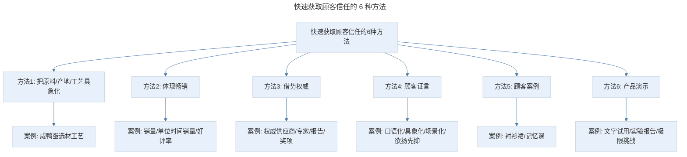
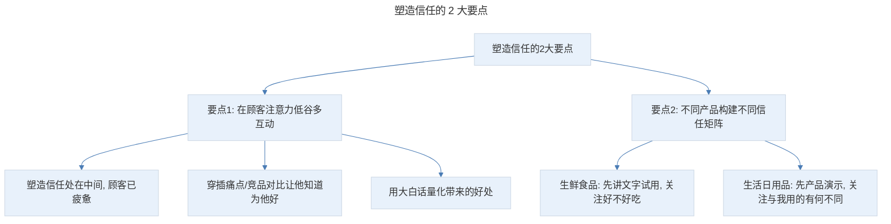

# 塑造信任：拒绝自嗨，如何让顾客完全信任你推荐的产品？

## 1. 导言

本节知识点：6 种方法，2 大要点。

如果我告诉你：宇宙中有 3000 亿颗星星，你相信吗？90% 的人相信，因为天文学家已经证实。但如果我递给你一个盘子，告诉你这是热的，你还相信吗？估计很少人相信。因为我没给你证实。

顾客读你的文案时也是一样，他对推文中宣扬的信息怀疑、不信任，而不信任就约等于"不会买"。

所以，文案的任务就是，用一个个无可辩驳的事实，构建产品的信任矩阵，证明你的品质和利益，最终让顾客坚信要么购买后，他就能获得推文中承诺的好处。要么让顾客觉得他是考虑周全才下单的，选择它是明智的。

## 2. 核心概念：快速获取顾客信任的 6 种方法

> 快速获取顾客信任的 6 种方法：把原料/产地/工艺具象化、体现畅销、借势权威、顾客证言、顾客案例、产品演示。

## 3. 关键方法：前三种获取信任的方法

### 3.1 方法一：把原料、产地、工艺具象化

隔着手机屏幕，顾客看不到产品是如何由原料一步步变成成品的，他潜意识会怀疑。而通过具象化的描述，呈现产地的环境，原料的筛选标准，工艺的加工流程，就像带着顾客参观了一遍，他就会更信任。

我们来看一个咸鸭蛋的案例：清晨当海鸭去觅食后，鸭农就去巢里收每天新产的海鸭蛋，先剔除磕破的蛋。再对收获的每个鸭蛋进行光照筛选，挑选出浑浊、散黄、黑黄的坏蛋，保证了每一颗烤海鸭蛋的新鲜。再将精选出的海鸭蛋，裹上海盐、海水和海泥调制均匀的泥浆，静置腌制 22 天左右，让美味发酵。腌好后的海鸭蛋以 130 度高温烘烤 5 小时，在烤熟的同时，还能杀菌。烘烤后的蛋黄颜色不是普通的橘红，会更深，一口咬下去，就能感受到滋出的红沙油的香味。

对吃的东西，顾客会考虑是否安全、健康、新鲜，而这段文字具象化描述了鸭蛋的筛选标准，腌制细节，让顾客相信品质有保证。

可能有人会说：兔妈，我家产品很普通，怎么办？首先，写推文前你就让品牌方、合作方拉一个群，你可以先让品牌方详细介绍下他们的研发过程，打电话或者语音采访都可以。千万不要不好意思，也不要怕打扰到品牌方，一定要多聊。了解产品的选材、工艺，看有什么亮点。比如我曾给某花果茶写推文，和研发人聊天知道，很多品牌为了香味浓郁就喷香精。他们是先把花中的精油萃取出来，烘干后再回喷到茶上，我就把这个细节写出来，增加顾客信任。

如果实在挖不出来，也没关系，你看竞品有没有把这些细节写出来，如果没有，那你第一个写出来，顾客会更信任你。

### 3.2 方法二：体现畅销

《乌合之众》这本书说过：即便错得离谱，74% 的人也会从众随大流。当你明示或暗示产品很畅销时，顾客就更容易购买。他会觉得：这么多人选它，肯定不会错。

所以，你摆出销量、顾客量等数据，比如累计销售 20 万支，顾客就更容易下单。但问题是，对大多新品牌来说，销量不高、顾客也不多怎么办？这里我总结了 5 个技巧：

- **描述单位时间的销量**：比如，618 你做了次促销，一小时卖了 3000 支，就可以说"上架 1 小时卖了 3000 支"。
- **营造高人气**：比如"新品发布会后 1 个月售罄"其实，你第一批只有 500 份，但顾客会觉得"好火爆"。还可以写"1 万支试用小样，2 天被申领完毕"。
- **被同行模仿**：曾经给一款挂面写推文，它家产品只在当地小有名气。当和负责人聊天知道，金龙鱼、中粮曾派人打探其配方，我写出来，顾客就会觉得卖得不错。
- **高好评率**：数量上不占优势，但 100 个人用了 99 人都说好，你就可以说"好评率 99%"。
- **高复购率、高推荐率**：顾客数量不多，但每位老顾客都复购、都推荐朋友，你就可以说"复购率多少"，或"90% 的顾客用完都推荐朋友"。

### 3.3 方法三：借势权威

看到明星代言、专家推荐，我们潜意识就认为这是大牌，值得信赖。这就是权威的威力。主要有 4 个角度：权威供应商/代工厂、权威专家、权威报告、权威奖项。

比如我曾给一家母婴品牌写菜板推文，就有用到。德国红点设计奖是权威奖项，美国白宫御厨是权威专家，德国防霉检测、中科院防霉检测是权威报告。

但你发现了吗？这里有个细节，你不能把权威摆上就 ok 了，你还要思考一下：这个权威是不是大众熟知的，比如，德国红点奖，专业人士很熟，但普通人是不知道的。这时你的权威就失效了，怎么办？正确的方法是，翻译成大众权威。所以我说：这个奖是世界三大设计奖之一，有"设计界奥斯卡"之称。这样即便是普通宝妈，也能明白这个奖很厉害。

这时有小伙伴就发愁了：兔妈，你说的这 4 个角度，我家产品都不符合，怎么办？教你一招：傍权威大腿！第一个是我写的一款美白饮，它有个成分是 SOD 酶，当时查了很多资料，发现它竟是很火的 POLA 美白丸核心成分，我就写"贵妇级美白丸 POLA 的核心美白成分就是它"。傍权威大腿的几个常用思路是：傍大牌配方、傍大牌成分、傍大牌产地（茅台镇酒、章丘县铁锅）。

如果实在找不到权威背书，也傍不上权威大腿，怎么办？答案是：打造专家人设。套用范爷的话就是：我不傍权威，我自己就是权威。常用技巧有 2 个：揭露行业内幕、顾客自查。

**案例一：小青柑推文。** 当时就用了揭露内幕的方法"市面上的柑普，为了降低成本，用广西柑，甚至是福建桔子代替正宗新会小青柑，填充劣质茶料，高温代替生晒发酵等"。这会让顾客产生 2 种心理：你竟知道别人不知道的内幕，应该挺专业的；你有底气这样说，你家产品肯定是经得住检验的。要注意的是，揭露内幕要把握度，否则，顾客对你整个行业都否定了，就永远不会买了。

**案例二：乳胶枕。** 用了顾客自查，就是通过看、闻、摸等感官体验或小实验教顾客辨真假，它的本质和揭露内幕有点相似。顾客会觉得你知道这么多细节，肯定是专家。并且会认为你家产品肯定符合这些条件。

## 4. 实践落地：后三种获取信任的方法

### 4.1 方法四：顾客证言

这个方法大家都不陌生，但正因为太普遍，很多人不重视，结果写的证言一看就很假。怎样写出打动顾客的证言呢？有 4 个要点：

- **口语化**。试想一下，有几个顾客会在评价中写"洗脸巾清洁彻底"？大多也就是写"棉片擦过后好脏呀，以为洗得很干净，竟还有好多脏东西被擦出来"。
- **具象化**。不要说"很好""很赞"笼统的信息，而要说出具体好的点，让顾客一看就觉得你是真的用过。比如，卖煎锅：很好上手，一年级的儿子就能操作。煎鸡蛋调到中档会糊，低档正好。煎饼也很快。越具体，可信度越高。
- **场景化**。不要简单写"用过"，要写明在什么场景下用的，具体有什么样的体验，让顾客产生一种映射。常用模板是：高频场景 + 美好体验。比如卖煎锅："三明治 3 分钟就搞定，味道不比外面卖的差。每天早上能多睡 20 分钟。"
- **欲扬先抑**。有时自爆一些不痛不痒的小缺点，反而让人觉得更真实。尤其适合功效型产品，比如卖眼膜，你写"用完黑眼圈立马就没了"，顾客肯定说骗子，但如果说：前两天效果不明显，以为又掉坑了，第三天就发现黑眼圈淡了。这才符合正常认知，也更容易获得信任。

### 4.2 方法五：顾客案例

顾客案例也是获取信任屡试不爽的招数，利用已有顾客的收益来佐证新顾客的收益预期，还能让顾客产生强烈的积极暗示：对别人有效，对我肯定也有效。但难的是说服力要强，让人觉得可信。有 3 个要点：符合目标顾客画像（包括年龄、职业等）、有前后的收益对比（特别是使用前的情况及使用后的收益）、有真实的照片/截图证据。

**案例一：衬衫裙。** 先给出试穿人的职业、身高、体重等画像标签，并给出试穿前、后的收益对比，之前：不敢穿连衣裙。穿上后显瘦 10 斤。并配上前后的对比照片。让顾客看完很有共鸣：我以前也这样啊。打消"不适合""穿上不好看"的疑虑，并想象自己穿上也能显瘦 10 斤，进而爽快下单。

**案例二：记忆课。** 7 岁的王珞是菲菲的学员，曾经的他对学习丝毫提不起兴趣，学习成绩在班级里倒数。因为家住杭州，渴望改变的王珞每周专门乘飞机来北京学习，3 次课程后，王珞发生了翻天覆地的变化：语文成绩从班级倒数几名考到了 100 分，位列班级第 1。如今的王珞成了一名不折不扣的小学霸。这个案例符合目标用户画像，有前后的收益对比，而且有照片和聊天截图的证据。让顾客觉得：哇，你讲的肯定是真的。而且还会觉得：我家孩子对学习也没兴趣，报名后肯定也能学好。

### 4.3 方法六：产品演示

演示不需要重复介绍产品的特性，而是直接证实产品的品质和效果。常用的套路有 3 个：文字试用、实验报告、极限挑战。

**文字试用案例**：我一般一周敷 2-3 次，每周坚持用，三周后，进行了肤色测试，报告显示：白了一个度！一个度！旋转跳跃！连闺蜜都问我是不是偷偷去打了美白针。使用感也很走心！拆开面膜我吓了一大跳：每一片面膜有足足 22ml 的精华！这分量，敷一片功效就几乎等于用 1/3 瓶美白精华啊！

它就用到了文字试用和实验报告的套路。隔着手机屏幕，顾客感知不到产品体验和效果，所以，你要把试用过程演示出来，让顾客像亲自试用了一样。写好文字试用有 2 个要点：细节（比如"一周敷 2-3 次""3 周后""足足 22ml 精华"）、画面感（比如"旋转跳跃""拆开面膜时吓了一大跳"）。"肤色测试"则是实验报告，它不仅更真实，已有的收益预期也能对顾客形成心理冲击。

**极限挑战案例**（行李箱、卸妆水、菜板）：都用了极限挑战的方法，证实行李箱结实、卸妆水安全、菜板好清洗。为了更真实，极限挑战最好用动图演示。具体可分为 4 个步骤：确定性能指标——设置挑战方式——完成挑战过程——证明产品品质和效果。

## 5. 实践指南：塑造信任时必须牢记的 2 大要点

至此，6 种获取信任的方法就讲完了。这时，可能有小伙伴会说了：你讲的这些方法我也用过，但为啥我的转化就是上不去呢？真相是：你摆事实、做演示，勉强算是个优秀导购，却没有像闺蜜一样关注顾客的感受！下面就来详细讲解塑造信任时必须牢记的 2 大要点。

> 塑造信任的 2 大要点：在顾客注意力低谷多互动（塑造信任处在中间，顾客已疲惫，要穿插痛点/竞品对比，用大白话量化好处）、不同产品构建不同信任矩阵（生鲜食品先讲文字试用关注好不好吃，生活日用品先产品演示关注与我用的有何不同）。

**首先，在顾客的注意力低谷，你要多和他互动。** 对于一篇推文，塑造信任处在中间，就像爬山一样，此时的顾客已经疲惫了。所以，你不能只顾演示产品，还要时不时和她互动一下。具体如何做呢？你要穿插痛点、以及竞品对比，让他知道你做这一切都是为了帮他解决问题。你比对了很多产品，才选出这个最佳方案。还要用大白话，把给他带来的好处量化出来。这样才能重新吸引他的注意。

**其次，不同产品，要构建不同的信任矩阵。** 很多文案有个误区：不管什么产品，6 个方法都挨个用一遍，却忽略了不同产品，顾客关注的点是不同的。比如，生鲜食品，你上来就讲原料多好、工艺多牛，顾客根本不感兴趣。他关注的是：好不好吃。所以，你要先讲文字试用，当他流口水了，才会关注原料好不好、工艺安不安全。如果是生活日用品，他最关注的不是权威，也不是工艺，而是"和我以前用的有什么不同"。所以，你要先通过产品演示，用强大的品质和效果震住他，这样他才有兴趣了解更多。

核心不在于你掌握了多少套路，而是什么时候该用什么套路。哪怕是简单的"顾客案例"，你都要想清楚，为什么要用在这里？它离不开你对顾客分析、痛点、卖点的精准把握。这也是普通文案和卖货高手的区别。

## 6. 进阶延展：总结与核心要点回顾

### 6.1 知识点总结

**第一个知识点：6 种获取顾客信任的方法**

- 第 1 种：把原料、产地、工艺具象化。
- 第 2 种：体现畅销。
- 第 3 种：借势权威（以及怎样打造专家人设获取信任）。
- 第 4 种：顾客证言（口语化、具象化、场景化、欲扬先抑）。
- 第 5 种：顾客案例。
- 第 6 种：产品演示。

**第二个知识点：塑造信任时必须牢记的 2 大要点**

1. 在顾客的注意力低谷，要多和他互动。
2. 不同产品，要构建不同的信任矩阵。

掌握这 6 种方法和 2 大要点，你也能让顾客完全信任，转化翻倍。

### 6.2 核心要点回顾

顾客对推文信息不信任就约等于"不会买"，文案的任务是用无可辩驳的事实构建产品的信任矩阵。6 种获取信任的方法为：把原料/产地/工艺具象化（像带顾客参观一遍）、体现畅销（利用从众心理，通过单位时间销量/营造人气/被同行模仿/高好评率/高复购率 5 个技巧）、借势权威（权威供应商/专家/报告/奖项 4 个角度，翻译成大众权威，傍权威大腿，打造专家人设）、顾客证言（口语化/具象化/场景化/欲扬先抑 4 个要点）、顾客案例（符合画像/前后收益对比/真实证据 3 个要点）、产品演示（文字试用/实验报告/极限挑战 3 个套路）。塑造信任必须牢记 2 大要点：在顾客注意力低谷多互动、不同产品构建不同信任矩阵。核心不在于掌握多少套路，而是什么时候该用什么套路。

### 6.3 练习作业

**请找一篇美食类的推文，拆解它用了哪些获取信任的方法，并分析它的使用逻辑。**

---

## 参考资料

- 本案例内容来源于"极客时间"文案高手专栏第 10 节。