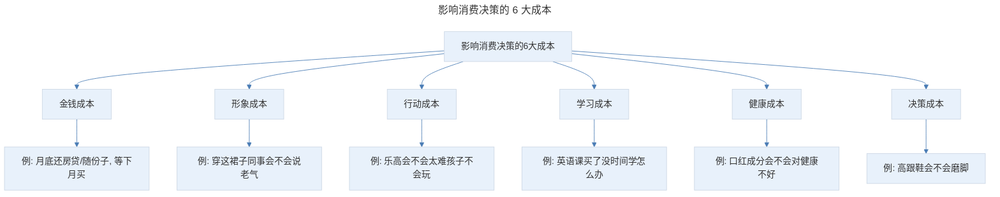
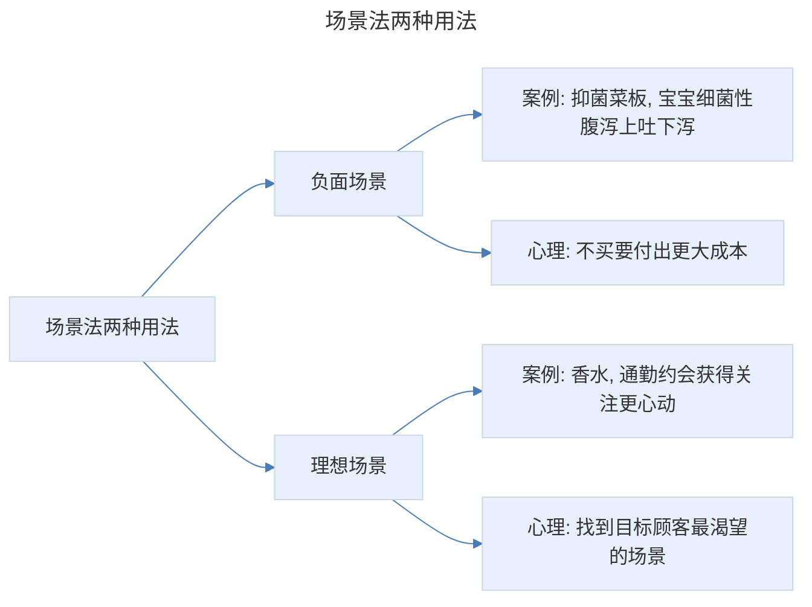
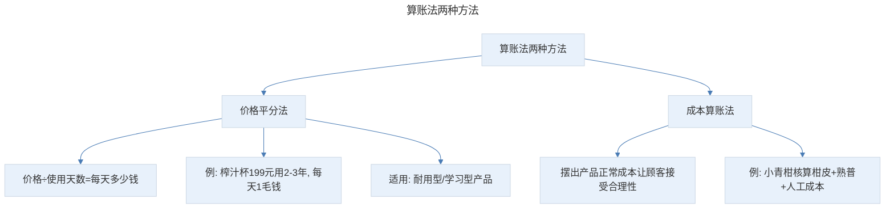
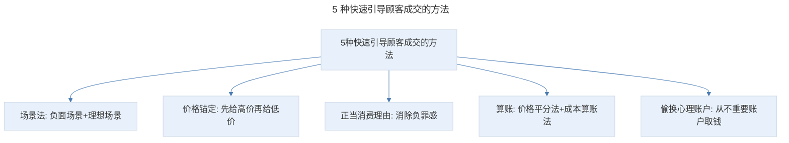

# 快速成交：如何让"抠门"顾客爽快掏钱下单？

## 1. 导言

本节知识点：1 个认知，6 大成本，5 种方法。

卖货文案的最终目的是让顾客掏钱付款，如果不能成交顾客，你之前的全部努力将毫无意义。

美国顶级销售文案 John Caples（约翰·卡尔普斯）曾说过：这个世界上有大量很好的广告，但是却很难让人产生最终购买的冲动。要么就是一味地说"请马上购买"，但顾客心里会想："为什么要立即购买呢？""我真的有必要买它吗？""现在买划算吗？会不会买亏了？""万一不好用怎么办？""老公会不会说我乱花钱啊？"

看到了吗？顾客在掏钱那一刻内心充满了不安，犹豫甚至怀疑。她担心做出错误的决定，害怕购买之后周围的人不认可，更害怕失去金钱的痛苦。为了避免抉择的痛苦，她干脆想"算了，下次再说吧"，但绝大多数情况下，顾客大脑中闪出"下次"这个念头的一瞬间，就意味着永远不会再购买了。

作为一名合格的卖货文案人，我们必须尽力避免这种情况的发生。要知道，所有的成交都是需要设计的，一旦设计成功，顾客的购买力就会增加 2 倍，甚至 3 倍。

## 2. 核心概念：影响消费决策的 6 大成本

想要设计出让顾客爽快付款的结尾，你必须明白人们在消费决策时，会考虑哪些成本。李靖（李叫兽）以前提出过影响消费决策的 6 大成本，包括金钱成本、形象成本、行动成本、学习成本、健康成本、决策成本。

> 影响消费决策的 6 大成本：金钱成本（月底还房贷等下月买）、形象成本（同事会不会说老气）、行动成本（乐高太难孩子不会玩）、学习成本（买了没时间学怎么办）、健康成本（成分会不会对健康不好）、决策成本（高跟鞋会不会磨脚）。

比如：月底就要还房贷了，下周李子结婚还要随份子，等下个月再买吧，这是金钱成本。穿上这个裙子同事会不会说老气啊，这是形象成本。这个高跟鞋很好看，但会不会像楼下买的那双一样磨脚啊，这是决策成本。这个乐高玩具，会不会太难，孩子不会玩啊，这是行动成本。这款口红价格不贵，颜色也好看，但不知道它的成分，会不会对健康不好啊，这是健康成本。这套英语课，全外教授课，看着挺不错的，但买了没时间学，怎么办？这是学习成本。

所以，文案的任务就是设计成交策略，让用户觉得：成本不高呀，或者是收益看起来太有诱惑力了，让他兴奋到忽略成本。只有这样，他才会毫不犹豫掏钱下单。

## 3. 关键方法：场景法与价格锚定

### 3.1 方法一：场景法

顾客决定成交时，大脑通常有 2 种意识，一种是解决痛点，另外一种是展望未来。而场景法就是利用顾客这种心理，让他看到：不买产品，痛点得不到解决，要付出的成本和代价更大。

**负面场景**：就像暖宫贴优化后的文案：如果痛经不解决，疼得厉害可能要请假，请假还要扣工资。而且不是疼一次，是每个月大姨妈都疼。如果拖延久了，还有可能引起妇科问题。这些负面场景是顾客害怕出现的。为了避免痛苦，就更愿意做出购买决策。

**理想场景**：帮他描绘一幅美好画面，让他看到：购买产品后，能享受的利益和好处。比如，学了某课程，就能多掌握一项技能，将来可以去更好的公司，拿到更高的薪水，让孩子上更好的学校等。当顾客想到这些理想场景，内心就会产生强烈的欲望和冲动，也更容易采取行动。

> 场景法两种用法：负面场景（如抑菌菜板，描述宝宝细菌性腹泻上吐下泻，让顾客觉得不买要付出更大成本）和理想场景（如香水，通勤约会获得关注更心动，关键是找到目标顾客最渴望的场景）。

**案例一：抑菌菜板。** 普通砧板都在 5、60 元左右，但用一年就刀痕累累了，那么多的刀痕里藏着数不清的细菌，发霉发黑还有异味，影响做菜的心情不说，孩子还容易细菌性腹泻影响食欲，只能换了，一年换一块也要一百五十元。重点是还不好用。当妈妈的都有体会，孩子一旦细菌感染上吐下泻好几天，个头比同龄人都落下一截，自己也跟着吃不好睡不好。我用的就是负面场景法，这些场景是目标顾客害怕出现的。让她觉得：如果不买这个抑菌菜板，将要付出的成本更大。

**案例二：香水。** 日常通勤、周末约会、出席正式场合，你都可以喷上某某香水，精致而低调，得体也大方。想象若是你自带清香，不止能让自己心情愉悦，也能在拂袖而过时，引得旁人回首注目，甚至让另一半心动不止。一个女人的魅力，就是这样因为香水更加高级。它就用了理想场景的技巧。试想一下，哪个女人不想让自己变得精致有魅力呢？《吸金文案》这本书讲到人类八大生命原力时，就提及了增加个人魅力、获得社会认同的内容。所以，在使用"理想场景"时，你一定要找到目标顾客心中最渴望的场景。

### 3.2 方法二：价格锚定

当你先告诉顾客一个已知商品的高价格，再告诉产品的低价格，顾客就会觉得便宜。这个判断体系，就是营销中有名的价格锚定。

**案例一：黄酒（一瓶 128 元）。** 很多人会觉得黄酒带着浓浓的乡气，上不了台面。事实上，它早已成为国家名片。就连长寿国日本的清酒，也是借鉴了黄酒的酿造工艺。但比起那些舶来品动辄 300、400 元的高价酒来说，某品牌的原浆酿酒，可以说非常实惠了。我先指出日本清酒也是借鉴了它，目的是塑造产品价值。而比起日本清酒 300、400 元的高价格，128 元就显得非常便宜了。

**案例二：艾灸仪（一台 1000 多元）。** 去美容院呢？二线以上城市美容院艾灸的价格在一百到三百左右，但艾灸一两次是看不到明显效果的，而一疗程的价格普遍在千元以上。有了某品牌艾灸仪，每天灸一灸，再也不用心疼钱了。这里我参照的是一次艾灸的费用。需要注意的是：这里我假设的是二线城市的价格，为什么要限定呢？因为不同地区消费水平不同，如果你只说"外面做一次艾灸要 300 元"，三四线的顾客就不信。所以，在用价格锚定时，你抛出的高价格，不能是随便乱说的，而一定要有依据。

## 4. 实践落地：正当消费理由、算账与偷换心理账户

### 4.1 方法三：正当消费理由

顾客在花钱时，内心会充满负罪感。尤其是买高档数码、保健品以及扫地机器人等方便型产品。正确的方法是：给他一个正当消费理由，消除他内心的负罪感，促使他马上下单。

纸尿裤就是靠正当消费理由，快速获得宝妈青睐的。纸尿裤刚上市时，主打：方便省事，但销售惨淡！因为很多人会认为用纸尿裤是懒惰的表现。当把消费理由改成：柔软透气，预防宝宝红 PP，非常火爆。这就给宝妈一个非常棒的理由：我买纸尿裤不是为了偷懒，而是为了孩子好！

**案例：书法课。** 人生的道路虽然很长，但最关键的只有那么几步。给孩子最好的礼物，不是昂贵的玩具，也不是一日三餐锦衣玉食，而是在他成长的路上，让他学会自信和坚持。而书法就有这样的魔力，不仅可以让你培养出一个，能写一手好字的自信宝宝；还能让你看到他每一点成长和进步，关于坚持、关于耐心、关于审美。这就让父母觉得，花钱不是浪费，而是为了培养孩子坚持、耐心、审美、自信等优良品质，就更容易付款。

**常用的正当消费理由，一共有 4 种：**

- 提升事业：达成目标、升职加薪。
- 关爱家人：孩子健康、学习、智力发育，父母健康等。
- 亲朋送礼：表达情感、维护人脉等。
- 健康保健：提升体质，预防疾病，避免家人跟着遭罪等。

### 4.2 方法四：算账

顾客在做出购买决策时，都会在心里算一笔账，盘算这笔交易的成本和收益，看是否划算。只有当收益大于成本时，他才会掏钱购买。聪明的卖货文案，深知顾客这种心理，就会把这笔账给顾客算清楚、摆出来，省掉顾客绞尽脑汁比对的麻烦。

**第一种是价格平分法。** 就是用价格除以产品的使用天数，算出一天要多少钱。一天的花费，与整体收益相比，顾客就会觉得收益大于成本。一般用于耐用型、学习型产品。比如榨汁杯：外面一杯鲜榨果汁都要一二十块，喝起来有点肉疼！风靡美国的榨汁杯，日常价 299 元，限时粉丝特惠价 199 元，正常情况下，用个 2、3 年没有问题，平均每天也就 1 毛钱，一个夏天省回来的钱又可以买一只口红了！简直太划算了！

**第二种是成本算账法。** 就是把产品正常的成本摆出来，让顾客接受产品价格的合理性。比如，我在小青柑这篇推文中，就写道：正宗新会小青柑要多少钱呢？我们先来算算小青柑的生产成本：市面上果径 4 cm、树龄 5 年的正宗新会小青柑柑皮普遍在 80 元/斤，最便宜的也在 50 元上下。根据 2017 年布朗山的熟普行情，三到五年的宫廷级熟普在百元左右，8 年的宫廷级熟普则要 150 元左右，这还没加上人工、运输和包装等费用。看完这段描述，顾客就会觉得：这个价格还挺合理的。并且还会让他产生一种认知：市面上低于这个价格的，肯定会偷工减料，进而选择你的产品。

> 算账法两种方法：价格平分法（价格÷使用天数=每天多少钱，如榨汁杯 199 元用 2-3 年每天 1 毛钱，适用耐用型/学习型产品）和成本算账法（摆出产品正常成本让顾客接受合理性，如小青柑核算柑皮+熟普+人工成本）。

### 4.3 方法五：偷换用户的心理账户

"心理账户"是 2017 年诺贝尔经济学奖得主理查德·塞勒提出的，是指人们会将不同来源、用途的钱放进不同的心理账户中。不同的心理账户，愿意花钱的难易程度也是不一样的。

比如：人们会把辛苦赚来的工资和意外获得的横财放入不同的账户中。很少有人会拿自己辛苦赚来的 10 万元去赌博，但如果是买彩票中了 10 万元，拿去赌的可能性就高多了。

**案例：给孩子报舞蹈课。** 现在活动是 159 元 6 节课，也就一顿麦当劳的价格，如果孩子不喜欢，也没啥损失。如果孩子喜欢，就拓展一项孩子的兴趣，将来也会更有竞争力。这里就让顾客从吃麦当劳的"心理账户"中取出 159 元用于给孩子买课程，愿意花钱的程度就容易了。因为顾客会觉得：同样投资 100 块钱，吃麦当劳的结果就是增加几千大卡的热量，而报舞蹈课，可以让孩子更有竞争力，得到的收益更大一些。

一句话就是：让顾客从喝咖啡/吃肯德基麦当劳/在外吃饭/买零食等不重要的心理账户中，取出一部分钱，用于更有意义的事情，降低顾客花钱的难度。

## 5. 实践指南：快速成交的 5 种方法总结

前面的内容吸引了顾客注意，激发了购买欲望，也获取了顾客信任，顾客来到了推文的结尾。但在掏钱时，他非常犹豫、谨慎，甚至还有可能转身离开。所以，你就要通过充满诱惑力和煽动性的文案，告诉他：别拖了，马上、现在、立刻下单。这就是我们常说的：引导成交。

> 5 种快速引导顾客成交的方法：场景法（负面场景+理想场景）、价格锚定（先给高价再给低价）、正当消费理由（消除负罪感）、算账（价格平分法+成本算账法）、偷换心理账户（从不重要账户取钱）。

## 6. 进阶延展：总结与核心要点回顾

### 6.1 知识点总结

**第一个知识点：5 种快速引导顾客成交的方法**

- 场景法，包含负面场景和理想场景 2 种用法。
- 价格锚定。
- 正当消费理由。
- 算账，包含价格平分法和成本算账法。
- 偷换顾客心理账户。

你可以根据情况，选择不同的方法进行组合。当你熟练掌握后，你会发现让顾客付款没那么难。

### 6.2 核心要点回顾

顾客在掏钱那一刻内心充满不安和犹豫，为避免抉择痛苦往往说"下次再说"，而"下次"就意味着永远不会再买。所有成交都需要设计。顾客消费决策时考虑 6 大成本：金钱、形象、行动、学习、健康、决策成本。5 种快速引导成交的方法为：场景法（负面场景让顾客觉得不买付出更大成本，理想场景找到顾客最渴望的画面）、价格锚定（先给高价再给低价，抛出的高价格必须有依据）、正当消费理由（消除负罪感，常用提升事业/关爱家人/亲朋送礼/健康保健 4 种）、算账（价格平分法适用于耐用型产品，成本算账法摆出成本让顾客接受合理性）、偷换心理账户（让顾客从不重要的心理账户取钱用于更有意义的事情）。可根据情况选择不同方法组合。

### 6.3 练习作业

**请用今天学到的知识，为一门知识付费课程写一段推文收尾。**

---

## 参考资料

- 本案例内容来源于"极客时间"文案高手专栏第 11 节。