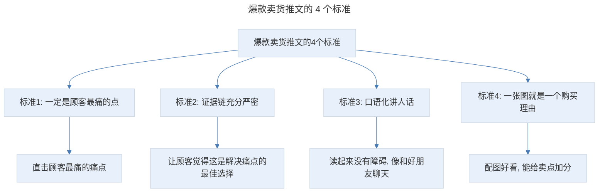
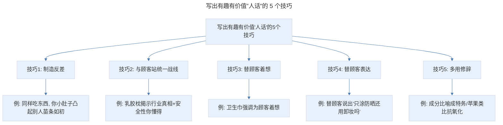
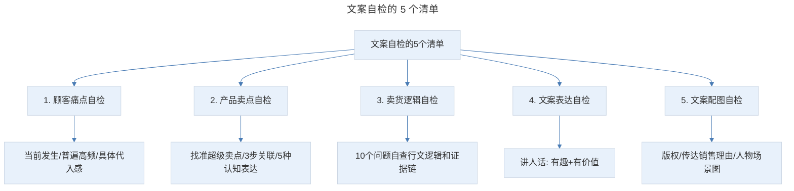

# 优化自检：转化率至少翻 2 倍，如何 5 步快速优化推文？

## 1. 导言

本节知识点：4 个标准，5 个自检清单。

好的文案是通过不断优化、打磨形成的。正确的优化自检，能让一篇文案从 60 分到 80 分，甚至 90 分。然而，说到文案修改，90% 的人有个误区：以为就是改改错别字、删掉多余的词语、把长句改成短句。事实上，这只是初级的文案修改。

卖货文案的目的是赚钱，所以，优化的目标也很明确，就是提高转化率。想要提升转化，你首先要知道怎样才是高转化的卖货文案？

## 2. 核心概念：爆款卖货推文的 4 个标准

我在帮商家打造爆款和拆解爆款的过程中，我发现爆款卖货推文都有 4 个标准：

> 爆款卖货推文的 4 个标准：一定是顾客最痛的点、证据链充分严密（让顾客觉得这是解决痛点的最佳选择）、口语化讲人话（读起来没有障碍像和好朋友聊天）、一张图就是一个购买理由（配图好看能给卖点加分）。

- 一定是顾客最痛的点；
- 证据链充分、严密，让顾客觉得这才是解决痛点的最佳选择；
- 口语化，讲人话。读起来没有障碍，就像和好朋友聊天一样；
- 一张图就是一个购买理由，配图好看，能给卖点加分。

明白了好文案的标准，具体如何做呢？接下来，我们就来详细讲解。

## 3. 关键方法：5 项文案自检清单

这 5 项文案自检清单是我曾经实践过的，让一篇推文从 60 分变成 80 分，最快速有效的方法。

### 3.1 自检清单第一项：顾客痛点自检

首先，你要问自己，这篇文案直击了顾客几个痛点。有没有掉入挖掘痛点常犯的 4 个误区：痛点太多、用力过猛、不够紧急、和你的目标顾客无关。

然后，做 3 个问题的自检：

**1. 痛点是顾客当前正在发生的吗？** 痛点要是顾客当下正面临的问题，而不是发生在过去或未来。只有正在发生的痛苦才有急迫感，才有马上要解决的冲动。举个例子：你要劝一个年轻人减肥，什么样的痛点最有效呢？A：不减肥，会导致高血脂、高血压等疾病。B：不减肥会变丑，找不到对象，错失升职加薪的机会。显然选项 B 更有说服力，因为 A 选项是发生在将来的，顾客感受不到紧迫性；但 B 选项是发生在当下的事情（找不到对象，升不了职），所以采取行动的可能性也更高。

但绝大多数情况下，需求是潜在的，产品也不是顾客当下必须要买的。怎么办？你自检的重点就应该是：能否用当下的某个热点或新闻事件，来提高顾客决策的紧迫性。比如，你要卖一款保护人身安全的警报器，但抢劫这事不是顾客当下面临的痛点呀。这款警报器就通过身边好友的故事、社会事件和开学季热点，让顾客觉得保护人身安全这件事，就发生在自己身边，现在就要重视。

**2. 你的痛点是顾客群中普遍、高频发生的吗？** 什么是高频？就是你描绘出来的痛苦经历，一定是目标顾客经常发生的，这样他才有动力去解决。如果一年只经历一次，或只有个别顾客经历，他就不会做出改变。我曾看到一篇卖拖把的推文："拖把难以清洗，绝对是家庭主妇一致认同的，她们大多数都是用手洗拖把，长此以往导致手日益粗糙。"但手洗拖把只是个别现象，而且也很少有人会天天手洗，所以它既不普遍，也不高频。相比呢，"拖把上缠了很多头发，不好清洗，拖完地，地板上还会残留头发"这个痛点就更加高频，这样顾客解决的欲望也会更强烈。

**3. 你的痛点具体吗？能不能让顾客产生代入感？** 比如你是卖减肥课的，就可以写：早上起床，准备把自己打扮得美美地出门，却发现去年最爱的裙子拉不上链子了，换个休闲的牛仔裤吧，却变成了紧身裤。这种具体情景有很强的代入感。但如果你说：水桶腰、大象腿，穿衣服就像绑在身上？说的也是胖这个痛点，但就不如上面的具体，所以不能引发顾客共鸣。

### 3.2 自检清单第二项：产品卖点自检

**第一，你有没有找准产品的独特优势，也就是超级卖点。** 具体可以参考挖掘产品超级卖点的取交集模型。

**第二，你有没有用 3 步关联法则**，产品卖点——卖点解决了顾客什么问题——给顾客带来了什么好处，把卖点链接到顾客的核心利益点。卖点不等于买点，而具体的、实实在在的好处，才是打动顾客的买点。

比如你说"智能电饭锅，在睡觉之前放上米，第二天就能自动煮好"，这只是产品的卖点，没有关联到顾客的利益相关点，顾客看了就没有感觉。而通过 3 步关联法则，你就可以轻松找到顾客的买点："第二天自动煮好"，可以解决顾客早上上班紧张，来不及做早饭的问题。给顾客带来的好处是：起床就能吃上香喷喷的八宝粥，不用饿着肚子去上班，还养胃，工作效率也更高。再也不用去排队买早餐，还能多睡几分钟。这样顾客才会觉得：好方便啊，才能刺激他马上下单。

**第三，你有没有用上卖点认知表达的 5 种方法**：关联法、数字具象化、利益具象化、场景具象化、体验具象化？具体用了哪种？能让顾客快速感知到产品的价值吗？

### 3.3 自检清单第三项：卖货逻辑自检

卖货逻辑自检是对一篇推文的整体把握，也是提升转化的关键。所以，你要多问自己以下 10 个问题：

- 我要为哪些顾客解决问题？解决的是什么问题？
- 这些问题是他们当下必须要解决的吗？
- 他们有什么特征和喜好？我开场选择的切入点能引起他的兴趣吗？
- 我有没有给顾客解释清楚，为什么不要选择其他竞品？
- 在证明产品是帮他解决问题的最佳选择时，我给的证据充分吗？都用到了哪些方法？
- 需不需要在这基础上补充一些证据？可以补充哪些证据？补充在哪个位置？
- 我用到的顾客案例是最合适的吗？能不能换成更贴近顾客的案例？
- 顾客掏钱时，可能会有哪些担忧？我有没有帮他主动化解？
- 整篇推文是以什么结构展开的？它的顺序是有条不紊的吗？
- 能不能调整某些段落的顺序，让逻辑、阅读更顺畅？

《高绩效教练》这本书中提到：提出有效的问题是产生觉察力的最好方法。这 10 个问题包含了卖货逻辑的前因后果，能帮你快速觉察到推文的问题所在。很多时候，不是你不知道推文哪里有问题，虽然你反复读了一遍又一遍，脑袋却是停止思考的状态，眼睛只会机械性地扫描一些错别字、标点。而通过有效的提问，能让你从文字中跳出来，站在更高处重新看待自己的文案。

所以，我平时有个习惯：在写完一篇推文后，一定要先拆解一遍，拆解它的行文逻辑和证据链。在拆解过程中，我就发现哪里需要优化，哪里需要再加一个顾客案例，哪个段落的顺序是需要调整的。

### 3.4 自检清单第四项：文案表达自检

文案的本质是沟通，既然是"人与人"的沟通，就要从"看文案的人"开始说。要考虑屏幕前的顾客能否完全理解、听懂，而不能归为一堆生硬的产品说明。这就是我们常说的"讲人话"。

讲人话并不是简单地把官方介绍翻译成"大白话"。比如，"极致享受，颠覆体验"翻译成大白话就是"这个沙发很舒服"，这的确是人话，但是不是太无聊了。所以，讲人话必须有 2 个原则：有趣、有价值。

### 3.5 自检清单第五项：文案配图自检

**第一，图片是否有版权。** 很多人往往是觉得这个图不错，就拿来用了。其实，这可能会有版权隐患。我身边很多商家和新媒体作者，因为图片版权被投诉、罚款的屡见不鲜，所以，你一定要有这个意识。如果条件允许，最好是搭建自己的图片库。

**第二，图片能不能很好地传达你的销售理由。** 图片只有在跟广告传达的信息存在明显联系时，才是有效的。然而，很多人用的是展示产品包装的硬图，让人看了没感觉。那什么样的图才是有效的呢？

1. **凸显产品的核心卖点**。拿口红充电宝来说，它的独特卖点是小，它的配图不是简单标注产品的长宽高，而是放上与口红的对比图。看完立马就能知道它到底多小。
2. **带人物的场景图**。斯塔奇调查公司发现："把产品照片放到广告里，能多吸引 13% 的读者。而有人正在使用产品的照片，能多吸引 25% 的读者。"因为使用产品的照片演示了产品和效果，更能勾起了读者的想象，让他联想到自己。卖煎锅不要用煎锅的图，而要用孩子吃着用煎锅做出来的香喷喷大餐的图。
3. **在图片下面放一个小标题**。可以是简短的销售信息或让人感兴趣的信息。
4. **无须放大，就要让读者看清图片上的关键信息**。很多人配的顾客证言图都要放大才能看清，阅读体验很不好。绝大多数顾客是不会放大的，那就没意义了。正确的做法是无须放大就一目了然。

## 4. 实践落地：如何写出有趣、有价值的"人话"文案

如何写出有趣、有价值的"人话"文案呢？这里有 5 个技巧：

> 写出有趣有价值"人话"的 5 个技巧：制造反差（引发好奇）、与顾客站统一战线（揭示行业真相消除戒备）、替顾客着想（关注"你"而非"我"）、替顾客表达（一针见血指出顾客想说的话）、多用修辞（让复杂道理简单易懂）。

**第一个技巧：制造反差。** 有趣的人往往能指出生活中的矛盾现象，引发目标顾客的好奇。第一个是：同样是喜欢吃东西，你小肚子凸起，别人苗条如初，让读者内心产生"为什么"；第二个是：小身材，大能量的反差。别看它小，但它效果很好，同样让人产生"这么牛，怎样做到的"心理。

**第二个技巧：与顾客站在统一战线。** 通过"与顾客站到统一战线"来表明态度、明确反对某种现象——比如其他商家偷工减料，只追求利润，根本不管对顾客好不好，进而消除顾客对你的戒备。比如乳胶枕案例：如果直接告诉你，他们的乳胶枕是泰国原产，质量有保证。别家品牌是黑心厂家，就很生硬，顾客会觉得你在吹牛。但主动与顾客站到统一战线，告诉顾客不知道的真相，最后来一句"安全性你懂得"，就像和闺蜜聊天一样，进而影响顾客决策。

**第三个技巧：替顾客着想。** 会聊天的人，更多地关注"你"，而不是"我"。不要自嗨地强调自己投入多少资金、多少人力物力，而是要从顾客角度出发，替他着想。比如卫生巾案例：如果是普通文案，可能会说"它的包装膜是和苹果手机一样的"，但顾客听起来无感。但它告诉你软的容易破，硬的怕咯你手，用苹果这款虽然贵，但密封性好，放一整年都不怕灰尘和细菌进去。顾客就会觉得：哇，好贴心啊！

**第四个技巧：替顾客表达。** 只要能够一针见血指出顾客想说的话，就能够引起他的共鸣。比如：只涂防晒霜还用卸妆吗？用洗面奶洗两遍就不用卸了吧？为什么我泡脚，没效果啊。这就会让顾客产生一种：我就是这样想的，你好懂我啊，进而引发他的兴趣。在写文案时，你就要多问问：顾客有哪些想说但是没说出来、或不好意思说出来的话，能否在文案中主动帮他说出来？

**第五个技巧：多用修辞。** 恰到好处的修辞，能让复杂的道理和原理变得简单易懂。比如把成分比喻成特务、通过切开苹果的类比让顾客理解皮肤也要抗氧化、用拟人手法。你可以根据自己的产品，选择合适的修辞方法。

## 5. 实践指南：5 项自检清单总结

> 文案自检的 5 个清单：顾客痛点自检（当前发生/普遍高频/具体代入感）、产品卖点自检（找准超级卖点/3 步关联/5 种认知表达）、卖货逻辑自检（10 个问题自查行文逻辑和证据链）、文案表达自检（讲人话：有趣+有价值）、文案配图自检（版权/传达销售理由/人物场景图）。

## 6. 进阶延展：总结与核心要点回顾

### 6.1 知识点总结

**第一个知识点：好文案的 4 个标准**

1. 一定是顾客最痛的点。
2. 证据链充分、严密，让顾客觉得这才是解决痛点的最佳选择。
3. 口语化，讲人话。读起来没有障碍，就像和好朋友聊天一样。
4. 一张图就是一个购买理由，配图好看，能给卖点加分。

**第二个知识点：文案自检的 5 个清单**

1. 顾客痛点自检：（1）痛点是顾客当前正在发生的吗？（2）你的痛点是顾客群中普遍、高频发生的吗？（3）你的痛点具体吗？能不能让顾客产生代入感？（4）有没有掉入挖掘痛点常犯的 4 个误区？
2. 产品卖点自检：你有没有找准产品的超级卖点？你是否把卖点链接到顾客的核心利益点？
3. 卖货逻辑自检：10 个问题。
4. 文案表达自检：文案是否做到了讲人话？可以用有趣、有价值、和顾客统一战线来优化。
5. 文案配图自检：（1）图片是否有版权；（2）图片能不能很好地传达你的销售理由。

按这 5 个自检清单的要点去做，你也能轻松提升 3-5 倍的转化率，让文案一稿过。

### 6.2 核心要点回顾

优化自检的目标是提高转化率，好文案有 4 个标准：顾客最痛的点、证据链充分严密、口语化讲人话、一张图就是一个购买理由。5 项自检清单为：顾客痛点自检（3 个问题：当前正在发生/普遍高频/具体有代入感）、产品卖点自检（找准超级卖点、用 3 步关联法则把卖点链接到买点、用 5 种认知表达方法）、卖货逻辑自检（10 个问题涵盖前因后果，帮作者从文字中跳出来审视）、文案表达自检（讲人话要有趣有价值，通过制造反差/站统一战线/替顾客着想/替顾客表达/多用修辞 5 个技巧）、文案配图自检（版权/传达销售理由/凸显卖点/人物场景图/小标题/无须放大看清）。按这 5 个清单优化，能轻松提升 3-5 倍转化率。

### 6.3 练习作业

**找一篇卖货文案，请用 5 个自检清单，为它进行检查优化。**

---

## 参考资料

- 本案例内容来源于"极客时间"文案高手专栏第 12 节。