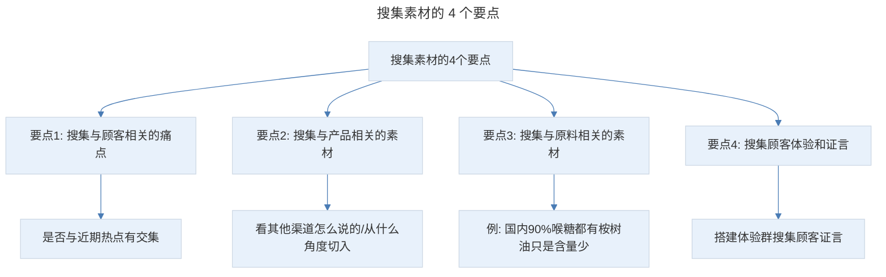
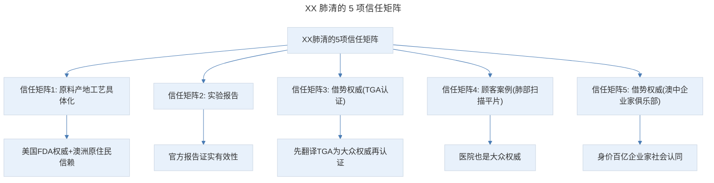

# 案例拆解 B：如何识别伪痛点？掌握蹭热点的绝招

## 1. 导言

本节知识点：4 个要点，1 套爆文结构。

## 2. 核心概念：搜集素材的 4 个要点

这是一款市场上的新产品——XX 肺清。客户给我时，只有一瓶样品和一张宣传小卡片。我用了一周来搜集素材，主要是 4 个方面：

> 搜集素材的 4 个要点：搜集与顾客相关的痛点（是否与近期热点有交集）、搜集与产品相关的素材（看其他渠道怎么说的、从什么角度切入）、搜集与原料相关的素材（发现差异点）、搜集顾客体验和证言（搭建体验群搜集顾客证言）。

- **搜集与顾客相关的痛点**。是否与近期的热点有交集。
- **搜集与产品相关的素材**。就是看其他渠道有没有产品的信息，他们是怎么说的，是从什么角度切入的。这会节省很多时间。
- **搜集与原料相关的素材**。产品 95% 的成分是桉树油，但桉树是什么，我完全不了解。我查遍了百度、微信、视频、知乎等，发现一条有价值的线索，就是：国内 90% 的喉糖都有这个成分，只是含量很少，大多是薄荷、冰片等成分。这样，我们就找到了一个很好的差异点。
- **搜集顾客体验和证言**。我体验后发现一个很棒的点是：相比其他润喉糖，它很大一颗，20 分钟才融化完。因为时间长，所以吃完嗓子会很舒服。我的咽炎也有明显地缓解。不含糖分，吃完嘴里也不发粘。我还让客户建了一个体验群，让他们吃完给我一些反馈。这就搜集了很多好的顾客证言。

最终经过 10 天的打磨，上线测试转化率 13.7%。3 个月销售额突破 2500 万，原本不被客户看好的一款产品，却撑起了公司一年的业绩。

**通过以上 4 点我想告诉你：拿到一个新品时，不要慌，先通过分解产品属性，锁定目标顾客和痛点。然后，制定出一个素材搜集列表，耐着性子去找，就会发现一些有价值的线索。**

## 3. 关键方法：标题与开场的拆解

### 3.1 标题拆解

先来看标题："咽炎嗓子干，有痰咳不出？澳洲国宝级清肺神器，每天 1 片，堪比万元洗肺！再也不怕雾霾二手烟。"

这是功效养生类常用的痛点 + 解决方案的模板。首先，指出目标顾客痛点（这个痛点一定要高频、普遍、具体）。其次，给出破解方法，但你不能直接说：推荐 XX 清肺片，这样顾客看了肯定不会点。所以，我用了 2 个抓人眼球的技巧：

1. **超级词语**。什么是超级词语呢？就是：不需要解释，一看就明白，而且带有强烈的感情色彩，能使顾客产生冲动感。比如国宝级、神器。国宝级凸显在澳洲的权威性和认可度。神器是网上流行语，特指解决某问题的必备好物。类似的还有：震惊！神奇！逆天！太惊喜了！最爱！免费！秘密等。
2. **用数字 + 结果量化产品价值**。我们讲过人们点击标题的四大行为驱动因素，其中一条是急功近利。这里我就用到了"每天 1 片，堪比万元洗肺"，当然这是夸张的说法，源于网友的讨论。"再也不怕雾霾二手烟"：首先，雾霾和二手烟是诱发咽炎、嗓子不舒服的 2 大热点。其次，再也不怕雾霾、二手烟，也是顾客的理想结果。

### 3.2 开场拆解

来看开场："一个人最无力的时候，莫过于家人深受折磨，自己却无能为力。"上周慧姐 10 岁的儿子呼吸道感染住院了，医生说已发展成中度肺炎。小的还没好，那边老人哮喘病又犯了。她每天奔波于医院、公司、家，已经连续一周睡眠不超过 3 小时了。

你发现了吗？我用了金句 + 故事开场，金句传达情绪，故事让读者有代入感。还记得故事开场的 2 个要点吗？符合顾客画像、有关键细节，这样才能让顾客有共鸣。

紧接着引出当下热点："秋季干燥、雾霾频发，导致呼吸道感染和哮喘高发。"（原文是：最近，这情况真的很普遍。送女儿上学，校医挨个检查孩子喉咙，稍有发炎、红肿都让回家看医生。说是秋季干燥、雾霾又严重，呼吸道和哮喘病高发，要加强防范。）这实现了 2 个目的：让顾客觉得故事中的情况是普遍发生的；如果不重视咳嗽、咽炎的小症状，也可能像故事主人公遭遇同样的麻烦。为了避免痛苦，他更容易采取行动。其中，"送女儿上学，校医挨个检查"这是我从女儿学校获得的灵感，所以，一定要留意身边生活中的素材。

然后，我用北京三甲主任的身份，来说明问题的普遍性及其严重后果。北京三甲主任是权威的代表，他的言论更易引起顾客的重视。所以，你在用痛点恐惧时，一定要找到事实依据。其实，这是我在新闻中看到的原话，只是把具体医院换成了代指。所以，你一定要重视搜集新闻素材。

接下来讲的是年轻人普遍、具体的痛点："一见凉就咳嗽、早上刷牙恶心干呕、呼吸困难、没跑几步就喘不上气。"

## 4. 实践落地：引出产品与竞品对比

### 4.1 引出产品：与顾客站统一战线

戳完了痛点，就要给出解决方案，正式引出产品了。我没有直接说：给你推荐 XX 肺清，而是"与顾客站到统一战线"讲人话。先告诉顾客我自己咽炎的痛苦经历，让顾客觉得：我不是在推销产品，而是分享我对抗咽炎的经历，迅速拉近与顾客的距离。

其实，它的本质是竞品对比，告诉顾客：菊花茶、红梨水、白萝卜水，喷剂，含片这些方法我试过了，都没用。言外之意就是：你也不用浪费钱去尝试了。其中，300/400 元的进口货，这里也是个锚点，这样下单时顾客会觉得 148 元就没那么贵了。而且告诉顾客：并不是越贵越好，国外的也不全是好的，让顾客觉得我很有经验，还挺真诚。

然后，介绍产品卖点，并摆出权威和顾客案例 2 个信任状，让顾客相信这款产品的品质和效果是有保证的。此时，成功撩起了顾客的兴趣，但顾客会有疑问：它真的像你说的一样好吗？所以，我先通过权威、畅销和顾客证言制造流行，利用人们的社会认同心理，让顾客看到高端人士都在用，就会觉得：肯定靠谱。

这里要注意的是，很多小伙伴拆解时，指出用了什么套路，却不会思考：为什么要用在这个位置？能起到什么效果？这才是拆解的重点。之所以把这几项摆在第一位，因为这是一个新品，顾客对这个产品的认可度是 0，这时候直接讲产品如何如何好，顾客不感兴趣，甚至会怀疑。所以，要先摆出信任状，打消他的疑虑。因为在很多消费者的认知里，高端人士用的品牌 = 大家都在买的品牌 = 我也买的品牌，这也是从众消费和权威崇拜的逻辑。

### 4.2 替顾客表达与痛点恐惧

接下来，站在顾客角度替顾客表达。"也许你会疑惑：澳大利亚空气好啊，为啥研发'抗霾神器'？"其实，不管顾客是否疑惑，这都是一个很好的阅读钩子，吸引顾客继续阅读。真正的目的是过渡到雾霾对人体呼吸系统的危害。

这里再一次用到了痛点恐惧。当时很多抗雾霾的产品，会罗列雾霾对人体各个系统的危害，但我只强调：呼吸系统。用雾霾的热点，引爆顾客咽炎、咳嗽、嗓子不舒服痛点。并摆出中国工程院院士钟南山和上海复旦大学的实验两个权威证据，证实雾霾对人体呼吸系统的损害是确切的，激发顾客恐惧感，促使其采取行动。

### 4.3 突破点：第二道防线

但预防雾霾，顾客首选是口罩。如果你告诉他不要戴口罩了，吃清肺片就可以了，非常难，因为雾霾戴口罩这个行为习惯已经很多年了。那么，怎样才能找到突破点呢？当时我雾霾天出门，到办公室摘掉口罩发现：2 个鼻孔处黑黑的，这就给了我灵感，让顾客把清肺片作为预防雾霾的第二道防线。具体是这样写的：对抗雾霾，90% 的人只做对一半。很多防霾口罩是不合格的，也很难做到 100% 服帖，所以，pm2.5 还会进入呼吸道，甚至肺部，损害健康。并摆出鼻孔发黑的口罩照片，证实只戴口罩是不够的。

其实，我这个观点当时与客户是有分歧的，他的观点是：买清肺片，雾霾天就不用戴口罩了，方便。首先，这不符合顾客行为习惯。其次，把口罩视为竞品的结果是：顾客买清肺片或是买口罩。但如果把切入点作为第二道防线：所有买口罩的人，都是潜在顾客。所以，很多时候，不要逼着顾客二选一，而是站在他的立场，替他着想，让他觉得你是真诚可信的。

但此时又出现了一个问题，市面上清肺产品很多，顾客为什么要买你的呢？所以，我们又用到了竞品对比。先指出市面上糖浆、喷剂的麻烦，再指出含片类成分的不安全，让顾客主动放弃竞品。

## 5. 实践指南：构建信任矩阵与引导下单

别的产品不靠谱，这款肺清的成分和效果就可靠吗？接下来，就要摆出各种事实，构建产品的信任矩阵，获取顾客信任。

> XX 肺清的 5 项信任矩阵：原料产地工艺具体化（美国 FDA 权威+澳洲原住民信赖）、实验报告（官方报告证实有效性）、借势权威（先翻译 TGA 为大众权威再认证）、顾客案例（肺部扫描平片+医院大众权威）、借势权威（澳中企业家俱乐部+身价百亿企业家社会认同）。

**信任矩阵 1：原料、产地、工艺具体化。** 讲述 XX 肺清的原料、产地和工艺的事实，凸显原料的稀缺性、配方的安全和效果的可靠性。并借美国 FDA 的权威，打消顾客疑虑。这里注意的是，通过澳洲原住民，几百年来对桉树油的信赖，衬托产品的安全可靠性。类似的用法还有：泰国人对某乳胶枕的喜爱、一家几代人对某馅饼的喜爱。

**信任矩阵 2：实验报告。** 通过官方报告，证实产品的有效性。

**信任矩阵 3：借势权威。** 注意，我没有直接说通过 TGA 认证，而是先指出 TGA 是全球公认最严格最权威的食品药品认证，再说 XX 肺清拿到了 TGA 认证，就是先把权威翻译成大众熟知的权威，让顾客秒懂它的含金量。但此时顾客可能会说：我没有咽炎或生活的城市没有雾霾，是不是就不需要吃了。所以，就要通过具体场景，让顾客想象一天下来，可以一次又一次地使用产品，保护他免受各种痛苦、成为他生活中离不开的必备品。更重要的是，不同场景还能覆盖不同的顾客群。

**信任矩阵 4：顾客案例。** 给出顾客连吃一个月的肺部扫描平片，让顾客相信坚持吃有清肺效果。其中，医院也是大众权威。

**信任矩阵 5：借势权威。** 澳中企业家俱乐部周年庆典伴手礼和澳洲优秀企业榜单。但顾客不晓得澳中俱乐部是个什么样的组织，所以，我指出这里都是身价百亿的企业家。利用顾客社会认同心理，让他觉得高端人士都在用，肯定靠谱。

努力找证据，做对比，做演示，一环套一环，终于等到顾客掏钱了，当然更不能放松。我用到了 4 个技巧：

- **首先，承接上面权威，站在顾客角度提出价格困惑**：百亿身家企业家用的产品会不会很贵呢？解释价格的合理性，让顾客觉得品质好，价格低，是对抗雾霾、缓解咽炎流感的最佳选择。
- **第一个技巧：负面场景。** 指出顾客不购买可能出现的痛苦结果：请假，扣工资，看病花钱。孩子学习落下一截。另外，这里还用到了制造反差的技巧：一边是花钱遭罪，一边是每天一颗 XX 肺清，就能解决流感咽炎雾霾小问题，让顾客觉得购买产品付出的成本更低。"与其……不如……"这个制造反差的句式你可以记下来。
- **第二个技巧：价格锚定；第三个技巧：偷换心理账户。** 这里用了 2 个锚定：同类产品做对比、与产品本身做对比。让顾客觉得现在购买是最划算的。并且让他从吃肯德基的心理账户中取出 100 多块钱来治疗咽炎、避免流感，降低花钱的难度。
- **第四个技巧：塑造稀缺性。** 如果给你说不用急，随时都能买到，你肯定不会急着买。但如果告诉你现在不买，可能就买不到了，就会有紧迫感。所以，这里给出顾客复购截图，一来证实产品品质和效果是经得起考验的，二来让顾客觉得别人都在抢着买，现在不买就可能买不到，促使其马上下单。

## 6. 进阶延展：总结与核心要点回顾

### 6.1 知识点总结

**第一个知识点：搜集素材的 4 个要点**

- 搜集与顾客相关的痛点。
- 搜集与产品相关的素材。
- 搜集与原料相关信息。
- 搭建临时群，搜集顾客证言。

素材搜集做到位，你也能写出流畅、可读性强的卖货文。

**第二个知识点：回顾下这篇爆文的整体结构**

- 首先，用故事引出热点，用热点引爆痛点。
- 其次，与顾客站在统一战线，分享咽炎经历，引出产品。
- 然后，权威 + 畅销 + 顾客证言，利用顾客社会认同心理，打消疑虑。
- 接着，痛点恐惧，指出雾霾对呼吸系统的危害。
- 接下来，竞品对比，凸显产品的好。
- 并摆出 5 项证据链，获取顾客信任。
- 最后，用负面场景、价格锚定、偷换心理账户、塑造稀缺性 4 个技巧引导马上下单。

你发现了吗？整个过程，我提到最多的就是：站在顾客角度，他会想什么问题。这样就能避免自嗨，也更容易引导顾客注意力。这也是卖货文案必须具备的用户思维。

### 6.2 核心要点回顾

案例拆解的核心是识别伪痛点并掌握蹭热点技巧。搜集素材的 4 个要点：顾客相关痛点（与热点交集）、产品相关素材、原料相关信息（发现差异点）、顾客体验和证言（搭建体验群）。XX 肺清爆文的整体结构：用故事引出热点用热点引爆痛点（金句+故事开场）、与顾客站统一战线分享咽炎经历引出产品（本质是竞品对比）、权威+畅销+顾客证言利用社会认同打消疑虑（新品认可度为 0 所以信任状前置）、痛点恐惧指出雾霾对呼吸系统的危害（替顾客表达+钟南山/复旦权威）、竞品对比凸显产品的好、摆出 5 项证据链获取信任（原料具体化/实验报告/TGA 权威/顾客案例/企业家俱乐部）、负面场景/价格锚定/偷换心理账户/塑造稀缺性 4 个技巧引导下单。核心思维是站在顾客角度思考他会想什么问题，避免自嗨。

### 6.3 练习作业

**请去超市洗护专区观察你旁边的顾客是怎么选东西的？并分析他们的心理活动。**

---

## 参考资料

- 本案例内容来源于"极客时间"文案高手专栏第 13 节。