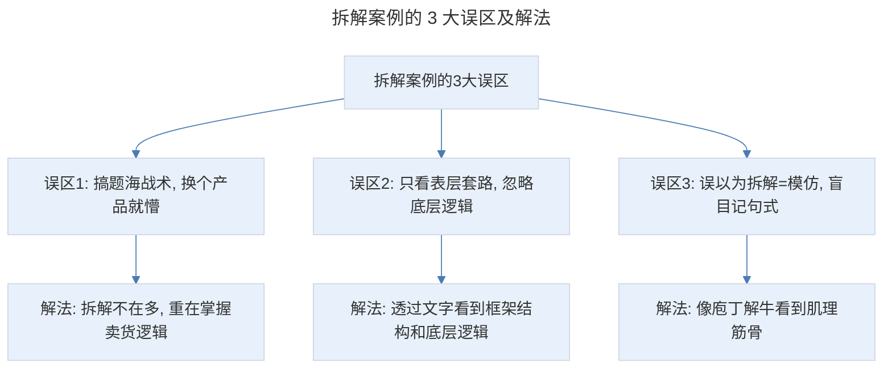
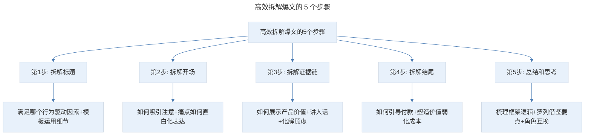
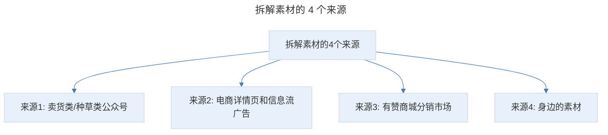

# 高效拆解：10 分钟拆解爆文，快速进阶成为文案高手！

## 1. 导言

本节知识点：3 个误区，3 个前提，5 个步骤，4 个素材来源。

如果你问我学卖货文案有没有捷径？我的答案是：有。熟悉我的人都知道，从没资源、没人脉、没经验的"三无小白"，到短时间做出多个千万级爆款，成为商家和学员口中的"卖货高手"，我的逆袭秘诀就是：拆解案例。

我通过拆解复盘优秀案例，找到行之有效的套路、方法、以及卖货逻辑，然后再去模仿、总结，用在自己的文章里，在文章发布之后我也会及时复盘这些经验和方法应用的效果，比如阅读、点击、转化率有没有提升？就这样不断改进。这是普通人掌握卖货文案的捷径，也是我验证有效的方法。可能有人会说：兔妈，我知道拆解案例很重要，也尝试过自己去拆解，的确能感觉写文案更顺溜了，但转化率为什么还是上不去呢？

## 2. 核心概念：拆解案例的 3 大误区

其实，90% 的人拆解案例都用错了方法。主要存在以下 3 大误区：

> 拆解案例的 3 大误区及解法：搞题海战术换个产品就懵（解法是拆解不在多重在掌握卖货逻辑）、只看表层套路忽略底层逻辑（解法是透过文字看到框架结构和底层逻辑）、误以为拆解=模仿盲目记句式（解法是像庖丁解牛看到肌理筋骨）。

### 误区 1：搞题海战术，换个产品就懵

经常有学员立下 flag 说："兔妈，我要每周拆两篇。"还有人说："兔妈，我每天拆一篇。"很努力，也很辛苦。但如果他刚拆完面膜的推文，你给他一款面膜让他写，他还是没思路。甚至会非常困惑，因为他不知道怎么写了，害怕写出来和拆的那篇一样。这就像上学时我们经常为了应对考试，花了很多时间在刷题上。你出一道和原题一模一样的题，他能解开，但换个同类型的其他题目，他就不会了。所以，拆解不在多，而在于你拆完有没有真正掌握这种类型的卖货逻辑。

### 误区 2：只看表层套路，忽略底层逻辑

曾经有位好友说："兔妈，我报了某某老师的文案课，作业是拆解文案。我刚拆解了一篇，你能不能帮我看看拆的对不对。"然后，我打开看到：上面用花花绿绿的字体标记出，不同段落用了哪个套路。其他就没有了。事实上，这只是拆解的最初级阶段。俗话说：外行看热闹，内行看门道。拆解案例就是一个看门道的过程。你能学到多少，提升多少，关键在于通过一篇推文，你能看到多少真相。如果你只看到表层的套路，就永远写不出逻辑清晰、说服力强的文案。

### 误区 3：误以为拆解 = 模仿，盲目记句式

很多人拆解文案，记了一堆句式，就像小学生造句一样，直接套上就能写，觉得进步很大。的确，模仿句式能提高文字表达能力，但这只是锦上添花。如果你都没找到锦在哪，花就无处存在。拆解文案要像"庖丁解牛"，你要透过文字的皮肉看到内部的肌理筋骨，也就是卖货的框架结构、底层逻辑，这才是爆文卖货的真相。

## 3. 关键方法：拆解案例你需要掌握这 3 个前提

### 第一个前提：看数据

拆解案例的目的是借鉴优秀的思路和方法，所以，你首先要知道哪些案例是值得借鉴的。否则，你去拆解那些失败的案例，就进步不大。尤其是 0 基础的小白，还有可能被错误的方法误导。如何判断哪些是优质案例，是值得借鉴和学习的呢？一个重要指标就是：看数据。数据是一篇推文的热度、关注度、优质度的直接反映。

如果你没有人脉，不认识内部人，拿不到数据怎么办？别慌，我给你 5 个判断维度：

1. **阅读量**。要注意的是，你不能只看这篇推文的阅读量，还要看账号上其他同类型的推文和同位置的推文。比如这个是卖面膜的，位置在第二条。那你就要看往期卖面膜，以及往期二条的阅读量。如果阅读量较高，就大概率说明是优质的。
2. **点赞量**。好的卖货文案是走心的，会引起目标顾客的共鸣，读完后点赞的概率也更高，所以，点赞量也是个重要的参考指标。
3. **评论量**。卖货推文是没有客服的，所以很多人下单前会在评论区咨询。一般情况下，评论量越多，说明购买的人越多。
4. **投放频繁度**。如果你在很多号或同一个号上，多次看到某篇推文，说明卖的肯定不错。因为只有转化好的文案，商家才会动用更多的渠道和资金去推广。
5. **你的心动度**。如果一篇推文能打动你，大概率也会打动像你一样的其他人。如果把看完直接购买的心动度打 10 分，然后看你读完有几分。

### 第二个前提：了解顾客群

文案是藏在键盘后面的销售。有销售，就有顾客群。不同顾客群有不同的习惯、喜好、需求和痛点，对应的解决方案和说服理由也不一样。比如卖大米的推文，你的第一感觉是大米人人都吃，人人都是目标人群。却忽略了这个大米卖 20 元一斤，普通家庭是消费不起的。它的顾客群是高端人士。高端人士的需求、生活场景和普通人是不一样的，推文要用的素材和说服理由肯定也不一样。当你考虑到文案背后的顾客，你才能和作者保持同频，才能深层次的分析、学习。所以，拆解前要先思考它的顾客群是谁，以及这些人的痛点和需求是什么。

### 第三个前提：找到切入点

切入点是一篇推文的起点。就像走迷宫，你只有知道作者是从哪个点开始走的，怎么过渡到主题的，如何论证的，才能找到走出迷宫的路线，掌握爆文卖货的真相。主要看什么呢？切入的思路和素材的运用。就像我带大家拆解的 XX 肺清的推文，我为啥要从一个小故事切入。又如何让读者觉得这件事很有可能发生在他身上。为了让他相信、让他产生恐惧，我用到了哪些素材等。

当搞清楚了这 3 个前提，你才能高度还原作者的脑回路，就像和作者一起，间接参与了这个案子，你的拆解才有意义、有结果。

## 4. 实践落地：高效拆解爆文的 5 个步骤和要点

> 高效拆解爆文的 5 个步骤：拆解标题（满足哪个行为驱动因素+模板运用细节）、拆解开场（如何吸引注意+痛点如何直白化表达）、拆解证据链（如何展示产品价值+讲人话+化解顾虑）、拆解结尾（如何引导付款+塑造价值弱化成本）、总结和思考（梳理框架逻辑+罗列借鉴要点+角色互换）。

### 第一步：拆解标题

拆解标题不能单单指出用了什么模板和公式，重要的是你要结合产品的顾客群，拆解标题满足了哪个行为驱动因素，以及模板的运用细节。就像我们拆解 XX 肺清的标题，同样是痛点 + 解决方案的模板，为什么这个阅读量高？你要拆解它的痛点是如何表达的？解决方案用了哪些技巧，来区隔同类竞品，吸引顾客点击？另外，还可以从以下几方面进行拆解思考：在抓人眼球方面用了哪些技巧（制造悬念、蹭热点、聊八卦）；在过滤目标顾客方面是怎样做的（痛点标签、身份、年龄标签）；价值是如何量化的；在煽动情绪方面是怎样突出紧迫感和焦虑感的；用了哪些超级词语，起到的作用是什么；和其他同类标题相比有没有创新点（如鼻喷标题的"鼻炎界的印度药神"）。

### 第二步：拆解开场

主要拆解开场是如何引发读者注意和兴趣，并快速切入主题的。这里有 2 个要点：如何吸引读者注意的（用新闻事件还是明星八卦，以及如何快速巧妙过渡到主题）；痛点是什么，有没有用热点来激活痛点。痛点的拆解又有 2 个细节：痛点是如何直白化表达的（负面场景、顾客画像故事、有画面感的动作词）；痛点不解决的严重后果是什么，能给目标顾客带来什么反应。只有这样做，拆解完一篇爆文后，你才能明白这个品类要打什么痛点，这个顾客群的核心痛点是什么。比如，很多学员说鼻喷的开场很有画面感，那拆解时，你不能只说"这个开场写得很有画面感"，而要拆解出它用了什么技巧来打造画面感，比如顾客画像故事、生活化的场景、擦揉擤鼻涕的动作词。那你就可以把这 3 个点记下来，用在自己的写作中。

### 第三步：拆解证据链

主要拆解推文是怎样介绍产品的，以及如何讲事实摆证据，证明产品对顾客的收益的。对一个产品有兴趣并不一定购买。所以，你要拆解它用了什么证据，来说服顾客，并让顾客相信这个产品能给他带来价值的。这里我总结了拆解证据链的 3 个要点：在打动顾客方面是如何展示产品价值的以及怎样证实的（借鉴思路避免自嗨式介绍）；在介绍作用原理和产品原料时是如何讲人话的（把好的表达句式记下来）；它是怎样化解顾客顾虑的（提出了什么问题，又是如何解答的）。另外一点是，注意图片和排版。很多时候，图片能传达比文字更直白的信息。你要留意好的配图和排版风格，比如产品图是从哪个角度拍的，动图用了什么创意，产品图出现的位置，字号、字色、行间距、字间距是怎样的，小标题和重点是如何突出的。

### 第四步：拆解结尾

主要拆解推文是如何快速引导顾客付款的，用了什么技巧。人在做出购买决策时，都会考虑成本和收益。所以，你要拆解它用了哪些技巧，来塑造产品的价值、弱化产品的成本，凸显产品的收益、以及购买产品的正当性和紧迫性的。

### 第五步：总结和思考

很多人拆解完就结束了，常常忽略了最重要的一步，就是总结思考。事实上，拆解后的思考比拆解本身更重要。主要有 3 个要点：回顾梳理整篇推文的框架逻辑（从切入点、引发兴趣、引出产品到证据链和收尾）；罗列出可以借鉴的要点以及这个点能用在什么类型的推文中（把要点和思考做好标记存入素材库）；角色互换（问自己作为潜在顾客是否下单、哪些困惑没被解决、如果自己写会怎样优化）。

## 5. 实践指南：如何找到拆解素材（4 个来源）

学会怎么拆解案例了，现在你就可以去积累自己的素材库了。我总结了 4 个来源供你参考：

1. **关注卖货类、种草类大号。** 在公众号搜"种草""好物"就会出来很多。另外，很多个人 IP 号、垂直领域的大号也都会接软文广告，比如你想找护肤方面的推文，就可以在公众号搜关键词"护肤"。
2. **电商详情页、信息流广告。** 很多人只盯着长文案，其实，这是个误区。不管什么渠道的广告，只要成交，都是对人性和人类行为习惯的把控。所以，空闲时可以刷刷电商详情页、信息流广告。前期我拆解的很多案例，都是详情页和朋友圈看到的信息流广告。
3. **有赞商城。** 打开有赞商城的分销市场，输入你要找的领域，就会出来很多不同类型的案例。可以多拆解自己研究的领域。
4. **你身边的素材。** 比如逛街时看到的海报、传单，刷朋友圈时看到的产品软文，别人微信群发的广告，甚至线下店的推销话术等。这张接女儿放学时收到的小卡片，我就写了一份 1500 字的拆解分析。通过这样的训练，可以提升你思考问题的能力和深度。

> 拆解素材的 4 个来源：卖货类/种草类公众号、电商详情页和信息流广告、有赞商城分销市场、身边的素材。

## 6. 进阶延展：总结与核心要点回顾

### 6.1 知识点总结

**第一个知识点：案例拆解的 3 个误区和 3 个前提**

- 误区 1：搞题海战术，换个产品就懵。
- 误区 2：只看表层套路，忽略底层逻辑。
- 误区 3：误以为拆解 = 模仿，盲目记句式。

拆解前必须要搞清楚的 3 个前提：看数据、了解顾客群、找到切入点。明白这 3 个前提，你才能还原作者的脑回路，拆解才有意义、有结果。

**第二个知识点：高效拆解爆文的 5 个步骤和要点**

第 1 步拆解标题、第 2 步拆解开场、第 3 步拆解证据链、第 4 步拆解结尾、第 5 步总结和思考。不管是哪一步，都有个大原则：拆解表面的套路，思考套路背后的卖货逻辑，以及举一反三用在其他产品中。

**第三个知识点：拆解素材的 4 个来源**

卖货类/种草类公众号、电商详情页和信息流广告、有赞商城、身边的素材。

当你掌握本节的 3 个知识点，并坚持刻意练习，你也能做到拆解一篇就有 10 篇的收获，才能触类旁通，快速完成从小白到高手的进阶。

### 6.2 核心要点回顾

拆解案例是普通文案掌握卖货文案的捷径，但 90% 的人用错了方法。3 大误区为：搞题海战术换个产品就懵（应掌握卖货逻辑而非追求数量）、只看表层套路忽略底层逻辑（应像庖丁解牛看到框架结构和底层逻辑）、误以为拆解=模仿盲目记句式（模仿只是锦上添花）。拆解前需掌握 3 个前提：看数据（阅读量/点赞量/评论量/投放频繁度/心动度 5 个判断维度）、了解顾客群（与作者保持同频）、找到切入点（还原作者脑回路）。高效拆解爆文的 5 个步骤：拆解标题、拆解开场、拆解证据链、拆解结尾、总结和思考（拆解后的思考比拆解本身更重要）。拆解素材的 4 个来源：卖货种草类公众号、电商详情页和信息流广告、有赞商城、身边的素材。

### 6.3 练习作业

**请用今天的高效拆解方法，把前面两节拆解的爆文，进行完善、补充和优化。**

---

## 参考资料

- 本案例内容来源于"极客时间"文案高手专栏第 14 节。