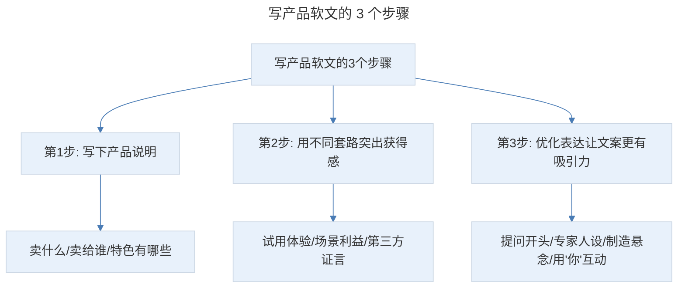
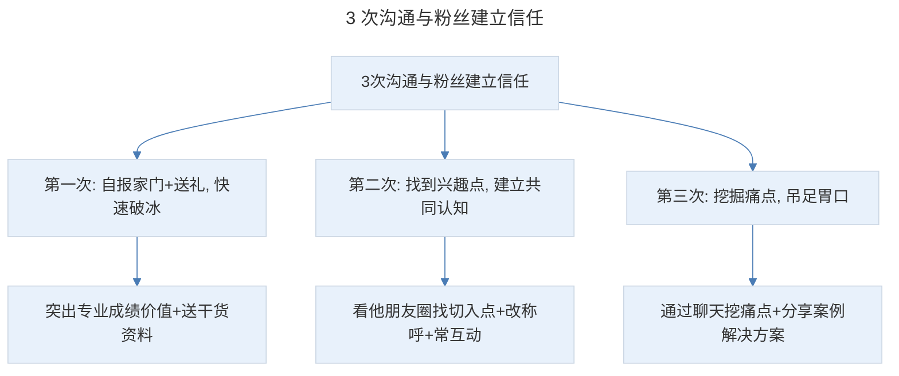

# 朋友圈卖货：4 个狠招让朋友圈潜在顾客纷纷下单，转化翻倍

## 1. 导言

本节知识点：打造朋友圈的 4 个技巧，小白也能每月多赚 5000+。

从这节课开始，我们就进入了文案学习的拓展阶段，把文案运用在多个维度，让你获得更高的销售额。

提到朋友圈，相信你肯定听过："你的朋友圈价值百万""朋友圈就是印钞机""做好朋友圈，普通人也能躺赚"……于是，你信心百倍交了钱，做了代理，拼命发圈，然而别人一条朋友圈能卖出几十、几百单，收款几千块，而你运气好的话，才有一两单。

为什么你发的内容，没人看、没人买，甚至被拉黑？但与此同时，又总有人把朋友圈玩得风生水起，赚得盆满钵满呢？

## 2. 核心概念：朋友圈卖货误区

这里就不得不提到，很多人朋友圈卖货的误区：

- **第一个误区：朋友圈全是产品广告。**
- **第二个误区：没有一个鲜明的人设。**
- **第三个误区：没有对粉丝提供价值。**
- **第四个误区：刚加好友就群发广告。**

其实，正确的朋友圈卖货逻辑，应该是先做信任，再卖货。而建立信任的第一步是：打造一个鲜明的人设。

## 3. 关键方法：如何打造让陌生人愿意掏钱的朋友圈人设

人设包含 2 方面：专业人设和生活人设。

- 专业人设就是你在职业中的人物设定，比如，你的职业、专业成绩，客户对你的口碑评价等。
- 生活人设是你的个性、特点、兴趣，生活中的形象。

比如我的职业是卖货文案，客户对我的评价是专业靠谱，我的个性是务实、接地气，爱好阅读。最后提炼一句话就是：兔妈是专业靠谱的卖货文案操盘手，她喜欢阅读，性格是务实、接地气。这句话就是我的人设。

### 3.1 第一个问题：不专业怎么办？

有些人会说：兔妈，我小白一个，不专业啊。其实，专业是相对的，一是自己成为专业人士；二是让别人以为你是专业人士。

自己成为专业人士不难。买一些书，关注一些同行大咖的公众号、微博，有条件的话，听听线上、线下课。经常学习、总结、归纳，一两个月，就能入门，五六个月，就能成为半个专家，起码也比普通人懂得多。

让别人以为你是专家，则要把每天学的内容通过朋友圈展示出来，让别人知道你在这个领域有见解、有研究。比如你是卖服装的：首先，买几本穿搭和色彩搭配的书，关注一些穿搭达人的公众号，借鉴他们的观点，用自己的话表达出来。其次，帮顾客解答问题，比如平胸怎么穿，个子矮怎么穿，苹果型身材怎么穿。

**这里给你 3 个常用的体现你专业的模板：**

- **很多人问我 + 常见问题 + 解决方案……**
- **很多人以为 + 常见误区 + 解决方案……**
- **其实 + 结论 + 解释原因……**

"很多人"就暗示你很专业、很受欢迎，这样遇到同类问题就会第一时间想到你。

最后，多分析案例。案例比理论更实用，也更受欢迎。我就经常发一些小案例，并给出分析思考。如果你卖服装，逛街时看到好的穿搭，就可以拍下来，然后发圈分析这个风格适合什么样的人，有什么样的视觉效果等。专业人设的核心是提供有价值的内容。所以，你要知道顾客有哪些问题，也就是痛点，和写推文是一样的。你解决的问题越多，别人就觉得你越专业。

### 3.2 第二个问题：生活人设等于晒生活吗？

有些宝妈，一天到晚就是晒娃，而且孩子也不好好收拾下，邋里邋遢就出镜；有些人生活中、工作上遇到不顺心的事，就朋友圈发泄；有些人，占了便宜喜欢炫耀。这也是生活化的，但会给人一种很 Low 的感觉。所以，生活人设并不是把你的生活在朋友圈直播，而是要过滤筛选。

你要想清楚：你想给别人什么样的印象？然后列出关键词。比如，我希望呈现给大家的形象是正能量、积极向上、生活得还不错。围绕这个形象就可以列出以下关键词：读书、思考、自律、勤奋努力、女儿懂事、老公贴心……

然后，把生活中能体现这些关键词的细节记下来。比如，前段时间我发了一条早起的朋友圈，这里就有几个点：休息陪娃，说明我是职场妈妈，事业家庭兼顾得很好；4:50 醒，5 点起床，说明我很自律；早起赶稿，说明我勤奋努力；做了几个压肩动作，说明我热爱生活。

再比如，前段时间我拜访很多大佬，就发圈写下和大佬聊天的收获，说明我积极向上、爱思考，而且还说明我圈子不错。总之，生活人设，不是简单的晒，而是通过生活细节来佐证你的人设关键词，让大家熟悉你、信任你，甚至把你当榜样。这也是我强调的**功利性发圈法**，你发的每条朋友圈，都要给人设加分。这样别人一看就知道你是干什么的，是怎样的一个人。

## 4. 实践落地：写产品软文的常用套路和 3 个步骤

谋划了这么多，我们的终极目的是通过卖货、卖服务，赚到钱。所以，你不可避免会遇到另一个问题：产品广告怎样写，才能既卖货又不伤人设？

### 4.1 写产品软文的原则

写产品软文有个原则：一定要"以人为核心"。产品再好，你直白生硬的叫卖也让人觉得浮夸、不信任。正确的方法是：多写你的体验、场景利益、第三方证言或案例。真实的体验过程，让粉丝相信你是亲自用过的。场景能激发顾客美好想象。第三方证言和案例，让顾客产生共鸣，并预期会产生同样的结果。有预期，就会有欲望。

### 4.2 写产品软文的 3 个步骤

> 写产品软文的 3 个步骤：写下产品说明（卖什么/卖给谁/特色有哪些）、用不同套路突出获得感（试用体验/场景利益/第三方证言）、优化表达让文案更有吸引力（提问开头/专家人设/制造悬念/用"你"互动）。

**第一步：写下产品说明。** 包括你卖的是什么？要卖给谁？特色有哪些？比如卖面膜：产品是 XX 美白面膜，顾客是经常熬夜、想要变白的女性，特色有医美级美白成分、每片 22ml 精华、泰国进口蚕丝等。

**第二步：用不同套路，突出某个特色给顾客带来的获得感。** 什么是获得感？就是给顾客带来的可量化、可感知的好处。比如，你要突出"美白效果明显"这个特色，可以用**试用体验**来写：我一般一周敷 2-3 次，每周坚持用，三周后和原来的照片一比，自己都被吓一跳，这明显白了一个色号啊！天生的暗黄皮变得由里到外的透亮，用手指轻轻一戳就像果冻一样 Q 弹，连闺蜜都问我是不是偷偷去打了美白针。另外，写试用体验时，还有个小技巧，就是你可以和其他同类产品的试用感受进行对比，凸显产品的好。

用**场景利益**写：上个月公司年中总结会，每天加班到晚上 1 点多，心想坚持这么久的美白功课又要被打回原形了。但熬了一周，皮肤还是很透亮，太让我惊喜了！连一起熬夜的同事都嫉妒地说：明明一样熬夜，凭啥你的脸像没熬一样。

用**第三方好评或案例**写：刚 XX 留言说：她上周六，熬夜到凌晨三点多，一整天出门也没涂防晒，第二天以肉眼可见的速度黑了。接着她又说：星期天晚上急救敷了一片，敷完第二天就白了一点点。

如何写好场景、体验和顾客证言，前面的课时中我们讲过，可以复习下。但有人可能会说：兔妈，没有顾客证言怎么办？别慌！教你一招：**向顾客要好评**。比如我的电子书发售时，让助手去和买过的人聊天，问对他们写稿有啥帮助？就收到很多好评。注意，你的提问要具体，不要问"觉得怎么样"，这样得到的答案十有八九是"差不多"，没啥意义。正确的方法是：问具体的某个点。比如：你觉得面膜的精华多不多？和以前用的比起来怎么样？他就会说：精华好多啊，比以前用的多多了，这样你就可以截屏、马赛克发圈了。

**第三步：优化表达，让文案更有吸引力。** 初稿写好不要着急发布，还要想一下能不能优化表达。比如用**提问**开头：为什么网红达人都力荐这个美白成分？我亲自体验后才明白，太神奇了。用**专家人设**开头：很多人问我，XX 面膜多久才能见到效果 + 你的试用体验。用**悬念**开头：这款面膜惹大祸了！连着好几个人问我：是不是偷偷打了美白针！用**"你"字互动**：试用体验 + 互动引导：你觉得我像打了美白针吗？配上变白前后的对比图。另外，还可以把产品特色写成**小科普**，比如产品原料、工艺、生产过程、产品故事、原理等。当然不能太生硬，还记得我们讲的 5 种人话技巧吗？你可以用起来。

### 4.3 知识付费课程的推荐语模板

可能有小伙伴会说了：兔妈，这些方法好像更适合实体产品。如果我要在朋友圈卖知识付费课程，转发推文的推荐语怎么写，别人才愿意点击、转化率才会高呢？别急！我给你总结了 2 个模板：

**模板 1：普遍痛点+文章主题 + 圆满结局。** 就是先指出目标人群的痛点，让他产生共鸣。然后，引出文章主题，并暗示这就是你痛点产生的原因。最后，给出圆满结局。为了解决痛点，获得圆满结局，粉丝就会点击链接查看原文。比如：很多人写稿的状态是：收拾好桌面，冲了杯咖啡，打开 word，脑袋一片空白，半天憋不出一个字。其实，关键问题在于你准备工作没做好。4 步准备工作，就能让你写稿更轻松。

**模板 2：我学了 + 学习收获 + 适合人群 + 引导行动。** 我学了是告诉朋友圈粉丝，这个课程是你学过的；学习收获写出你通过学习获得的成绩和改变；适合人群指出课程适合的人群，让潜在顾客对号入座；引导行动是用限时限量、价格锚点等引导粉丝马上下单。有位学员就用这个模板推荐兔妈的文案社群，发完朋友圈不到 1 小时，就有 12 个人私信她问怎么买。其实，这个模板的本质是顾客案例，只是这个顾客是你。粉丝看到你的收益对比，就会觉得：你学完后能获得成长、赚到钱，我肯定也可以。

最后要强调的是，不管是实体产品，还是知识付费产品，每条朋友圈最好只说一个点。这样不会折叠，而且你每天都不缺素材。当然，千万别忘了最后一步：评论区引导下单。我建议你每天发 4-8 条朋友圈：干货 1-2 条，个人生活 1-2 条，科普 1 条，产品软文 2-3 条。另外，发圈时间最好规律。

## 5. 实践指南：3 次沟通与粉丝建立信任，让订单翻倍

打造了人设，发了软文，就坐等订单上门吗？99% 的人是这样的。但朋友圈卖货高手不会告诉你，让订单量翻倍的成交秘籍，就是：私信沟通。你会发现有些人持续关注、点赞，甚至咨询，但迟迟不下单？所以，你要主动出击。我有个朋友，是知识分销领域的大 V，不管卖什么课，别人都愿意找他买。我问他原因，他说了 3 个字：多聊天。

可能你会说：兔妈，我试过，但顾客很抵触，根本聊不下去。为什么是 3 次呢？统计表明：打交道 3 次，就能从陌生人变成半熟人，甚至熟人。

> 3 次沟通与粉丝建立信任：第一次自报家门+送礼快速破冰（突出专业成绩价值+送干货资料）、第二次找到兴趣点建立共同认知（看他朋友圈找切入点+改称呼+常互动）、第三次挖掘痛点吊足胃口（通过聊天挖痛点+分享案例解决方案）。

### 第一次：自报家门 + 送礼，快速破冰

如果你们从来没说过话，对方会想：找我什么事？很戒备。所以你要先自报家门。但自我介绍不能太硬，也不能太长，要凸出：你的专业、成绩、能给对方带来的价值。然后送上干货资料或产品小样。你可以说：经常看到你给我点赞，特别感谢。送你一份 XXX，相信能帮上你。如果你有某方面的问题，也可以问我。就像我这位朋友，如果分销我的课，他就给点赞的人送一份我的干货包。这样别人觉得他很真诚，而且也了解了课程的价值，就会找他买。

### 第二次：找到兴趣点，建立共同认知

如何找到切入点呢？答案是：看他朋友圈。比如一个人经常发健身、跑步的消息，你就可以说"好佩服你，平时上班那么忙，怎么做到每天跑步的。我也很想跑步，但每次都坚持不了几天"。聊到差不多时，找借口说要发货等，让对方觉得你很忙，事业做得还不错，引起他的注意。另外，这次要改称呼了。男生叫某某哥，比自己小就叫帅哥，女生叫美女，如果明显年纪大的，可以叫姐姐。在朋友圈还要常和他互动，点赞 + 评论 = 关心。如果对方卖产品，也可以买他一份。这样很快就能与对方建立情感链接。

### 第三次：挖掘痛点，吊足胃口

比如你卖母婴产品，通过聊天知道对方孩子不好好吃饭，晚上睡得也很晚。你就可以说：某顾客的孩子也是这样的情况，然后你用什么方法帮他解决了。现在是什么情况。可能很多人会纳闷了，何时讲产品呢？答案是朋友圈！他会对你好奇，觉得你很专业，人又贴心，还不推销产品，对你的印象就很好，甚至主动翻你的朋友圈！在需要时，也会首先想到你。

现在不管朋友圈卖什么，都能看到同行，而且一个微信只有 5000 好友，所以，朋友圈卖货拼的不单是文案、人设，而是系统化、精细化的运营，这也是朋友圈卖货的真谛！

## 6. 进阶延展：总结与核心要点回顾

### 6.1 知识点总结

**第一个知识点：如何打造朋友圈的人设？**

列出目标形象的关键词，然后把体现关键词的生活细节展示出来。在朋友圈中多输出你的见解和观点。这样才能让别人熟悉你、记住你、喜欢你、信任你。3 个常用的体现你专业的模板：很多人问我+常见问题+解决方案；很多人以为+常见误区+解决方案；其实+结论+解释原因。

**第二个知识点：写产品软文的 3 个步骤**

第 1 步写出产品说明（卖什么、卖给谁、特色有哪些）；第 2 步用不同套路突出某个特色给顾客带来的获得感；第 3 步优化表达让文案更有吸引力。并总结了转发推文时常用的 2 个推荐语模板：普遍痛点+文章主题+圆满结局；我学了+学习收获+适合人群+引导下单。

**第三个知识点：3 次沟通，快速与粉丝建立信任**

第 1 次自报家门+送礼快速破冰；第 2 次找到兴趣点建立共同认知；第 3 次挖掘痛点吊足胃口。另外，别忘了朋友圈卖货的 4 个误区：朋友圈全是产品广告、没有一个鲜明的人设、没有对粉丝提供价值、刚加好友就群发广告。

通过以上 3 个方法，你的朋友圈订单也能翻倍。

### 6.2 核心要点回顾

朋友圈卖货的正确逻辑是先做信任再卖货，需避开 4 个误区（全是产品广告、没人设、没价值、刚加好友就群发）。打造人设包含专业人设和生活人设：专业人设通过 3 个模板（很多人问我/很多人以为/其实）和案例分析体现专业性；生活人设通过"功利性发圈法"筛选生活细节佐证人设关键词。写产品软文坚持"以人为核心"原则，按 3 个步骤：写产品说明、用试用体验/场景利益/第三方证言突出获得感、优化表达（提问/专家人设/悬念/"你"字互动开头）；知识付费课程推荐语用 2 个模板（普遍痛点+文章主题+圆满结局、我学了+学习收获+适合人群+引导行动）。最后通过 3 次沟通（破冰/找兴趣点/挖痛点）与粉丝建立信任。朋友圈卖货拼的是系统化、精细化的运营。

### 6.3 练习作业

**请用"我学了 + 学习收获 + 适合人群 + 引导行动"的模板，写一段朋友圈卖货文案。**

---

## 参考资料

- 本案例内容来源于"极客时间"文案高手专栏第 15 节。