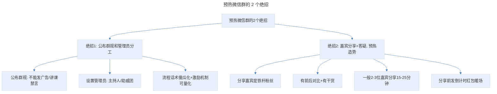
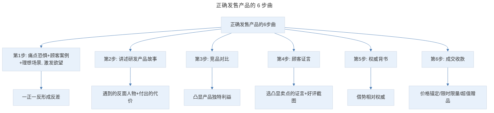
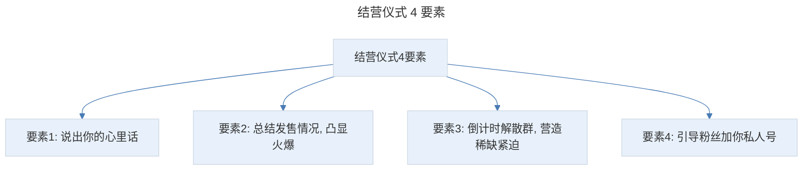

# 社群转化：3 个核心 6 个步骤，小白也能操作一场收款 10 万+ 的社群发售

## 1. 导言

本节知识点：3 个核心，6 个步骤，实操社群发售。

可能有小伙伴会困惑："兔妈，别说卖货收款了，我的几个社群每天只有几个人发发表表情，问问好，偶尔丢个链接，让大家点个赞、投个票。哪里有机会了。"

别急！我先给你分享两个案例：

**第一个案例**是我朋友涛哥，他在今年 1 月份，通过社群发售，售卖自己的卖货研究社群，收费 998 元，2 天时间，卖出 103 个，成交金额 10.2 万。

**第二个案例**是今年 6 月份，我的电子书上线，定价 39.9 元，很多人说比实体书还贵，很不看好电子书的销量。但我通过 3 天的社群发售，成交了 1377 套，其中包括 89.9 元和 799 元的大额套餐，最后成交金额 10.7 万，购买转化率高达 40.18%。

社群卖货的门槛和成本很低，就算你没客户，没预算，没团队，也能通过社群卖货快速赚到第一桶金。

做一场高转化的社群，有 3 大板块，分别是：建群、预热、发售。

## 2. 核心概念：正确建群的 2 个方法

建群之前有常见的有 2 个误区，千万别犯：

- **误区 1**：不打招呼，也不管别人愿不愿意，就拉进群里。结果被拉进来的人很反感，没等你宣传产品就退群了。
- **误区 2**：靠红包和礼品诱惑。承诺发 XX 元的红包，XXX 元的礼品。的确，这样能快速吸引人，但吸引来的都是贪小利的人，效果也不好。

那怎样能快速吸引目标顾客，又不会让他反感呢？我给你推荐 2 个方法。

### 2.1 第一个方法：朋友圈征集

朋友圈征集包括 3 方面：你自己发朋友圈，说要搞事情了，感兴趣评论区扣 1，然后拉群；让实力和你相当的好友帮你转发，这一次他帮你，下一次你帮他推，彼此赋能；找拥有大量粉丝的大 V 借势，但前提是你要先给他提供他需要的价值，这样他才愿意帮你。

另外，你不能生硬地说：我要建群发布新品了，这样肯定没人进。那么如何发布信息才能吸引目标用户进群呢？下面我给你总结 4 个要点：

- **悬念反差 + 承诺**。比如，我帮好友涛哥转发卖货社群时就用了这个技巧：开头说"很多人邀请他开课，他拒绝了"，制造反差。然后用嘉宾身份做出承诺：都是真金白银实操出来的干货。一个微信群是 500 人，我这条朋友圈就帮他引流了 102 人。
- **痛点 + 解决方案**。比如你要卖面膜，可以先直击痛点：网红面膜用了很多没效果，大牌面膜又舍不得。给出的解决方案是：让你花白菜钱用到千元品质的面膜。
- **请求粉丝帮忙**。你可以发消息说，耗时多久的新品要上线了，想请大家帮忙做个小调研。感兴趣在评论区扣 1，你会拉一个群，还会给参与的人送一份小礼品。在获取好友点赞的过程中，你就完成了准顾客的筛选。
- **公布超值福利**。在以上 3 点的基础上公布福利，比如会给一个有史以来的最低价，群外人是享受不到的。并且还会发红包和礼品。

### 2.2 第二个方法：讲课

你可以借助各种直播平台，比如千聊、荔枝微课、抖音等。也可以通过群直播软件，多群同步讲课。可以讲免费公开课，也可以讲收费课。

去年 10 月份，我做了一次免费公开课，想听课的人必须将海报分享到朋友圈并截图给我，才能获得免费听课资格。通过这个方法，吸引了 900 多人来听课。在今年发售电子书时，我做了一次收费公开课，3 天课程收费 9.9 元。课程主题很吸引人，性价比又很高。而且可以参与分销，每分销一个人，就能获得 99% 的分销佣金，所以，就会有很多人愿意帮你分销，最后吸引了 3200 多人来听课。

但不管是哪种，要学会借势种子用户快速裂变。具体有 2 个步骤：

- **寻找种子用户**。种子用户是裂变传播的原动力。去哪找种子用户呢？首先，是你的朋友、同事、家人等；其次，是你混群结交的同频人、大 V 等；最后，是你在打造朋友圈专家人设时，和你互动多的人，比如常给你点赞、评论的，你可以私信他。
- **设计裂变海报**。课程能不能吸引人，海报是关键。

**设计海报的 5 大要素：**

1. **海报主题**：主题要让人看见的第一眼，就能理解内容是讲什么的，对他有啥好处。比如这 2 个标题："我是怎样帮助 1500+ 小白赚取文案第一桶金？""兔妈揭秘：如何从 0 写出卖货千万爆文，每月多赚 5 万+"。首先，用提问引发好奇。人类只要被问到，就会"想知道答案"，这是天性。其次，筛选目标人群。"1500+ 小白""文案""从 0"这些关键词，精准锁定文案新手。最后，凸显金钱获得感。"帮小白赚到第一桶金""每月多赚 5 万+"，明确给出课程带来的结果利益，激发欲望。
2. **课程讲师**：要包括 2 个要点：权威背书 + 案例成绩。
3. **课程大纲**：课程大纲不要讲生硬的课程信息，要与顾客的痛点和需求产生强关联。
4. **大咖背书**：权威推荐能降低粉丝选择风险，获取信任。
5. **促使成交**：价格锚点凸显价值、限时限量制造紧迫感，超值福利加强诱惑。

最终总浏览人数 5717 人，付费 3267 人，转化率：57.15%，创下业内所有活动的最高纪录。

试过 2 个方法后，我的建议是：收费课更利于后期转化。如果你怕收费没人进，可以把价格定低一些，比如 6.9、2.9 元等。

## 3. 关键方法：预热微信群的 2 个绝招

预热的目的是：建立信任感，让群成员认识你、熟悉你、认可你、信任你。这也是社群卖货成功的关键。一般预热时间是 1-2 天。主要有 2 个要素：

> 预热微信群的 2 个绝招：公布群规和管理员分工（公布群规不能发广告/讲课禁言、设置主持人/助威团管理员、流程话术傻瓜化+激励机制可量化）；嘉宾分享+答疑预热造势（分享嘉宾是铁杆粉丝、有前后对比+有干货、一般 2-3 位嘉宾分享 15-25 分钟、分享前发倒计时红包暖场）。

**1、公布群规和管理员分工。** 首先，建好群后最重要的就是公布群规，比如不能发广告；讲课期间禁言等，并提醒流程安排。然后，设置管理员，包括：主持人、助威团等。最后，还要明确岗位分工。主要有 2 个原则：（1）流程话术要傻瓜化，管理员只需复制、粘贴即可；（2）激励机制要可量化，比如得票最高的管理员可获得红包奖励等。

**2、嘉宾分享 + 答疑，预热造势。** 准确来说，分享嘉宾是你的铁杆粉丝。但千万不能太生硬说这个产品多好，兔妈多厉害，这样一看就很假。这里有 2 个要点：（1）有前后对比，特别是之前的糟糕情况，和之后的变化；（2）有干货。举个例子：如果你是卖减肥产品的，可以找几位减肥成功的顾客来分享，先分享之前胖的经历，再分享如何用产品成功瘦身的，并给出瘦身前后的对比图。另外，还要分享一些减肥干货，比如运动、饮食等，让粉丝觉得有收获。

通过嘉宾分享，让人对你或你的产品产生好感。更重要的是，给粉丝一种正面暗示：和我一样的普通人都做到了，我也一定能做到。一般设置 2-3 位嘉宾分享，每次分享 15-25 分钟。另外，嘉宾分享结束，还要解答粉丝的问题。还个小细节是，嘉宾分享前，要发倒计时红包暖场。也可以穿插和产品有关的竞猜、游戏抽奖等，中奖粉丝送现金红包、产品小样、代金券等。

## 4. 实践落地：正确发售产品的 6 步曲

谋划了这么多，终极目的就是成交卖货。接下来，我们来讲如何发售。

> 正确发售产品的 6 步曲：痛点恐惧+顾客案例+理想场景激发欲望（一正一反形成反差）→ 讲述研发产品故事（遇到的反面人物+付出的代价）→ 竞品对比（凸显产品独特利益）→ 顾客证言（选凸显卖点的证言+好评截图）→ 权威背书（借势相对权威）→ 成交收款（价格锚定/限时限量/超值赠品）。

**1、痛点恐惧 + 顾客案例 + 理想场景，激发粉丝欲望。** 先指出目标顾客普遍的痛点，再展示受益的顾客案例。并告诉粉丝：曾经他们也和你是一样的情况，让粉丝产生积极心理暗示，"别人能做到，我也能做到"。另外，还可以描绘出顾客心中的理想场景，比如，"有了这套课程，你也能体会推文一发出去，订单就噌噌噌暴涨，商家、金主，主动送钱到你手里"的感觉。一正一反，形成反差，激发顾客对现状的不满，对美好生活的渴望。

**2、讲述研发产品的故事。** 通过这一步，给粉丝传达这是一款重磅产品，引发粉丝的好感和好奇。常用的有 2 个技巧：（1）遇到的反面人物：好的故事都是有冲突的。比如，我就讲到写书时，朋友、家人、客户的打击。（2）付出的代价：比如，为了写书，我推掉很多合作机会。大纲被推翻了几十次，52 位编辑反复校对了 200 次，这样粉丝就会觉得：花费这么多人力物力，肯定靠谱。

**3、竞品对比。** 顾客已经被你的故事吸引了，但付款时会想：你的故事的确很感人，但我已经买过其他产品了呀。所以，你要通过竞品对比，指出你的产品和市面其他竞品的区别，凸显产品的独特利益。告诉他：这个产品和其他不一样。

**4、顾客证言。** 你罗列再多好处也是自己说的，还要给出其他顾客证言，这样粉丝就会觉得：大家都说好，应该不错吧。而且顾客证言要选凸显产品卖点的。比如：兔妈的电子书是文案界的新华字典，其他人就会觉得：这么厉害，到底什么样呀。就能激发购买欲望。另外，要配上好评截图或视频，让人觉得真实。

**5、权威背书。** 对不了解的产品，很多人都喜欢参考权威的意见。大佬都说好，肯定错不了。可能有人会说："兔妈，我的产品没有权威，怎么办？"你可以借势身边的相对权威。比如，如果你卖蛋白粉，就可以免费送给你的健身教练，然后就可以说：国家二级健身教练都推荐。

**6、成交收款。** 假如你的发布会非常成功，有 80% 的人感兴趣，如果结尾轻描淡写地说：感兴趣的朋友快下单吧。可能销量就几单。但如果你设计一个让顾客觉得买到就是赚到的成交方案，可能会增加 2 倍，甚至 3 倍的销量。常用技巧有：（1）价格锚定：比如市面上同标准的产品都是 99 元，我们 69 元，而且群内成员只要 39 元。（2）限时限量限身份：这里有个要点是，一定要给出限时限量的理由，比如：为了让大家熟悉这个品牌，我们是成本价出售的，所以只限 300 套，而且只限群内成员，群外是不能享受这个价格的。（3）超值赠品：赠品是促进购买的一个关键因素，能让人觉得占了便宜。

**在选择赠品时，要注意 4 个技巧：** ①赠品要能让顾客更好达成目标（卖洗面奶就送洁面仪、面膜，因为这些能让顾客皮肤更好）；②要塑造赠品价值（拍精美的照片，标出赠品价格和给顾客带来的好处）；③赠品也要限时限量（仅限前 100 名下单的人）；④赠品要设置门槛（把下单截图发到群里，可以更快帮你安排，其他顾客看到这么多人下单，从众和稀缺性起作用，也会跟着下单）。

## 5. 实践指南：结营仪式，打造第二波成交高峰

你发现了吗？社群发售的流程和写卖货推文的步骤是一样的。它就是把你的推文，像新闻发布会一样一段一段呈现给社群成员，引导他们一步步了解你的产品、激发购买欲望，解决各种信任难题，最终让他们下单付款。

但到这里就结束了吗？NO！最后还有一个非常重要的环节，就是：结营仪式。然后，倒计时解散群。

为什么说结营仪式非常重要呢？首先，如果不解散群，后期管理成本会很高，而且如果有人说坏话或申请退款，就很难控场。其次，如果草草解散群，你费尽心思引流来的人就流失了。正确的方法是：举行结营仪式。

> 结营仪式 4 要素：说出你的心里话、总结发售情况凸显火爆、倒计时解散群营造稀缺紧迫感、引导粉丝加你私人号。

**主要包括 4 个要素：**

- 说出你的心里话。
- 总结发售情况，凸显火爆。
- 倒计时解散群，营造稀缺感和紧迫感，促使快速做决定。
- 引导粉丝加你私人号。

## 6. 进阶延展：总结与核心要点回顾

### 6.1 知识点总结

**第一个知识点：正确建群的 2 个方法**

- 朋友圈征集。可以自己发圈，也可以和实力相当的人互推，或者借势大 V。
- 讲免费课或公开课。具体有 2 个步骤：找到种子用户，设计课程海报。

**第二个知识点：预热微信群的 2 个绝招**

- 用傻瓜式的话术，降低管理员门槛。
- 请铁粉做分享，让顾客熟悉你、信任你。

**第三个知识点：正确发售产品的 6 步曲**

- 第 1 步：用痛点恐惧 + 顾客案例 + 理想场景，激发粉丝欲望。
- 第 2 步：讲述产品研发故事，与顾客建立情感链接。
- 第 3 步：竞品对比，凸显产品独特利益。
- 第 4 步：顾客证言。
- 第 5 步：权威背书。
- 第 6 步：成交收款。

最后，用结营仪式，打造第二波成交高峰。按照这 3 个知识点去操作，你也能靠一场发售会完成半年的销量。

**小知识点：设计海报的 5 大要素：**

1. 海报主题：主题要让人看见的第一眼，就能理解是干啥的，对他有啥好处。
2. 课程讲师：要包括 2 个要点：权威背书 + 案例成绩。
3. 课程大纲：课程大纲不要讲生硬的课程信息，要与顾客的痛点和需求产生强关联。
4. 大咖背书：权威推荐能降低粉丝选择风险，获取信任。
5. 促使成交：价格锚点凸显价值、限时限量制造紧迫感，超值福利加强诱惑。

### 6.2 核心要点回顾

社群发售是门槛和成本极低的卖货方式，做一场高转化社群有建群、预热、发售 3 大板块。建群需避开 2 个误区（不打招呼拉人、靠红包礼品诱惑），通过朋友圈征集（悬念反差+承诺、痛点+解决方案、请求帮忙、公布超值福利 4 个要点）或讲课（免费课/收费课，收费课更利于转化）两种方法；讲课需找种子用户并设计海报（海报 5 大要素：主题/讲师/大纲/大咖背书/促使成交）。预热通过公布群规和管理员分工（话术傻瓜化+激励可量化）、嘉宾分享+答疑（有前后对比+有干货）建立信任。发售按 6 步曲：痛点恐惧+顾客案例+理想场景、讲述研发故事、竞品对比、顾客证言、权威背书、成交收款（价格锚定/限时限量/超值赠品）。最后用结营仪式（心里话/总结火爆/倒计时解散/引导加私人号）打造第二波成交高峰。

### 6.3 练习作业

**假设你要卖一款与"迪士尼"联名的午餐盒，请为这款产品设计一份社群发售流程。**

---

## 参考资料

- 本案例内容来源于"极客时间"文案高手专栏第 16 节。