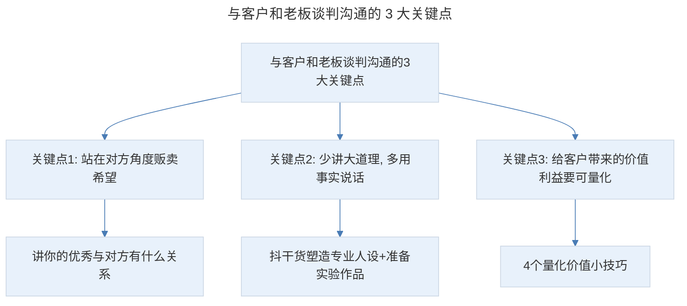
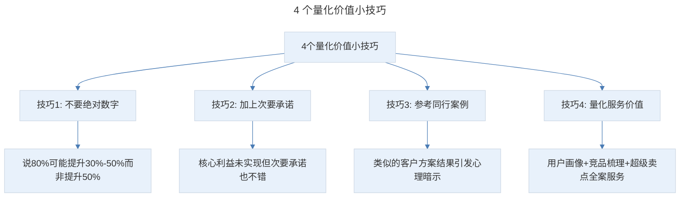
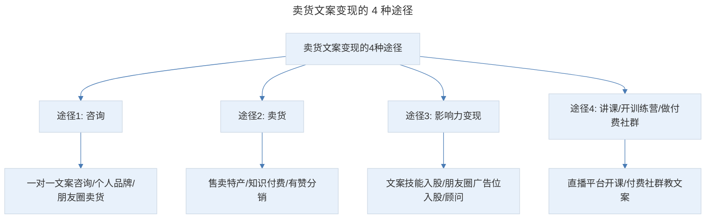

# 文案变现：1 套金主谈判、求职面试的万能表达脚本

## 1. 导言

本节知识点：3 大关键点，4 种变现途径。

掌握了正确的卖货文案写作方法，那怎样才能提高学习效率、短期获得更大进步呢？我的答案是：用这项技能去赚钱。

对于大多数人来说，为了"提升自己"或"个人兴趣"去学文案课，通常没有用，因为这个目标太虚了，不能量化，也没有反馈机制，你根本坚持不了。但如果用学到的文案方法去接稿、卖货，和老板谈判，发现每个月多赚了几百元、几千元，这个方法就会刻在你脑子里，想忘都忘不了。更重要的是，当你真正体会到赚钱的快乐，就像被注入了源源不断的能量，你会愿意主动学习更多的东西。

说到接稿呢，很多人经常问我一个问题："兔妈，明明我也有 7-8 年的文案经验，写的内容自认为也不算差，为什么同样一篇文案，别人能收几千，甚至几万元，我却只能收 500 元？我明明比别人收费低、态度也不差，怎么报完价格，客户那边就没了下文？"

其实这些问题，都是对人的营销出了问题。简单理解就是，你没有很好地把自己"卖"出去。你自己优秀，和让别人认为你优秀是两件事情。如何达成外界对你的有效认知，让别人认为你是优秀的、可靠的，有能力的，值得万元稿费或薪酬呢？这是对人营销的本质。

事实上，推销自己和推销产品是一样的，你要了解目标用户是谁？他有什么样的需求和痛点？你能帮他解决什么问题？帮他达成什么样的结果？以及如何让他相信你有这个实力。

## 2. 核心概念：与客户和老板谈判沟通的 3 大关键点

> 与客户和老板谈判沟通的 3 大关键点：站在对方角度贩卖希望（讲你的优秀与对方有什么关系）、少讲大道理多用事实说话（抖干货塑造专业人设+准备实验作品）、给客户带来的价值利益要可量化（4 个量化价值小技巧）。

### 第一个关键点：要站在对方角度贩卖希望

其实，这就是我们强调的用户思维。只是这里的用户不是购买产品的顾客，而是购买你服务的老板或商家。那什么才算是站在对方角度呢？那就是，你不要讲自己多优秀，而要讲自己的优秀和对方有什么关系。

**没有用户思维的人**是这样的："我叫某某，任职什么岗位，曾经在 XX 文案训练营获得优秀学员称号，靠文案变现多少元，期望有机会与您合作。"但客户看到会说，你是优秀学员、变现多少元跟我有什么关系？甚至还会引起别人的反感情绪。

**有用户思维的人**是这样的："我叫某某，擅长什么，最近的成绩有：帮多少位商家卖货多少等。如果你在卖货时有选品、转化等方面的困惑，我可以给你提供什么样的帮助。比如，免费诊断推文等。"

**区别就在于：有用户思维的人会时刻站在对方的角度，讲和对方有关的事。他的重心不是自己多厉害，而是能给对方提供什么价值。**

所以，在与客户沟通谈判时，你要多讲与客户有关的事、客户关心的事。但这里注意的是，你不能生硬地提问："你们的产品有哪些特色？"这样连续几个问题下去，客户就会不耐烦。正确的方法是：引导性地问。比如："这类产品近几年很火呢，市面上这类产品也不少，大部分卖点都是什么，不晓得咱们家的产品除了这些点，还有哪些不同点呢？"这样不仅能凸显你的专业，更重要的是，打开话匣子，让对方更愿意谈产品的特色。

再举个例子，如果你去面试，你就可以先讲：对公司的了解和印象，以及说出你为什么对该公司充满敬仰。切忌的是：你不能浮于表面地拍马屁，而要真正去公司官网研究一下，说 2-3 条他们引以为傲的点。另外，还要聊聊行业的趋势和痛点。

总之，不管与客户谈判，还是求职面试，你都要讲与对方有关的内容。这就像一种"口头的握手"，让你与对方快速建立链接。

### 第二个关键点：少讲大道理，多用事实说话

当对方对你这个人感兴趣了，接下来，你就要说明你有能力帮他解决问题。但你不能说："我是某某第一人，我对这个项目有信心，我这个人在圈里认可度是很高的。"你要给他一系列事实证据，让他相信你是真正有实力的。比如，你帮某位客户写的推文，阅读量多少、转化多少、卖货多少等案例成绩。

如果没有成功案例，怎么办？我教你 2 个方法：

- **方法 1：抖干货，塑造专业人设。** 你可以通过初步调研，了解市面上同类竞品有哪些？产品的目标人群有什么样的需求和痛点？并指出选择投放渠道时要注意哪些问题？以及现有推文中有哪些问题，调整建议和方向是什么等等。通过这些建议，让客户觉得你对卖货文案是非常有研究的。在求职面试或与领导谈升职加薪时，也同样有效。比如，我的助手庞娜，她是刚毕业的大学生，没经验，没资源，短短 8 个月，晋升成为运营主管。她就是在开早会时，分享跟我学到的文案知识，以及帮我运营社群的经验，领导看她对运营挺有研究，就任命她为运营主管，工资也由原来的 4000 元，涨到 1.2 万，翻了 3 倍。
- **方法 2：准备好一份实验作品。** 首先，选一篇你觉得有改进空间的推文，然后优化一遍。你可以把原文和优化后的推文一起发给客户，好坏一目了然。其次，找一篇当下比较火的爆款案例，写一篇深度拆解文。比如我刚开始接稿时，有一个美妆产品的客户找我，但我此前没有写过美妆案例，所以就找了一篇当时非常火的洗面奶案例进行拆解，客户看过后就直接确定了合作。

其实，客户问你有没有案例，很多时候并不是真的嫌你没案例，他只是用这种方式表示出了不信任，他需要你帮他解决这个顾虑，让他坚定选你不会错的信心。

### 第三个关键点：给客户带来的价值利益要可量化

我们买东西时，要的是产品能带来什么结果和好处。同样的道理，客户花钱找你写文案，老板花钱雇佣你，他看中的是你的能力能给公司带来什么。可能有人会说："兔妈，这样承诺结果，会不会让别人觉得你是吹牛、不信任你？"我的答案是：有可能。所以，你的表达要精准、切合实际。这里，我给你总结了 4 个量化价值的小技巧：

> 4 个量化价值小技巧：不要绝对数字（说 80% 可能提升 30%-50% 而非提升 50%）、加上次要承诺（核心利益未实现但次要承诺也不错）、参考同行案例（类似的客户方案结果引发心理暗示）、量化服务价值（用户画像+竞品梳理+超级卖点全案服务）。

**1、不要绝对数字。** 比如，你说"我能让你的转化率提升 50%"，可信度就不高。但如果你说，根据以往经验，通过这个方法，80% 的可能能提升 30%-50% 的转化率，可信度就高了。

**2、加上次要承诺。** 假如你说"我 5 分钟就能把产品卖出去"，客户就会怀疑。但如果你补充说，"即便 5 分钟没有卖出去，我也能让顾客以后主动找我买"。别人就会觉得：即便核心利益没有实现，但实现次要承诺也不错。

**3、参考同行案例。** 你可以说："我曾经有个和你类似的客户，他的产品是什么，他当时的情况是什么样的。然后，我给他制定了什么方案，最终帮他达到了什么样的结果。"这样顾客就会产生一种积极的心理暗示。

**4、量化服务价值。** 就拿我来说，别人一篇推文几百、几千元，而我收一万块，我的底气在哪里？除了成功案例，另一个重要因素就是服务价值。比如，我说："我会做详细的用户画像分析，还会梳理市面上竞品的情况，提炼产品超级卖点，做好产品定位。还会根据投放渠道定制不同的标题等。别人只是写一篇文案，而我做的相当于产品全案。"这样客户不仅会觉得你很专业，而且还会感觉物超所值。

最后强调一点，很多人经常来问我怎么报价，其实，这没有一定标准。很多人喜欢和同行比价，怕报低了吃亏，报高了客户流失。其实，不必担心。只要你把价值塑造出来，大多客户是不会流失的。我建议：起步时价格可以低一些，我开始就是一篇推文 200 元。重要的是，通过客户反馈，你知道哪里写得好，哪里写得不好。对于新手来说，这才是最重要的。当找你的客户越来越多，报价就可以参考其他因素，比如，利润高、客户实力强、要花费更多精力、时间加急的产品可以适当收高一点。

## 3. 关键方法：卖货文案变现的 4 种常见途径

这时候，可能有小伙伴会说：兔妈，除了接稿，学习卖货文案还有哪些变现途径呢？接下来，我们讲卖货文案的变现途径。

> 卖货文案变现的 4 种途径：咨询（一对一文案咨询/个人品牌/朋友圈卖货）、卖货（售卖特产/知识付费/有赞分销）、影响力变现（文案技能入股/朋友圈广告位入股/顾问）、讲课/开训练营/做付费社群（直播平台开课/付费社群教文案）。

**1、咨询。** 比如，帮别人一对一做文案咨询、个人品牌咨询、朋友圈卖货咨询、推文卖货咨询、抖音卖货咨询。另外，你也可以根据你擅长的领域，专注某个垂直细分领域，比如美妆类文案咨询、母婴类文案咨询等。像我现在一个小时咨询费，也要 1000 元了。

**2、卖货。** 当你朋友圈里有了各种各样的人以后，你可以通过卖货来赚取利润，从而实现变现。比如，售卖家乡特产、知识付费产品等。也可以开个有赞微小店，分销别人的商品。具体选什么产品，你可以根据自己的资源和用户构成来定：你家乡盛产核桃、粉条等，朋友圈中的好友也没有特别明显的标签，这种综合类产品就比较适合你；如果你的朋友圈中女性居多，你也可以卖服装、化妆品、母婴产品等；如果你的朋友圈都是爱学习的人，你就可以卖知识付费产品；如果你的朋友圈里有非常多的中小企业老板，你还可以卖资源等。

**3、影响力变现。** 当你有了成功案例、有了粉丝，很多人就会主动找你合作。比如提供文案技能入股、朋友圈广告位入股，或让你担任公司的文案顾问，这都是不错的变现途径。现在我就担任多家有赞头部商家的文案顾问。

**4、讲课、开训练营、做付费社群。** 你可以在千聊、有赞、荔枝微课等直播平台开课，也可以和知识付费平台合作，或者开自己的训练营、付费社群，教别人怎么写文案、怎么起标题、怎么写短视频脚本等。

总之，只要你把卖货文案技能学好、学精了，变现方法有很多。但需要注意的是，起步阶段最好专注一种途径，这样更容易积累案例和影响力，有了案例和影响力，顺其自然就能实现多途径变现。

## 4. 实践落地：谈判沟通的实际应用

谈判沟通的 3 大关键点在第二节中已结合实际场景展开：与客户谈判时的引导性提问（第 2.1 节）、求职面试中对公司官网与行业趋势的研究（第 2.1 节）、无成功案例时抖干货与准备实验作品（第 2.2 节）、报价与量化服务价值（第 2.3 节）。可直接对照这些场景演练本节的万能表达脚本。

## 5. 实践指南：总结与练习

### 5.1 知识点总结

**第一个知识点：与客户和老板谈判沟通的 3 大关键点**

- 首先，站在对方角度贩卖希望。
- 其次，少讲大道理，多用事实说话。
- 最后，给客户带来的价值利益要可量化。

用好这 3 个点，你也能轻松提升 60% 客户成交率，涨薪 3-5 倍。

**第二个知识点：卖货文案变现的几种常见途径**

它们是：接稿、咨询、卖货、影响力变现以及讲课、开训练营、做付费社群。起步阶段，建议先专注其中一种途径，然后，做出了案例和影响力，就能实现多途径变现。

### 5.2 练习作业

**请列出你谈判沟通中存在的问题，并写下优化计划。然后找位搭档，试着进行演练。**

## 6. 进阶延展：核心要点回顾

### 6.1 核心要点回顾

用卖货文案技能赚钱是提高学习效率的最佳方式，而变现的关键是把自己"卖"出去——你自己优秀和让别人认为你优秀是两件事。与客户和老板谈判沟通的 3 大关键点为：站在对方角度贩卖希望（讲你的优秀与对方有什么关系，用引导性提问而非生硬提问）、少讲大道理多用事实说话（抖干货塑造专业人设、准备实验作品）、给客户带来的价值利益要可量化（4 个技巧：不要绝对数字、加上次要承诺、参考同行案例、量化服务价值）。卖货文案变现的 4 种常见途径：咨询、卖货、影响力变现、讲课/开训练营/做付费社群。起步阶段建议专注一种途径，积累案例和影响力后顺其自然实现多途径变现。

### 6.2 延伸思考

- 如何根据自身资源和朋友圈构成选择合适的卖货变现产品？
- 如何在谈判中平衡"塑造价值"与"避免吹牛"的边界？

---

## 参考资料

- 本案例内容来源于"极客时间"文案高手专栏第 17 节。