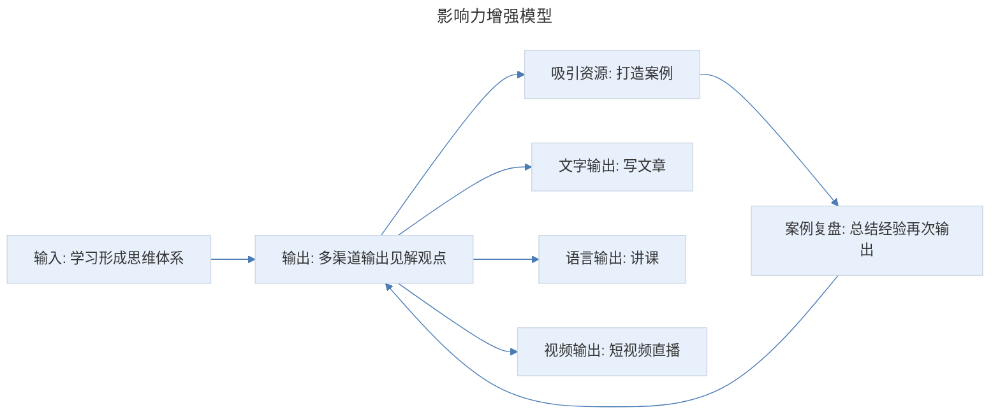
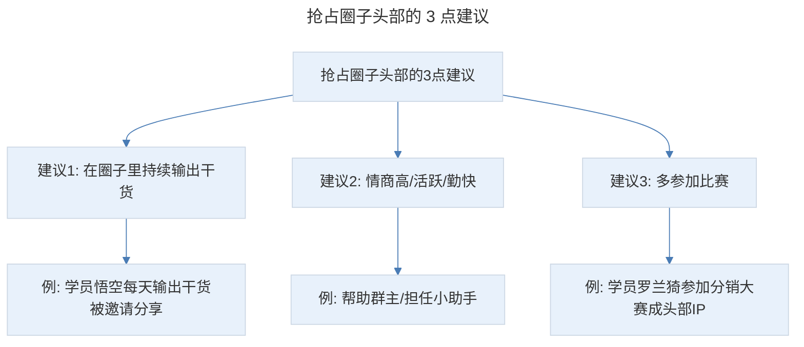
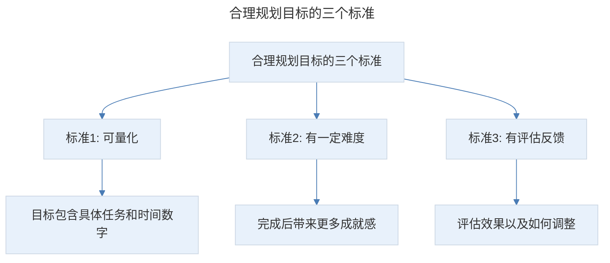

# 影响力打造：1 套影响力模型，教你打造吸金网红 IP

## 1. 导言

本节知识点：1 个模型，2 个加速器，3 个标准。

什么是影响力呢？官方解释是用一种别人乐于接受的方式，改变他人思想和行动的能力。简单理解就是，一个人在某个领域的分量、信服力和号召力。

以我个人为例，在筹备这次课程和实体书的过程中，很多学员跑来问我："兔妈，你的课什么时候上线，在哪里可以买到？"他们在没看过目录大纲，也没试听过的情况下，就愿意提前预定我的产品，离不开这 3 点要素：我在卖货文案领域建立起来的专家形象、我在往期课程中积累的信用程度、持续在学员中的曝光度。

**品牌内涵、品牌背书、品牌曝光度，三者就是个人品牌 IP 的三大基本要素。而影响力就等于：品牌内涵 × 品牌背书 × 品牌曝光度，是三者叠加产生的结果。**

全球著名管理学大师，商界教皇汤姆·彼得斯说过："我们每个人都是'自己'这家公司的首席执行官。最重要的工作就是打造那个叫作'你'的品牌。"

## 2. 核心概念：影响力增强模型的 4 个要素

所谓影响力增强模型，就是通过学习输入，形成自己的思维体系，并进行多渠道输出。然后，吸引好的资源找到你，一起合作打造案例。最后，复盘案例、总结经验，再进行多渠道输出。输出又会吸引新资源，然后再打造案例，这样就可以形成正向循环，让你的影响力不断增强。

> 影响力增强模型：输入（学习形成思维体系）→ 输出（文字/语言/视频多渠道输出）→ 吸引资源（打造案例）→ 案例复盘（总结经验再次输出），形成正向循环，让影响力不断增强。

### 第一个要素：输入

就是通过学习，把别人的知识输入我们自己的大脑，提升专业技能。输入形式有很多，比如你可以买一些专业书籍、课程，也可以关注领域内前十的公众号，看大咖总结的经验文章等。不能为了学习而学习，而是要带着目的去学习：先把要学的技能，拆分成不同要点，列出自己要加强的问题；想一想这个领域最靠谱的信息源在哪里，分别找到排名前十的老师、书籍、公众号和课程；归纳、总结，形成自己的思维体系。这是要特别注意的点，否则，照抄别人的东西，就是侵犯知识版权。你只需要把自己的理解以及对问题的重新思考写出来。实在不行，你就把学到的内容，用自己的方式和语言风格表达一遍。

### 第二个要素：输出

输出有 3 种形式：

- **文字输出**，就是写文章。你可以把学习的内容，归纳、总结，发表在自己的公众号、简书、头条号等。这样就会得到更多曝光机会。如果你的文章写的还不错，就会有号主转载，甚至还会有出版社找你签约写书等。另外，你也可以去知乎、悟空问答等问答平台，回答专业领域的提问，用自己学到的内容帮别人解决问题，这样既帮助了别人，也打造了自己的影响力。还有一些生活社区，比如小红书等。我有一位学员，她原来是一个 130 斤的胖子，然后通过正确的方法，3 个月减到 106 斤。她就在小红书上分享自己的瘦身方法，积累了 10 多万粉丝。
- **语言输出**，就是讲课。你可以通过免费公开课的方式让更多人知道你，进而扩大自己的影响力。分享的好处有 3 点：如果你的课有价值，听课的人会自发扩散；一次课程是 30-60 分钟，你就能对一群人产生影响，更容易被记住；你有更多机会被领域内的 KOL（意见领袖）和专业平台看到，获得合作机会。比如去年 10 月份，我在荔枝微课自己筹备了一次线上公开课。然后，唯库运营负责人看到后，就邀请我合作，做了一次 3 天文案训练营，最终听课人数累计 19200 多人。
- **视频输出**，比如抖音、快手等短视频直播。现在短视频平台拥有大量的流量，你可以把学习的内容，录成小视频上传上去，让更多人知道你。

### 第三个要素：吸引资源，打造案例

只要你持续输出，就会被一些有资源的合作方看到，这样就可以获得合作机会，打造自己的案例。比如，很多商家看到我写的文章和爆文拆解后，就来找我写产品推文，这样我就积累了越来越多的案例。很多专业平台和社群 KOL 看到我的分享能力，也来请我做分享。现在我已经是有赞学院的高级讲师，出版社也邀请我出书。再比如，有一位叫彭妮子的学员，她经常写关于美妆的文章，然后有平台看到后，就邀请她讲化妆方面的课程。

### 第四个要素：案例复盘，再次输出

当你做出了案例，你要及时复盘，总结好的经验，然后再通过写文章、讲课的形式输出。只有把案例说出去，你的成绩才能累积到个人品牌上，你的影响力才会越来越强。

可能有小伙伴说："兔妈，成绩不亮眼怎么办？"这里很多人有一个误区，以为必须做出千万级案例才算案例，其实不是的，普通人也可以有光环。比如，你帮别人写的文案，阅读量虽然只有 1000，但相比于原来，提升了 1.5%，你就可以说：帮客户推文打开率提升 1.5%。类似的还有：一篇文案销售 5 万产品、一个月服务过 XX 位商家、20 万粉丝公众号签约作者等。比如我社群的晶朵，全职主妇的她跟着我学文案 2 个月，就写出了自己的第一篇小爆文，转化率 10%，卖货近十万元。还有一位叫暖心的学员，她用我教的方法，帮朋友写了一条果冻橙的朋友圈文案，5 分钟卖掉了 8 箱。我让她复盘发出来，当晚精准涨粉 16 人，并链接到了 2 个金主。

当你一点点积累案例，一次次复盘输出，就会不断吸引更多、更好的资源。然后，正向循环。在这个过程中，你的影响力也越来越强。很多人会担心：这个过程是不是要很长时间？其实，只要你用心执行，也就几个月的事。不过我会教你一个方法，缩短这个过程。

## 3. 关键方法：打造影响力的 2 个加速器

### 加速器一：加入圈子

加入圈子可以让你掌握最新的趋势和方法，更重要的是，借助高势能人群提高自身势能。你可以付费加入一些垂直学习社群、线下活动交流群、商务行业社群等。为什么推荐付费方式呢？因为这里的成员养成了为知识付费的习惯，更优质。

但注意的是，光加入还不行，你还要抢占圈子的头部。只有这样，你才有机会被更多人看到。如何抢占头部呢？给你 3 点建议：

> 抢占圈子头部的 3 点建议：在圈子里持续输出干货（例：学员悟空每天输出干货被邀请分享）、情商高/活跃/勤快（例：帮助群主/担任小助手）、多参加比赛（例：学员罗兰猗参加分销大赛成头部 IP）。

- **在圈子里持续输出干货**。比如有位叫悟空的学员，她每天在我的社群输出干货文章，我看到后觉得不错，就邀请她做个专题分享，最后有 500 人来听分享。
- **情商高一点，活跃一点，勤快一点**。比如，主动关注群主接下来要做什么，哪些是你可以帮他做的。他出了课程你可以帮他发朋友圈宣传。他做用户调研，你积极参与。另外，很多群主比较忙，不可能天天泡在群里，你可以担任小助手的角色，解答成员问题，维持群内秩序，让群主看到你的价值。
- **多参加比赛**。很多社群为了提升活跃度，会举办一些比赛，比如文案大赛、分销大赛等。你不要怕自己不行，要多参加。因为主办方会对比赛进行宣传，这样你就有更多机会被曝光。比如学员罗兰猗，他付费加入很多社群，不但情商高，活跃，还主动参加各种分销大赛。现在已经是分销领域的头部 IP。

### 加速器二：链接牛人

学会借助牛人势能，可以帮你快速打造自己的影响力。比如我的助手庞娜，一个 95 后陕西姑娘，她大学毕业一年，没有运营经验，但多次提出帮我管理社群，我记住她了，所以，四五个人最后选了她做助理。她成了兔妈多个学习社群的群主，很多学员主动加她微信，也让更多人知道她、记住她。

总之，当你影响力不大时，你可以多给没有能量的人提供价值，让别人喜欢你。在有能量的牛人面前，多展现自己的价值，让他愿意给你机会，帮你赋能。

另外，要注意的是，你还要建立自己的核心粉丝群。通过聚集群友，让自己成为群里的意见领袖，扩大自己的影响力。比如，有位学员叫西湖玉贝，她通过加入圈子，输出价值，链接到一些粉丝，就建立了自己的读书打卡群。经常推荐自己看过的好书、分享自己的读书心得。这样在给别人提供价值的同时，也扩大了自己的影响力。

## 4. 实践落地：合理规划目标的三个标准

掌握了正确的方法，就能打造出影响力吗？不一定。经常有小伙伴说："兔妈，我要写 100 篇文章。兔妈，我要出 2 本书。"目标很远大，但就像跑步，你刚开始能跑 10 公里，但一上来就要跑 42 公里的全马，非但完成不了，还会产生挫败感，最后往往不了了之。

那么，如何正确设置目标呢？合理规划目标的三个标准：

> 合理规划目标的三个标准：可量化（目标包含具体任务和时间数字）、有一定难度（完成后带来更多成就感）、有评估反馈（评估效果以及如何调整）。

**第一：可量化。** 就是目标要包含具体的任务和时间数字，以便知道完成了多少。

**第二：目标需要有一定难度。** 原因是，完成后会带来更多成就感。

**第三：有评估反馈。** 就是任务完成后，要评估效果以及如何调整。

举个例子：你要成为文案讲师，可以先设置一个量化的目标。比如，2 个月时间，输出 15 篇干货文章，进行 1 次微课分享。实现精准涨粉 300 人，听课人数 200 人。第一个标准是可量化，就是：2 个月时间，15 篇干货文章，1 次微课分享，涨粉 300 人，听课 200 人。第二个标准是有一定难度，体现在：实现精准涨粉 300 人，听课人数 200 人。第三个标准是有评估反馈，主要是评估：涨粉和听课人数达到了吗？如果没有达到，问题出在哪里？甚至可以发红包给粉丝和大咖，让他帮你提建议。如果达到了，与对标榜样相比，文章哪里还可以提升。

设定目标是成长的重要手段，越精确、越严密，达成的效果越好。在正向激励和反馈中，慢慢完成自己的升值和影响力提升。

## 5. 实践指南：知识点总结

### 5.1 知识点总结

**第一个知识点：影响力增强模型的 4 个要素**

- 通过书籍、课程不断输入知识，形成自己的思维体系。
- 通过文章、讲课、视频直播，持续输出自己的见解和观点。
- 吸引来好资源，打造案例成绩。
- 复盘案例，总结经验，再通过文章、讲课等方式输出。

当你做到这 4 点，就会有越来越多客户主动找你合作。

**第二个知识点：打造影响力的 2 个加速器**

- 加入圈子，并努力挤入圈子的头部。
- 主动链接大咖，提供价值。

学会借牛人势能，你也能做到事半功倍。

**第三个知识点：合理规划目标的三个标准**

- 可量化，就是目标要包含具体的任务和时间数字，以便知道完成了多少。
- 目标需要有一定难度的原因是，完成后会带来更多成就感。
- 有评估反馈，就是任务完成后，要评估效果以及如何调整。

小步快走，让你的个人品牌越来越闪亮。当你产生 10 倍的影响力，就能实现原先收入的 10 倍。

### 5.2 练习作业

**请结合打造影响力的四个要素，给自己的兴趣爱好制定 3 个月的短期目标。**

## 6. 进阶延展：核心要点回顾

### 6.1 核心要点回顾

影响力等于品牌内涵 × 品牌背书 × 品牌曝光度三者叠加的结果。影响力增强模型通过"输入→输出→吸引资源→案例复盘→再次输出"形成正向循环，4 个要素为：输入（带着目的学习，归纳总结形成自己的思维体系，避免侵权）、输出（文字写文章/语言讲课/视频直播三种形式）、吸引资源打造案例、案例复盘再次输出（普通人也可以有光环，把微小成绩累积到个人品牌上）。打造影响力的 2 个加速器为加入圈子（抢占头部：持续输出干货/情商高活跃勤快/多参加比赛）和链接牛人（给没能量的人提供价值、在牛人面前展现价值）。合理规划目标的三个标准为可量化、有一定难度、有评估反馈。小步快走，让个人品牌越来越闪亮。

### 6.2 延伸思考

- 如何在"持续输出"与"避免抄袭侵权"之间保持平衡？
- 个人品牌打造如何与卖货文案的变现途径形成协同？

---

## 参考资料

- 本案例内容来源于"极客时间"文案高手专栏第 18 节。