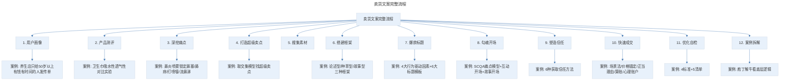
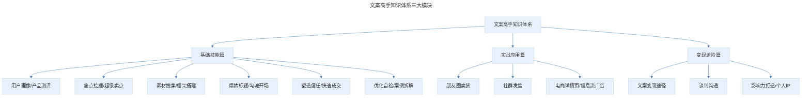

# 重点内容总结

## 1. 导言

本节是"文案高手"专栏的重点内容总结，将 18 节课的核心知识浓缩为系统化的知识体系。原版以知识卡片图片形式呈现，本文档将其整理为文字化的完整知识框架，方便读者回顾复习。

## 2. 核心概念：卖货文案的完整流程

卖货文案写作遵循一套从"了解产品与用户"到"引导成交"的完整流程，各环节环环相扣：

> 卖货文案完整流程：用户画像→产品测评→深挖痛点→打造超级卖点→搜集素材→搭建框架→爆款标题→勾魂开场→塑造信任→快速成交→优化自检→案例拆解，各环节环环相扣。

## 3. 关键方法：核心技能模块总结

### 3.1 用户画像与产品测评

**用户画像**是根据目标顾客的社会属性、生活习惯和其他行为等信息抽象出的标签化用户模型。做用户画像的 4 个步骤：搞清产品功能按图索骥找用户、提炼关键标签描述角色设定、借助大数据工具锁定切入点、梳理卖点排序做好攻坚对策。需避免 2 个误区（笼统不具体、停留在数据和工具层面）。

**产品测评**的 4 个步骤：了解产品背景、确定评测指标、加入竞品对比、填写测评内容。核心是找到产品的价值锚，通过竞品对比找出差异化卖点。

### 3.2 深挖痛点与超级卖点

**痛点必须满足的 4 个要素**：实实在在存在的问题、超出顾客忍受阈值、持续出现影响正常生活、产品是解决这个问题的最佳选择。挖掘痛点需避开 4 个误区（痛点太多、用力过猛、不够紧急、与顾客无关），通过用户思维、吐槽思维、社交思维 3 个方法和百度指数/微信指数、圈子调研 2 个工具筛选极痛点。

**打造超级卖点**用取交集模型：列出用户痛点、竞品缺点、产品卖点的交集。再用 3+5 卖点直白翻译模型（3 步关联消费者找到价值利益点 + 5 种认知表达方法：关联法、数字具象化、利益具象化、场景具象化、体验具象化）让顾客秒懂。

### 3.3 素材搜集与框架搭建

**素材库打造 4 步**：明确核心领域、挑选工具养成记录习惯、做好归类标注、定期复盘加工删减。快速找素材 2 个技巧：锁定核心渠道（知乎/微信搜一搜/新闻/论坛）检索特定关键词、拆解借鉴同行案例。

**推文 3 种框架**：论述型（借势热点戳痛点→大方案+论据→具体产品+论据→化解异议→利益引导下单）、种草型（小事引出产品→大家都说好→卖点论据→大厂品质→值得拥有）、故事型（选切入点→引主人公→穿插痛点和卖点的故事→收益证明→引导下单）。

## 4. 实践落地：表达与成交技巧总结

### 4.1 爆款标题与勾魂开场

**爆款标题**需针对顾客点击的 4 大行为驱动因素（逃避痛苦/焦虑、尝鲜好奇、急功近利、关注和自己有关的）写作。6 种推文类型各有标题模板（美食类：感官体验+生活场景+惊叹词；母婴类：悬念+信息差；时尚类：试用体验+使用场景、好奇+圆满结局；功效养生类：具体痛苦+解决方案；生活日用类：可量化价值+惊叹词/对比；付费课程类：反差/悬念+利益点）。按 5 个步骤（明确卖点→思考顾客场景→直白化翻译→选模板→排列组合+投票测试）写出高点击标题。

**勾魂开场**遵循 3 大法则（简单易读、关联用户、投其所好），3 个开场套路为：痛点开场（SCQA 痛点模型：情境→冲突→问题→答案）、互动开场（加"你"字+巧设问题）、故事开场（符合用户画像+描述关键细节）。

### 4.2 塑造信任与快速成交

**塑造信任 6 种方法**：原料产地工艺具象化、体现畅销（单位时间销量/营造人气/被同行模仿/高好评率/高复购率）、借势权威（权威供应商/专家/报告/奖项，翻译成大众权威，傍权威大腿，打造专家人设）、顾客证言（口语化/具象化/场景化/欲扬先抑）、顾客案例（符合画像/前后收益对比/真实证据）、产品演示（文字试用/实验报告/极限挑战）。塑造信任牢记 2 大要点：在顾客注意力低谷多互动、不同产品构建不同信任矩阵。

**快速成交 5 种方法**：场景法（负面场景+理想场景）、价格锚定、正当消费理由（提升事业/关爱家人/亲朋送礼/健康保健）、算账（价格平分法+成本算账法）、偷换心理账户。顾客消费决策考虑 6 大成本：金钱、形象、行动、学习、健康、决策成本。

### 4.3 优化自检与案例拆解

**优化自检 5 个清单**：顾客痛点自检、产品卖点自检、卖货逻辑自检（10 个问题）、文案表达自检（讲人话：制造反差/站统一战线/替顾客着想/替顾客表达/多用修辞）、文案配图自检。

**案例拆解**需避开 3 个误区（题海战术、只看表层套路、误以为拆解=模仿），掌握 3 个前提（看数据、了解顾客群、找到切入点），按 5 个步骤（拆解标题/开场/证据链/结尾/总结思考）高效拆解爆文。

## 5. 实践指南：拓展变现与个人品牌

### 5.1 朋友圈卖货与社群转化

**朋友圈卖货**需先做信任再卖货，避开 4 个误区（全是广告、没人设、没价值、刚加好友群发）。打造人设（专业人设+生活人设），按 3 个步骤写产品软文（写产品说明→用套路突出获得感→优化表达），通过 3 次沟通（破冰/找兴趣点/挖痛点）与粉丝建立信任。

**社群转化**有建群、预热、发售 3 大板块。发售按 6 步曲：痛点恐惧+顾客案例+理想场景、讲述研发故事、竞品对比、顾客证言、权威背书、成交收款。最后用结营仪式打造第二波成交高峰。

### 5.2 文案变现与影响力打造

**文案变现 4 种途径**：接稿、咨询、卖货、影响力变现（讲课/开训练营/做付费社群）。与客户谈判的 3 大关键点：站在对方角度贩卖希望、少讲大道理多用事实说话、价值利益可量化（4 个技巧：不要绝对数字/加上次要承诺/参考同行案例/量化服务价值）。

**影响力增强模型 4 要素**：输入（学习形成思维体系）、输出（文字/语言/视频）、吸引资源打造案例、案例复盘再次输出。2 个加速器：加入圈子（抢占头部）、链接牛人。合理规划目标的三个标准：可量化、有一定难度、有评估反馈。

> 文案高手知识体系三大模块：基础技能篇（用户画像/产品测评、痛点挖掘/超级卖点、素材搜集/框架搭建、爆款标题/勾魂开场、塑造信任/快速成交、优化自检/案例拆解）、实战应用篇（朋友圈卖货、社群发售、电商详情页/信息流广告）、变现进阶篇（文案变现途径、谈判沟通、影响力打造/个人 IP）。

## 6. 进阶延展：核心要点回顾

### 6.1 核心要点回顾

"文案高手"专栏系统构建了卖货文案的完整知识体系，覆盖基础技能篇（用户画像、产品测评、痛点挖掘、超级卖点、素材搜集、框架搭建、爆款标题、勾魂开场、塑造信任、快速成交、优化自检、案例拆解 12 大核心技能）、实战应用篇（朋友圈卖货、社群发售）和变现进阶篇（文案变现、谈判沟通、影响力打造）。核心方法论包括：以用户思维贯穿始终（站在顾客角度思考他会想什么问题，避免自嗨）、用事实构建信任矩阵、通过科学的框架和套路写出高转化文案、用拆解复盘实现持续进阶。掌握这套体系，普通人也能从零基础写出高转化的卖货爆文。

### 6.2 持续实践建议

- 按 5 个自检清单持续优化自己的推文。
- 坚持拆解优秀案例，掌握底层卖货逻辑。
- 将文案技能用于接稿、卖货、个人品牌打造等实际变现场景。

---

## 参考资料

- 本案例内容来源于"极客时间"文案高手专栏重点内容总结。