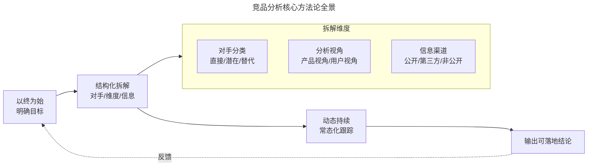
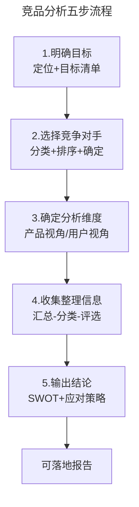
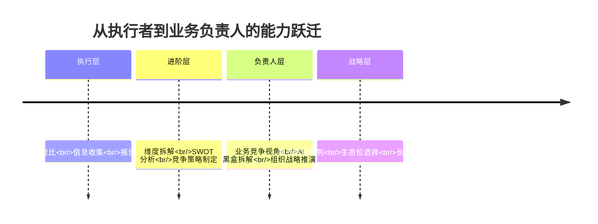

# 别再让你的竞品分析只是纸上谈兵

> **适用范围**：产品经理、运营人员、业务负责人，以及所有需要在多变市场环境中通过竞争情报支撑决策的互联网从业者。

> **更新摘要（v2 · 2026-08 更新）**：在 v1 基础上重构为六节标准骨架；引入 2025-2026 年 AI 辅助竞品分析（AI-Assisted Competitive Analysis）的最新实践；补充 SimilarWeb、Sensor Tower、Klue 等主流工具的定位说明；将过时的探探/Tinder 时代案例替换为 AI 产品、即时零售等 2024-2026 最新案例；所有失效图片替换为 Mermaid 图与文字表格。

## 一、导言

在互联网行业，产品经理与运营人员的岗位职责描述中，几乎都会出现"竞品分析（Competitive Analysis）"这一项能力要求。然而，真正能够把竞品分析做成一项系统性、可持续、可落地工作的从业者并不多。常见现象是：临时需要时拼凑一份报告交差，或者先入为主地认为"仿照优秀的 A、B 产品改改即可"。

这种认识是错误的。竞品分析的实质是为了更好地参与市场竞争，为后续更加激烈的竞争做好准备工作。它不仅是关注对手动向，更重要的是为自己的判断提供论证和决策依据。

当前市场环境与五年前已大不相同。根据 CB Insights 在 2026 年发布的统计，约 67% 的初创公司失败原因中，缺乏真实的竞品分析位列前五；与此同时，约 71% 的产品团队已经将 AI 工具纳入每周的竞争情报（Competitive Intelligence，CI）工作流。这意味着：不做竞品分析，或者用陈旧方法做竞品分析，都意味着在起跑线上落后。

本手册的目标是帮助读者建立一套完整的竞品分析思维体系，覆盖从目标设定、对手选择、维度拆解、信息收集到结论输出的全流程，并补充 AI 时代的最新方法论。

## 二、核心方法论

竞品分析并非"看一眼对手做了什么"的简单动作，而是一套由目标驱动的系统工程。其核心方法论可以概括为三条原则：

**第一，以终为始（Begin with the End in Mind）。** 任何一次竞品分析都必须先回答"为什么要做"，再决定"怎么做"。没有明确目标的竞品分析，最终只会沦为信息堆砌。

**第二，结构化拆解。** 把模糊的"对手"拆解为直接性、潜在性、替代性三类；把模糊的"分析"拆解为产品视角（产品 7 要素）与用户视角（用户决策 5 要素）；把模糊的"信息"拆解为公开渠道、第三方渠道、非公开渠道。结构化才能保证覆盖度与可比较性。

**第三，动态持续。** 竞争是一个动态变化的过程，是分阶段的。一次性的竞品报告在落盘的那一刻就开始过时，必须建立常态化的跟踪机制。

上图展示了竞品分析核心方法论的闭环关系。"以终为始"是起点，"结构化拆解"是主体，"动态持续"是保障，三者共同指向"输出可落地结论"，并通过反馈机制修正下一轮分析的目标设定。需要强调的是，这三条原则并非线性执行，而是在整个分析周期中反复迭代。

### 竞品分析能力的三个层次

理解核心方法论后，还需要认识到竞品分析能力是一个分层递进的体系。第一层是"信息收集层"——能够找到竞品公开信息并整理成表格，这是基础能力，大多数产品经理和运营人员都具备。第二层是"结构分析层"——能够运用产品 7 要素、用户决策 5 要素、SWOT 等框架对信息进行结构化拆解，得出有逻辑的结论，这是中级能力，需要系统训练。第三层是"战略推演层"——能够从竞品的动作反推其战略意图，并结合自身资源制定差异化的竞争策略，这是高级能力，也是业务负责人的必备素质。

大多数从业者停留在第一层，部分能达到第二层，能稳定输出第三层能力的人凤毛麟角。本手册的设计目标就是帮助读者从第一层逐步进阶到第三层。

## 三、关键流程

一套完整的竞品分析流程包括五个关键步骤：明确目标 → 选择竞争对手 → 确定分析维度 → 收集并整理信息 → 利用 SWOT 等框架输出结论。本节先做整体说明，后续章节会逐一展开。

| 步骤 | 关键问题 | 主要产出 | 常见风险 |
| --- | --- | --- | --- |
| 明确目标 | 为什么要做这次分析？ | 目标清单、定位说明 | 目标模糊导致返工 |
| 选择对手 | 谁是真正的竞争对手？ | 竞品清单（分直接/潜在/替代） | 把行业第一当直接对手 |
| 确定维度 | 从哪些角度分析？ | 维度矩阵（产品视角/用户视角） | 12 个维度全上，缺乏重点 |
| 收集信息 | 用什么渠道、怎么整理？ | 信息仓库（汇总-分类-评选） | 渠道单一、信息无结论 |
| 输出结论 | 结论是否可落地？ | 竞品分析报告、应对策略 | 只描述现象，不给出行动建议 |

这张流程图揭示了竞品分析的本质：它是一条从"为什么"到"怎么办"的完整链路，每一步都为下一步提供输入。其中最容易出错的是第一步和最后一步——目标不清晰会导致后续全部偏移，结论不可落地则会让前期所有努力失去价值。在 AI 辅助时代，这条流程的执行效率大幅提升，但流程本身并没有被取代，反而因为信息获取门槛降低，对"目标设定"和"结论验证"两个环节提出了更高要求。

## 四、工具与实战

### 工具生态

2025-2026 年的竞品分析工具生态已经相当成熟，按用途大致可分为以下几类：

| 类别 | 代表工具 | 核心能力 | 适用场景 |
| --- | --- | --- | --- |
| 流量与市场情报 | SimilarWeb、Statista | 网站/App 流量估算、市场份额、受众画像 | 市场格局判断、流量对标 |
| 应用商店情报 | Sensor Tower、七麦数据 | 下载量、收入估算、版本迭代、关键词排名 | 移动端产品跟踪 |
| 网站变更监控 | ChampSignal、Visualping、Scrapx | 定价页/功能页变更告警、HTML diff | 实时捕捉对手动作 |
| 技术栈识别 | Wappalyzer、SimilarTech | 识别对手网站使用的技术框架与第三方服务 | 技术维度分析 |
| 销售赋能 | Klue、Crayon | 竞争情报中央仓库、Battlecard 生成 | B 端销售场景 |
| AI 可见性 | LLMrefs、TrackMyBusiness | 监测品牌在 ChatGPT/Gemini/Perplexity 中的曝光 | AI 搜索时代的"新 SEO" |
| 社交聆听 | BuzzSumo、Meltwater | 内容趋势、品牌提及、情感分析 | 营销与口碑分析 |

需要特别说明的是，AI 辅助竞品分析已经成为主流实践。一种被广泛验证的工作流是：用 Perplexity 等具备实时联网能力的工具完成信息采集，用 ChatGPT/Claude 将信息结构化为 SWOT 矩阵或功能对比表，再由人工完成战略层面的综合判断与验证。据 MeritForge 在 2026 年的测算，这套流程可以将一次 5 个竞品的分析从原来的 1-2 周压缩到约 90 分钟，但前提是必须设置显式的验证环节，避免 AI 产生过时数据或幻觉（Hallucination）。

### 实战要点

第一，工具是放大器，不是替代品。工具可以帮你更快地拿到数据，但"这些数据意味着什么""应该怎么办"仍然需要人来判断。

第二，先确定维度再选工具。分析移动端产品优先选 Sensor Tower/七麦数据，分析 Web 产品优先选 SimilarWeb，分析 B 端销售场景优先选 Klue，不要盲目堆砌工具。

第三，建立自动化监控。把定价页、功能更新公告、招聘信息等关键页面纳入变更监控工具，设置 Slack/邮件告警，从"被动查阅"转向"主动推送"。

### 实战案例：AI 助手产品的竞品分析框架

以 2026 年某团队开发一款面向 C 端的 AI 写作助手为例，说明上述方法论与工具如何组合使用。

**目标设定**：该团队处于产品从 0 到 1 阶段，分析目的是学习借鉴头部竞品的产品设计与运营策略，同时预警潜在的技术替代风险。

**对手选择**：直接竞品为市面上已有的 3 款 AI 写作工具；潜在竞品为通用大模型（如 ChatGPT、Claude）中内置的写作功能；替代竞品为可能集成 AI 写作能力的办公套件（如飞书文档、Notion）。

**维度确定**：根据"学习借鉴"目的与"技术驱动"特性，选定产品视角的功能、技术、营销要素，以及用户视角的好处、便捷性要素，共 5 个维度。

**信息收集**：用 Perplexity 采集竞品公开信息，用 Sensor Tower 查看下载量与收入估算，用 Wappalyzer 识别技术栈，用 ChampSignal 监控定价页变更，亲自注册体验核心功能流程。所有 AI 采集的数据均在竞品官网二次验证。

**结论输出**：通过 SWOT 框架汇总发现——直接竞品在垂直场景的提示词工程上有优势，但通用大模型的写作能力正在快速追赶；建议团队聚焦"特定行业写作模板"这一差异化方向，同时密切关注通用大模型的能力边界变化。

这个案例展示了从目标到结论的完整链路：每一步都由目标驱动，工具服务于维度，结论指向可执行的动作。

## 五、常见误区

**误区一：把竞品分析等同于功能抄写。** 看到"经过与对手对比后发现，我们应该提高用户体验"这样的结论，却没有写应该如何提高——是否要调整按钮颜色、是否要优化加载速度、是否要重构交互流程。可落地的结论必须具体到可执行的动作。

**误区二：只看直接竞品，忽视替代性竞品。** 方便面的对手从来不是挂面，而是外卖；英语学习 App 的对手可能不是多邻国，而是具备实时语音能力的通用大模型。在 AI 时代，跨界掠夺者（潜在竞品）的威胁远超直接竞品，必须把视野放宽到 GitHub、Hugging Face 等技术社区。

**误区三：一次分析定终身。** 竞争是动态的，对手的版本迭代、组织调整、融资进展都在持续变化。建议至少以季度为周期刷新竞品分析，并在对手有重大动作（融资、发布会、产品改版）时触发临时分析。

**误区四：信息越多越好。** 信息的"充分"是指"够用"，而不是"多"。信息过载反而会让人迷失在细节中，错失决策窗口。每条信息都应该能够回答"它对本次分析目标有什么贡献"。

**误区五：只做分析，不做应对。** 竞品分析的终点不是一份报告，而是一套可执行的竞争策略。如果分析完成后没有任何动作发生，这次分析就是失败的。

## 六、进阶延展

当由产品经理走向管理岗，成为业务负责人后，竞品分析的视角需要从"功能对比"提升到"业务竞争"层面。这一阶段需要关注三类高阶问题：

**第一，竞争策略的制定。** 不仅要看对手做了什么，还要分析对手为什么这么做、这么做背后的资源投入与战略意图是什么。例如通过招聘信息反推对手的业务布局，通过财报分析对手的资源分配优先级。

**第二，AI 时代的全新分析维度。** 2026 年的市场竞争中，仅看界面与功能已不够，需要新增"模型黑盒拆解"维度：对手用的是自研模型、开源微调还是 API 套壳？Token 成本控制如何？智能体（Agent）架构是否接管了用户意图？这些维度决定了 AI 产品的真实竞争力。

**第三，把竞品分析思维迁移到个人发展。** 把自己当做一个产品，放到求职或晋升的场景中做一次完整的自我剖析：你的直接竞品是谁（同岗位同级别）、潜在竞品是谁（跨岗位可替代者）、替代竞品是谁（AI 工具）。通过 WWHR 模型（What-Why-How-Result）梳理自己的核心竞争力，并制定差异化的职业策略。

上图展示了竞品分析能力从执行层到战略层的演进路径。每一层的能力都是在前一层基础上的叠加，而非替代。一个成熟的业务负责人需要同时具备功能拆解的细致与生态位判断的格局。本手册后续章节将围绕这条进阶路径，逐一展开目标设定、对手选择、维度拆解、信息收集等核心环节的方法论与实操细节。

---

**本篇小结**：竞品分析已经从"产品经理与运营人员的能力加分项"演变为"参与市场竞争的基本生存技能"。掌握系统方法论、善用现代工具、避免常见误区、持续向业务竞争视角进阶，是本手册希望帮助读者建立的核心能力。后续章节将从"竞品分析的目标究竟是什么"开始，逐步展开完整的方法体系。
