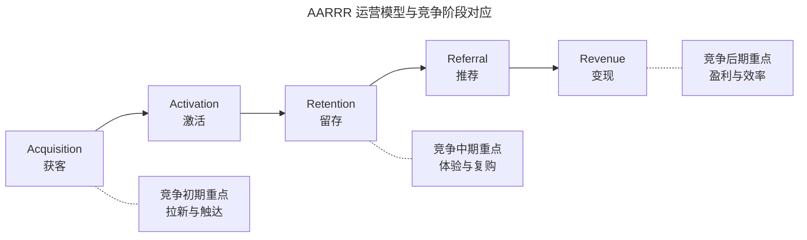
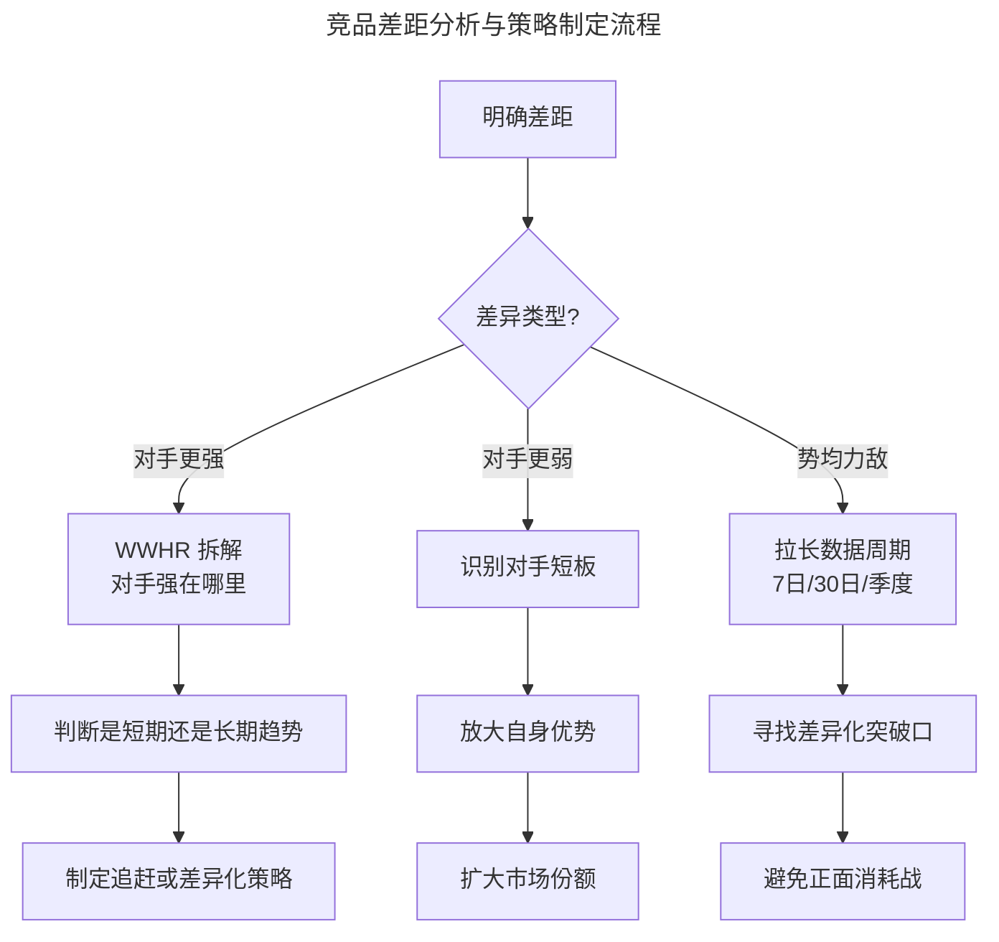
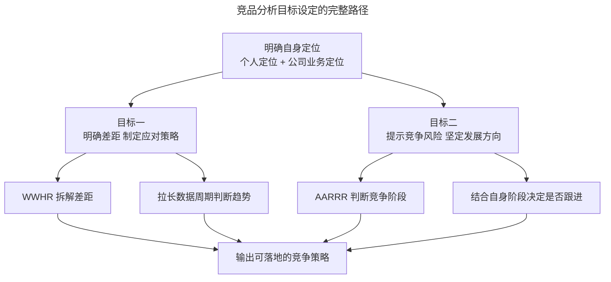

# 竞品分析的目标究竟是什么？

> **适用范围**：需要在启动竞品分析前明确方向的产品经理、运营人员与业务负责人，尤其适合首次主导竞品分析项目的从业者。

> **更新摘要（v2 · 2026-08 更新）**：重构为六节标准骨架；引入 WWHR 思维模型与 AARRR 模型的完整说明；用 2024-2026 年即时零售、AI 产品等最新案例替换过时的社区团购案例；补充数据周期拉长、AI 时代竞争风险预警等新内容；失效图片全部替换为 Mermaid 图与文字表格。

## 一、导言

做任何一件事之前，先想清楚"为什么做"，远比"怎么做"更重要。竞品分析（Competitive Analysis）同样如此——如果连目标都不清晰，后续的对手选择、维度拆解、信息收集都会失去方向，最终产出的报告多半是信息的堆砌，难以支撑任何决策。

竞品分析的目标设定有一个前置条件：明确目前所处的位置（自己的定位）。因为要知道终点在哪里，必须先清楚起点在哪里。这就引出了本篇的核心命题：在明确自身定位的前提下，竞品分析的目标究竟是什么。

本篇将围绕 WWHR 思维模型（What-Why-How-Result）与 AARRR 运营模型（Acquisition-Activation-Retention-Revenue-Referral）展开，系统阐述竞品分析目标的设定方法。

## 二、核心方法论

### WWHR 思维模型

WWHR 模型是一种通用的思维框架，可用于拆解任何需要深入分析的问题。它由四个环节构成：

| 环节 | 含义 | 在竞品分析中的应用 |
| --- | --- | --- |
| What | 现象是什么 | 对手做了什么动作？发布了什么功能？ |
| Why | 为什么会这样 | 对手为什么这么做？背后的需求或战略意图是什么？ |
| How | 怎么做到的 | 对手通过什么方式实现？技术路径、运营手段是什么？ |
| Result | 结果如何 | 用户使用频率如何？满意度如何？对市场格局的影响如何？ |

这四个环节构成一个完整的分析闭环：从现象出发，挖掘原因，理解路径，评估结果。WWHR 模型的价值在于避免分析停留在"对手做了什么"的表层，而强制要求深入到"为什么"和"结果如何"。

### AARRR 运营模型

AARRR 模型（又称海盗指标，Pirate Metrics）是衡量产品运营健康度的经典框架，由 Dave McClure 提出，五个环节分别是获客（Acquisition）、激活（Activation）、留存（Retention）、推荐（Referral）、变现（Revenue）。

上图展示了 AARRR 五个环节与竞争阶段的对应关系。在竞争初期，获客是核心，运营成本和手段集中在拉新；进入中期后，留存变得关键，用户体验和复购率决定胜负；到了后期，变现效率和推荐机制成为竞争焦点。理解这一点至关重要：当对手在某个环节发力时，需要判断自己所处的竞争阶段是否与之匹配，而不是盲目跟进。例如，处于获客阶段的产品去模仿已进入留存阶段的对手做精细化运营，往往是资源错配。

## 三、关键流程

### 第一步：明确定位

竞品分析的目标设定需要从两个维度明确自身定位：个人定位与公司业务定位。

**个人定位**关注从业者在组织中的角色与发展方向。需要回答的问题包括：最大的核心竞争力是什么？加入这家公司的原因是什么？看好公司的哪些方面？晋升的潜在对手有谁？通过回答这些问题，可以明确个人在本次竞品分析中希望获得的产出——是提升业务理解、支撑决策、还是展示专业能力。

**公司业务定位**需要"上下结合"：

- 从下看（业务本身和团队情况）：业务处于起步期还是成熟期？是否有稳定现金流？团队能力如何？对市场变化能否快速反应？
- 从上看（上级预期和资源情况）：老板/合伙人对你的 KPI/OKR（Objectives and Key Results）预期是什么？提供了什么资源？业务最需要什么？

### 第二步：设定竞品分析的两个目标

在明确定位后，竞品分析的目标可以归纳为两类：

**目标一：明确差距，制定应对策略。**

与竞争对手之间通常存在三种差异：对手不如自己、对手做得更好、双方势均力敌。竞品分析需要量化这些差距，并据此制定策略。

以即时零售赛道为例，2025 年美团闪购、京东到家、饿了么非餐外卖三方竞争格局中，如果从市场份额、配送时效、SKU（Stock Keeping Unit）丰富度、价格竞争力四个维度分析差距，可能会发现：美团闪购在配送时效上领先，京东到家在 SKU 丰富度上占优，而饿了么在价格补贴上有优势。基于这样的差距分析，才能制定针对性的应对策略。

需要特别注意的是数据周期问题。如果只看昨日数据，可能得出"两家势均力敌"的结论；但拉长到 7 日、30 日日均来看，趋势可能完全不同。建议在数据跟踪时把时间周期拉长，观察更明确的变化趋势。

上图展示了针对三种差异类型的策略制定路径。对于"势均力敌"的情况，最关键的动作是拉长数据观察周期——短期数据可能掩盖真实趋势，只有把时间维度展开，才能发现对手是在上升期、平稳期还是衰退期，从而判断是否应该主动出击或保持节奏。

**目标二：提示竞争风险，坚定发展方向。**

通过分析竞争对手的动态，快速判断当前市场竞争态势，对自身业务进行风险预警。例如对手召开战略级发布会、宣布重大组织调整、获得大额融资等，都可能对自身业务构成威胁。

但并非对手的每一个动作都需要跟进。需要结合自身业务的发展阶段和公司战略意图，有选择地应对。以 AARRR 模型分析：如果自身处于获客阶段，核心任务是打通品控、拉新、售卖等基础链条，此时对手在留存环节做的精细化运营功能（如菜谱推荐、内容社区）并不需要立即跟进；当自身业务已经跑通基础链条、进入用户深度运营阶段时，再跟进学习才是合理的时机。

## 四、工具与实战

### 数据周期对比工具

在做差距分析时，建议使用 Sensor Tower、七麦数据等工具对比多周期下载量与活跃数据。这些工具支持按日、周、月查看趋势，能够帮助识别真实的竞争态势。

| 工具 | 数据维度 | 适用场景 | 注意事项 |
| --- | --- | --- | --- |
| Sensor Tower | 下载量、收入估算、广告素材 | 全球移动市场对标 | 收入估算为区间值 |
| 七麦数据 | 国内应用商店排名、下载量 | 国内 iOS/Android 市场 | 数据有滞后 |
| SimilarWeb | 网站/App 流量、受众画像 | Web 产品与跨端对标 | 免费版数据有限 |
| Statista | 行业报告、市场规模 | 宏观市场判断 | 部分数据需付费 |

### 风险预警工具

对于竞争风险的实时预警，推荐使用 ChampSignal、Visualping 等变更监控工具，将对手的定价页、功能公告页、招聘页面纳入监控，设置邮件或 Slack 告警。同时关注对手的官方公众号、开发者博客、财报投资者关系页面，这些都是获取战略级信息的有效渠道。

在 AI 时代，还可以用 Perplexity 等具备实时联网能力的工具，定期生成"竞争对手动态简报"，将分散的信息源汇总为结构化摘要，大幅提升信息处理效率。

### 实战案例：即时零售赛道的差距分析

以 2025 年即时零售赛道为例，假设自身是排名第三的平台，分析目标是明确与头部竞品的差距并制定追赶策略。

**定位明确**：公司处于成长期，已有稳定现金流但市场份额不足 10%，团队在即时配送领域有 3 年经验，但 SKU 丰富度和品牌知名度不如头部。

**差距分析**：从市场份额、配送时效、SKU 丰富度、价格竞争力四个维度，对比美团闪购、京东到家和自身。通过 Sensor Tower 获取近 30 日下载量趋势，通过亲自体验对比配送时效和商品品类，通过 ChampSignal 监控对手定价页变化。

**数据周期拉长**：仅看昨日数据，自身与京东到家的下载量接近；但拉长到 7 日日均，京东到家领先约 15%；拉长到 30 日日均，差距扩大到 22%。这表明对手处于上升期，如果只看单日数据会严重低估差距。

**策略输出**：基于差距分析，建议在 SKU 丰富度上集中资源追赶（这是用户最敏感的维度），同时在配送时效上保持现有优势，暂不与美团闪购正面竞争市场份额。

这个案例说明：目标设定决定了分析维度的选择，数据周期的长短直接影响结论的准确性，而最终策略必须可落地、可衡量。

## 五、常见误区

**误区一：跳过定位直接定目标。** 不明确自身所处阶段就设定竞品分析目标，容易导致目标与实际需求脱节。例如初创公司把"扩大市场份额"作为首要目标，但实际上更紧迫的可能是"学习借鉴竞品的产品设计"。

**误区二：只看单点数据。** 仅凭昨日下载量或某一次活动的数据就下结论，忽略了时间维度的趋势变化。建议至少对比 7 日、30 日、季度三个周期的数据。

**误区三：对手做什么就跟着做什么。** 这是最常见的应激式反应。正确做法是结合自身所处的 AARRR 阶段，判断对手的动作是否对自己构成真实威胁，以及自己是否有资源跟进。

**误区四：把竞品分析目标等同于"写一份报告"。** 报告只是载体，真正的目标是支撑决策。如果一份报告完成后没有任何决策或动作发生，这次竞品分析就是失败的。

**误区五：忽视间接风险。** 在 AI 时代，最大的竞争风险往往不来自直接竞品，而来自通用大模型对垂直场景的替代。例如英语学习 App 需要警惕具备实时语音对话能力的通用 AI 助手，这类跨界威胁必须纳入风险预警范围。

## 六、进阶延展

### 动态竞争观

竞争本质上是一个动态变化的过程，是分阶段的。以即时零售为例，前期拉新阶段平台会大量补贴，消费者关心的是薅多少羊毛；当消费者真正进入平台后，更关心的是商品品质、配送时效、售后体验等切身利益。用户关心的点会随竞争阶段变化而变化，对应的竞争策略也必须随之调整。

越早知道用户真正关心的点，就越能取得先发优势。竞品分析的目标之一，正是通过观察对手在不同阶段的动作，反推用户关心的点正在发生怎样的迁移。

### WWHR 模型的高阶应用

当由执行者走向业务负责人后，WWHR 模型可以从"功能层面"升级到"业务层面"：

- What：对手的业务重心在哪里？（从财报、组织架构、融资动向上判断）
- Why：对手为什么选择这个方向？（从市场趋势、政策环境、用户需求上分析）
- How：对手怎么落地的？（从资源投入、技术路径、合作伙伴上拆解）
- Result：结果如何？（从市场份额、用户口碑、财务指标上评估）

上图完整呈现了从定位到目标、再到方法、最终输出策略的路径。两个目标并非独立，而是相互支撑：明确差距有助于判断风险等级，风险预警又能反向校准差距分析的优先级。所有方法的最终出口都指向"可落地的竞争策略"，这也是衡量一次竞品分析是否成功的唯一标准。

### 迁移到个人发展

WWHR 模型同样适用于个人职业规划。把自己当做竞品，用 What-Why-How-Result 拆解自己的核心竞争力：我擅长什么（What）？为什么擅长（Why）？怎么持续强化（How）？在市场上的竞争力如何（Result）？通过这种结构化的自我剖析，可以更清晰地定位个人发展方向。

---

**本篇小结**：竞品分析的目标设定需要先明确自身定位，再围绕"明确差距、制定应对策略"与"提示竞争风险、坚定发展方向"两个目标展开。WWHR 模型与 AARRR 模型是支撑目标设定的两套核心思维工具。竞争是动态分阶段的过程，只有理解这一点，才能在合适的时机做合适的应对。下一篇将进入流程的第二步：如何选择竞争对手。
