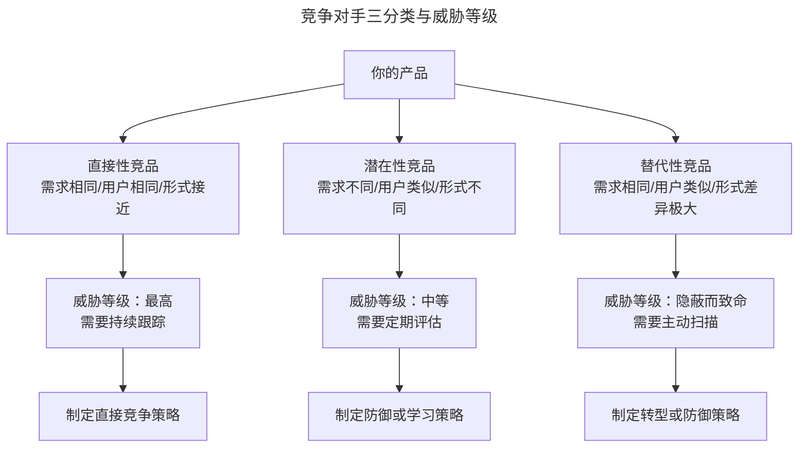
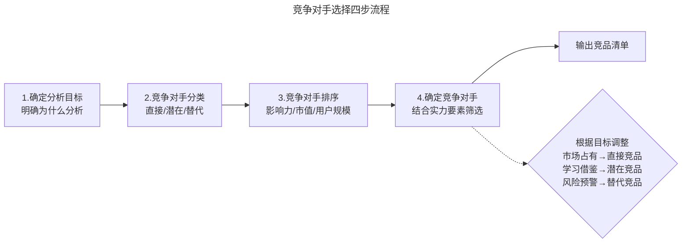
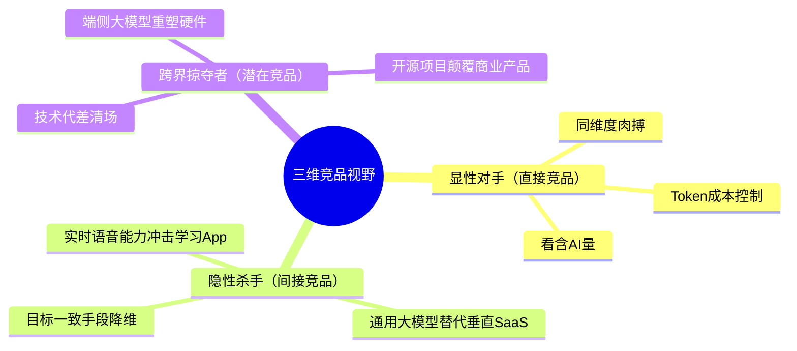

# 你的竞争对手选对了吗？

> **适用范围**：已完成竞品分析目标设定、需要精准锁定分析对象的产品经理、运营人员与业务负责人。

> **更新摘要（v2 · 2026-08 更新）**：重构为六节标准骨架；引入 MAS 思维模型与三维竞品视野；用 2024-2026 年即时零售、AI 产品、智能硬件等最新案例替换过时的社区团购与手机品牌案例；补充 AI 时代跨界掠夺者的识别方法；失效图片全部替换为 Mermaid 图与文字表格。

## 一、导言

在明确了竞品分析（Competitive Analysis）的目标之后，下一步就是回答"谁是真正的竞争对手"。这个问题看似简单，实际操作中却充满陷阱。选错对手，轻则浪费分析资源，重则导致竞争策略完全跑偏。

选择竞争对手不是简单地列出"同行业的公司"，而是一个包含分类、排序、确定的完整流程。不同的对手会带来不同的分析结果，只有围绕目标精准挑选，才能让分析结果离目标最近。

本篇将系统阐述竞争对手的三分类法（直接性、潜在性、替代性）、排序逻辑，以及在 AI 时代如何识别跨界威胁。

## 二、核心方法论

### 三分类法

根据需求、目标用户、产品形式三个维度，可以将竞争对手分为三类。这三个维度与你的产品越接近，威胁程度越高。

| 竞品类型 | 用户需求 | 目标用户 | 产品形式 | 威胁程度 | 典型案例（2025-2026） |
| --- | --- | --- | --- | --- | --- |
| 直接性竞品 | 相同 | 相同 | 接近 | 最高 | 美团闪购 vs 京东到家 vs 饿了么非餐 |
| 潜在性竞品 | 不同 | 类似 | 不同 | 中等 | Figma vs Canva（设计工具用户重叠） |
| 替代性竞品 | 相同 | 类似 | 差异极大 | 隐蔽而致命 | 通用大模型 vs 垂直英语学习 App |

**直接性竞品**指解决的需求、目标用户、产品形式、主要功能都与你的产品高度一致的对手。它们会对产品产生最直接的影响，必须与之争抢市场和用户。

**潜在性竞品**的特征是产品满足的需求不同、产品形式不同，但目标用户特性类似。它们具备切入你所在领域的实力，是未来可能转化的直接竞品。

**替代性竞品**与其他类型最重要的差别在于：满足的需求相同、目标用户类似，但产品形式差异极大。它们往往利用技术或商业模式的创新，通过降维打击（Dimensional Strike）吞噬你的市场份额，而你可能并不直接感知到。

### MAS 思维模型

选择竞争对手的过程本质上是问题拆解的过程，可以套用 MAS 模型：遇到问题（Meet）→ 分解问题（Analyze）→ 逐一击破（Solve）。具体而言：先列出所有可能的竞争对手（Meet），按三分类法分解（Analyze），再根据目标逐一筛选确定（Solve）。

### 实力要素

在分类过程中，必须引入一个关键要素——实力。实力决定了竞争对手是否有资格参与直接竞争。初创公司不应把行业巨头当直接竞争对手，而应关注排位接近的对手。如果自身排位第二十，应该关注第十九或第二十一，而非行业第一或第一百以外——规模差距太大，彼此够不着。

上图展示了三分类法与威胁等级的对应关系。需要特别关注的是替代性竞品——它们的威胁往往是隐蔽而致命的，因为你不会在日常的竞品跟踪中"看到"它们。在 AI 时代，这类威胁尤其需要主动扫描，方法包括关注 GitHub 上 Star 数飙升的开源项目、Hugging Face 上霸榜的新模型、以及技术社区中的新论文。

## 三、关键流程

选择竞争对手的完整流程包含四个步骤：

**步骤一：确定分析目标。** 这是 01 篇的内容，目标是"以终为始"的起点。

**步骤二：竞争对手分类。** 从需求、目标用户、产品形式三个维度，将所有候选对手归入直接性、潜在性、替代性三类。

**步骤三：竞争对手排序。** 根据目标的侧重点，对每类竞品内部的对手进行排序。排序维度通常包括行业影响力、公司市值、用户规模、与自身的接近程度等。

**步骤四：确定竞争对手。** 结合实力要素，选定与自己排位接近的直接竞品作为重点分析对象，同时保留对潜在性竞品和替代性竞品的监控。

这张流程图揭示了一个关键原则：竞争对手的选择不是固定的，而是根据分析目标动态调整的。如果目标是提高市场占有率，必然聚焦直接性竞品；如果目标是学习借鉴，重点关注潜在性竞品；如果目标是市场预警，则需扫描替代性竞品。同一批对手在不同目标下可能归入不同类别，这是正常的。

### 排序实战示例

以 2025 年即时零售赛道为例，假设自身是一家排名第三的创业公司，候选竞品清单包括：美团闪购、京东到家、饿了么非餐、叮咚买菜、盒马、朴朴超市、小象超市。按行业影响力、用户规模、与自身接近度打分后排序：

| 排名 | 竞品 | 分类 | 关注优先级 | 关注理由 |
| --- | --- | --- | --- | --- |
| 1 | 美团闪购 | 直接性 | 高 | 行业第一，需跟踪其战略动作 |
| 2 | 京东到家 | 直接性 | 高 | 排位接近，直接对标 |
| 3 | 饿了么非餐 | 直接性 | 中 | 背靠阿里，资源充足 |
| 4 | 朴朴超市 | 直接性 | 高 | 排位最接近，最直接的竞争对手 |
| 5 | 盒马 | 潜在性 | 中 | 用户重叠，但形态偏重线下 |
| 6 | 叮咚买菜 | 潜在性 | 低 | 品类聚焦生鲜，间接竞争 |
| 7 | 小象超市 | 潜在性 | 低 | 美团旗下，定位不同 |

排序完成后，应当将排位最接近的朴朴超市和京东到家选定为直接竞争对手，制定针对性的竞争策略；同时将盒马列为潜在性竞品定期观察。

## 四、工具与实战

### 竞品发现工具

| 工具 | 用途 | 适用场景 |
| --- | --- | --- |
| 七麦数据 | 查看应用排行榜、关键词竞品 | 发现国内移动端直接竞品 |
| Sensor Tower | 全球应用排行榜、类别竞品 | 发现海外市场竞品 |
| SimilarWeb | 网站竞品分析、同类网站推荐 | 发现 Web 端竞品 |
| G2 / Capterra | SaaS 类目排名与对比 | 发现 B 端 SaaS 竞品 |
| GitHub Trending | 开源项目趋势 | 发现 AI 时代潜在竞品 |
| Product Hunt | 新产品发布 | 发现早期阶段竞品 |

### 替代性竞品识别方法

替代性竞品最难识别，因为它们往往出现在你日常视野之外。推荐以下方法：

第一，从用户需求出发反向搜索。不要搜索"即时零售竞品"，而要搜索"用户如何快速买到日用品"——这会引导你发现即时配送、社区团购、前置仓、甚至便利店外卖等多种解决方案。

第二，关注技术社区。AI 时代的替代性竞品往往以开源项目或新模型的形式出现。定期浏览 GitHub Trending、Hugging Face 排行榜、arXiv 热门论文，可以发现尚未产品化但具备颠覆潜力的技术。

第三，关注招聘信息。竞品的招聘 JD（Job Description）能暴露其业务布局。例如某平台招聘"熟悉智慧建筑、智能家居"的岗位，可能暗示其将进入相关领域。

### 排序实战的注意事项

在对手排序过程中，需要特别注意以下几个问题：

**打分维度的选择要匹配目标。** 如果分析目标是市场占有率，打分维度应侧重用户规模、DAU/MAU、市场份额；如果目标是学习借鉴，打分维度应侧重产品成熟度、功能创新度、用户体验评分。不同目标下同一批竞品的排序可能完全不同。

**实力要素的动态评估。** 竞品的实力不是静态的——一次融资、一次人事变动、一次政策调整都可能改变实力对比。建议在排序时同时记录"当前实力"和"实力变化趋势"，后者往往比前者更具预警价值。

**关注第二与第三的合并可能。** 如果自身是行业第一，要特别警惕第二和第三名合并这类大动作——两个排位接近的对手合并后，实力可能直接跃升为对自身的最大威胁。反之，如果自身排位靠后，也要关注排位更靠后的对手是否通过融资或并购快速上升。

### 跨界掠夺者的识别补充

在 AI 时代，跨界掠夺者是最难识别但威胁最大的竞品类型。补充以下识别方法：

第四，关注大模型的垂直能力演进。当通用大模型（如 GPT、Claude、Gemini）在某项垂直能力上达到专业水平时，依赖该能力的垂直 SaaS 工具就会面临替代风险。建议定期测试主流大模型在自身所在领域的表现，评估"大模型何时能替代我的产品"。

第五，关注硬件终端的智能化升级。智能音箱、智能手表、智能眼镜等终端一旦接入强大的端侧大模型，可能重塑用户交互习惯，从而替代现有的 App 形态。

## 五、常见误区

**误区一：只盯行业第一。** 如果自身排位靠后，把行业第一当直接竞品会导致策略脱离实际。应该关注排位接近的对手，制定可执行的竞争策略。

**误区二：忽视替代性竞品。** 方便面的对手不是挂面而是外卖，英语学习 App 的对手可能不是多邻国而是通用大模型。替代性竞品的威胁往往在不知不觉中发生，等到市场份额明显下滑时已经来不及应对。

**误区三：竞品清单一成不变。** 市场竞争千变万化，今天的直接竞品可能明天就因转型而不再是威胁，今天的潜在竞品也可能突然变成直接竞品。建议每季度刷新一次竞品清单。

**误区四：用同一个清单应对所有目标。** 不同分析目标需要不同的竞品组合。市场占有率分析用直接竞品，学习借鉴用潜在竞品，风险预警用替代竞品——不能一张清单走天下。

**误区五：忽视实力要素。** 把巨头当直接竞品的初创公司，容易陷入"对标焦虑"，在资源不对等的情况下做正面竞争，最终消耗殆尽。

## 六、进阶延展

### AI 时代的三维竞品视野

在古典互联网时代，竞品视野是狭隘的——做外卖的盯美团，做打车的盯滴滴。但在 AI 时代，必须引入"三维竞品视野"：

上图展示了 AI 时代竞品视野的三个维度。显性对手（直接竞品）的竞争重点从"功能对比"升级为"含 AI 量"和"Token 成本控制"；隐性杀手（间接竞品）通过通用能力替代垂直工具，例如具备实时语音通话能力的 AI 助手对英语学习 App 的冲击；跨界掠夺者（潜在竞品）则可能通过技术代差直接清场，例如端侧大模型让儿童电话手表变成"儿童版微信+随身家教"。

在这个框架下，选择竞争对手时不仅要看应用商店排行榜，还要看 GitHub 的 Star 数、Hugging Face 的模型下载量、技术社区的话题热度。那些代码仓库里的权重文件，可能才是真正的对手。

### 赢家通吃与差异化突围

互联网行业存在"赢家通吃"规律——一旦竞争格局建立，后来者在同一领域几乎无翻盘可能。微信已经是即时通讯的 NO.1，再做这个领域的创业就需要重新思考。这也解释了为什么互联网行业节奏更快、融资规模更大、内卷更严重。

面对赢家通吃的格局，差异化突围是唯一出路。与其在已经被巨头占领的正面战场硬碰硬，不如在巨头尚未覆盖的细分场景、人群、地域中寻找机会。竞品分析的目标之一，正是帮助识别这些"巨头够不着、对手还没来"的空白地带。

### 迁移到个人场景

将选择竞争对手的思维迁移到个人求职场景：把自己当做一个产品，放入求职市场。直接竞品是同岗位同级别的求职者，潜在竞品是跨岗位但能力可迁移的求职者，替代竞品是可能替代你岗位的 AI 工具。根据求职目标（薪资提升、职级晋升、转行）的不同，关注的竞品类型也不同。

---

**本篇小结**：选择竞争对手需要遵循"确定目标→分类→排序→确定"的四步流程，重点掌握三分类法与实力要素。在 AI 时代，必须将视野从显性对手扩展到隐性杀手和跨界掠夺者，建立三维竞品视野。竞争对手是动态变化的，需要持续观察、定期刷新。下一篇将进入分析维度的拆解，先从产品视角的"产品 7 要素"开始。
