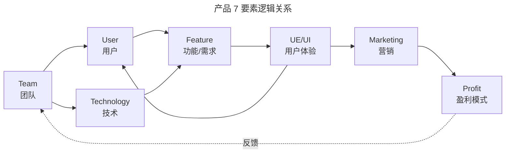
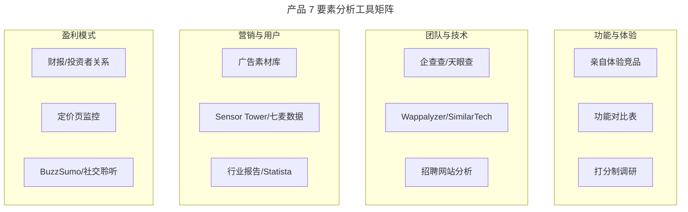

# 什么是产品视角的分析维度？

> **适用范围**：已选定竞争对手、需要从产品内部结构出发拆解竞品的产品经理、运营人员与业务负责人。

> **更新摘要（v2 · 2026-08 更新）**：重构为六节标准骨架；完整呈现产品 7 要素（Feature/UE-UI/Team/Technology/Marketing/User/Profit）的分析方法；用 2024-2026 年即时零售、AI 产品、SaaS 等最新案例替换过时案例；补充 AI 时代技术黑盒拆解、LLM 可见性等新维度；失效图片全部替换为 Mermaid 图与文字表格。

## 一、导言

确定了竞品分析的（Competitive Analysis）目标和竞争对手之后，接下来要回答"从哪些维度分析竞品"。分析维度分为两个视角：产品视角与用户视角。本篇聚焦产品视角。

所谓"产品视角"，就是站在产品顶层设计者的立场去拆解竞品——如果自己是竞品的设计者，会怎么设计和布局这款产品？开发一个产品需要具备七个核心要素：功能/需求（Feature）、用户体验（UE/UI）、团队（Team）、技术（Technology）、营销（Marketing）、用户（User）、盈利模式（Profit）。理顺这七个要素，一个项目就能跑起来。

本篇将逐一拆解产品 7 要素在竞品分析中的具体应用，并补充 AI 时代的新增分析维度。

## 二、核心方法论

### 产品 7 要素总览

产品 7 要素之间存在内在逻辑：团队分析用户需求后，用技术开发功能，通过用户体验呈现给目标用户，再用营销手段实现盈利模式。

上图展示了产品 7 要素的逻辑闭环。团队是起点，它决定了对用户需求的理解深度和技术实现能力；功能是核心，承载着产品背后的商业逻辑；用户体验是呈现层，决定了用户能否顺畅地使用功能；营销是放大器，将产品推向更多用户；盈利模式是终点，决定了产品能否持续运转。在竞品分析中，七个要素的难易先后顺序为：功能/需求、用户体验、营销、盈利模式、团队、技术、用户。

### 各要素分析要点

| 要素 | 核心问题 | 分析方法 | 数据来源 |
| --- | --- | --- | --- |
| 功能/需求 | 对手有哪些功能？背后需求是什么？ | 功能对比表、流程拆解 | 亲自体验、应用商店 |
| 用户体验 | 用户用得爽吗？ | 打分制、用户调研 | 问卷、A/B 测试 |
| 团队 | 组织架构反映什么战略意图？ | 招聘信息分析、股东变更 | 企查查、招聘网站 |
| 技术 | 技术是否带来业务突破？ | 前端反编译、技术栈识别 | Wappalyzer、报错信息 |
| 营销 | 营销策略背后的目标是什么？ | MCPP 流程拆解 | 广告素材库、社交平台 |
| 用户 | 用户画像与数据如何？ | 行业报告推算、用户调研 | 行业报告、路演 BP |
| 盈利模式 | 怎么赚钱？能否持续？ | 盈利模式对比、场景适配 | 财报、定价页 |

## 三、关键流程

### 功能：对手有哪些功能？

功能分析是产品视角的起点。建议制作功能对比表格：横向是各竞品名称，纵向是功能模块的拆解（一般分解到 3-4 级菜单）。竞品都有的功能很可能是核心功能和基础功能，切不可忽视。

以即时零售 App 为例，功能拆解通常分三级：

| 层级 | 功能示例 | 分析重点 |
| --- | --- | --- |
| 一级功能 | 首页、分类、购物车、我的 | 整体业务模式与核心功能 |
| 二级功能 | 限时秒杀、新人专享、品牌专区 | 运营策略与流量分配 |
| 三级功能 | 加入购物车、一键支付、订单跟踪 | 具体操作落地与转化效率 |

除了功能清单对比，还应该以用户身份拆解使用流程中的功能点。以即时零售的下单流程为例：搜索商品→浏览详情→加入购物车→确认订单→选择地址→支付→等待配送→确认收货→评价。每一步都对应功能点，也都存在用户流失的可能。在流程上比竞品多做一步细节，就能形成差距——例如绑定极速支付降低结算决策难度，或通过短信推送优惠券提升复购率。

**核心原则：功能背后是需求。** 功能呈现反映的是产品形式，核心功能承载的是产品背后的商业逻辑。只有理解本质才算做好功能拆解。

### 用户体验：如何让用户用得爽？

用户体验主要围绕产品设计：UE（User Experience）层面的交互逻辑设计，UI（User Interface）层面的界面视觉设计。软件反应速度、耗电量等性能指标广义上也属于用户体验。

UE/UI 的好坏难以量化，因为主观性较强。建议引入打分制：将布局、色彩、LOGO、交互反馈等要素列入表格，按 0-5 分打分。打分需要做用户调研（样本 10 个以上），并在调研时抹去竞品名称以规避品牌偏好。

### 团队：组织架构背后的深意

团队分析的重点是看组织架构和人员组成，从中判断对手的战略意图、业务效率和资源分配。2025 年某即时零售平台将社区团购业务定为一级战略项目，3 个月内团队从 100 人扩增到 3000 余人，地推团队采用外包迅速铺开——这种组织动作直接暴露了其战略优先级和进攻节奏。

除组织架构外，还应关注：股东变更情况（反映资金实力）、投融资进展（反映资源储备）、关键人物背景（反映团队调性）、专利信息（反映技术壁垒）。这些信息可通过企查查、天眼查等平台获取。

### 技术：新技术是否带来业务突破？

技术对业务的影响是根本性的。虽然很难直接知道对手用了什么技术，但可以通过观察推断：前端页面是否支持后台动态调整（说明有配置化运营能力）、报错信息暴露的框架线索（如 Spring、React 等）。

在 AI 时代，技术维度的分析必须升级为"模型黑盒拆解"：

| 技术类型 | 特征 | 竞争力评估 |
| --- | --- | --- |
| 自研模型 | 掌握底层数据和权重，护城河深 | 强，但成本极高 |
| 开源微调 | 基于开源基座注入行业数据 | 中等偏强，性价比高 |
| API 套壳 | 直接调用第三方接口 | 脆弱，受制于上游 |

使用 Wappalyzer、SimilarTech 等工具可以识别对手网站的技术栈；对于 AI 产品，还需要分析其基座来源、微调数据质量、Token 成本控制策略等。技术分析的深度往往决定了竞品分析的"含金量"——停留在"对手用了 React"这种表层信息价值有限，深入到"对手的模型推理延迟控制在 200ms 以内，说明采用了量化压缩或边缘部署"这种深层信息才能真正指导自身的技术决策。

### 营销：你能比对手更懂营销吗？

营销分析是产品视角中应着重跟踪的维度，因为营销是全生命周期的事。制定营销策略包含 MCPP 流程：市场分析（Market）→ 消费者分析（Customer）→ 产品分析（Product）→ 促销方式制定（Promotion）。

每一个营销活动背后都有明确目标：新手大礼包是为了让新用户快速实现操作闭环；老带新返券是为拉新同时活跃老用户；抽奖、买二送一是为提高购买转化率和 GMV（Gross Merchandise Volume）。看到竞品的营销动作时，必须以终为始地分析其背后的策略逻辑。

### 用户：如何了解用户？

用户分析看三个方面：用户画像、用户数据、用户看法。用户画像包括正常标签（性别、年龄）、地域标签、兴趣标签、安全标签等。用户数据包括注册数、DAU（Daily Active Users）、ARPU（Average Revenue Per User）、留存率等——这些数据通常需要从行业报告和对手声明中推算，建议对官方公布的数据打一定折扣。用户看法可以通过观察用户行为和做小型问卷调查获取。

### 盈利模式：你能比对手更赚钱吗？

互联网行业的盈利模式主要有：广告、增值服务、付费下载、电商、提成佣金。还有一种模式是"主件便宜、附件定期更换"——例如智能净水器低价销售主机，通过滤芯定期更换获取持续利润。

与竞品的盈利模式对比可以打出差异化。但需要注意：与竞品所处行业、产品形式接近时，盈利模式也可能接近，因此要区别应用场景，选择适合自己产品调性的模式。

## 四、工具与实战

上图按四组工具对应不同的分析要素。实战中建议：先亲自体验竞品完成功能拆解，再用工具补充团队、技术、用户等难以直接观察的维度。AI 辅助方面，可以使用 Perplexity 采集公开信息，用 ChatGPT 将信息结构化为对比矩阵，最后由人工完成战略层面的判断。

具体工具推荐：SimilarWeb 用于流量与受众画像对标；Sensor Tower/七麦数据用于移动端下载量与收入估算；Wappalyzer 用于技术栈识别；BuzzSumo 用于营销内容趋势分析；Statista 用于宏观市场数据。

## 五、常见误区

**误区一：功能分析停留在"有没有"。** 只对比竞品是否有某功能，而不深入分析功能背后的需求逻辑和商业意图。正确做法是用 WWHR 模型追问：对手为什么做这个功能？怎么实现的？效果如何？

**误区二：用户体验只凭个人感觉。** 单人主观判断容易偏差，必须引入打分制和用户调研，至少 10 个以上样本，并抹去竞品名称规避偏好。

**误区三：忽视组织架构信息。** 团队分析是最容易被忽略的维度，但它最能反映对手的战略意图。招聘信息和组织调整往往比产品发布更早暴露战略方向。

**误区四：技术分析浅尝辄止。** 在 AI 时代，仅看前端界面已不够，必须深入到模型基座、微调策略、Token 成本等技术黑盒层面，才能判断对手的真实竞争力。

**误区五：盈利模式照搬竞品。** 即使与竞品处于同一行业，盈利模式也需要根据自身的产品调性和资源禀赋做适配，不能简单复制。

## 六、进阶延展

### AI 时代的第 8 要素：AI 含量

在 2026 年的市场环境中，产品 7 要素之外需要新增一个维度——AI 含量。这个维度评估的是产品在多大程度上利用 AI 重构了业务逻辑，包括：是否在核心流程中嵌入了 AI 能力？AI 是无感融入还是作为卖点？Token 成本控制如何？智能体（Agent）是否接管了用户意图？

例如，同样是协同文档产品，竞品是否集成了"一键生成周报""智能润色""自动摘要"等 AI 能力，这些能力的实现质量如何——这些差异可能比传统的功能对比更能决定产品竞争力。

AI 含量的评估可以从四个层面展开：第一，AI 是否嵌入核心流程（如写作助手的智能补全、电商平台的智能推荐）；第二，AI 的实现深度（是简单调用第三方 API 还是基于自研模型微调）；第三，Token 成本控制（高频调用场景下的单位成本是否可承受）；第四，Agent 架构（是否通过智能体接管了多步骤的用户意图，让界面逐步消失）。这四个层面构成从"有没有"到"深不深"再到"贵不贵"最后到"智不智"的完整评估链路。

### STEPPS 营销传播模型

在营销要素的进阶分析中，可以引入 STEPPS 模型（Jonah Berger 提出）评估竞品营销活动的传播潜力：

| 要素 | 含义 | 在竞品分析中的应用 |
| --- | --- | --- |
| Social Currency | 社交货币 | 用户分享竞品内容是否能提升自身形象 |
| Triggers | 触发器 | 什么场景会触发用户想到竞品 |
| Emotion | 情绪 | 竞品营销唤起了什么情绪 |
| Public | 公共性 | 竞品的使用是否容易被他人看到 |
| Practical Value | 实用价值 | 竞品营销传递的信息是否有用 |
| Stories | 故事 | 竞品营销是否承载了易传播的故事 |

### BP 三问与 7 要素的映射

在融资场景中，投资人最关心的三个问题是：我是谁？我是做什么的？我怎么赚钱？这三个问题恰好映射到产品 7 要素：用"团队"回答"我是谁"，用"功能/技术/用户体验"回答"我是做什么的"，用"营销/盈利模式"回答"我怎么赚钱"。用这 7 个要素同时拆解自己的产品和竞品的产品，就能形成一份完整的竞争图谱。

---

**本篇小结**：产品视角的分析维度由产品 7 要素构成，每个要素都有具体的分析方法和工具支撑。核心原则是"功能背后是需求"，所有分析都要深入到商业逻辑层面而非停留在表象。在 AI 时代，需要新增"AI 含量"维度，并将技术分析升级为模型黑盒拆解。下一篇将进入用户视角的分析维度，从用户决策 5 要素展开。
