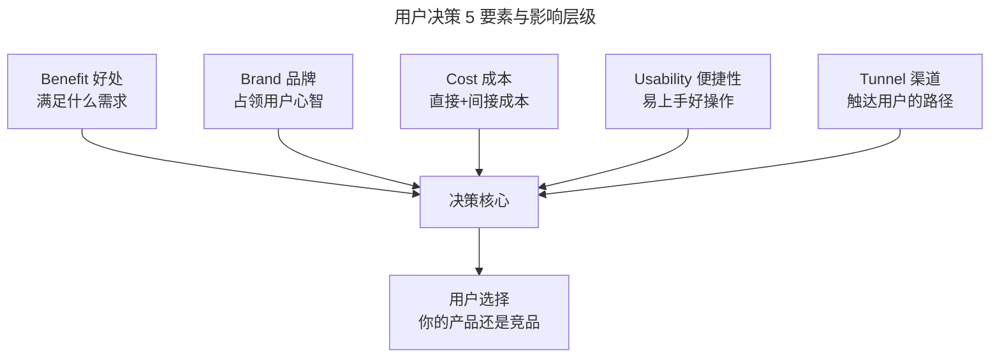
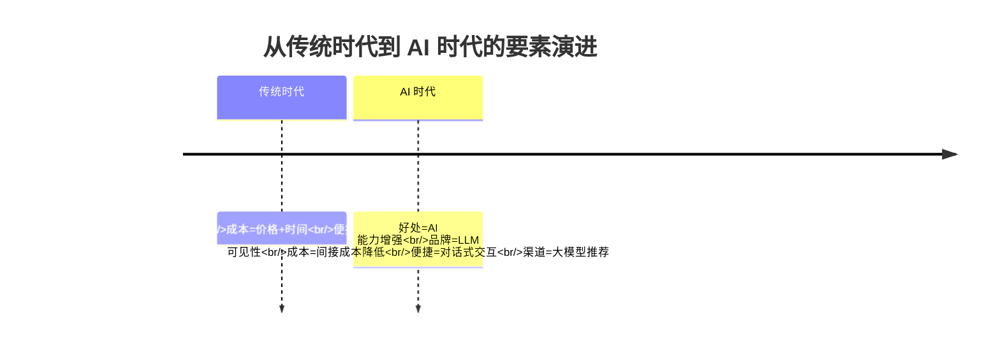

# 什么是用户视角的分析维度？

> **适用范围**：需要从用户决策心理出发评估竞品竞争力的产品经理、运营人员与业务负责人，尤其适合 C 端产品从业者。

> **更新摘要（v2 · 2026-08 更新）**：重构为六节标准骨架；完整呈现用户决策 5 要素（Benefit/Brand/Cost/Usability/Tunnel）的分析方法；用 2024-2026 年即时零售、AI 助手、直播电商等最新案例替换过时案例；补充 AI 时代品牌心智变化、LLM 推荐可见性等新内容；失效图片全部替换为 Mermaid 图与文字表格。

## 一、导言

产品视角回答的是"竞品如何被设计出来的"，用户视角回答的则是"用户为什么会选择竞品"。两种视角互补，缺一不可。

用户视角的核心是"用户决策 5 要素"：好处（Benefit）、品牌（Brand）、成本（Cost）、便捷性（Usability）、渠道（Tunnel）。这 5 个要素贯穿用户从认知到购买的整个决策过程，分析它们在竞品与自身产品上的差异，就能找到影响用户决策的关键杠杆点。

本篇将逐一拆解每个要素的含义、在竞品分析中的应用方法，以及在 AI 时代这些要素发生的变化。

## 二、核心方法论

### 用户决策 5 要素总览



上图展示了 5 个要素共同作用于用户决策的关系。需要强调的是，这 5 个要素在不同场景、不同用户群体中的权重并不相同。竞品分析的任务之一，就是识别在特定场景下哪些要素的权重最高，从而集中资源在该维度建立优势。

| 要素 | 本质 | 分析问题 | 量化方式 |
| --- | --- | --- | --- |
| 好处 | 满足用户需求的程度 | 竞品比我们多满足了哪些需求？ | 功能覆盖度、需求满足度 |
| 品牌 | 占领用户心智 | 用户第一时间想到的是谁？ | 品牌提及率、NPS、LLM 可见性 |
| 成本 | 直接成本+间接成本 | 用户选择竞品的总成本更低吗？ | 价格对比、决策时长 |
| 便捷性 | 易上手、好操作 | 竞品比我们更好用吗？ | 任务完成率、操作步数 |
| 渠道 | 触达用户的路径 | 竞品通过什么渠道触达用户？ | 渠道覆盖度、获客成本 |

### 核心原则：让用户爽

5 个要素的底层逻辑是同一个原则：用最小的成本最大化满足用户的欲望和需求。产品设计时需要不断比竞品更好地满足用户更多需求，让用户获得更多好处，同时让用户的成本比竞品更低。

## 三、关键流程

### 好处：用户选择你的产品能获得啥？

好处本质上是指产品满足用户需求的程度，以及满足方式是否符合用户当前的认知和情绪。用户的需求有主次之分——满足主需求后，用户才会考虑次要需求。

例如用户急需打车前往签约现场（主需求是快速到达），如果打开 App 发现排队 50 位，那么无论平台送什么优惠券都无法安抚焦虑——用户会立即转向其他平台。这就是"主需求未被满足时，次要好处无效"的典型场景。

在竞品分析中，评估"好处"需要回答：产品是否给用户带来直接好处？是否比竞品有更多好处？以即时零售为例，用户最直接的好处是买到东西，但如果竞品价格更便宜、品类更丰富、配送更快，那竞品就能给用户更多好处。

### 品牌：你能否占领用户心智？

塑造品牌的本质是占领用户心智（Mind Share）。用户倾向于购买经常"被看到"的品牌，当有符合某品类需求时，会第一时间想到该品牌。

在 AI 时代，品牌心智的战场已经从传统媒体扩展到大模型推荐。当用户向 ChatGPT、Gemini、Perplexity 询问"推荐一款好用的协作工具"时，被提到的品牌就获得了新的心智入口。因此，品牌分析不仅要做传统的品牌提及率调研，还需要用 LLMrefs、TrackMyBusiness 等工具监测品牌在主流大模型中的推荐可见性。

口碑是品牌的基石。当产品与竞品带来的好处差异不明显时，做口碑就是做品牌。直播带货的兴盛让品牌曝光和销售转化的链路大幅缩短，许多平台甚至跳过品牌打造的前奏，直接将品牌预算转化为用户补贴——天下武功唯快不破，谁先占领用户心智，谁就获得先发优势。

### 成本：成本越低用户越喜欢吗？

成本分为直接成本和间接成本。直接成本是用户为购买产品付出的金钱和时间；间接成本往往是无形的，如搜索信息、比对选项、蹲点抢购等所花费的精力。

在直接成本上的控制效果会影响"购买决策者"的选择，在间接成本上的控制效果会影响"军师"（帮决策者出主意的人）的决策效率。例如电商平台的详情页将所有同系列商品罗列出来供用户直接比较，就是在降低用户的间接成本。

在竞品分析中，需要同时对比直接成本和间接成本：

| 成本类型 | 构成 | 竞品分析关注点 |
| --- | --- | --- |
| 直接成本 | 金钱、时间 | 定价对比、补贴力度、配送费 |
| 间接成本 | 搜索、比对、学习、切换 | 决策路径长度、上手难度、迁移成本 |

### 便捷性：细节真的会影响用户吗？

便捷性是用户上手体验的第一感受，直接体现了产品经理和运营人员的业务水平。便捷性包括：符合用户直觉习惯的交互方式（点击返回就是返回上一页）、软件速度、耗电量、内存占用等性能指标。

便捷性直接关系到用户使用产品时的效率和对需求的响应速度。能比竞品快几百毫秒也会在竞争中取得优势。建议真实走到用户使用产品的场景中做测试——在地铁、公交等弱网环境下打开自己的产品和竞品，对比加载速度和操作流畅度，从而形成反馈意见进行迭代优化。

### 渠道：触达用户的最后一个环节

渠道是指用户获得产品的方式。应用商店和小程序是用户知道产品后的落脚点，但更需要关注的是前置渠道——如何引流用户来下载或使用产品。

渠道选择要根据资金和用户群确定。资金充足可以全渠道投放，资金有限则需要精准选择。与直接竞品往往争夺同一群用户，谁能用最少的钱占领渠道，谁就能率先抓住用户。

线上渠道投放涉及竞价排名（如搜索引擎关键词广告），与竞争对手拼出价。对关键词的选择和优化能让渠道优势发挥更好效果。总之，以较低的价格抓取到目标用户是做好渠道的原则。

```mermaid
---
title: 渠道竞争与触达策略
---
flowchart TD
    subgraph 前置渠道
        P1[内容种草<br/>小红书/抖音]
        P2[搜索投放<br/>百度/Bing]
        P3[社交传播<br/>微信/社群]
    end
    subgraph 落脚渠道
        L1[应用商店<br/>App Store/华为/小米]
        L2[小程序<br/>微信/支付宝]
        L3[Web 端<br/>官网/H5]
    end
    subgraph AI 时代新渠道
        A1[大模型推荐<br/>ChatGPT/Gemini]
        A2[AI 搜索<br/>Perplexity/夸克]
    end
    前置渠道 --> 落脚渠道
    AI 时代新渠道 --> 落脚渠道
```

上图展示了渠道的完整结构。在 AI 时代，大模型推荐和 AI 搜索已经成为新的前置渠道——当用户询问"推荐一款好用的 XX"时，被大模型提到的产品就获得了流量入口。这意味着渠道竞争的战场正在扩展，传统 SEO（Search Engine Optimization）之外需要新增 LLM SEO（Large Language Model SEO），即优化品牌在大模型回答中的可见性。

## 四、工具与实战

### 用户决策要素的量化工具

| 要素 | 推荐工具 | 用途 |
| --- | --- | --- |
| 好处 | 亲自体验、用户访谈 | 对比功能覆盖度与需求满足度 |
| 品牌 | BuzzSumo、Meltwater、LLMrefs | 品牌提及、情感分析、AI 可见性 |
| 成本 | 定价页监控（ChampSignal）、比价工具 | 实时追踪竞品定价变化 |
| 便捷性 | Userlytics、Loop11、真机实测 | 可用性测试、任务完成率 |
| 渠道 | SimilarWeb、Sensor Tower | 流量来源、渠道分布分析 |

### 便捷性测试实战

便捷性分析不能只看截图，必须真机实测。建议准备 5-6 台不同品牌的手机，在地铁、公交、电梯等弱网场景下对比自己的产品与竞品的：页面加载速度、操作响应延迟、弱网下的容错处理。这种实地测试能发现办公室里永远发现不了的问题。

### 用户决策要素的权重识别

5 个要素在不同产品类型中的权重差异很大，竞品分析的第一步是识别自身产品的关键要素。以下是一个权重参考矩阵：

| 产品类型 | 好处权重 | 品牌权重 | 成本权重 | 便捷性权重 | 渠道权重 |
| --- | --- | --- | --- | --- | --- |
| 即时零售 | 高 | 中 | 高 | 高 | 高 |
| 奢侈品 | 中 | 极高 | 低 | 中 | 中 |
| SaaS 工具 | 高 | 低 | 中 | 极高 | 低 |
| AI 助手 | 极高 | 中 | 中 | 极高 | 中 |
| 游戏 | 高 | 中 | 中 | 中 | 高 |

这个矩阵不是固定模板，而是提示一个原则：做用户视角的竞品分析前，先判断 5 个要素中哪些是"决定性要素"，哪些是"保障性要素"。决定性要素是用户选择或放弃产品的核心理由，必须重点分析；保障性要素是"做到行业平均即可，做得再好也不会成为选择理由"的要素，保持及格线即可。把资源集中在决定性要素上与竞品拉开差距，是用户视角分析的核心策略。

## 五、常见误区

**误区一：5 个要素平均用力。** 不同产品、不同场景下各要素权重不同。便利贴产品"便捷性"权重高，奢侈品"品牌"权重高，拼团产品"成本"权重高。必须根据产品特性识别关键要素集中突破。

**误区二：只看直接成本。** 间接成本往往被忽略，但它对用户决策的影响很大。降低用户的搜索成本、比对成本、学习成本，也是与竞品拉开差距的有效手段。

**误区三：品牌分析只看知名度。** 品牌分析不仅要看"有多少人知道"，还要看"用户怎么评价"。口碑是品牌的基石，差评和负面舆情会快速侵蚀品牌资产。在 AI 时代，还要关注大模型对品牌的"评价"——这会影响所有使用 AI 搜索的用户的认知。

**误区四：便捷性只看界面设计。** 便捷性是"端到端"的体验，包括加载速度、弱网表现、错误处理等性能层面。只看界面不看性能，会遗漏大量用户体验问题。

**误区五：渠道分析只看应用商店。** 应用商店是落脚渠道，但前置渠道才是决定用户能否被触达的关键。在 AI 时代，大模型推荐已经成为新的前置渠道，必须纳入分析范围。

## 六、进阶延展

### AI 时代用户决策的新变量

在 AI 时代，用户决策 5 要素正在发生重要变化：

**好处的变化**：AI 助手能够以更低成本满足更多需求。当通用大模型具备垂直领域的专家能力时，垂直工具的"好处"优势会被快速填平。竞品分析需要重新评估"好处"的护城河深度。

**品牌的变化**：品牌心智的战场从传统媒体扩展到大模型推荐。LLM 可见性成为新的品牌指标——用户向 AI 询问推荐时，你的品牌是否被提及？

**成本的变化**：AI 降低了用户的间接成本（搜索、比对、学习），但也可能提高切换成本（用户与 AI 助手建立了使用习惯后，迁移到其他平台的成本上升）。

**便捷性的变化**：AI 助手让"对话式交互"成为新的便捷性标准。当用户习惯了"说一句话就完成操作"后，传统的多步操作流程会被感知为"不便捷"。

**渠道的变化**：大模型推荐成为新的前置渠道，LLM SEO 成为新的渠道竞争维度。

### 用户决策模型的迁移应用

用户决策 5 要素不仅适用于产品分析，也适用于个人生活决策。例如选购手机时：好处（满足通讯和娱乐需求）、品牌（品牌偏好）、成本（预算限制）、便捷性（上手难度）、渠道（购买渠道）——5 个要素共同决定了最终选择。理解这套模型，既能帮助分析竞品，也能帮助做出更理性的个人决策。



上图以时间线展示了 5 个要素在 AI 时代的变化趋势。这些变化不是未来时，而是正在发生——2026 年已有 71% 的产品团队将 AI 工具纳入日常工作流，用户通过 AI 搜索获取推荐信息的比例持续上升。竞品分析必须跟上这个趋势，否则分析的就是"过去的竞争格局"而非"当下的竞争现实"。

---

**本篇小结**：用户视角的分析维度由用户决策 5 要素构成，核心原则是"用最小成本最大化满足用户需求"。5 个要素在不同场景下权重不同，需要根据产品特性识别关键要素。在 AI 时代，5 个要素都在发生深刻变化，尤其要关注大模型推荐对品牌心智和渠道结构的影响。下一篇将讨论如何根据分析目标、产品类型和驱动因素，在产品视角与用户视角之间做出选择。
