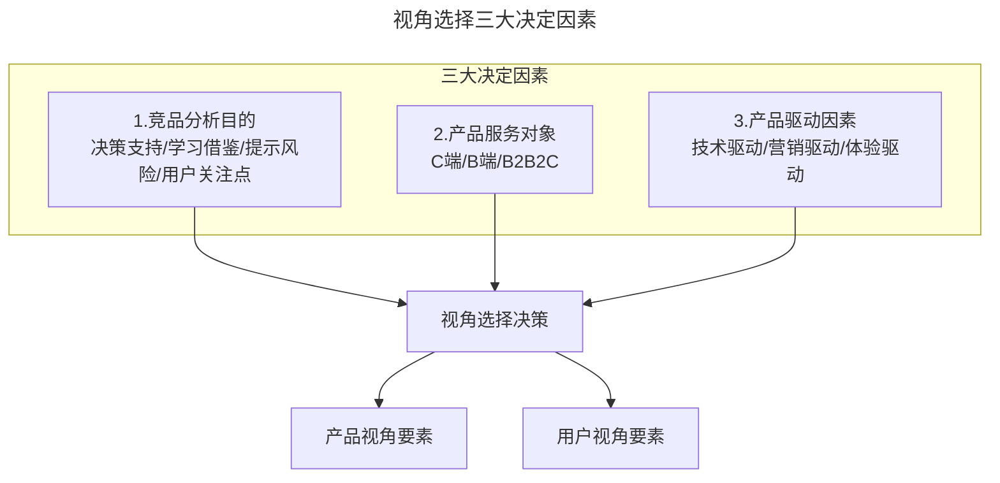
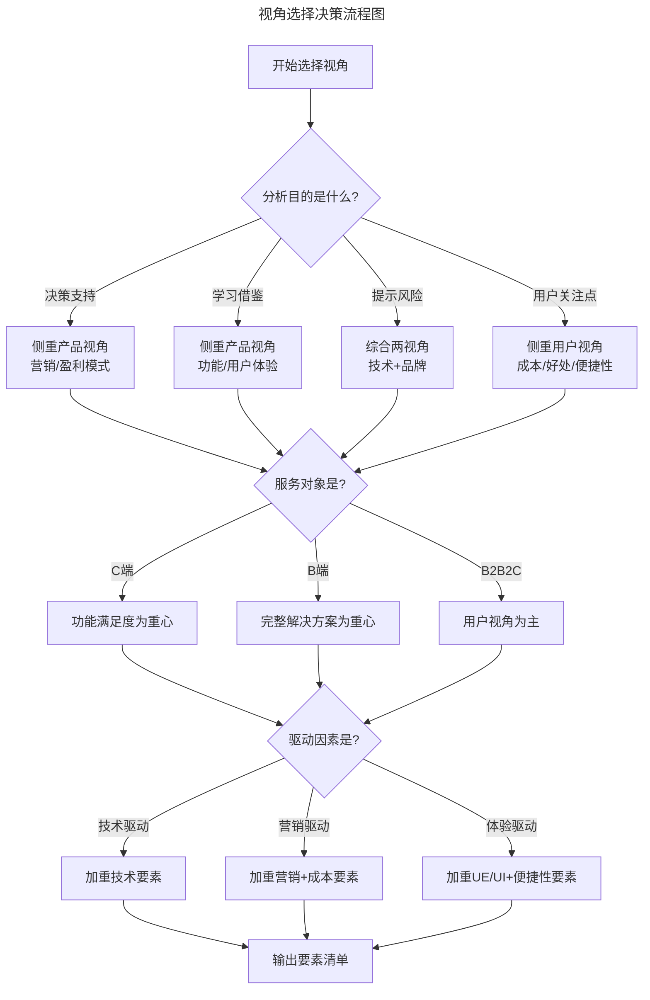
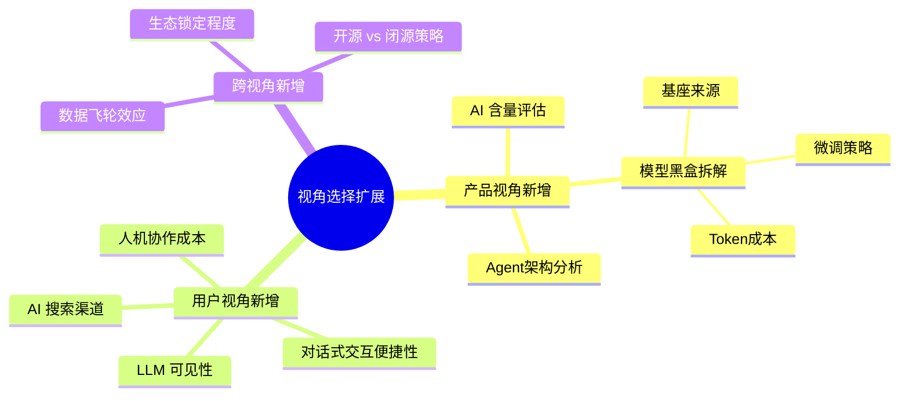

# 你选择产品视角还是用户视角？

> **适用范围**：已掌握产品视角（产品 7 要素）与用户视角（用户决策 5 要素）分析方法、需要在实际项目中做出视角选择决策的产品经理、运营人员与业务负责人。

> **更新摘要（v2 · 2026-08 更新）**：重构为六节标准骨架；系统阐述视角选择的三大决定因素（分析目的、服务对象、驱动因素）；用 2024-2026 年 AI 产品、SaaS、即时零售等最新案例替换过时案例；补充 AI 时代视角选择的新考量；失效图片全部替换为 Mermaid 图与文字表格。

## 一、导言

产品视角有 7 个要素，用户视角有 5 个要素，合计 12 个维度。一个常见的误区是：不确定选哪个视角，于是把 12 个要素全部写进报告，生怕不能面面俱到。结果是报告臃肿、重点模糊、结论空洞。

竞品分析（Competitive Analysis）不需要每次都用上全部 12 个要素。确定分析视角和维度主要由三个方面决定：**竞品分析的目的、产品的服务对象、产品的驱动因素**。本篇将逐一拆解这三个决定因素，并提供一套可操作的视角选择框架。

## 二、核心方法论

### 视角选择的三大决定因素

上图展示了视角选择的决策结构。三大因素并非孤立判断，而是需要综合考量：先看分析目的确定大方向，再看服务对象调整着力点，最后看驱动因素微调侧重点。三个因素叠加后，才能精确选出本次分析需要的具体要素。

### 两套视角的要素清单

| 视角 | 要素 | 英文 | 核心关注 |
| --- | --- | --- | --- |
| 产品视角 | 功能/需求 | Feature | 对手有哪些功能？背后需求是什么？ |
| 产品视角 | 用户体验 | UE/UI | 用户用得爽吗？ |
| 产品视角 | 营销 | Marketing | 营销策略背后的目标是什么？ |
| 产品视角 | 盈利模式 | Profit | 怎么赚钱？能否持续？ |
| 产品视角 | 团队 | Team | 组织架构反映什么战略意图？ |
| 产品视角 | 技术 | Technology | 技术是否带来业务突破？ |
| 产品视角 | 用户 | User | 用户画像与数据如何？ |
| 用户视角 | 好处 | Benefit | 用户获得什么？ |
| 用户视角 | 品牌 | Brand | 能否占领用户心智？ |
| 用户视角 | 成本 | Cost | 总成本是否够低？ |
| 用户视角 | 便捷性 | Usability | 是否易上手好操作？ |
| 用户视角 | 渠道 | Tunnel | 通过什么路径触达用户？ |

## 三、关键流程

### 第一步：根据竞品分析目的选择视角

竞品分析的目的大致分为四类：决策支持、学习借鉴、提示风险、用户关注点。不同目的对应不同的视角选择。

**目的为决策支持**：如果是市场推广的决策支持，需要看竞品的营销策略，根据 MCPP 流程（Market-Customer-Product-Promotion）分析竞品，这里主要用产品视角的营销要素。

**目的为学习借鉴**：想学习竞品的产品设计，需要拆解对方的功能特性、背后满足的需求点以及用户体验——用产品视角。想学习竞品的运营风格，需要分析用户画像和营销模式——综合产品视角与用户视角。建议提前一年就开始关注竞品的节假日活动运营，发现其中的规律和套路（是返券、满减还是抽奖），灰度尝试适合自己产品调性的运营风格。

**目的为提示风险**：需要扫描替代性竞品和潜在性竞品的动作，重点关注技术维度和品牌维度——综合产品视角的技术要素与用户视角的品牌要素。

**目的为用户关注点**：如果关注用户对价格的敏感性，需要用用户视角的成本要素，跟竞品比较用户对谁家的成本更敏感。进一步调研是对直接成本敏感还是交易成本敏感，从而思考如何给到用户比竞品性价比更高的产品。

### 第二步：根据产品服务对象调整着力点

产品的服务对象是 C 端还是 B 端，对视角选择有显著影响。

**B 端产品**要求第一次就提供一套完整的解决方案，容错度相对 C 端更低，更新难度更高（尤其是私有化部署的非 SaaS 服务）。做 B 端竞品分析时，需要分析一套完整的解决方案，不只是功能性产品本身，还包括配套的培训资料、营销方式、定价策略、客服方式等。B 端产品体验功能通常需要走商务流程（如申请测试账号），不如 C 端直接下载体验方便。

**C 端产品**更新速度最快可以做到一周 1-2 个迭代，功能拆解较为容易，直接应用商店下载就能上手体验。C 端产品更多关注功能满足用户需求的程度。

**B2B2C 产品**：B 端是甲方，C 端是甲方的用户。作为服务提供商，需要商务上让 B 端满意，体验上让 C 端满意。因此服务对象最终还是 C 端，分析视角应偏重用户视角。

| 服务对象 | 分析着力点 | 体验方式 | 推荐视角侧重 |
| --- | --- | --- | --- |
| C 端 | 功能满足需求程度 | 应用商店直接下载 | 产品视角功能+用户视角好处 |
| B 端 | 完整解决方案与交付 | 商务流程申请测试账号 | 产品视角全套+盈利模式 |
| B2B2C | B 端商务+C 端体验 | 双端分别体验 | 用户视角为主 |

### 第三步：根据产品驱动因素微调侧重点

不同产品有不同的核心驱动力，这决定了 12 个要素中哪些权重更高。

**技术驱动型产品**（如 AI 产品、智能硬件）：以技术为核心竞争力，分析时必须重点关注产品视角的技术要素。例如智能音箱产品，其竞争力取决于 AI 模型的能力（能否连续回答多个连环问、能否理解用户情绪），技术维度是分析重点。

**营销驱动型产品**（如电商、社区团购）：对营销方式的探索和竞争始终不遗余力。这类产品需要综合两个视角，在产品设计和运营上更加侧重用户视角来做营销方向的分析。例如各大电商平台的造节营销（双 11、618、年货节），背后都是五花八门的发券、抢券策略，分析时要同时关注营销策略（产品视角）和用户成本敏感度（用户视角）。

**体验驱动型产品**（如工具类、内容类产品）：用户体验和便捷性是核心竞争力，分析时侧重产品视角的 UE/UI 要素和用户视角的便捷性要素。

这张决策流程图展示了视角选择的完整路径：先按目的确定大方向，再按服务对象调整着力点，最后按驱动因素微调侧重点。三步走完后，输出的不是"产品视角或用户视角"的二选一，而是一份精确到具体要素的分析清单。

### 决策矩阵示例

假设你是一家 AI 产品公司的产品经理，产品是一款面向 C 端的智能助手，分析竞品的目的是学习借鉴其营销推广方式。使用决策矩阵：

| 决策因素 | 选择 | 勾选要素 |
| --- | --- | --- |
| 分析目的：学习借鉴 | — | 产品视角：营销、盈利模式 |
| 服务对象：C 端 | — | 用户视角：品牌、成本、渠道 |
| 驱动因素：技术驱动 | — | 产品视角：技术（补充） |

最终本次分析的要素清单为：产品视角的营销、盈利模式、技术 + 用户视角的品牌、成本、渠道，共 6 个要素。这比 12 个要素全上要精准得多。

## 四、工具与实战

### 视角选择清单工具

建议用 Excel 或在线表格建立"视角选择清单"，每次分析前按三步走流程勾选要素，形成本次分析的维度矩阵。这样可以避免"不知道选哪个，干脆全上"的问题。

### 灰度验证工具

在学习借鉴竞品的运营风格时，建议采用灰度发布（Gray Release）方式验证效果。灰度发布是指让一部分用户继续用老版本，另一部分用户用新版本，通过对比两组数据来判断新策略是否有效。常用工具包括：LaunchDarkly（功能开关管理）、Optimizely（A/B 测试平台）、自建灰度系统。

### AI 辅助视角选择

可以使用 AI 工具辅助视角选择：将产品描述、分析目的、服务对象、驱动因素输入 ChatGPT 或 Claude，让其推荐适合的分析要素组合。但需要注意：AI 的推荐是参考，最终决策仍需基于对业务的深入理解。

## 五、常见误区

**误区一：12 个要素全上。** 这是最常见的问题，源于"不确定选哪个，干脆全分析"的心理。结果是报告臃肿、重点模糊、每个要素都浅尝辄止。正确做法是根据三大决定因素精选 4-6 个要素深入分析。

**误区二：固定视角不分场景。** 习惯性地每次都用产品视角或每次都用用户视角，不根据分析目的和服务对象调整。不同场景需要不同的要素组合，不能一张清单走天下。

**误区三：忽视驱动因素。** 只看分析目的和服务对象，不考虑产品本身的驱动因素。技术驱动型产品不重点分析技术，营销驱动型产品不重点分析营销，都会导致分析偏离关键竞争力。

**误区四：B 端 C 端一刀切。** B 端和 C 端产品的分析着力点差异很大，不能套用同一套要素清单。B 端需要分析完整解决方案和配套服务，C 端更关注功能满足度和用户体验。

**误区五：只选一个视角。** 视角选择不是"二选一"的非此即彼，而是可以根据需要灵活组合。一次分析中可以同时包含产品视角和用户视角的要素，关键是选择最相关的组合。

## 六、进阶延展

### AI 时代的视角选择新考量

在 AI 时代，视角选择需要新增一个考量维度：产品的"AI 含量"。

对于 AI 原生产品（如 AI 助手、AI 写作工具），技术要素的权重显著提升，甚至需要新增"模型黑盒拆解"子维度（基座来源、微调策略、Token 成本、Agent 架构）。同时，用户视角中需要新增"LLM 可见性"考量——当用户通过大模型获取推荐时，你的产品是否被提及。

对于传统产品叠加 AI 能力的场景，视角选择需要区分"AI 是核心驱动力还是辅助增强"。如果 AI 是核心驱动力（如 AI 客服替代人工客服），技术要素权重高；如果 AI 只是辅助增强（如电商平台的智能推荐），则用户体验和营销要素仍是核心，技术要素作为补充分析即可。

上图展示了 AI 时代视角选择的扩展维度。这些新增维度不是可选项，而是 AI 产品竞品分析的必选项——忽略它们就等于在分析"皮囊"而忽视"灵魂"。

### 灰度发布与策略验证

在学习借鉴竞品的运营策略后，不要直接全量上线，而应通过灰度发布逐步验证。灰度发布的核心逻辑是：先让小部分用户使用新策略，对比这批用户与未使用新策略用户的行为数据，确认效果后再逐步扩大范围。

灰度发布的标准流程：确定实验目标→选择实验人群→设计对照组与实验组→设定观察指标与周期→执行实验→分析数据→决定是否全量上线。这套流程可以最大限度降低新策略的风险，同时积累数据支撑后续决策。

### 视角选择的动态调整

视角选择不是一次性的——随着产品生命周期的推进，分析视角也需要动态调整。初创期以学习借鉴为主，侧重产品视角的功能和体验；成长期以提升市场占有率为目标，侧重用户视角的好处和成本；成熟期以防御风险为主，侧重产品视角的技术和团队变化。定期审视分析视角是否匹配当前阶段，是保持竞品分析有效性的关键。

---

**本篇小结**：视角选择由三大因素决定——分析目的、服务对象、驱动因素。三步走流程（目的定方向→对象调着力点→驱动微调侧重点）输出的是精确到具体要素的分析清单，而非简单的"产品视角或用户视角"二选一。在 AI 时代，需要新增 AI 含量、LLM 可见性等扩展维度。下一篇将进入竞品分析流程的下一环节：如何收集竞争对手的信息。
