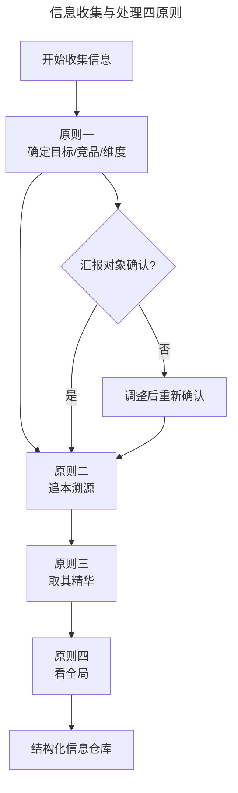
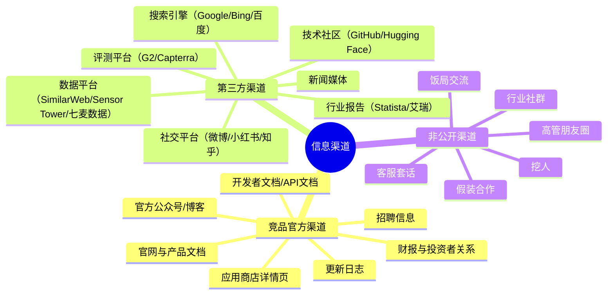
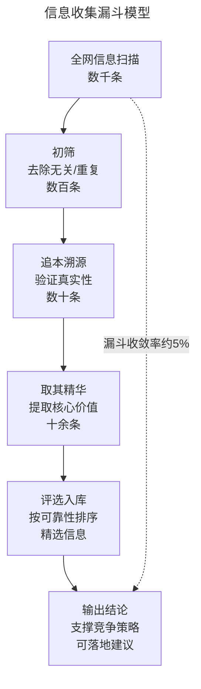

# 如何收集竞争对手的信息？

> **适用范围**：已确定分析目标、竞争对手和分析维度，需要系统化收集与整理竞品信息的产品经理、运营人员与业务负责人。

> **更新摘要（v2 · 2026-08 更新）**：重构为六节标准骨架；系统呈现信息收集四原则、三类渠道、整理三步法；用 2024-2026 年 AI 产品、即时零售等最新案例替换过时案例；补充 AI 辅助信息收集、自动化监控工具、LLM 数据验证等新方法；失效图片全部替换为 Mermaid 图与文字表格。

## 一、导言

确定了竞品分析（Competitive Analysis）的目标、对手和维度之后，接下来就是信息收集。这个阶段需要化身为"千里眼、顺风耳"，系统性地汇总看到的、听到的信息。但信息收集远非"看到什么记什么"那么简单——收集什么、从哪里收集、怎么整理，都有一套方法论。

常见的问题包括：信息多且杂却缺乏结论、信息来源渠道单一、罗列信息却没有提炼策略。本篇将从收集原则、收集渠道、整理方法三个层面，系统阐述如何高效地收集和整理竞品信息。

在 AI 时代，信息收集的效率已经大幅提升——Perplexity 等具备实时联网能力的工具可以在数分钟内完成过去需要数天的信息采集。但效率提升不等于质量保证，AI 产生的过时数据和幻觉（Hallucination）反而对信息验证提出了更高要求。

## 二、核心方法论

### 信息收集四原则

| 原则 | 含义 | 操作要点 |
| --- | --- | --- |
| 确定目标、竞品和维度 | 收集前必须明确分析框架 | 以邮件等形式发送给汇报对象确认 |
| 追本溯源 | 同一信息多出处时找到最权威来源 | 向官方媒体核实，不轻信转载 |
| 取其精华 | 从一条信息中提取最有价值的部分 | 聚焦与分析目标最接近的信息段 |
| 要看全局 | 不仅看单个竞品，还要看行业共性 | 关注政策、市场总量、共同短板 |

**原则一：确定目标、竞品和维度。** 收集信息前，至少要确定竞品分析的目标和维度。知道目标、选好竞品、确定维度，才能有的放矢。强烈建议先将"竞品目标、竞品类型、分析维度"以邮件等可留存形式发送给汇报对象确认——否则花一周做出的报告可能因某个环节不符合预期而返工。

**原则二：追本溯源。** 同一条信息往往有不同出处。例如某条行业新闻既来自新闻门户又来自搜索引擎聚合，这时需要向权威媒体核实。搜索后可以在官方发布渠道找到原始信息。尽管追本溯源会耗费时间，但可以确保信息的真实性。

**原则三：取其精华。** 如果"追本溯源"是从众多重复信息中找到最真实的，那"取其精华"就是从一条信息中找到最有价值的部分——也就是跟竞品分析目标和分析维度最接近的信息。体验竞品时，要找到最核心的流程和功能，而非事无巨细地记录所有细节。

**原则四：要看全局。** 不能只收集单个竞品的信息，还要关注共同影响整个行业的信息。从宏观角度看全局和行业共性：行业政策如何？预计总产值多少？竞争对手们共同的短板是什么？这样才能知道行业底线和天花板。

### MAS 信息处理模型

信息收集和处理可以套用 MAS 模型：遇到信息（Meet）→ 分析价值（Analyze）→ 整理归档（Solve）。每一条信息都需要经过这三个环节的筛选，才能进入最终的分析报告。

上图展示了四原则的执行顺序与关键卡点。原则一是前置门控——必须先获得汇报对象确认才能开始大规模收集，避免方向性错误。原则二到四贯穿收集全过程，确保信息的真实性、价值性和全面性。

## 三、关键流程

### 信息收集的三类渠道

信息收集渠道按获取方式分为三类：竞品官方渠道、第三方渠道、非公开渠道。

上图为信息渠道的完整图谱。官方渠道信息可靠但经过包装，第三方渠道相对客观但可能有滞后，非公开渠道信息最真实但获取难度大。三类渠道需要组合使用，互为印证。

**重点渠道一：招聘信息。** 招聘信息容易被忽视，但它能暴露竞品的业务布局和潜在计划。例如某平台招聘信息中出现"熟悉智慧建筑、智能家居、安防监控"，可以初步推测其可能进入相关领域。招聘信息还能反映团队规模扩张速度、技术栈选择（如要求熟悉某项 AI 框架）、组织架构变化等。

**重点渠道二：搜索引擎。** 使用搜索引擎时需要掌握常用技巧：`site:` 搜索特定网站下的文件、`filetype:` 搜索特定格式文档、引号精确匹配等。不要只用一家搜索引擎——Google 国际化覆盖好，Bing 国内表现也不错，百度适合中文内容。

**重点渠道三：技术社区。** 在 AI 时代，GitHub、Hugging Face、arXiv 等技术社区是发现潜在竞品和技术趋势的重要渠道。竞品是否开源了某些组件？是否有技术人员在社区提问暴露了技术栈？这些信息往往比官方公告更早、更真实。

### 信息整理三步法

收集到的信息需要经过"汇总→分类→评选"三步整理：

**第一步：汇总。** 将多渠道收集来的所有信息汇总到一个信息仓库中（建议使用在线协作文档，如飞书文档、Notion、有道云笔记），建立一个文件夹将所有相关信息归档。

**第二步：分类。** 根据来源渠道、竞品名称对信息进行分类，做好排重（删除重复信息）和校正（比对不同渠道信息以验证真实性）。

**第三步：评选。** 按照与竞品分析目标的接近程度、信息可靠程度进行评选。信息可靠性有几个原则：官方渠道优于第三方渠道；有精确好过无（数据上有一个量级即可，不需要完全精确）；注明信息来源（便于追溯）。

| 整理步骤 | 操作 | 工具推荐 | 产出 |
| --- | --- | --- | --- |
| 汇总 | 多渠道信息归档到统一仓库 | 飞书文档/Notion/有道云笔记 | 信息仓库 |
| 分类 | 按渠道、竞品分类，排重校正 | Excel/在线表格 | 分类信息表 |
| 评选 | 按相关性和可靠性排序 | 评选矩阵 | 精选信息清单 |

## 四、工具与实战

### 2025-2026 年信息收集工具矩阵

| 工具类别 | 代表工具 | 核心能力 | 适用信息类型 |
| --- | --- | --- | --- |
| 流量情报 | SimilarWeb | 网站流量、受众画像、流量来源 | 市场份额、用户画像 |
| 应用情报 | Sensor Tower、七麦数据 | 下载量、收入估算、版本迭代 | 移动端竞品动态 |
| 变更监控 | ChampSignal、Visualping、Scrapx | 定价页/功能页变更告警 | 实时动作捕捉 |
| 技术识别 | Wappalyzer、SimilarTech | 技术栈、第三方服务识别 | 技术维度分析 |
| 社交聆听 | BuzzSumo、Meltwater | 内容趋势、品牌提及、情感分析 | 营销与口碑 |
| 企业信息 | 企查查、天眼查 | 股东信息、投融资、专利 | 团队与资源分析 |
| AI 可见性 | LLMrefs、TrackMyBusiness | 品牌在大模型中的推荐可见性 | AI 时代品牌分析 |
| AI 采集 | Perplexity、ChatGPT | 实时联网搜索、结构化摘要 | 快速信息汇总 |

### AI 辅助信息收集工作流

2026 年被广泛验证的 AI 辅助信息收集工作流分为四个阶段：

**阶段一：范围确定（15 分钟）。** 写一段范围说明文档，定义本次分析要支撑什么决策、纳入哪些竞品（3-7 个）、关注哪些维度、报告给谁看。这段说明作为上下文粘贴到后续每个 AI 提示词中。

**阶段二：信息采集（45 分钟）。** 用 Perplexity 等具备实时联网能力的工具采集竞品信息。Perplexity 的优势在于每条信息都附带来源链接，便于后续验证。采集时按竞品逐一进行，每个竞品覆盖所有分析维度。

**阶段三：结构化（20 分钟）。** 用 ChatGPT 或 Claude 将采集到的信息结构化为 SWOT 矩阵、功能对比表、定价对比表等标准化框架。

**阶段四：综合与验证（15 分钟）。** 用 Claude 完成战略层面的综合分析。**验证环节不可跳过**——所有定价、产品规格、用户数据都必须在竞品官网上二次核实后才能写入报告，避免 AI 幻觉。

### 实战要点

第一，信息的"充分"是指"够用"，不是"多"。信息过载反而会让人迷失在细节中，错失决策窗口。每条信息都应能回答"它对本次分析目标有什么贡献"。

第二，学会在信息"不充分"的情况下做竞品分析。并不是想收集什么就能收集到什么，可以用解决费米问题（Fermi Problem）的逻辑方式进行合理推演，但不建议随意主观猜测。

第三，建立自动化监控。将关键竞品的定价页、功能公告页、招聘页面纳入 ChampSignal 或 Visualping 等变更监控工具，设置 Slack/邮件告警，从"被动查阅"转向"主动推送"。

## 五、常见误区

**误区一：信息收集缺乏计划。** 没有先确定目标、竞品和维度就开始收集，导致收集的信息与实际需求脱节。正确做法是先与汇报对象确认分析框架，再开始大规模收集。

**误区二：渠道单一。** 只从一个渠道（如只看客服反馈、只看应用商店评论）获取信息，视角片面。必须组合使用官方渠道、第三方渠道和非公开渠道，互为印证。

**误区三：只收集不整理。** 把所有信息堆在一个文档里，没有分类、排重、评选，导致信息仓库变成信息垃圾场。必须执行"汇总→分类→评选"三步法，提炼出有价值的精选信息。

**误区四：信息无结论。** 罗列了一大堆信息，却没有提炼出结论和竞争策略。竞品分析的终点不是信息仓库，而是可落地的竞争策略——每条信息都应该能够支撑某个结论或建议。

**误区五：盲目信任 AI 输出。** AI 工具可能产生过时数据或幻觉，直接使用会导致报告中的数据失实。所有 AI 采集的数据都必须在原始来源上二次验证后才能采用。

**误区六：忽视行业宏观信息。** 只盯着单个竞品，忽略了影响整个行业的政策、法规、市场总量等宏观信息。这些信息决定了行业的天花板和底线，是制定竞争策略的重要背景。

## 六、进阶延展

### 漏斗分析在信息收集中的应用

漏斗分析（Funnel Analysis）是一种将过程拆解为多个阶段、分析每个阶段转化率的方法。在信息收集中，可以建立一个"信息漏斗"：

上图展示了信息从"全网扫描"到"输出结论"的漏斗收敛过程。从数千条原始信息中，经过层层筛选，最终只有约 5% 的信息能够进入报告并支撑结论。这个漏斗模型提醒我们：信息收集不是"多多益善"，而是"层层精炼"。

### 反竞品分析意识

在收集竞品信息的同时，也要意识到竞品可能在收集你的信息。非公开渠道（如假装合作、挖人、套话）不仅是你获取信息的手段，也是竞品获取你信息的手段。因此，在对外沟通中需要注意信息保密，避免在行业社群、饭局、招聘等场景中泄露核心策略。这部分内容将在后续"反竞品分析"章节详细展开。

### 营销案例的深度拆解

以 2024-2026 年某热门游戏与文化 IP 联合营销为例，信息收集不仅要记录"做了什么活动"，还要拆解完整的营销流程：确定合作对象→分解合作对象需求→分析共赢点→策划研发营销活动→完善细节→选择时机推出。提炼出可沿用的营销合作流程方法论后，还可以进一步分析危机公关处理（确定事实→表明态度→做出措施），为自身产品的营销活动提供全流程参考。

### 从信息收集到情报体系

当竞品分析从一次性项目升级为常态化工作时，信息收集需要从"手动采集"升级为"情报体系"。这包括：建立竞品数据库（结构化存储所有竞品信息）、设置自动化监控（关键页面变更告警）、定期生成动态简报（AI 辅助汇总）、建立内部情报共享机制（团队协作平台同步）。据 2026 年的行业统计，71% 的产品团队已经将 AI 工具纳入每周的竞争情报工作流——从"被动收集"到"主动监控"再到"智能预警"，这是竞品分析能力进阶的必经之路。

---

**本篇小结**：信息收集需要遵循四原则（确定框架、追本溯源、取其精华、看全局），组合使用三类渠道（官方、第三方、非公开），并通过"汇总→分类→评选"三步法完成整理。在 AI 时代，Perplexity 等工具大幅提升了采集效率，但验证环节不可跳过。信息收集的终点不是信息仓库，而是可落地的竞争策略。从一次性收集升级为常态化情报体系，是竞品分析能力进阶的关键标志。
