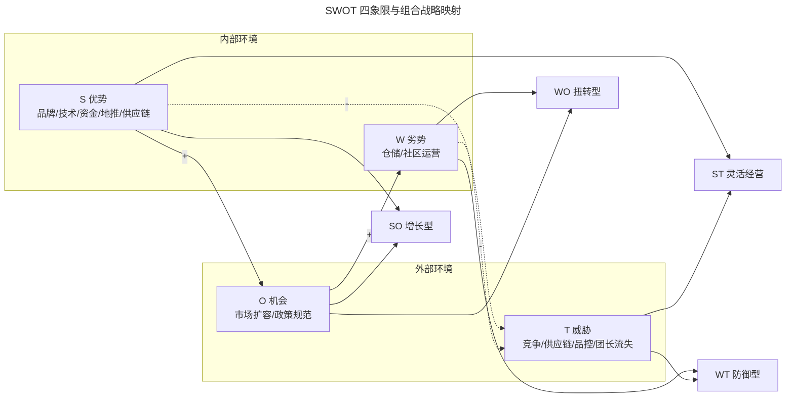
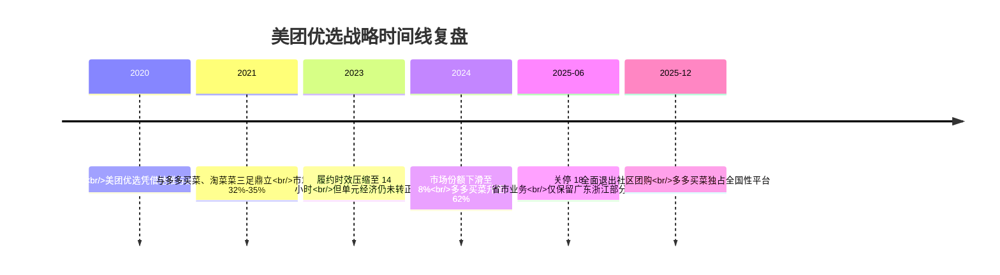

# 通过 SWOT 分析法，看美团优选的先天优势

> **适用范围**：产品经理、运营人员、战略分析岗位，需要对外部环境和自身业务进行系统化对比分析的场景；适用于社区团购、本地生活、电商等强竞争行业的策略推演。

> **更新摘要（v2 · 2026-08 更新）**：在保留 SWOT（Strengths-Weaknesses-Opportunities-Threats）核心方法论的基础上，更新了 2024-2026 年社区团购最新格局——美团优选已于 2025 年 12 月全面退出，多多买菜市场份额升至 62%；新增对原文 SWOT 推演结论的事后复盘，并以 Mermaid 图与文字表格替代失效图片；补充 AI 驱动的环境扫描工具与 SWOT 现代应用边界。

## 一、导言

竞品分析（Competitive Analysis）的最终落点不是"罗列信息"，而是"得出策略"。SWOT 分析法（Strengths-Weaknesses-Opportunities-Threats，优势-劣势-机会-威胁）正是把零散的内外部信息收敛为竞争策略的经典枢纽工具。它源自斯坦福研究院 1960 年代的研究框架，至今仍被产品经理、战略分析师广泛使用，原因在于其"以终为始"的逻辑：先明确目标，再扫描内外部环境，最后输出可执行的战略组合。

本文以"美团优选"作为贯穿案例。需要特别说明的是，2025 年 6 月 23 日美团优选宣布关停全国 18 个省市的社区团购业务，仅保留广东、浙江部分城市有限运营；同年 12 月 15 日完成最后一批区域关停，意味着美团全面退出社区团购赛道。这一事实恰恰使得"复盘 2020-2024 年期间对美团优选的 SWOT 推演"具备了独特价值——可以验证当时得出的策略是否被现实兑现，哪些"先天优势"最终未能转化为持续竞争力。这种"以历史案例反推方法论有效性"的视角，是 v2 版本的核心增量。

## 二、核心方法论

SWOT 的本质是把环境信息映射到四个象限，再通过象限组合生成四类战略：

| 象限 | 来源 | 组合战略 | 战略性质 |
|------|------|---------|---------|
| S 优势（Strengths） | 内部 | SO 战略：依靠优势利用机会 | 增长型 |
| W 劣势（Weaknesses） | 内部 | WO 战略：利用机会克服劣势 | 扭转型 |
| O 机会（Opportunities） | 外部 | ST 战略：依靠优势回避威胁 | 灵活经营 |
| T 威胁（Threats） | 外部 | WT 战略：减少劣势回避威胁 | 防御型 |

优势要利用、劣势要改进、机会要观察、威胁要消除。SWOT 之所以被称为"枢纽工具"，是因为它不替代 PEST、波特五力等环境扫描方法，而是把这些方法产出的要素"装入"四个象限，再组合输出策略。

上图中实线"+"表示利用，虚线"-"表示回避或克服。四个象限的组合并非穷举，而是要求分析师根据业务目标做优先级排序，每个象限的要素数量建议控制在 5 个以内，避免失焦。SWOT 的真正难度不在画图，而在要素筛选的权重判断——同一个事实（如"地推能力强"）在不同业务阶段可能既是优势也是潜在的成本负担。

## 三、关键流程

### 3.1 明确分析目标

确定 SWOT 的目标需与竞品分析目标保持一致。以美团优选为例，2020 年时的分析目标可表述为：**通过分析内外部信息，明确美团优选在社区团购赛道的可选策略，并为未来 12-24 个月的产品规划提供参考**。目标决定了要素取舍的标准——若目标是"是否进入某区域"，则重点关注该区域的市场机会与本地竞争者；若目标是"如何应对头部对手"，则聚焦资源对比与差异化能力。

### 3.2 扫描外部环境（PEST 模型）

PEST 模型（Political-Economic-Social-Technological，政治-经济-社会-技术）是 SWOT 中 O 与 T 要素的主要来源。下表梳理了 2020-2024 年社区团购行业的 PEST 要素及 2025-2026 年的演变：

| 维度 | 2020-2024 年要素 | 2025-2026 年演变 |
|------|-----------------|-----------------|
| 政治 P | "九不得"新规规范竞争；社区团购合规经营指引酝酿 | 《社区团购合规经营指引》2025 年 10 月全面实施，佣金率稳定在 8.5%-11.2% |
| 经济 E | 2020 年 GDP 增长 2.3%；CPI 走低影响消费 | 2025 年行业规模达 1.86 万亿元，同比增长 32.86%；客单价从 42.6 元升至 53.8 元 |
| 社会 S | 用户养成小程序买菜习惯；团长多为便利店主 | 2025 年活跃团长 892.4 万人，金牌团长占 12.8% 贡献 43.6% 交易额；女性占比 81.5% |
| 技术 T | 4G 成熟、5G 普及；GPS 推荐自提点 | AI 选品系统在头部平台 100% 覆盖，新品测款周期从 14 天压缩至 5.2 天 |

### 3.3 横纵向对比内部环境

横向与竞品比较市场占有率、用户数、融资速度；纵向梳理自身业务结构、组织能力、核心技术、盈利模型。美团优选 2020 年时的内部要素可归纳如下：

- **优势 S**：美团 App 导流入口、10 年+ 高并发系统与智能推荐积累、上市公司资金支持、团购与外卖积累的强地推团队、商家管理能力支撑供应链。
- **劣势 W**：仓储环节起步晚，跨城运输与原产地采购需持续投入；偏交易平台属性，社区运营经验较弱。

### 3.4 四象限组合输出策略

将要素装入象限后，结合分析目标筛选出 2-3 条可执行策略。以 2020 年的美团优选为例，原文给出的四类策略纲领为：

- **SO 增长型**：借助地推资源发展团长、巩固区域代理、扩大渠道，向县城与农村地区下沉。
- **ST 灵活经营**：利用品牌效应吸引供应商和技术人才，开展线上线下组合营销。
- **WO 扭转型**：加强仓储建设特别是非一线地区，引入运营人员深入一线理解"菜市场"氛围。
- **WT 防御型**：加强仓储管理，提升合作伙伴质量，挖掘合作空间。

## 四、工具与实战

### 4.1 信息收集工具栈

2025 年后，SWOT 的环境扫描已不再依赖人工检索，AI 驱动的竞品情报工具大幅缩短了要素收集时间：

| 工具类型 | 代表产品 | 适用场景 |
|---------|---------|---------|
| 数字流量情报 | Similarweb、Semrush | 监测竞品网站/小程序流量、用户画像、获客渠道 |
| 移动应用情报 | Sensor Tower（已收购 data.ai）、AppFollow、AppTweak | 跟踪下载量、版本迭代、评论情感、ASO 关键词 |
| 实时竞品监控 | Crayon、Klue、Valona | 自动捕获竞品官网更新、定价变化、招聘动向 |
| AI 研究助手 | Already.dev、Perplexity、Sai by Simular | 4 分钟生成竞品全景报告、SWOT 自动生成 |
| 社交聆听 | Brandwatch | 监测用户口碑、品牌情感倾向 |

### 4.2 实战复盘：美团优选 SWOT 推演的有效性

将原文 2020 年的 SWOT 结论对照 2025 年的现实，可以清晰看到方法论的价值与边界：

| 原文策略 | 当时的推演依据 | 2025 年实际结果 | 方法论启示 |
|---------|--------------|---------------|----------|
| SO：借助地推下沉县城 | 地推团队是美团核心优势 | 美团优选确实完成了全国多线布局，但下沉市场的履约成本始终未跑通 | 优势未转化为可持续单元经济模型（Unit Economics） |
| ST：用品牌吸引供应商 | 美团品牌效应强 | 2025 年 6 月退出时，供应商库存积压、货款结算困难 | 品牌优势在 B 端无法替代供应链效率 |
| WO：加强一线以外仓储 | 仓储是劣势 | 履约时效从 29.7 小时压缩至 14.3 小时，但成本结构未根本改善 | 劣势改进需要远超预期的投入 |
| WT：防御型加强仓储管理 | 竞争加剧、品控难 | 多多买菜通过供应链复用主站流量，CR3 集中度超 90% | 防御型战略在资本效率上输给进攻型对手 |

复盘结论是：**SWOT 正确识别了要素，但低估了"资本效率竞争"这一隐性威胁**。多多买菜借助拼多多主站流量与农产品供应链的复用效应，把同一套要素组合出了更优的单位经济模型。这意味着 SWOT 分析必须叠加"财务推演"环节，仅做定性象限分析不足以判断战略可行性。

时间线显示，SWOT 推演中"WT 防御型"的预警在 2023-2024 年逐步兑现，但当时的反应速度不足以扭转趋势。这印证了一条经验：**SWOT 的输出必须配以时间维度的节奏表（短-中-长期）**，否则策略会停留在口号层面。

## 五、常见误区

### 5.1 要素罗列而无权重

最常见的错误是把所有想到的要素都塞进象限，导致每个象限 10+ 项，无法决策。正确做法是为每条要素打权重（如 0.1-1.0），保留权重前 3-5 项。在个人决策场景（如"是否转岗产品经理"）可对要素加权求和，得到量化参考。

### 5.2 静态视角忽略动态转换

波特五力、PEST 与 SWOT 的共同局限是"静态切片"。互联网行业的供应商、替代品、潜在进入者经常相互转换——例如 Keep 既做 App 又开线下健身房 KeepLand，传统"替代品"变成"延伸业务"。建议每季度刷新一次 SWOT，把"动态转换"作为独立维度跟踪。

### 5.3 把 SWOT 当终点

SWOT 输出的策略纲领（如"SO 增长型"）只是方向，必须进一步拆解为具体行动：谁负责、什么资源、什么时间、什么指标验证。原文中美团优选的 SO 战略"借助地推资源下沉县城"若不拆解为开城节奏表、团长招募指标、履约成本红线，就会停留在战略口号。

### 5.4 忽略资本效率维度

复盘美团优选案例的最大教训：仅做定性 SWOT 容易高估"品牌优势"的护城河作用。建议在 SWOT 矩阵旁并列一张"单元经济模型表"，把每条优势/劣势换算为获客成本（CAC）、生命周期价值（LTV）、履约成本等可量化指标。

## 六、进阶延展

### 6.1 SWOT 与其他模型的组合

SWOT 作为枢纽工具，其象限要素可来自多种分析模型。推荐组合方式：

- **PEST + SWOT**：PEST 产出 O/T 要素，横纵向对比产出 S/W 要素。
- **波特五力 + SWOT**：波特五力分析行业结构，识别的机会/威胁输入 SWOT 的 O/T 象限。
- **波士顿矩阵 + SWOT**：波士顿矩阵定位产品组合，明星产品对应 S，瘦狗产品对应 W。
- **5Why + SWOT**：在确定劣势根因时，用 5Why 追问到底层原因，避免表象要素。

### 6.2 AI 时代的 SWOT 进化

2025 年后，AI 工具已能自动化完成 SWOT 的环境扫描与要素初筛。Sai by Simular、Already.dev 等平台可在数分钟内生成 SWOT 报告初稿。但分析师的核心价值转移到三个环节：**权重判断**（哪些要素更关键）、**财务推演**（要素如何转化为经济模型）、**节奏设计**（策略的时序安排）。这些是 AI 难以替代的"决策性工作"。

### 6.3 从 SWOT 到 TOWS

TOWS 矩阵（Threats-Opportunities-Weaknesses-Strengths）是 SWOT 的逆向应用——先看外部环境，再匹配内部能力。在快速变化的互联网行业，TOWS 往往比 SWOT 更实用：先识别多多买菜的供应链复用威胁，再倒推自身需要补齐的能力，比"先盘点自身优势再找机会"更贴近实战。

### 6.4 知识锦囊：什么是核心竞争力？

核心竞争力（Core Competence）由普拉哈拉德与哈默尔 1990 年提出，指企业经过长期积累形成的、难以被模仿的、能带来持续竞争优势的能力组合。判定标准有三：**稀缺性**（对手不具备）、**不可替代性**（无法通过其他资源替代）、**组织性**（嵌入组织流程而非依赖个人）。在美团优选案例中，"地推团队"看似是核心竞争力，但其可被资本复制（多多买菜通过高薪挖角）；真正的核心竞争力更可能是"供应链+流量+算法"的组合能力，这也是多多买菜最终胜出的底层逻辑。
