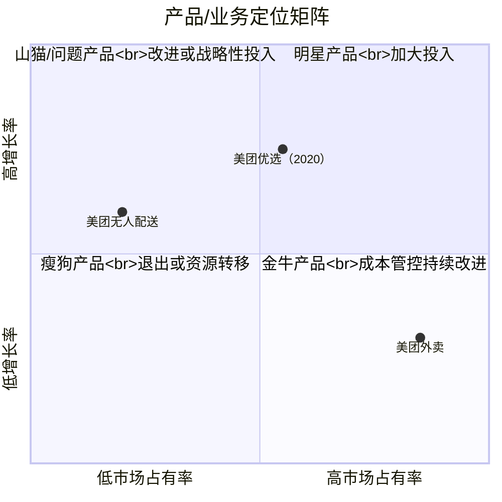
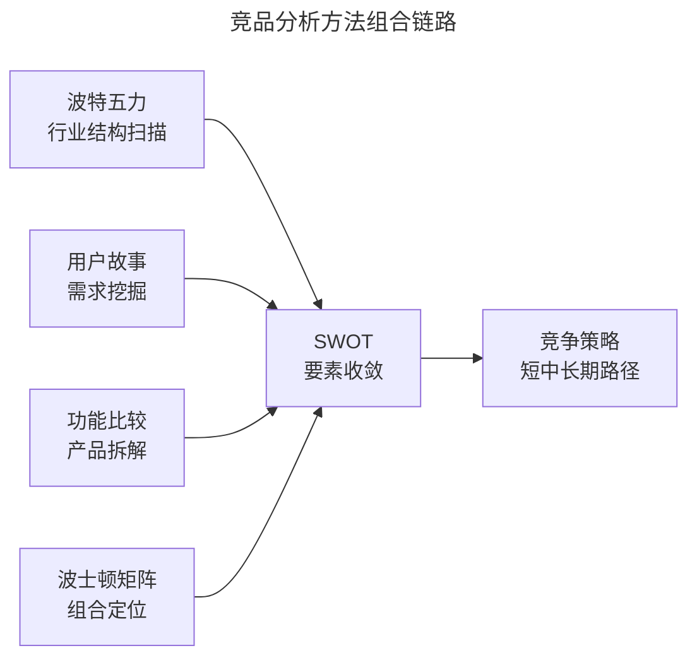

# 除了 SWOT 分析，另外 4 个常见的分析方法

> **适用范围**：产品经理、运营人员、战略分析师在 SWOT 之外需要补充的工具箱；适用于功能规划、行业进入决策、产品组合管理、用户需求挖掘等场景。

> **更新摘要（v2 · 2026-08 更新）**：在用户故事、功能比较、波特五力、波士顿矩阵四个经典方法基础上，新增 AI 驱动竞品分析、波特五力在互联网行业的现代应用、JTBD（Jobs-to-be-Done）等 2025 年主流增量方法；以 Mermaid 图与表格替代失效图片；补充 2025-2026 年工具栈与最新案例。

## 一、导言

SWOT（Strengths-Weaknesses-Opportunities-Threats）是枢纽工具，但它本身不产出环境要素——要素来自其他分析方法的输入。一个完整的竞品分析往往需要 3-5 个方法组合使用：用 PEST 扫描宏观环境，用波特五力分析行业结构，用功能比较拆解产品维度，用用户故事理解需求，最后用 SWOT 收敛出策略。本文介绍 4 个最常用的"要素生产"方法，并补充 2025 年后 AI 驱动的新一代分析范式。**核心原则：方法不是越多越好，而是要形成内在逻辑，不可拍脑袋做决定**。

## 二、核心方法论

| 方法 | 切入视角 | 主要产出 | 典型适用场景 |
|------|---------|---------|-------------|
| 用户故事（User Story） | 用户使用场景 | 需求点、功能开发思路 | 功能规划、需求评审 |
| 功能比较（Feature Comparison） | 产品功能维度 | 功能矩阵、差异点 | 产品规划、定价策略 |
| 波特五力（Porter's Five Forces） | 行业参与者结构 | 行业盈利能力、竞争空间 | 行业进入决策、投资评估 |
| 波士顿矩阵（BCG Matrix） | 业务组合 | 产品定位、资源分配 | 多产品线管理、产品组合优化 |

2025 年后，AI 驱动竞品分析（AI-driven Competitive Analysis）与 JTBD（Jobs-to-be-Done）已成为第五、第六种常被纳入工具箱的方法，下文统一在"进阶延展"中说明。

## 三、关键流程

### 3.1 用户故事：从场景反推需求

用户故事（User Story）是敏捷开发中的标准需求表达格式：**"作为\<角色\>，我希望\<行为\>，以便\<价值\>"**。在竞品分析中，它的价值在于让分析师"成为用户"，通过讲故事的方式观察竞品如何满足需求，而不只是罗列功能。

例如经典案例"骑车时不方便打字，希望手机把收到的信息念给我听"，可拆解为：

- 场景限制：骑车、不方便打字——更关键的限制是"不方便打字"。
- 行为拆解：收到的是语音、文字还是视频？如何朗读？系统默认还是独立模块？
- 回复路径：既然不能打字，是否仅回复语音或语音转文字？

通过这种拆解，可以离"竞品为何开发该功能"更近一步。用户故事与"用户视角"的区别在于：用户视角重视单产品体验感，用户故事强调"需求满足情况"。

### 3.2 功能比较：拆解功能矩阵

功能比较法（Feature Comparison）是产品经理最常用的拆解方式，主要有三种形态：

- **文字描述型**：如苹果官网对 iPhone 不同机型的参数对比。
- **打勾矩阵型**：列出竞品 1/2/3 与功能 1/2/3，标记是否有该功能。所有竞品都有的功能是行业共性，需重视；独有功能需分析创新点。
- **价格-功能对应型**：列出每个竞品的价格与对应功能服务，明确差异。

2025 年后，AI 工具（如 Already.dev）可自动生成功能对比网格（Feature Grid），但分析师仍需对"功能是否真的为用户所需"做判断——这是工具无法替代的。

### 3.3 波特五力：互联网行业的现代应用

波特五力（Porter's Five Forces）由迈克尔·波特 1979 年提出，包含五种影响行业盈利能力的外在力量：供应商议价能力、购买者价格影响力、潜在进入者威胁、替代品替代能力、直接竞争者竞争能力。

传统五力模型适用于制造业等成熟行业，但在互联网行业存在三点局限：**静态视角**难以覆盖技术颠覆；**忽略跨界因素**（如美团优选既与多多买菜竞争，也与线下菜市场存在替代关系，边界模糊）；**数据维度单一**缺乏对用户行为的微观洞察。2025 年后行业实践已形成"互联网化转换"版本：

| 五力维度 | 传统含义 | 互联网行业转换维度 |
|---------|---------|------------------|
| 供应商议价力 | 上下游议价 | 云厂商、应用商店（Apple/Google 占 92% 分发）、AI 调制服务商、内容 API |
| 购买者议价力 | 供求关系 | 用户粘性、留存率、转换成本 |
| 潜在进入者 | 行业门槛 | 小众形态的细分创新者快速切入 |
| 替代品威胁 | 替代产品 | 跨界整合风险、数据沉淀可复制性 |
| 同业竞争 | 市场集中度 | 渗透率、用户份额、迭代频率 |

### 3.4 波士顿矩阵：产品组合的现金牛逻辑

波士顿矩阵（BCG Matrix）由波士顿公司创始人布鲁斯·亨德森提出，以"相对市场占有率"为横轴、"需求增长率"为纵轴，把产品分为四类：

图中以美团业务作为示例：美团外卖是典型金牛产品（高占有率、低增长），需做成本管控与持续改进；美团优选在 2020 年被定位为明星/问题产品（高增长、中等占有率），需战略性投入；无人配送是问题产品，前景不明朗需大量资金投入。复盘 2025 年的结果——美团优选退出市场——印证了山猫/问题产品的高风险属性。

## 四、工具与实战

### 4.1 方法组合的实战路径

四种方法并非独立使用，而是构成"输入-分析-输出"的链条：

链路的核心是：波特五力产出 O/T 要素，用户故事与功能比较产出 S/W 要素，波士顿矩阵定位自身产品在组合中的位置，最后由 SWOT 收敛为竞争策略。这种链路避免了"每个方法都跑一遍却不出结论"的低效。

### 4.2 在线少儿编程的实战案例

以线上少儿编程为例，应用四种方法组合：

- **波特五力**：直接竞争对手是编程猫、核桃编程；供应商是自带课程资源的老师；购买者是家长和孩子，选择多议价力强；替代品是线下培训（更友好交流方式）；潜在竞争者包括今日头条、腾讯、阿里。
- **用户故事**：作为 8 岁孩子的家长，我希望孩子在 30 分钟内完成一个小游戏，以便看到学习成果（验证激活与留存的关键场景）。
- **功能比较**：列出编程猫、核桃编程、小码王的核心功能矩阵，识别"可视化拖拽编程"是行业共性，"AI 个性化辅导"是差异化创新点。
- **波士顿矩阵**：基础课程是金牛产品，AI 课程是问题产品，硬件套件是瘦狗产品。

### 4.3 2025 年工具栈补充

| 方法 | 推荐工具 |
|------|---------|
| 用户故事 | 用户访谈工具（UserTesting、 Maze）；AI 拆解（ChatGPT、Claude） |
| 功能比较 | Already.dev（自动生成 Feature Grid）；ProductPlan |
| 波特五力 | 帆软 FineBI（动态数据监测）；AlphaSense（NLP 文档搜索） |
| 波士顿矩阵 | Excel/Google Sheets；Tableau；Power BI |

## 五、常见误区

### 5.1 把 SWOT 当分析工具而非枢纽

最常见的误用是把 SWOT 当成独立分析工具，导致象限要素空洞。正确做法是先用波特五力、PEST 等方法产出要素，再装入 SWOT 象限组合出策略。

### 5.2 波特五力机械套用

互联网行业边界模糊，"替代品"与"潜在进入者"经常相互转换。如美团优选既与多多买菜直接竞争，又与线下菜市场存在替代关系，而线下菜市场本身又可能成为社区团购的团长节点。机械套用五力会遗漏这类动态关系。

### 5.3 波士顿矩阵仅用于产品组合

矩阵同样适用于功能模块、运营策略、渠道布局的横向对比。如单一产品下，可将功能按增长率与占有率分为四类，对应不同运营策略。

### 5.4 用户故事变成"以情动人"

用户故事的核心是"引入使用场景"以切中竞品需求开发的要害，而非煽情。提炼故事时应遵循"当\<场景\>时，我希望\<行为\>"的结构化模板。

## 六、进阶延展

### 6.1 AI 驱动竞品分析（2025 新增方法）

2025 年后，AI 驱动竞品分析已成为独立方法分支。代表工具包括：**Already.dev**（4 分钟生成竞品全景报告）、**Sai by Simular**（端到端市场研究）、**Crayon**（实时竞品监控）、**Klue**（销售 Battlecard 自动生成）。这些工具的共同特征是：自动抓取多源数据（应用商店、官网、招聘、SEC 文件、社交媒体）、AI 摘要与情感分析、自动生成 SWOT 或竞争 Battlecard。

但 AI 工具的局限在于：依赖公开数字信号，对深度 stealth 模式的竞品无能为力；输出偏向结构化数据，对非结构化的"运营调性"洞察有限。分析师的价值转移到"判断 AI 输出的可信度"与"补充非公开信息"。

### 6.2 JTBD（Jobs-to-be-Done）框架

JTBD 由克莱顿·克里斯滕森推广，核心是"用户雇佣产品来完成某个任务"。与用户故事的区别在于：用户故事关注"做什么"，JTBD 关注"为什么"。例如用户购买电钻不是为了拥有电钻，而是为了墙上的孔。在竞品分析中，JTBD 帮助识别"功能背后的真正任务"，避免被功能表象误导。

### 6.3 五力模型的 AI 推理应用

2025 年起，AI 大模型已能基于行业数据自动生成五力分析。但实践显示，AI 输出的五力分析在"行业数据更新"维度表现良好，在"跨界替代识别"与"动态转换预测"上仍依赖人类分析师。建议把 AI 输出作为初稿，由分析师做关键修正。

### 6.4 知识锦囊：什么是 UGC？

UGC（User Generated Content，用户生成内容）指用户原创内容，是互联网平台内容生态的核心。与 PGC（Professional Generated Content，专业生产内容）、AIGC（AI Generated Content，AI 生成内容）并列。UGC 平台如 B 站、知乎、小红书，UP 主是 UGC 的关键供给方，制约 UGC 平台的发展；AIGC 在 2023 年后大规模进入内容生产链路，正在重塑 UGC 平台的成本结构。

### 6.5 方法选择的决策树

面对 6+ 种竞品分析方法，如何选择？建议按以下决策树：

| 业务场景 | 推荐方法组合 |
|---------|------------|
| 是否进入新行业 | 波特五力 + PEST + SWOT |
| 是否上线新功能 | 用户故事 + 功能比较 + 5Why |
| 多产品线资源分配 | 波士顿矩阵 + SWOT |
| 验证用户需求真假 | JTBD + 5Why + MVP 灰度 |
| 运营策略对比 | RARRA + 功能比较 |
| 长期跟踪监控 | 波特五力（季度）+ 数据指标（周） |

**核心原则：方法服务于问题，而非相反**。先明确要回答什么问题，再选合适的方法组合。不要为了"用上某方法"而强行套用——这是新手最常见的本末倒置。

### 6.6 方法间的协同与冲突

各方法并非孤立使用，而是形成"输入-输出"的协同链。例如：

- **波特五力的输出**（行业机会/威胁）→ 输入 SWOT 的 O/T 象限
- **用户故事的输出**（需求点）→ 输入功能比较的维度设计
- **波士顿矩阵的输出**（产品定位）→ 决定 SWOT 分析的目标产品
- **5Why 的输出**（需求根因）→ 输入 JTBD 的任务定义

但方法间也可能存在冲突——例如波特五力得出"行业不具吸引力"时，SWOT 仍可能基于内部优势建议进入。这种冲突需通过"财务推演"与"风险评估"做最终决策，不能依赖单一方法得出结论。

### 6.7 AI 时代分析师的不可替代价值

2025 年后，AI 工具能自动生成 SWOT、波特五力、波士顿矩阵的初稿。分析师的不可替代价值集中在三个层面：**权重判断**（哪些要素更关键）、**非公开信息补充**（行业人脉、私下访谈）、**决策性推理**（要素如何转化为战略行动）。建议把 AI 输出作为"高质量初稿"，分析师精力投入到"判断、补充、决策"环节，这才是未来的工作方式。同时，AI 工具的输出依赖公开数字信号，对深度 stealth 模式的竞品无能为力，分析师的非公开信息渠道仍是关键差异化优势。
