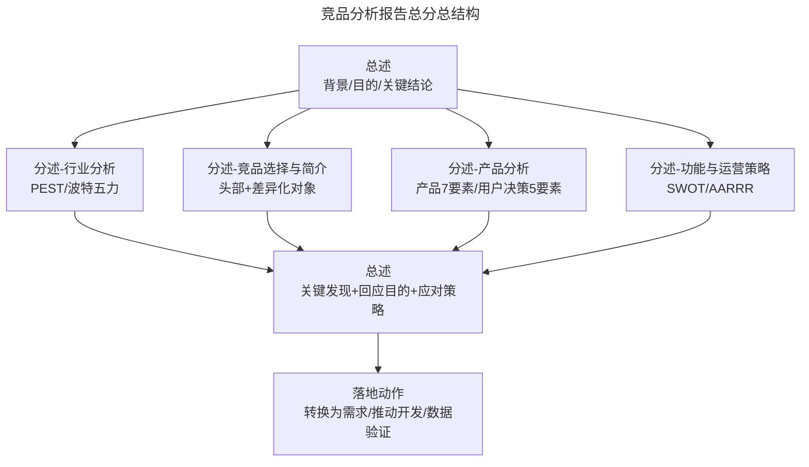
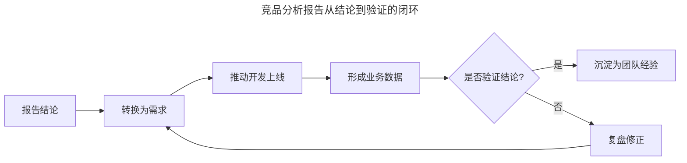

# 怎样输出一份营养丰富的竞品分析报告？

> **适用范围**：产品经理、运营人员、战略分析师、新人入职熟悉业务场景；适用于需要向决策者、团队成员或合作方交付竞品分析结论的所有汇报场景。

> **更新摘要（v2 · 2026-08 更新）**：在保留"总分总"结构与 PPT/Word 选型逻辑基础上，新增 2025 年 AI 辅助撰写流程（Perplexity、Already.dev、Notion AI）；以 Mermaid 图与表格替代失效图片；补充现代报告模板（Confluence、飞书文档、Notion）与"结论先行（BLUF）"原则；更新网络货运案例数据。

## 一、导言

竞品分析报告（Competitive Analysis Report）是整个竞品分析工作的价值兑现点——分析做得再扎实，若不能在报告中被决策者理解和采纳，工作价值就会被严重低估。常见的三类问题包括：**信息堆砌**（洋洋洒洒几千字没有营养）、**有数据无结论**（图表一堆却不知所云）、**有结论无可操作性**（"加大投入提高体验"之类的空话）。本文从目标管理、结构设计、案例拆解、工具协同四个层面，系统化输出"营养丰富"的竞品分析报告方法。**核心原则：报告不是为了写而写，竞品分析应该是一个学习、模仿、超越的过程，最后目标都是为了超过竞品**。

## 二、核心方法论

报告的本质是基于特定场景、面向特定对象、解决特定问题的能力体现——这就是"产品思维"在报告撰写中的应用。下表把这三个问题映射为可执行的设计决策：

| 维度 | 关键问题 | 设计决策 |
|------|---------|---------|
| 场景 | 在什么场景下阅读？ | 会议分享→PPT；邮件/异步阅读→Word/Notion；实时协作→飞书/Confluence |
| 对象 | 面向谁？ | 老板→结论先行；同事→过程透明；外部合作方→脱敏 |
| 问题 | 解决什么问题？ | 策略决策→建议要可操作；行业认知→背景要详实；功能借鉴→维度要清晰 |

报告采用"总分总"结构（与小学作文的总分总同名但内涵不同）。三个"总"分别承担不同职能：第一个"总"是开篇即呈现关键结论，便于决策者快速判断是否需要继续阅读；"分"是分析步骤与维度的展开；最后一个"总"回应分析目的、给出优化建议与应对策略。

## 三、关键流程

### 3.1 明确目标与汇报对象

撰写前必须先回答三个问题：**什么场景下阅读**（电脑前、手机前、会议分享、邮件发送）、**面向的汇报对象是谁**（老板、同事、合作方）、**解决什么问题**（决策、认知、借鉴）。建议在动笔前把"分析目标和维度"先发给汇报对象确认，避免本末倒置。汇报对象关注的点必须明确标记——例如老板关注结论时，应在报告最前面写出关键结论。

### 3.2 设计"总分总"结构

图中分述部分可灵活组合，但每一段都必须有该环节的结论——这是"营养丰富"的核心标志。"体验环境"（机型、系统版本、产品版本、网络环境、体验时间）应在分述开始前交代清楚。

### 3.3 撰写关键结论（BLUF 原则）

2025 年后主流报告采用 BLUF（Bottom Line Up Front，结论先行）原则：在报告最前面用 5-7 条要点呈现关键结论。每条要点应包括：**结论陈述**（一句话）、**支撑数据**（量化指标）、**对应建议**（可操作动作）。例如："多多买菜 2025 年市场份额升至 62%（数据），社区团购 CR3 集中度超 90%（数据），建议本季度暂停下沉扩张，聚焦核心城市单元经济模型优化（建议）"。

### 3.4 分述维度的选择

分述主体应对应到产品 7 要素或用户决策 5 要素，可根据目的选取 3 个左右维度深入展开。如目的是"为产品提供灵感"，可选功能、营销策略、盈利模式三个维度，分析方法用 SWOT 或 AARRR。**避免 12 个要素平均用力**——这会稀释报告的针对性。

## 四、工具与实战

### 4.1 报告撰写工具栈

| 工具类型 | 代表产品 | 适用场景 |
|---------|---------|---------|
| 协作文档 | 飞书文档、Notion、Confluence | 多人协作、版本管理、评论批注 |
| 演示文稿 | PPT、Keynote、Google Slides、Gamma | 会议分享、领导汇报 |
| 思维导图 | XMind、MindNode、Whimsical | 结构梳理、目录设计 |
| AI 撰写助手 | Perplexity、Already.dev、Notion AI | 资料检索、初稿生成、数据校验 |
| 数据可视化 | Tableau、Power BI、FineBI | 行业数据、趋势图、对比表 |
| 设计素材 | Figma、Canva、墨刀 | 流程图、原型对比 |

### 4.2 案例：网络货运城际大宗货物方向

针对"网络货运大宗城际方向"的竞品分析报告，目标是为自家产品进入该行业提供指导，形式为团队分享 PPT。竞品选择行业头部（运满满、福佑卡车）与差异化明显的产品，二者均已向美国证监会提交 IPO 招股书。

报告目录结构示意：

| 章节 | 内容要点 | 关键结论示例 |
|------|---------|-------------|
| 调研背景 | 行业政策、市场机会 | 2025 年公路货运市场规模 6.2 万亿 |
| 调研目的 | 为产品进入该行业提供指导 | 明确切入点与差异化路径 |
| 行业分析 | PEST 经济环境 E | 网络零售/公路货运/快递三块规模 |
| 市场分析 | 区域分布、用户画像 | 司机群体年龄 36-45 岁占 48.7% |
| 竞品分析 | 融资/定位/版本/功能 | 运满满融资额远超对手、野心更足 |
| SWOT 分析 | 行业信息+两家产品特点 | SO/ST/WO/WT 四类策略 |
| 总论 | 7 点关键发现 | 切入点→具体措施探讨 |

### 4.3 招聘信息作为侧面情报

报告撰写过程中，可通过竞品招聘信息反推其内部产品部门分工与下一步计划。例如招聘"企业方向产品经理"意味着该产品可能向企业市场拓展。这是低成本高价值的情报源，建议在报告中单列"竞品动向推测"小节。

## 五、常见误区

### 5.1 目标不明确导致信息堆砌

"按部就班走完 6 个步骤就结束"是新人最易犯的错误。报告呈现"为了写而写"，寡淡无味。规避方法：每写一段都反问"这段服务于什么决策？"

### 5.2 分析夹带私货

信息不完全时可通过费米问题推测，但推测必须有理有据、有数据支撑，不可主观判断。"肚子叫"是事实，"饿了"是解释，"吃东西"是行动——若把肚子叫解释为拉肚子，行动就变成上厕所。每条结论都要可追溯到事实数据。

### 5.3 竞品选择单一

除非业务竞品少或指定竞品（如百事可乐 vs 可口可乐），否则应尽量选择更多竞品以丰富信息交叉。建议选行业头部 + 差异化明显的产品，覆盖直接竞争者、潜在竞争者、替代品三类。

### 5.4 建议不可操作

"加大投入提高用户体验"是空话。可操作的建议应说明：在什么方面、投入什么、投入多少、通过什么手段。**能预测对手下一步动作就更好**，这能为业务应对竞争提供前瞻参考。

### 5.5 PPT 信息过载

PPT 形式下，把大段文字塞入页面会导致演讲效果差。建议把详细描述放在备注里，页面只保留结论与图表，并用粗体/标红/灰色小字标记数据来源。

## 六、进阶延展

### 6.1 AI 辅助撰写流程

2025 年后，AI 已成为报告撰写的标配助手。推荐流程：用 Perplexity 或 Already.dev 检索行业数据与竞品情报（4 分钟出初稿）→用 ChatGPT/Claude 整理结构与生成 SWOT/AARRR 初稿→人工判断与补充非公开信息→在飞书/Notion 协作定稿→在 Gamma 或 PPT 中可视化呈现。**注意：AI 输出必须人工校验**，特别是数字与时间敏感信息。

### 6.2 模板沉淀与复用

团队应沉淀标准模板库（如"行业进入决策报告模板"、"功能借鉴报告模板"、"运营策略对比报告模板"），新人入职即可基于模板快速产出第一份报告。模板应包含：必填章节、结论先行结构、数据来源标注规范、可操作建议检查清单。

### 6.3 从报告到行动的闭环

报告完成后必须形成闭环：**结论转换为需求 → 推动开发 → 形成业务数据 → 验证分析结论**。没有这一闭环，报告就只是文档而非业务输入。建议在报告末尾加"下一步行动项"清单，明确责任人、时间节点、验证指标。

闭环的关键不是"写完报告就结束"，而是把验证结果回流到下一次竞品分析，形成持续迭代的能力。**只有当结论被业务数据验证或证伪后，这次竞品分析才真正完成价值兑现**。

### 6.4 知识锦囊：什么是网络货运？

网络货运（Internet Freight）指依托互联网平台整合货源、车源、运力，实现车货匹配、运输全程数字化的货运模式。2019 年《网络平台道路货物运输经营管理暂行办法》出台后，行业进入合规化阶段。2025 年该行业市场规模约 6.2 万亿元。代表企业包括满帮（运满满+货车帮）、福佑卡车、货拉拉等。其核心痛点是司机空载率高（72.7% 无固定线路）、返程货源信息闭塞，竞品分析的关键维度是"信息撮合效率"与"履约成本"。

### 6.5 报告评审检查清单

为保证报告质量，建议在交付前对照以下检查清单逐项核查：

| 检查项 | 通过标准 |
|--------|---------|
| 目标明确 | 报告开头说明分析目的与决策问题 |
| 结论先行 | 前 5-7 条要点呈现关键结论 |
| 数据来源 | 每条数据有出处标注（行业报告/官方数据/平台数据） |
| 维度清晰 | 分述对应产品 7 要素或用户决策 5 要素中的 3 个左右 |
| 体验环境 | 机型、系统版本、产品版本、网络环境、体验时间已交代 |
| 竞品选择 | 覆盖头部 + 差异化对象，至少 2-3 个竞品 |
| 建议可操作 | 在什么方面、投入什么、多少、什么手段均已说明 |
| 时间节奏 | 短-中-长期行动项已列出 |
| 风险预判 | 对手下一步动作与行业趋势已预测 |
| 闭环机制 | 末尾"下一步行动项"清单含责任人与验证指标 |

### 6.6 不同交付形式的优化技巧

**PPT 形式**：每页聚焦一个观点，备注里放详细描述；用粗体/标红/灰色小字标记数据来源；图表优于文字；角落用灰色小字标数据来源；准备充分演讲稿。会议分享后留时间讨论，讨论结论可形成新的行动项。

**Word/Notion 形式**：可详细描述；保留目录便于查阅；图表与表格穿插使用；每个分述章节末尾必须有该环节结论；适合异步阅读与归档。

**飞书/Confluence 协作形式**：支持多人评论与版本管理；适合团队持续更新的活文档；建议设置定期 review 节奏（如月度更新）。

### 6.7 报告价值的最终检验

报告价值的最终检验标准是：**它是否被决策者采纳并转化为业务行动**。若无任何后续动作（功能上线、策略调整、资源重新分配），说明报告未能击中关键问题。建议在报告交付后 2 周做一次回访：决策者是否引用过报告结论？是否推动了具体行动？若答案是否定的，需复盘报告的目标对齐、结论表述或建议可操作性是否存在问题，作为下一次报告的改进输入。

### 6.8 报告写作的语言风格

竞品分析报告应保持专业、客观、可读的语言风格。建议遵循以下原则：

- **结论先行**：每段开头一句话陈述结论，后接数据支撑。
- **避免口语化**：用"建议"而非"我觉得应该"，用"数据显示"而非"看起来"。
- **量化优先**：能用数字说明的就不描述。如"用户体验差"改为"次日留存仅 18%，低于行业均值 25%"。
- **避免绝对化**：慎用"必然""一定""绝对"，留有余地。
- **数据来源标注**：每条数据后括注来源（艾媒咨询 2025、Sensor Tower 估算、内部数据）。
- **图表优于文字**：能用图表说明的就不长篇大论。

### 6.9 多竞品对比报告的特殊处理

若分析多个竞品，建议采用"矩阵对比 + 单点深挖"结构：

- **矩阵对比**：把所有竞品的关键维度（定位、用户、功能、商业模式、运营策略）做成一张大矩阵表。
- **单点深挖**：选择 1-2 个最值得借鉴或最威胁的竞品，做单独深度章节。
- **交叉结论**：从多竞品对比中提炼共性（行业基础能力）与差异（创新机会点）。

这种结构既覆盖广度又突出深度，避免在多竞品场景下平均用力导致报告失焦。在多竞品对比场景下，建议每个竞品设置统一的对比字段（成立时间、融资轮次、用户规模、核心功能、定价模式），确保横向对比的一致性。
