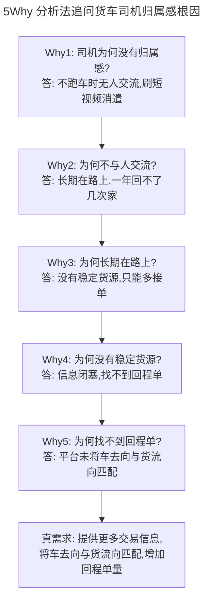
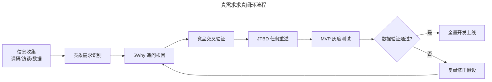

# 如何在竞品分析的过程中发现真需求？

> **适用范围**：产品经理、运营人员、用研同学在竞品分析过程中识别真需求、规避伪需求的场景；适用于功能规划、需求评审、用户调研结论验证等环节。

> **更新摘要（v2 · 2026-08 更新）**：在保留 5Why 分析法与货车司机归属感经典案例基础上，新增 2025 年主流的真需求验证方法——JTBD（Jobs-to-be-Done）、MVP 灰度测试、A/B 测试、Kano 模型；以 Mermaid 图与表格替代失效图片；补充伪需求识别清单与现代用户调研工具栈。

## 一、导言

在信息收集环节，竞品分析会挖掘出大量"看似需求"的反馈。但用户说的不一定全对，竞品做的也不一定都该跟进。**真需求（True Need）**指能够满足用户根本诉求、与产品定位契合、且具备规模化价值的需求；**伪需求（Fake Need）**则停留于表象陈述，无法支撑可持续业务。区分二者的能力是产品经理的基本功，本文从用户画像、5Why 追问、竞品交叉验证、现代验证方法四个角度系统化输出"求真"流程。**核心原则：需求评审前必须经历发现→求真→调研→再求真的完整循环**。

## 二、核心方法论

### 2.1 马斯洛需求层次与用户画像对照

马斯洛需求层次（Maslow's Hierarchy of Needs）将人类需求从底到顶分为生理、安全、社交、尊重、自我实现五层。竞品分析中，需求识别的关键是判断"用户当前所处的需求层级"——若用户停留在生存层（如货车司机的赚钱需求），就应优先解决生存问题，而非用上层需求（如归属感）做产品切入点。

### 2.2 5Why 分析法

5Why 分析法（Five Whys）由丰田公司创始人丰田佐吉提出，通过连续追问"为什么"层层下钻，找到问题的根本原因。其精髓不在"5 次"这个数字，而在于"打破表象解释、抵达可改变的根本层"。

### 2.3 JTBD 框架

JTBD（Jobs-to-be-Done）由克莱顿·克里斯滕森推广，核心是"用户雇佣产品来完成某个任务"。它把需求从"功能表述"转换为"任务表述"，避免被功能表象误导。

### 2.4 三类验证工具

| 工具 | 适用阶段 | 产出 |
|------|---------|------|
| MVP 灰度测试（Minimum Viable Product） | 开发前/小范围上线 | 真实用户行为数据 |
| A/B 测试 | 上线后优化 | 量化对比效果 |
| Kano 模型 | 需求分类 | 必备/期望/魅力/无差异/反向五类 |

## 三、关键流程

### 3.1 经典案例：货车司机的归属感

在网络货运的 1 对 1 调研中，多位司机反馈："不跑车时躺在车里刷手机，几乎不与人交流。" 调研者据此推断"司机缺乏归属感"，得出结论"应在平台开发交友社区"。

但社区上线后用户寥寥。复盘发现：**用户说的"没有归属感"是真陈述，但解释为"需要交友社区"是伪需求**。

根据《2021 年货车司机从业状况调查报告》及 2025 年行业跟踪数据，司机画像呈现以下特征：

| 维度 | 数据 | 启示 |
|------|------|------|
| 年龄 | 36-45 岁占 48.7%，46 岁以上占 25.8% | 年龄偏大，对交友社区接受度低 |
| 收入 | 不稳定，依赖返程货源 | 优先解决生存层需求 |
| 线路 | 72.7% 无固定运输线路 | 痛点是回程货源信息闭塞 |
| 行为 | 25.9% 从互联网平台获取加油/维修优惠 | 已习惯平台型工具 |

司机使用网络货运平台的真正目的是解决货单信息来源——这是马斯洛需求最底层（生存层）。交友社区对应社交/归属层（第三层），但底层未满足时直接做上层需求，必然南辕北辙。

### 3.2 5Why 追问示例

对"司机没有归属感"做 5Why 追问：

5Why 追问的关键技巧：**不要生硬地连续问"为什么"**，而要融入场景化提问。如本应问"为什么有时间刷短视频"，实际调研时改问"刷这么久短视频会不会影响接单"。最后一个 Why 往往是自问自答（不直接问司机），用于定位"自己能改变的层级"。**追问停止条件：到达可改变的层级**——若根因是"经济大环境行情"，企业改变不了，就不算可改变；若是"信息撮合效率"，平台可以改进，就是可改变的真需求。

### 3.3 竞品交叉验证

发现真需求后，下一步看竞品如何处理。网络货运市值最大的两个软件——运满满与货拉拉——均未做娱乐短视频或交友社区。运满满的"互助"栏目从名称就能看出运营调性，且发帖活跃度不高，本质是地图导航信息不及时时的补充功能；货拉拉干脆未做社区。

**竞品交叉验证的三步法**：

1. **竞品是否做了**：若头部竞品都没做，需警惕"伪需求"。
2. **竞品为何这么做**：理解其运营调性与场景定位。
3. **竞品做得如何**：从日活、评论数、功能迭代频率判断效果。

## 四、工具与实战

### 4.1 用户调研工具栈

| 工具类型 | 代表产品 | 适用场景 |
|---------|---------|---------|
| 用户访谈 | UserTesting、Maze、腾讯问卷 | 1 对 1 深访、问卷量化 |
| 行为分析 | 神策、GrowingIO、Mixpanel | 用户路径、漏斗分析 |
| 评论挖掘 | AppFollow、七麦数据、Sensor Tower | App Store/应用商店评论情感分析 |
| AI 摘要 | ChatGPT、Claude、Perplexity | 大量访谈记录摘要归类 |
| 原型测试 | Figma、墨刀、Framer | MVP 灰度测试 |

### 4.2 JTBD 框架在竞品分析中的应用

JTBD 把"用户故事"升级为"用户任务"。例如对货车司机：

- 表面需求："我想在车上有个交友社区"
- JTBD 表述："当我在外跑车孤独时，我希望能感受到与家人的连接，以便缓解孤独感"
- 任务候选方案：交友社区 / 视频通话家人 / 司机互助语音频道 / 给家人发定位

JTBD 帮助识别出"交友社区"只是众多候选方案之一，且并非最优——视频通话家人或司机互助语音频道更贴近"感受与家人连接"的任务本质。

### 4.3 MVP 灰度验证

发现真需求后不直接全量开发，应做 MVP（Minimum Viable Product，最小可行产品）灰度测试：

- 选择小范围用户（如 5% 流量）做最小功能验证
- 设置核心验证指标（如回程单匹配率提升 10%）
- 设置对照期与实验期（通常各 2 周）
- 根据数据决定是否全量上线

网络货运案例的真需求验证可设计为：在某个城市试点"返程货源智能匹配"功能，跟踪该城市司机回程单量与收入变化，验证"归属感问题本质是赚钱问题"的假设。

## 五、常见误区

### 5.1 把用户陈述直接当作需求

"用户说要交友社区"是陈述，不是需求。需求是陈述背后的根本诉求。每次听到用户陈述，先问"他真正想解决什么？"

### 5.2 5Why 变成"机械追问"

5Why 不是简单连续问"为什么"。需要融入场景、调整话术，避免让用户感到被审问。最后一个 Why 常是自问自答，用于定位根因。

### 5.3 用头部竞品"做了"反推需求必然真

竞品做了不代表需求真——可能竞品也在试错。需结合"做了多久""运营效果""迭代频率"综合判断。运满满的"互助"栏目活跃度低，反而提示该需求并不强。

### 5.4 真需求不一定契合自己产品

挖掘出的真需求若与自己产品定位不符，仍不应做。如货车司机的"归属感"是真需求，但应交给抖音、微信解决，而非网络货运平台。**需求契合度判断**：是否在自己产品 7 要素的能力范围内？是否能形成业务闭环？是否与商业模式协同？

### 5.5 跳过验证直接全量开发

缺乏 MVP 灰度验证的需求开发风险极高。即使 5Why 推理到位，现实用户行为仍可能偏离预期。建议任何新功能都至少做 5% 流量的灰度测试。

## 六、进阶延展

### 6.1 Kano 模型分类需求

Kano 模型（Kano Model）由东京理科大学教授狩野纪昭提出，将需求分为五类：

- **必备需求（Must-be）**：不满足则用户极度不满，满足后无惊喜（如 App 不闪退）。
- **期望需求（One-dimensional）**：满足程度与用户满意度成正比（如配送速度）。
- **魅力需求（Attractive）**：不满足无影响，满足后超预期（如隐藏彩蛋）。
- **无差异需求（Indifferent）**：满足与否用户都无所谓。
- **反向需求（Reverse）**：满足反而引起不满（如过度推送）。

竞品分析时可用 Kano 模型对竞品功能做分类，识别哪些是必备（必须跟进）、哪些是魅力（差异化机会）、哪些是无差异（避免投入）。

### 6.2 AI 辅助的需求挖掘

2025 年后，AI 工具能辅助需求挖掘的两个环节：**访谈记录摘要**（ChatGPT/Claude 把大量访谈录音转文字并归类）与**竞品评论情感分析**（AppFollow/Sensor Tower 自动分析应用商店评论的情感倾向与高频关键词）。但"根因判断"与"产品契合度判断"仍需人工完成。

### 6.3 需求求真流程图

完整的需求求真流程应包括：信息收集 → 表象需求识别 → 5Why 追问根因 → 竞品交叉验证 → JTBD 任务重述 → MVP 灰度测试 → 全量决策。这是一个"发现→求真→调研→再求真"的循环，避免在需求评审会上无谓互怼。

流程的关键不是"线性走完"，而是每个节点都可回溯——若 MVP 灰度测试未通过，应回到 5Why 追问重新审视根因，而非简单调整功能形态。**真正的需求求真往往需要 2-3 轮迭代**，而非一次到位。

### 6.4 知识锦囊：什么是五眼观？

五眼观源自佛教认识论，指五种认知能力：**肉眼**（凡夫所见表象）、**天眼**（超越空间限制的观察）、**慧眼**（洞察本质的智慧）、**法眼**（菩萨度化的智慧）、**佛眼**（圆满无碍的全知）。在需求分析的隐喻中，肉眼看到用户陈述，慧眼看到需求本质，法眼能识别需求的可行性。这是东方哲学对"层层下钻"的认知论参照，与 5Why 的层层追问逻辑相通。

### 6.5 真需求验证的量化指标

真需求不能仅靠推理，还需用数据验证。建议为每个候选需求设置量化验证指标：

| 需求类型 | 验证指标 | 通过标准 |
|---------|---------|---------|
| 生存层（如货车司机赚钱） | 回程单匹配率、月均收入提升 | 匹配率提升 15%+，收入提升 10%+ |
| 安全层（如数据备份） | 故障恢复率、备份完成率 | 恢复率 ≥ 99%，备份率 100% |
| 社交层（如社区互动） | 帖子发布率、互动率、留存 | 日活发布率 ≥ 5%，留存提升 8%+ |
| 尊重层（如会员等级） | 会员转化率、续费率 | 转化率 ≥ 3%，续费率 ≥ 60% |
| 自我实现层（如创作工具） | 创作完成率、分享率 | 完成率 ≥ 20%，分享率 ≥ 5% |

通过量化指标可避免"主观感觉用户喜欢"的判断陷阱。**指标设置原则**：可观测、可对比、有时间窗、有阈值。

### 6.6 需求池的优先级排序

发现多个真需求后，如何排序？推荐 RICE 评分法（Reach-Impact-Confidence-Effort）：

- **Reach 触达**：该需求影响多少用户（如 10000 人/月）
- **Impact 影响**：对单用户的价值（3=高，2=中，1=低，0.5=极低）
- **Confidence 信心**：基于数据的信心（100%=有数据，80%=定性调研，50%=猜测）
- **Effort 投入**：人力月数

RICE 得分 = (Reach × Impact × Confidence) / Effort，得分越高优先级越高。这把"哪个需求先做"从拍脑袋决策转换为可计算的优先级。

### 6.7 避免需求膨胀的纪律

竞品分析过程中容易陷入"需求越来越多"的陷阱。建议设置需求纪律：

- **每轮分析只输出 3-5 个候选需求**，超出的留入需求池待评估
- **每个需求必须通过 5Why + 竞品交叉验证**才进入开发评估
- **每季度做一次需求池清理**，过期的需求直接淘汰
- **建立"反向需求清单"**：明确"我们不做哪些功能"，避免被竞品牵着走
