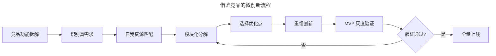
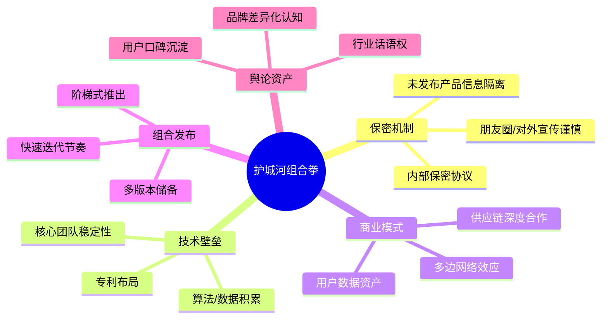

# 竞品分析过后就是抄吗？

> **适用范围**：产品经理、运营人员、创业者面临"是否借鉴竞品功能"决策时的判断框架；适用于功能规划、产品迭代、知识产权合规等场景。

> **更新摘要（v2 · 2026-08 更新）**：在保留"抄背后的真需求"核心论点基础上，新增 2025 年微创新方法论（差异化拆解-重组）、避风港原则的现代适用边界、AI 时代的"借鉴"新形态；以 Mermaid 图与表格替代失效图片；补充被抄袭的护城河构建策略。

## 一、导言

"抄"在互联网行业是个无法回避的话题，但简单一棒子打死或直接 Copy 都是错的。从乔布斯看到施乐图形界面推出 Macintosh，到中国互联网早期的 C2C（Copy to China，复制到中国），再到近年来 Facebook 抄袭 Snapchat Story、海外电商借鉴淘宝直播带货，"抄"是行业普遍现象。**核心原则：不能用道德与否简单判断，而要弄清楚抄背后的原理——抄的是真需求与产品逻辑，而非表面交互**。本文系统化输出"如何抄、抄什么、被抄怎么办"的判断框架。

## 二、核心方法论

### 2.1 抄的判断标准

判断"该不该抄"的三个标准：

- **是否真需求**：抄之前必须验证对方功能背后满足的是真需求（参见"发现真需求"一讲）。被功能本身蒙蔽是新手最大错误。
- **是否用户认可**：通过版本迭代情况判断——若竞品某功能长期未变化且评论正面，说明已被用户接受。
- **是否行业领先**：借鉴国民级应用（微信、淘宝、抖音）的交互与运营方式有参考价值，而小众产品的功能形态风险高。

### 2.2 抄的三种形态

| 形态 | 描述 | 风险 |
|------|------|------|
| 表面抄（Copy） | 直接复制功能形态、UI | 画虎不成反类犬，法律风险 |
| 逻辑抄（Learn） | 借鉴产品逻辑与运营思路 | 中等，需匹配自身定位 |
| 真需求抄（Steal） | 抄背后的真需求与解决方案 | 低，能形成差异化 |

乔布斯的经典名言"good artists copy, great artists steal（好的艺术家抄创意，伟大的艺术家盗灵感）"对应的正是第三种形态。

### 2.3 抄的好处与风险

**好处**：降低犯错成本、拓宽产品服务范围、可能获得商业收益。  
**风险**：被牵着鼻子走、与自身产品定位不契合、可能侵犯知识产权。

## 三、关键流程

### 3.1 选准抄的对象

选择赛道与对象时应优先考虑：国家政策提倡的方向（如新基建、数字化转型）、资本看好的领域、市场占有率排前的产品。避免在夕阳行业或政策限制领域抄。

### 3.2 清楚自己的能力

利出一孔，而非对手有什么就抄什么。在动手前应梳理自身核心资源：流量、供应链、技术能力、资金、团队。**核心资源匹配度**是判断"该不该抄"的关键指标。

### 3.3 挖掘背后的真需求

把资源投入到核心真需求的满足上，而非表面功能形态。这一步可结合 5Why 分析法与 JTBD 框架，识别竞品功能背后真正解决的任务。

### 3.4 快速验证结果

从产品 7 要素和用户决策 5 要素验证抄的真需求满足的是哪个要素，然后快速开发小范围灰度测试。MVP（Minimum Viable Product，最小可行产品）原则在"抄"的过程中尤为重要。

### 3.5 微创新：找到自己的方式

把整个产品、服务、流程拆分成一个个模块和流程，再选择一个部分进行重组优化。例如：

- 优化底层调用逻辑，比竞品反应速度更快
- 同样做袜子，但分为 7 种颜色，每天一双
- 同样是社交产品，但聚焦特定场景（如陌陌聚焦陌生人社交）

微创新流程的关键在于"分解-选择-重组"三步——不是全盘照搬，而是把竞品功能拆解到模块层，选择一个或几个模块做优化，再重组为差异化产品。

### 3.6 弯路超车

通过以上五步的循环迭代，最终实现弯路超车。注意"弯路超车"不是一次性事件，而是持续能力。

## 四、工具与实战

### 4.1 失败案例：匿名社交产品

2015 年一款匿名社交产品借鉴了美国匿名社交软件形态，把对方"文字匿名"换成了"图片匿名"，但最终失败。失败原因：

- **需求层面**：匿名社交不具备满足大多数人刚性需求的属性，用户使用时长低，需求发生率与急迫性不强，注定是小众产品。
- **运营层面**：无法正确引导用户内容，平台多出现周边人出丑画面甚至涉黄内容，激发用户阴暗面，带来法律风险，最终下架。

**结论：只有真正能满足大多数人正向的真需求的产品，才具备抄的价值**。

### 4.2 成功案例：抖音 vs Musical.ly

字节跳动借鉴 Musical.ly 的短视频形态，但通过算法推荐（核心能力匹配）、本土化运营（资源整合）、持续迭代（MVP 验证），最终以抖音品牌全球化扩张。这是"真需求抄+微创新"的典型案例。

### 4.3 借鉴工具栈

| 工具 | 用途 |
|------|------|
| AppFollow / 七麦数据 | 监控竞品版本迭代频率与评论情感 |
| Sensor Tower | 跟踪竞品下载量与收入估算 |
| Crayon / Klue | 实时监控竞品官网更新、定价变化 |
| Figma / 墨刀 | 拆解竞品 UI 与交互流程 |
| ChatGPT / Claude | 拆解竞品功能背后的需求逻辑 |

## 五、常见误区

### 5.1 直接 Copy 表面形态

最常见错误是看到对方某个功能好就直接复制 UI 与交互。正确做法是先问"这个功能解决了什么真需求？"，再判断是否与自身产品契合。

### 5.2 抄与创新对立

"抄"与"创新"不是对立关系。乔布斯、比尔·盖茨都公开承认借鉴了施乐的图形界面，但他们通过差异化重组创造了 Macintosh 与 Windows。**抄是创新的第一步，关键是后续的微创新与重组**。

### 5.3 忽视产品契合度

挖掘出的真需求若与自身产品定位不符，仍不应做。如 ClubHouse 在 2021 年初因马斯克直播爆火，国内推出大量语音社交产品，但几个月后销声匿迹——本质是该形态不满足大多数人刚性需求。

### 5.4 被抄后只打舆论战

被抄后维权成本极高，但仅靠舆论战往往无效（如 Snapchat 指责 Facebook 抄袭 Story 后股价仍一路走低）。应结合技术壁垒、商业模式、运营数据构建组合拳护城河。

### 5.5 忽视法律风险

直接复制 UI、代码、文案可能侵犯著作权与不正当竞争法。建议借鉴前咨询法务，避开"实质性相似"的判定标准。

## 六、进阶延展

### 6.1 避风港原则的现代适用

避风港原则（Safe Harbor Principle）源自美国《数字千年版权法》（DMCA），指网络服务提供者在收到权利人通知后及时删除侵权内容，可免除赔偿责任。**适用边界**：仅适用于"不知情且及时处理"的场景，不适用于"应知"的主动推荐场景。

2025 年后，AI 生成内容的版权归属成为新议题——AI 训练数据是否侵犯原作者版权？目前各国判例不一，建议借鉴 AI 生成内容时保留来源标注，避免后续法律风险。

### 6.2 护城河构建组合拳

被抄后的应对不是单点防御，而是组合拳：

护城河组合拳的核心是"多维叠加"——单一维度的护城河（如仅靠 UI 创新）极易被复制，而"技术+数据+商业模式+用户认知"的多维组合才是可持续竞争力。**英特尔的实践**：2008 年参观时实验室已有 16 核 CPU，但市面刚流行双核——这种"已开发但未发布"的版本储备就是组合发布策略。

### 6.3 AI 时代的"借鉴"新形态

2025 年后，AI 工具能自动拆解竞品功能、生成对比网格、甚至输出"借鉴建议"。但 AI 输出的"借鉴方案"往往停留在表面功能层，对"产品契合度"与"差异化重组"的判断仍需人工。**新风险**：AI 生成内容可能无意中复制了竞品的版权元素（如 UI 布局、文案），建议在借鉴流程中加入"原创性审核"环节。

### 6.4 知识锦囊：什么是避风港原则？

避风港原则（Safe Harbor Principle）是互联网版权法中的核心制度，指网络服务提供者在只提供空间服务时，若接到权利人侵权通知后及时删除涉嫌侵权内容，即可免除赔偿责任。与之对应的是"红旗原则"——若侵权事实明显（如红旗般显眼），服务提供者不能装作不知情而免责。在中国，《信息网络传播权保护条例》第 23 条确立了类似规则。该原则在 UGC 平台、搜索引擎、视频网站等场景广泛适用。

### 6.5 微创新的六种典型手法

把竞品功能"分解-选择-重组"是微创新的核心。具体可落地六种典型手法：

| 手法 | 描述 | 案例 |
|------|------|------|
| 体验微调 | 同样功能，体验做得更好、更流畅 | 抖音比 Musical.ly 的加载速度更快 |
| 模式简化 | 同样服务，环节更少更便捷 | 拼多多砍掉了搜索环节，直接推荐 |
| 流程拆解 | 把整体流程拆分模块，只优化一段 | 美团把外卖拆为下单-配送-评价三段优化 |
| 颜色/视觉差异化 | 同样功能，视觉识别不同 | 拉勾网绿色主色调差异化 |
| 受众细分 | 同样功能，针对特定人群 | 小红书聚焦年轻女性内容种草 |
| 场景迁移 | 同样功能，迁移到新场景 | 共享单车迁移了共享模式的场景 |

微创新的关键不是"颠覆"，而是"在已有真需求上做差异化重组"——这往往是小公司能在巨头夹缝中生存的有效策略。

### 6.6 知识产权合规要点

借鉴竞品时需注意以下合规边界：

- **著作权**：UI 布局、文案、图片、代码均受著作权保护，避免"实质性相似"。建议借鉴前做差异化设计，保留独立设计稿作为创作证据。
- **专利权**：技术方案、交互逻辑可能申请了专利（如苹果的滑动解锁）。借鉴前建议做专利检索。
- **不正当竞争**：直接复制竞品包装、宣传语、商业标识可能构成不正当竞争。
- **软件著作权（软著）**：申请时间通常 1 个月以上，对一周内决出胜负的互联网竞争而言速度过慢，但仍是基础保护。
- **保密协议**：内部员工保密协议是防止泄露的关键，该签就要签。

### 6.7 借鉴的决策流程

完整的借鉴决策应包括五个环节，避免拍脑袋照搬：

1. **真需求验证**：确认竞品功能背后满足的是真需求（5Why + JTBD）
2. **契合度判断**：与自身产品定位、用户群、商业模式是否契合
3. **资源评估**：自身是否有能力做出差异化版本
4. **法律审查**：是否触及著作权、专利、不正当竞争红线
5. **MVP 验证**：小范围灰度测试，数据通过后再全量上线

### 6.8 被抄袭后的应对策略矩阵

被抄袭后，单一应对往往无效，应组合使用：

| 应对手段 | 见效快慢 | 适用场景 |
|---------|---------|---------|
| 舆论战 | 快但效果短暂 | 抄袭事实明显、用户同情度高 |
| 法律诉讼 | 慢，成本高 | 证据充分、金额可观 |
| 技术迭代 | 中等 | 技术壁垒型产品 |
| 商业模式护城河 | 慢但持久 | 网络效应、数据资产型 |
| 用户运营 | 中等 | 用户粘性高的产品 |
| 专利布局 | 长期 | 技术驱动型产品 |

最佳策略是"组合拳"——先用舆论战制止扩散，同时启动法律程序，最关键的是通过技术迭代与商业模式护城河建立长期优势。**被抄袭本身说明方向成功，关键是能否在对手跟进前筑起新的护城河**。

### 6.9 借鉴速度与质量的平衡

互联网竞争速度极快，"先抄再优化"与"想清楚再做"的平衡是关键。建议遵循以下节奏：

| 阶段 | 时间占比 | 关键动作 |
|------|---------|---------|
| 真需求验证 | 30% | 5Why + JTBD + 竞品交叉验证 |
| 契合度与资源评估 | 20% | 与团队对齐、资源盘点 |
| 法律审查 | 10% | 法务快速过审 |
| MVP 灰度开发 | 25% | 最小可行产品，2 周内上线 |
| 数据验证与迭代 | 15% | A/B 测试、数据驱动优化 |

避免"过度思考不行动"，也避免"未经思考直接 Copy"。**借鉴速度的优势只有在已有真需求判断基础上才能转化为竞争势能**。

### 6.10 抄袭与原创的辩证关系

在产品发展史上，纯粹原创与纯粹抄袭都是极端状态。绝大多数成功产品都处于"借鉴-微创新-原创"的连续光谱上：

- **早期借鉴**：降低试错成本，快速验证市场需求
- **中期微创新**：在借鉴基础上做差异化，建立初步护城河
- **成熟期原创**：基于用户数据与场景理解，推出行业首创功能

理解这一光谱有助于团队避免"为原创而原创"（陷入自嗨）与"为借鉴而借鉴"（永远跟随）的极端。**借鉴是手段，差异化是过程，原创是结果**——这是健康的竞争观。
