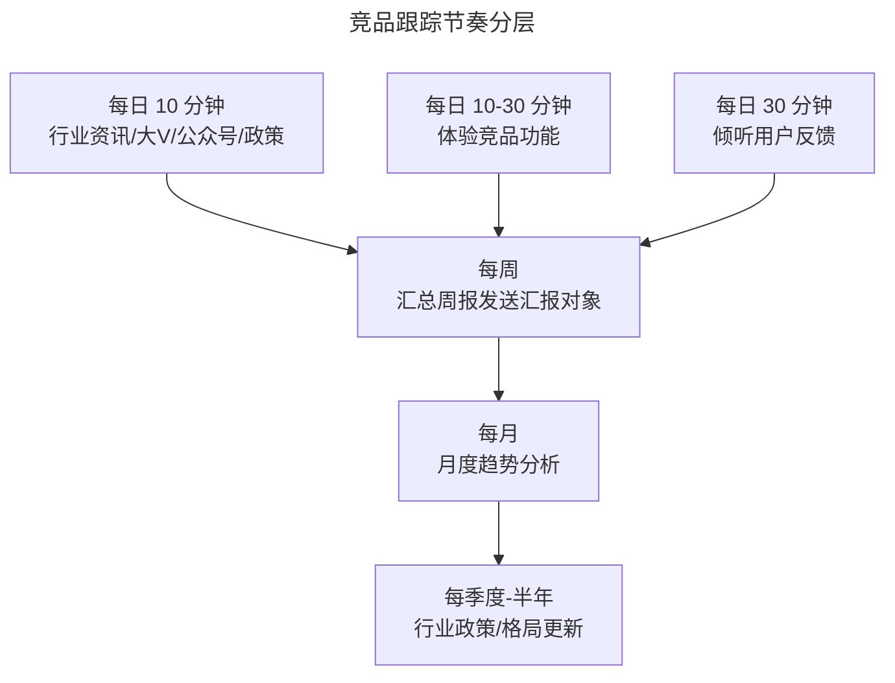
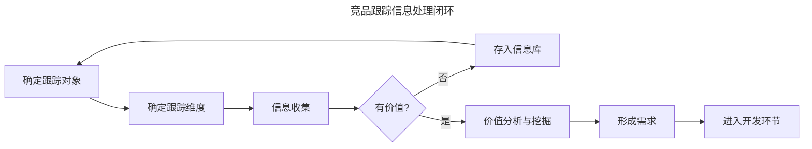

# 跟踪竞品怎么帮我们做竞品分析？

> **适用范围**：产品经理、运营人员、产品营销经理（PMM）的日常工作；适用于需要持续监控竞品动向、为团队提供竞争情报的场景。

> **更新摘要（v2 · 2026-08 更新）**：在保留竞品跟踪流程与价值判断框架基础上，新增 2025 年主流 CI（Competitive Intelligence，竞争情报）工具——Crayon、Klue、Valona、八爪鱼；以 Mermaid 图与表格替代失效图片；补充数据思维指标体系与不同业务阶段的跟踪节奏表。

## 一、导言

竞品分析报告是阶段性产出，而**竞品跟踪（Competitive Tracking）**是日常信息收集动作，目标是保持对市场的敏锐度。跟踪的目的有两个：**当需要创新时，随时参看跟踪信息获取灵感；当竞品有威胁动作时，及时告警**。在创新愈发困难的当下，一旦某创新点被市场验证，就会有大量跟进者（大到商业模式如社区团购、网络货运，小到 UE 设计如长按返回按钮），日常跟踪是抵御这类威胁的最有效手段。**核心原则：跟踪不是为单次报告服务，而是持续形成趋势与规律认知**。

## 二、核心方法论

### 2.1 跟踪对象的优先级

竞品分为三类：直接性竞争对手（威胁最大）、潜在性竞争对手（威胁中等）、替代性竞争对手（威胁较小）。三类都应作为跟踪对象，但优先级不同：

| 类型 | 跟踪频率 | 跟踪重点 |
|------|---------|---------|
| 直接竞争者 | 每日-每周 | 功能更新、定价变化、市场动作 |
| 潜在竞争者 | 每月 | 行业跨界动向、新进入者融资 |
| 替代竞争者 | 每季度 | 替代关系演化、用户场景迁移 |

### 2.2 跟踪维度

推荐参考产品 7 要素与用户决策 5 要素作为信息分类名目，形成 12 个跟踪维度：

| 类别 | 维度 |
|------|------|
| 产品视角 | 定位、功能、UI/UE、技术、运营、商业模式 |
| 用户决策 | 需求、对应人群、解决方案、价值感受、对比决策 |

### 2.3 不同汇报对象的关注点

不同岗位对竞品情报的诉求不同：

- **公司领导**：竞品战略与重大事件
- **产品经理**：新功能与需求点
- **运营**：市场活动与运营效果
- **业务/销售**：营销动作与定价策略
- **PR/品牌**：舆情与品牌动向

明确汇报对象后，应着重跟踪并反馈对方关心的内容。

## 三、关键流程

### 3.1 确定跟踪目的

跟踪前必须先回答：**为什么要跟踪？** 关注的是竞品对业务的威胁（市场份额、抢夺用户），还是竞品功能背后的需求？目的决定维度的取舍。

### 3.2 不同业务阶段的跟踪力度

| 业务阶段 | 跟踪力度 | 重点维度 |
|---------|---------|---------|
| 新产品期 | 全面跟踪（不亚于一份竞品分析报告） | 定位、营销、用户 |
| 成长期 | 中等跟踪 | 功能更新、增长策略 |
| 成熟稳定期 | 轻量跟踪 | 版本更新、营销活动 |
| 衰退期 | 重点跟踪 | 转型动向、退出策略 |

### 3.3 跟踪节奏

每日跟踪时间建议不超过 1 小时。行业性、政策性内容每 3-6 个月主动更新一次（如教育行业"双减"政策类重大事件需第一时间获取）。每周把跟踪信息发周报给汇报对象，每月做趋势分析，每季度做格局更新。

### 3.4 价值判断三准则

跟踪到的信息如何判断是否有价值？三个判断准则：

- **汇报对象关心的点**：与汇报对象对齐跟踪目标，遇到这些信息着重提炼。
- **具有方向性指导作用**：影响行业的政策文件、趋势性方向（如国家 1 号文件、新能源补贴、数字化转型战略、新基建）。
- **能够解决团队问题**：通过日常沟通、参与会议、看周报日报，发现信息能解决团队当前问题。

### 3.5 跟踪流程

跟踪流程的关键在于"价值判断"环节——大部分信息应进入信息库待用，只有少量高价值信息进入需求开发环节。判断标准不是"信息新"，而是"信息能解决什么问题"。

## 四、工具与实战

### 4.1 数据思维指标体系

竞品跟踪必须具备数据思维——所有指标应被量化。常见通用指标与行业特定指标：

| 类别 | 指标 |
|------|------|
| 通用 | 下载量、总用户数、DAU、MAU、次日/3日/7日留存、访问时长、Push 转化率、激活转化、活动参与率、地域分布、机型分布、渠道拉新 |
| 游戏 | 新手引导转化率、充值率、ARPU、LTV、区服活跃、英雄出场率、被 ban 率、钻石金币消耗、工会用户数 |
| 电商 | GMV、下单转化率、客单价、注册到购买漏斗、品类偏好、复购率、老拉新转化率 |
| 企业服务 | 活跃企业数、核心功能渗透率、功能留存率、功能使用次数、异常报错、单企业活跃、到期用户数、流失用户数、沉默用户数 |

### 4.2 数据对比方法论

竞品数据大多难以直接获取，但可从公开渠道（如七麦数据、Sensor Tower 估算下载量）获取。对比时需注意：

- **加上时间维度对比**：竞品新增用户数对应自己用户流失数，看竞争基础情况。
- **同比与环比**：做到心中有数。
- **数据变化归因**：跟踪期间数据变化较大时，需排查"竞品做了什么，我们做了什么"。

### 4.3 工具栈推荐

| 工具类型 | 代表产品 | 用途 |
|---------|---------|------|
| 移动应用情报 | Sensor Tower、AppFollow、七麦数据 | 下载量、版本、评论、ASO 关键词 |
| 网站流量情报 | Similarweb、Semrush | 流量来源、用户画像、竞品渠道 |
| 实时竞品监控 | Crayon、Klue、Valona | 官网更新、定价、招聘、SEC 文件 |
| 数据采集 | 八爪鱼、爬虫脚本 | 特定 SKU 价格、商品上架监控 |
| 协作沉淀 | 飞书文档、Notion、Confluence | 跟踪信息库、周报模板 |

### 4.4 跟踪后的动作

跟踪信息收集好后，应以邮件形式发送本周跟踪信息表给汇报对象，并在工作群通知。**附上本周重大发现**，引起大家关注。若发现能指导特定产品业务线，圈出相关负责人或私聊，说出发现与跟进办法。**别怕多管闲事，有价值的点应被落实——这是做竞品跟踪的工作意义**。

## 五、常见误区

### 5.1 跟踪无目的

跟踪前未与汇报对象对齐目标，导致跟踪维度发散。建议每次跟踪前明确"本次要回答什么问题"。

### 5.2 只看不做

跟踪到的信息仅停留在收集层，未进入价值分析与需求形成。**跟踪的最终落点是形成需求**，否则只是信息堆砌。

### 5.3 数据维度单一

只看下载量或 DAU 等单一指标，忽略横向对比与时间维度。建议每次对比至少包含：自己 vs 竞品、本周 vs 上周、本月 vs 去年同期。

### 5.4 忽视趋势沉淀

单周跟踪价值有限，关键是 1 个月、半年的跟踪后形成趋势与规律认知。建议每月做一次趋势分析，每季度做一次格局更新，从单点事件提炼规律。

### 5.5 工具依赖过重

工具能自动化数据采集，但"价值判断"与"业务关联分析"仍需人工。AI 工具的输出应作为输入，而非决策本身。

## 六、进阶延展

### 6.1 跟踪交接与团队沉淀

竞品跟踪不会一直由同一人负责，重要的是形成可交接的流程与工具。在团队中，从产品助理到产品经理的考核之一就是"竞品分析跟踪做得如何"。**坚持不懈地收集信息是基础要求，而在此之上能形成客观、理性的思维模式，并对业务产生帮助，才是竞品跟踪的最终要义**。建议沉淀：跟踪流程文档、工具配置清单、周报/月报模板、历史信息库。

### 6.2 AI 驱动的实时跟踪

2025 年后，Crayon、Klue、Valona 等平台能自动捕获竞品官网、定价、招聘、SEC 文件的实时变化，并通过 AI 摘要推送给团队。这把分析师从"信息收集"解放出来，转移到"价值判断"与"业务关联"环节。建议团队配置至少一个实时监控工具作为底层情报源。

### 6.3 Battlecard 制作

对于 B2B 销售场景，竞品跟踪的产出形式之一是 **Battlecard（竞争对战卡）**——一份面向销售团队的竞品应对手册，包括：竞品定位、优势、劣势、我方应对话术、客户常见问题。Klue、Crayon 等工具支持 Battlecard 自动生成与版本管理，并集成到 CRM 与 Slack。

### 6.4 知识锦囊：什么是同比与环比？

同比（Year-over-Year，YoY）指与去年同期对比，用于剔除季节性因素影响，反映长期趋势。如"2025 年 8 月销售额同比增长 15%"指对比 2024 年 8 月。环比（Month-over-Month，MoM）指与上一期对比，用于反映短期变化。如"8 月环比增长 5%"指对比 7 月。竞品跟踪时，同比看长期趋势，环比看短期波动，二者结合使用。在电商等强季节性行业，同比比环比更具参考价值。

### 6.5 跟踪信息库的沉淀模板

跟踪信息库建议采用以下字段结构，便于后续检索与归因：

| 字段 | 类型 | 示例 |
|------|------|------|
| 日期 | 日期 | 2025-08-12 |
| 竞品名称 | 文本 | 多多买菜 |
| 信息类型 | 枚举 | 功能/营销/人事/财务 |
| 信息摘要 | 文本 | 上线 AI 选品系统 |
| 来源 | 文本 | 官方公众号/36氪/小红书 |
| 链接 | URL | https://... |
| 影响评估 | 高/中/低 | 高 |
| 关联业务线 | 文本 | 社区团购事业部 |
| 建议动作 | 文本 | 跟进 AI 选品能力建设 |
| 责任人 | 文本 | 张三 |
| 状态 | 待评估/已采纳/已驳回 | 待评估 |

建议在飞书多维表格或 Notion 数据库中建立此结构，支持多维度筛选与图表统计。每月做一次信息库回顾，识别高频信号。

### 6.6 跟踪与战略的关系

竞品跟踪看似是战术层动作，但长期跟踪的累积能形成战略层认知。例如持续跟踪某竞品半年，可以发现其从"功能驱动"转向"运营驱动"的战略转型；持续跟踪行业政策一年，可以预判下一波合规化浪潮。**战术层跟踪 → 趋势层洞察 → 战略层预判**，这是从执行到决策的能力跃迁路径。

### 6.7 不同岗位的跟踪重点差异

| 岗位 | 跟踪重点 | 产出形式 |
|------|---------|---------|
| 产品经理 | 功能迭代、用户反馈 | 功能对比表、需求池 |
| 运营 | 营销活动、运营效果 | 活动复盘、策略建议 |
| 市场商务 | 渠道变化、合作伙伴 | 渠道地图、合作机会 |
| 销售PMM | 定价、销售话术、Battlecard | 销售对战卡 |
| 战略/投资 | 融资、并购、战略转型 | 行业格局图、投资备忘 |
| PR/品牌 | 舆情、品牌资产、危机事件 | 舆情周报、品牌资产表 |

每个岗位都应有自己的跟踪模板与节奏，避免"一人跟踪、众人索取"的瓶颈。团队层面建议设置"竞品情报负责人"角色，统筹跨岗位的跟踪协调与信息共享。

### 6.8 跟踪失效的预警信号

跟踪工作若出现以下信号，需立即调整：

- **连续 4 周无重大发现**：可能跟踪维度过于狭窄，需扩展监控范围
- **汇报对象不读周报**：报告形式或内容未击中决策者关注点，需重新对齐
- **团队对跟踪工作失去兴趣**：缺乏与业务联动的产出，需建立"跟踪→需求→业务影响"闭环
- **信息来源单一**：可能漏掉关键信号，需扩展信息源（如增加小红书、B 站等新型渠道）
- **数据指标长期无变化**：可能选错了指标，需重新设计指标体系

### 6.9 跟踪工作的 KPI 设计

竞品跟踪工作本身也应有可量化的 KPI，避免陷入"做了但不知道有没有价值"的状态。建议从三个维度设计跟踪 KPI：

| 维度 | KPI | 目标值 |
|------|-----|--------|
| 输入量 | 每周新增信息条数 | ≥ 10 条 |
| 处理量 | 价值评估完成率 | ≥ 80% |
| 输出量 | 转化为需求/行动的比例 | ≥ 15% |
| 影响量 | 被汇报对象引用次数 | ≥ 1 次/月 |
| 时效性 | 重大事件响应时间 | ≤ 24 小时 |

跟踪 KPI 的设计应与业务目标对齐——若业务处于稳定期，"输入量"可适当降低，"输出量"提高；若处于变革期，"时效性"权重最高。

### 6.10 长期跟踪的认知复利

竞品跟踪的最大价值不在单次报告，而在长期累积形成的"认知复利"。持续跟踪某行业 1 年、3 年、5 年的分析师，对行业规律的把握远超新入者。这种认知复利体现在：

- **模式识别能力**：能从相似事件中快速识别底层规律
- **预判能力**：能基于历史周期预判下一波趋势
- **决策速度**：能在新事件发生时快速做出反应
- **行业人脉**：长期跟踪建立的行业关系网络

**建议把跟踪工作视为长期投资，而非短期任务**。每一次跟踪的输入都为未来的判断能力添砖加瓦。
