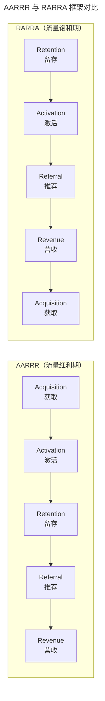
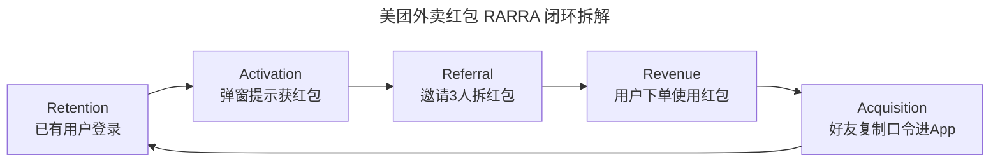

# 怎么用 AARRR 模型做运营策略的竞品分析？（v2：升级为 RARRA 框架）

> **适用范围**：运营同学、产品经理、增长岗位的日常工作；适用于需要分析竞品运营策略、制定自身增长方案的场景，特别适合运营驱动型产品。

> **更新摘要（v2 · 2026-08 更新）**：原 AARRR 模型已升级为 2020+ 主流的 RARRA 框架（Retention-Activation-Referral-Revenue-Acquisition，留存优先）；新增 2025 年私域流量、AI 投放、增长飞轮等新形态；以 Mermaid 图与表格替代失效图片；补充各阶段对应的数据指标体系与工具栈。

## 一、导言

运营岗位的工作高度动态，每天与市场、研发、用户打交道，没有固定的产品线集中管理。**运营的竞品分析需要一套可重复使用的思维模型作为底层支撑**，AARRR 模型（Acquisition-Activation-Retention-Referral-Revenue，海盗指标）正是这样的模型。它由 Dave McClure 于 2007 年在"Startup Metrics for Pirates"演讲中提出，因首字母发音类似海盗"Arrr!"而得名。但 2017 年后，Thomas Petit 与 Gabor Papp 提出了 **RARRA 框架**——把留存（Retention）放到首位，反映了流量红利消退后"以用户为中心"的范式转移。本文系统化输出 AARRR 与 RARRA 的对比、各阶段运营策略拆解与工具实战。**核心原则：岗位不同，但都从用户本身出发，关注五个阶段的运营思路，借此看出竞品的运营路径**。

## 二、核心方法论

### 2.1 运营的分类

运营分类并不固定，常见三类：

- **内容运营**：针对产品上的内容（文字、视频、软件），形成常规内容或活动专题。建议内容团队把全年节假日拉出来定出全年运营大纲，至少提前 1 个月策划。
- **商务/市场运营**：对内对外商务合作，整合渠道、分析优劣、追求性价比，并监测行业动态。
- **用户运营**：以用户需求为出发点，收集反馈、跟踪行为、追求用户价值最大化。

### 2.2 AARRR vs RARRA 的核心差异

| 维度 | AARRR（2007） | RARRA（2017+） |
|------|--------------|----------------|
| 顺序 | 获取→激活→留存→推荐→营收 | 留存→激活→推荐→营收→获取 |
| 起点 | 拉新 | 留存 |
| 适配时代 | 流量红利期（2015 前） | 流量饱和期（2020+） |
| 核心假设 | 池中水多，多打井 | 池中水少，先保现有水 |
| 典型适用 | 拼多多早期、抖音早期 | SaaS、订阅服务、成熟 App |

RARRA 的核心洞察是：在流量成本高企的当下，**留存是其他所有环节成立的前提**。eCommerce 行业数据显示，2013 年获客亏损约 9 美元/人，2025 年已扩大至 29 美元/人——若留存不力，获客投入将打水漂。

### 2.3 RARRA 各阶段的指标体系

| 阶段 | 关键指标 |
|------|---------|
| Retention 留存 | 留存率（次日至年）、DAU/MAU、人均停留时长、人均使用次数、cohort 留存曲线 |
| Activation 激活 | 激活转化率、活动参与率、领券率、首次关键行为完成时间 |
| Referral 推荐 | 老用户邀请率、邀请激活率、传播系数（K-factor）、NPS（净推荐值） |
| Revenue 营收 | 转化率、客单价、人均购买次数、LTV、MRR/ARR |
| Acquisition 获取 | 注册量、注册率、CAC（获客成本）、CPC/CPM、广告曝光与点击 |

## 三、关键流程

### 3.1 留存（Retention）：RARRA 的起点

留存效果的核心决定因素是产品/竞品是否满足了用户的核心需求。如用户来美团优选就是为买生鲜，只有这个核心需求满足好，才能有效留存。**留存的常见手段**：每日秒杀、会员卡、会员激励、游戏化运营、内容化推荐（如菜谱找灵感顺手买菜）。

### 3.2 激活（Activation）：让用户体验核心价值

用户进入产品后要尽快传递核心价值主张，让用户产生兴趣并采取下一步动作（注册、领券、收藏、搜索、首单）。**激活的常见手段**：注册流优化、新人引导、首单立减、关键功能 onboarding。

### 3.3 推荐（Referral）：让忠诚用户主动分享

推动忠诚用户主动分享和推荐。**推荐的常见手段**：拼多多的"砍一刀"（虽被微信禁止，但传播思路仍被各类平台借鉴）、美团外卖红包邀请、邀请有奖、社交裂变。

### 3.4 营收（Revenue）：在留存基础上变现

通过会员权益、优惠券、满减活动等促进用户购买转化，提升购买频率和客单价，延长用户生命周期，提升 LTV。**RARRA 中营收位于推荐之后**——先有留存与口碑，再有变现。

### 3.5 获取（Acquisition）：在留存验证后扩大投放

获取新用户通过广告投放、官网、线下渠道获得用户关注。**RARRA 中获取是最后一步**——只有当留存验证通过后，扩大获客才有意义，否则只会放大亏损。

## 四、工具与实战

### 4.1 拉新投放的 8 个要素

拉新仍是商务运营的核心工作，投放时需关注 8 个要素：

| 要素 | 关键决策点 |
|------|-----------|
| 用户画像群体 | 年龄、兴趣标签、在线时长 |
| 投放渠道 | 线上/线下/联动 |
| 投放位置 | 开屏页/首页/详情页 |
| 广告形态 | 图文/视频/音频 |
| 投放文案 | 简单易懂，转化率高 |
| 结算形式 | CPC/CPA/CPS/CPM |
| 投放时段 | 用户活跃时段 |
| 投放区域 | 精确到城市/区/线下门店 2000 米 |

### 4.2 投放渠道更新（2025）

- **线上主流**：字节巨量引擎、腾讯广点通、阿里妈妈、百度广告联盟、Google AdMob、快手磁力引擎、小红书聚光平台。
- **私域流量**：社群裂变、企业微信 SCRM、KOL/KOC 合作、视频号直播。
- **线下主流**：电梯（分众/新潮）、地铁、公交、户外大屏、机场、校园。
- **AI 投放新形态**：2025 年后，巨量引擎的"自动化投放"、Meta 的 Advantage+ 等已实现 AI 自动调优素材、定向与出价。

### 4.3 案例：美团外卖红包的传播闭环

打开美团 → 弹出"恭喜获得外卖红包"强提示 → 点击进入落地页 → 告知已获 8 元通用红包 → 邀请 3 人可拆红包 → 复制口令分享到微信 → 好友复制口令到美团帮助力 → 好友也能获得红包 → 形成传播循环。

这个案例完整体现了 RARRA 闭环——从已有用户留存出发，通过红包机制激活、引出推荐、转化为营收、最终带来新用户获取，形成增长飞轮。每个环节都有用户流失（弹窗被叉掉、不粘贴口令），**全链路数据埋点+归因分析是优化的基础**。

### 4.4 运营策略工具栈

| 工具类型 | 代表产品 | 用途 |
|---------|---------|------|
| 数据分析 | 神策、GrowingIO、Mixpanel、Amplitude | 用户行为埋点、漏斗、cohort 分析 |
| 私域运营 | 企业微信、有赞、微盟 | SCRM、社群裂变 |
| 投放平台 | 巨量引擎、广点通、阿里妈妈 | 广告投放与归因 |
| A/B 测试 | Optimizely、火山引擎 DataTester | 实验设计与统计显著性 |
| 用户反馈 | AppFollow、七麦数据、Sensor Tower | 评论情感分析 |
| 增长协同 | 飞书多维表格、Notion | 增长实验看板 |

## 五、常见误区

### 5.1 仍以拉新为运营起点

2020+ 流量成本高企，仍以拉新为起点的策略会放大亏损。建议先验证留存，再扩大获客。

### 5.2 留存手段单一

只靠发券和红包维持留存，用户会形成"不发券就不转化"的认知习惯。应结合内容化运营、游戏化机制、会员体系等多元手段。

### 5.3 漏斗分析缺乏埋点

每个环节都有用户流失，若缺乏全链路埋点，无法定位流失节点。建议在制定运营方案时同步规划埋点方案与归因模型。

### 5.4 忽视线下投放的线上化

线下投放也应回归线上——在线下广告物料加入二维码，让用户扫描后连接到线上，使线下广告数据真实可控。

### 5.5 把 AARRR 与 RARRA 对立

二者并非替代关系，而是不同时代的侧重选择。新产品期仍可借鉴 AARRR 的拉新逻辑，成熟期切换至 RARRA 的留存优先。

## 六、进阶延展

### 6.1 增长飞轮与循环模型

RARRA 的进一步演化是"增长飞轮"（Growth Flywheel）——把五个环节形成闭环，让每个环节的产出反哺前一环节。如美团的"更多商家→更多用户→更多订单→更多商家"飞轮。飞轮的关键是"自我强化"——每个环节的产出是下一环节的输入，无需外部持续投入。

### 6.2 北极星指标（North Star Metric）

RARRA 框架下建议为产品定义一个北极星指标——能代表核心价值交付的单一指标。如 Airbnb 的" nights booked"、Facebook 的"DAU"、美团的"年度交易用户数"。北极星指标统一团队目标，避免各岗位优化局部指标而损害整体。

### 6.3 AI 驱动的运营自动化

2025 年后，AI 已深度渗透运营各环节：**投放自动化**（巨量引擎 Advantage+、Meta Advantage+）、**内容生成**（ChatGPT/Claude 生成文案、Midjourney 生成素材）、**用户分层**（AI 自动分群与个性化触达）、**实验优化**（AI 自动调优 A/B 测试变量）。运营人员的价值转移到"策略制定、指标定义、伦理判断"层面。

### 6.4 RARRA 在不同行业的适配

| 行业 | RARRA 重点阶段 | 典型策略 |
|------|--------------|---------|
| SaaS | Retention 优先 | 续费率、客户成功、功能渗透 |
| 电商 | Retention + Revenue | 复购率、客单价、品类扩展 |
| 游戏 | Activation + Revenue | 新手引导、付费转化、LTV |
| 内容 | Retention + Referral | 内容质量、社交分享、社区氛围 |
| 工具 | Retention + Activation | 核心功能体验、使用频率 |

### 6.5 知识锦囊：CPC、CPA、CPS、CPM

- **CPC（Cost Per Click，按点击付费）**：广告被点击一次的计费方式，适合品牌曝光与流量引入。
- **CPA（Cost Per Action，按行为付费）**：用户完成指定动作（如下载、注册）才计费，适合效果导向投放。
- **CPS（Cost Per Sale，按销售付费）**：用户完成购买才计费，适合电商类投放。
- **CPM（Cost Per Mille，按千次展示付费）**：每千次展示计费，适合品牌广告。

不同结算形式价格不同，需结合自身产品形态选择。可口可乐适合 CPM（品牌曝光），王者荣耀适合 CPA（行为转化），电商适合 CPS（销售分成）。下表对比四种结算形式的优劣：

| 结算形式 | 广告主风险 | 平台风险 | 适用产品 | 典型单价区间 |
|---------|----------|---------|---------|------------|
| CPM | 低（只付曝光） | 高（无效果保证） | 品牌广告 | 5-50 元/千次 |
| CPC | 中（按点击） | 中 | 流量引入 | 0.5-10 元/次 |
| CPA | 高（要求行为） | 低 | 效果投放 | 5-100 元/次 |
| CPS | 最高（要求购买） | 最低 | 电商分成 | 销售额 5%-30% |

选择结算形式时还需考虑产品生命周期——新产品期适合 CPA 快速验证留存，成熟期适合 CPC/CPM 扩大曝光，电商类全周期适合 CPS 控制成本。**RARRA 框架下，建议先用小预算 CPA 验证留存，验证通过后再切换至 CPM/CPC 扩大获客**，避免在留存未验证时大规模投放 CPM 造成亏损。
