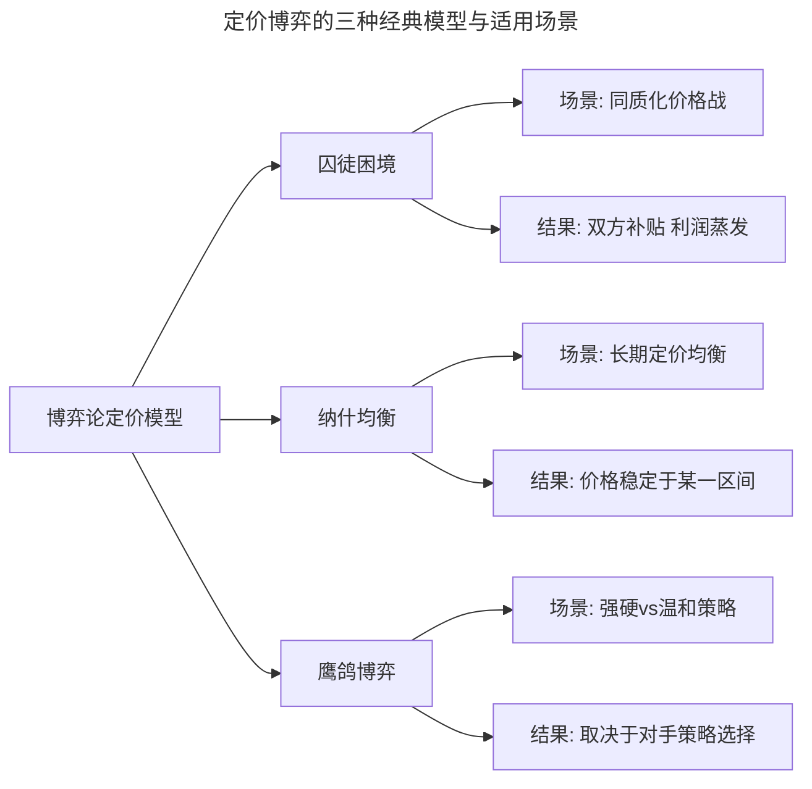
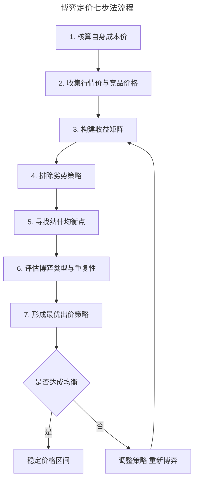

# 如何用博弈论制定出有竞争力的运营价格？

> **适用范围**：面向产品经理、运营经理、商业化负责人与创业者，覆盖定价策略制定、补贴博弈分析与竞品价格应对。
>
> **更新摘要（v2 · 2026-08 更新）**：在原版囚徒困境、纳什均衡基础上，补充 2024-2025 年网约车、外卖补贴战的真实博弈案例；新增鹰鸽博弈、触发策略、价格领袖等进阶模型；以 Mermaid 流程图与收益矩阵替代失效图片；提供可落地的博弈定价七步法。

## 一、导言

定价是商业化链条中最敏感、也最能体现竞争智慧的环节。一个看似简单的"该定多少钱"背后，实则隐藏着对成本、需求、对手反应与监管边界的多重判断。博弈论（Game Theory）提供了一套结构化的思考工具，帮助决策者在"我出价、对手也会出价"的互动情境中，找到当前条件下的最优解，而非追求一击制胜。

竞品分析（Competitive Analysis）的最终落点之一，就是将对手的价格行为纳入自身的定价模型。本文围绕"如何用博弈论制定有竞争力的运营价格"这一问题，系统梳理博弈论的基本分类、定价流程、典型案例与常见误区，并给出可复用的实战框架。

需要强调的是：博弈论并非鼓励价格战，恰恰相反，其最大价值在于帮助决策者识别并跳出零和博弈的陷阱，找到让双方利益最大化或至少避免双输的均衡点。

## 二、核心方法论

### 2.1 博弈论的基本分类

博弈论研究的是理性决策者在策略性互动中的选择行为，其核心分类如下：

| 分类维度 | 类型 | 含义 | 定价场景示例 |
|---------|------|------|-------------|
| 是否有约束协议 | 合作博弈（Cooperative Game） | 博弈方存在有约束力的协议 | 行业自律价、OPEC 配额 |
|  | 非合作博弈（Non-cooperative Game） | 无约束协议，各自独立决策 | 外卖补贴战、网约车价格战 |
| 收益结构 | 零和博弈（Zero-sum Game） | 一方所得即另一方所失 | 同质化产品的市场份额争夺 |
|  | 非零和博弈（Non-zero-sum Game） | 双方可共同获益或共同受损 | 行业共建、生态合作定价 |
| 重复性 | 一次博弈（One-shot Game） | 仅一次互动 | 临时促销、清仓处理 |
|  | 重复博弈（Repeated Game） | 多轮互动，可形成声誉 | 长期定价、订阅制产品 |

### 2.2 三种与定价强相关的经典博弈

**囚徒困境（Prisoner's Dilemma）** 揭示了个体理性与集体理性的冲突：当双方都追求自身利益最大化时，往往陷入双输局面。这正是价格战的典型写照——两家平台都补贴，利润双双蒸发，却无人敢先停手。

**纳什均衡（Nash Equilibrium）** 是博弈的稳定状态：在给定对手策略的前提下，任何一方单方面改变策略都不会更好。定价中的纳什均衡点，就是双方都不愿意主动调整的价格区间。

**鹰鸽博弈（Hawk-Dove Game）** 描述了强硬策略与温和策略的对抗。2025 年外卖大战中，三家平台都采取"鹰派"补贴策略，导致整体收益被严重侵蚀；若有一方转为"鸽派"收缩补贴，则可能迅速丢失市场份额。这正是博弈论对"非理性竞争"的精准刻画。

上述三类模型并非互斥，而是从不同角度刻画了定价博弈的复杂性。囚徒困境解释"为什么会打价格战"，纳什均衡解释"价格最终停在哪里"，鹰鸽博弈则解释"该强硬还是该温和"。

## 三、关键流程

### 3.1 博弈定价七步法

将博弈论落地为可操作的定价流程，可遵循以下七步：

第一步核算成本价是底线，包括边际成本（Marginal Cost）与固定成本分摊；第二步收集行情价时，需同时关注竞品的标价与实际成交价（含补贴、券后价）；第三步构建收益矩阵是博弈分析的核心，需列出双方不同出价组合下的收益；第四步排除劣势策略，即在任何对手策略下都更差的出价方案；第五步在剩余策略中寻找纳什均衡；第六步判断博弈是一次性还是重复性的，这直接影响合作的可能性；第七步形成最终出价。

### 3.2 收益矩阵的构建方法

以两家平台 A、B 的定价博弈为例，假设各有"高价""中价""低价"三档策略，收益矩阵如下：

| 平台A \ 平台B | 高价 | 中价 | 低价 |
|--------------|------|------|------|
| 高价 | (60, 60) | (40, 80) | (20, 70) |
| 中价 | (80, 40) | (50, 50) | (30, 45) |
| 低价 | (70, 20) | (45, 30) | (25, 25) |

括号内为（A收益, B收益）。通过逐一排查：当对手出中价时，A 出中价（50）优于高价（40）和低价（45）；当对手出高价时，A 出中价（80）优于低价（70）。因此（中价, 中价）构成纳什均衡，双方各得 50。而（高价, 高价）虽总收益更高（120），但任一方都有动力偏离——这正是囚徒困境的体现。

## 四、工具与实战

### 4.1 案例：2025 年外卖补贴大战的博弈解读

2025 年 2 月京东上线外卖业务，与美团、阿里形成"三国混战"。截至 9 月，这场补贴战已持续 218 天，被业内称为"中国互联网史上规模最大的补贴战"之一。从博弈论视角看，这场大战是典型的非合作、重复、非零和博弈，且陷入了类似囚徒困境的结构。

**博弈结构分析**：

- 参与方：美团、京东、阿里（淘宝闪购），均为理性主体，追求市场份额与长期利润；
- 策略空间：高强度补贴 / 中等补贴 / 不补贴；
- 收益结构：短期看补贴方获取订单与流量，但利润大幅下滑；长期看，谁先停手谁流失份额。

三家平台的财报数据直观反映了博弈代价：2025 年第二季度美团经调整溢利净额同比下滑 89%，阿里集团销售和市场费用同比翻倍、经营利润同比降 85%，京东第三季度经营利润亏损 11 亿元、营销开支同比增 110.5%。复旦大学经济学院课题组对全国 4 万余家餐饮商户的数据分析显示，商户侧普遍呈现"增量不增收"状态——日均单量增长 7%，但实收金额平均下降约 4%，总利润平均降幅达 8.9%。

这场博弈的关键特征是：每一方都知道补贴不可持续，但谁也不敢先收手，因为"先收手者"将立即丧失市场份额。这正是鹰鸽博弈中"都采取鹰派策略"的均衡——个体理性导致集体非理性。

**破局路径**：2025 年 12 月，国家市场监管总局发布实施《外卖平台服务管理基本要求》（即"新国标"），明确规定"外卖平台开展价格促销活动，相应成本应由外卖平台自身承担，不应要求商户或配送员进行分摊"。这一监管介入实质上改变了博弈的收益结构，将"补贴转嫁成本"的路径切断，促使博弈向更可持续的均衡演化。

### 4.2 案例：网约车定价的动态博弈

网约车行业的动态定价（Surge Pricing）是博弈论在定价中的典型应用。平台通过实时供需匹配，动态调整价格以实现供需平衡。从博弈视角看，这涉及三方博弈：平台、司机、乘客。

- 平台与司机：平台通过抽成比例与司机博弈，抽成过高则司机流失，过低则平台亏损；
- 平台与乘客：价格过高则乘客流失，过低则运力不足；
- 司机与乘客：通过平台撮合，价格是双方接受的均衡点。

2014-2016 年滴滴与快的、Uber 的补贴大战，本质是"用补贴换市场份额"的非合作博弈。最终以合并收场，从非合作博弈转为合作博弈，行业进入新的纳什均衡——这也提醒我们：博弈的边界（参与者、规则、重复性）并非固定，合并、监管、技术变革都可能重塑博弈结构。

### 4.3 触发策略与价格领袖

在重复博弈中，"触发策略"（Trigger Strategy）是维持合作均衡的重要机制：一方一旦发现对方降价，则永久恢复低价报复。这种"冷酷触发"（Grim Trigger）虽严厉，但能有效威慑背叛行为。行业中的"价格领袖"模式——由一家企业率先调价，其他企业跟进——本质上是一种隐性合作机制，降低了价格博弈的不确定性。

| 策略类型 | 含义 | 适用场景 | 风险 |
|---------|------|---------|------|
| 冷酷触发 | 一次背叛即永久报复 | 长期稳定的寡头市场 | 误判导致永久价格战 |
| 以牙还牙 | 模仿对方上一轮策略 | 信息透明、轮次明确 | 容易陷入报复循环 |
| 价格领袖 | 一家定价、其他跟进 | 行业有明确领导者 | 涉嫌垄断协议 |

## 五、常见误区

### 5.1 将博弈论等同于价格战

博弈论的最大价值是帮助识别并跳出零和博弈，而非鼓励对抗。许多团队一提"博弈定价"就想到降价，这是对博弈论的根本误解。真正的博弈定价，往往指向合作均衡——例如行业自律价、差异化定价以避免正面冲突。

### 5.2 忽视博弈的重复性

一次性博弈中，背叛往往是占优策略；但在重复博弈中，合作可能成为均衡。许多定价决策失败，源于只看了单次收益，忽视了长期互动中的声誉成本与报复风险。

### 5.3 静态分析忽视动态变化

博弈的参与者、策略空间、收益结构都可能随时间变化。2025 年外卖大战中，监管政策的介入、商户的集体反弹、消费者对服务质量的投诉，都在改变博弈结构。静态的收益矩阵分析必须配合动态的环境扫描。

### 5.4 忽视外部性与社会成本

补贴战看似是平台间的博弈，但负外部性由商户、骑手、消费者甚至城市交通共同承担。据 2026 年发布的行业研究，2025 年 Q2 至 2026 年 Q1，美团累计亏损约 224 亿元，淘宝闪购超 870 亿元，京东新业务约 557 亿元，三平台市值蒸发超 3000 亿元。忽视外部性的定价决策，终将面临监管与社会信任的反噬。

## 六、进阶延展

### 6.1 从博弈论到机制设计

机制设计理论（Mechanism Design）是博弈论的逆向应用：不是分析给定规则下的博弈结果，而是设计规则以引导出期望的博弈行为。在定价领域，这意味着平台不仅要"参与博弈"，更要"设计博弈"——例如设计拍卖式定价、动态抽成机制、商户激励分层等，使各方在自利行为下达成整体最优。

### 6.2 AI 时代的定价博弈新变量

生成式 AI 与智能体（Agent）的普及，正在为定价博弈引入新变量：

- **算法共谋风险**：当多家企业使用相似的定价算法时，可能在无人类沟通的情况下形成事实上的价格同盟，引发反垄断关注；
- **个性化定价的博弈边界**：AI 驱动的千人千面定价，使传统"统一价格"的博弈分析失效，需引入更细粒度的策略空间；
- **智能体代理博弈**：当用户的购买决策由 AI 代理完成时，博弈从"平台 vs 用户"变为"平台 AI vs 用户 AI"，策略空间与均衡形态都将重构。

### 6.3 跨文化定价博弈

不同市场对价格战的容忍度、监管尺度、消费者反应模式差异巨大。中国市场对补贴战的接受度曾较高，但 2025 年的监管收紧与公众舆论转向，标志着"烧钱换市场"的范式正在退场。进入新市场时，需将当地监管文化、消费者价格敏感度、竞争格局纳入博弈模型。

### 6.4 定价博弈的实战工具箱

将博弈论落地为定价决策，可借助以下工具箱：

| 工具 | 用途 | 使用时机 |
|------|------|---------|
| 收益矩阵 | 列出双方策略组合下的收益 | 任何定价博弈分析 |
| 优势策略排查 | 排除任何情况下都更差的策略 | 收益矩阵构建后 |
| 纳什均衡求解 | 找到双方都不愿单方面偏离的点 | 排除劣势策略后 |
| 重复博弈分析 | 判断合作是否可维持 | 长期定价关系 |
| 触发策略设计 | 设计威慑机制防止背叛 | 寡头定价、行业自律 |
| 敏感性分析 | 测试收益结构变化对均衡的影响 | 参数不确定时 |

这些工具并非线性使用，而是根据具体问题灵活组合。例如，分析"是否应跟随对手降价"时，需先用收益矩阵判断降价与不降价的收益，再用重复博弈分析长期影响，最后用触发策略设计威慑机制。

### 6.5 知识锦囊：边际成本（Marginal Cost）

边际成本指每多生产（或多服务）一单位产品所增加的成本。在数字经济中，软件产品的边际成本趋近于零，这一定价特性使得博弈结构与传统制造业截然不同——零边际成本意味着降价的空间极大，但也意味着价格战的下限极低，更容易陷入囚徒困境。理解边际成本，是理解互联网行业"为什么这么容易打价格战"的关键。
