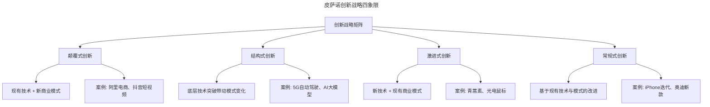
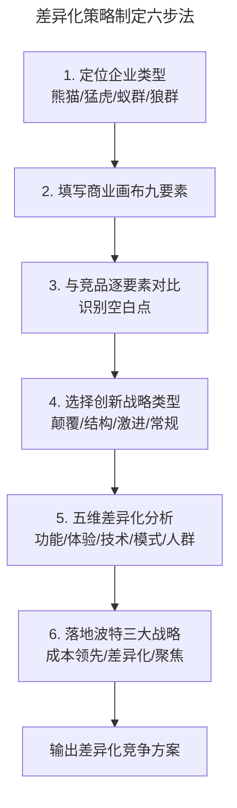

# 产品差异化竞争的 5 个建议

> **适用范围**：面向产品经理、创业者、商业化负责人，覆盖产品定位、差异化策略制定、AI 时代竞争维度识别与生态构建。
>
> **更新摘要（v2 · 2026-08 更新）**：在原版"四种企业类型、商业画布、四种创新战略、互联网思维、波特差异化战略"基础上，新增 AI 时代差异化五维框架、结果导向差异化（Outcome-based Differentiation）、数据资产护城河与智能体能力差异化；以 Mermaid 图与文字矩阵替代失效图片；补充 2024-2025 年 AI 产品差异化案例。

## 一、导言

差异化竞争（Differentiation）是商业战略的永恒主题。在供给过剩、信息透明的市场环境中，同质化是产品死亡的最快路径。麦肯锡数据显示，超过 80% 的产品在上市后一年内因同质化竞争被市场淘汰。而在 AI 时代，差异化竞争的维度与逻辑正在发生根本性变化：当基础模型趋于同质、能力清单趋于饱和，"功能多一个少一个"已不再是有效的差异化。

本文从企业类型定位出发，系统梳理商业画布、创新战略、互联网思维与波特差异化框架，并在此基础上补充 AI 时代差异化的新维度，提出可落地的"五维差异化框架"，帮助决策者在同质化红海中找到立足之地。

需要明确的认知前提是：差异化的本质不是"做得更新"，而是"做得不同"；不是追求功能数量，而是追求在某一维度上对特定人群形成不可替代的价值。

## 二、核心方法论

### 2.1 四种企业类型矩阵

根据企业的核心竞争力强度与生态协作能力，可将企业分为四类。这一矩阵不仅适用于自评，也可用于竞品定位分析。

| 类型 | 核心竞争力 | 生态能力 | 典型特征 | 代表企业 |
|------|-----------|---------|---------|----------|
| 熊猫型 | 弱 | 弱 | 依赖补贴与政策，难以直面竞争 | 部分初创、地方垄断企业 |
| 猛虎型 | 强 | 弱 | 单体能力强，不擅连接生态 | 隐形冠军：三一重工、大族激光 |
| 蚁群型 | 弱 | 强 | 个体弱小，协同能力强 | 产业集群：曹县汉服、许昌假发 |
| 狼群型 | 强 | 强 | 单体与生态兼备，攻防俱佳 | 小米系、腾讯产品矩阵 |

判断自身与竞品的企业类型，是制定差异化策略的起点。熊猫型企业首要任务是建立核心竞争力；猛虎型企业需拓展生态连接；蚁群型企业需在协同中寻找技术突破；狼群型企业则要持续巩固双重优势。

### 2.2 商业画布九要素

商业画布（Business Model Canvas）是分析产品商业模式与竞争优势的结构化工具，由九个模块组成：

| 模块 | 含义 | 差异化分析要点 |
|------|------|---------------|
| 核心客户 | 产品的目标用户群体 | 是否聚焦竞品忽视的细分人群 |
| 价值主张 | 提供给核心用户的核心价值 | 是否解决竞品未满足的真需求 |
| 渠道 | 触达用户的方式 | 是否有更高效或独占的触达路径 |
| 关键业务 | 创收的核心功能 | 是否在关键业务上建立壁垒 |
| 收入来源 | 产生收入的方式 | 是否有差异化的变现模式 |
| 核心资源 | 最依赖的竞争力 | 是否有独占的资源或数据 |
| 成本结构 | 投入与成本驱动 | 是否有结构性成本优势 |
| 重要伙伴 | 业务运转的依赖对象 | 是否有排他性的合作伙伴 |
| 客户关系 | 与用户的连接方式 | 是否建立了更深的关系粘性 |

将自身与竞品按九要素分别填写，并做对比分析，是发现差异化机会点的有效方法。

### 2.3 皮萨诺创新战略四象限

皮萨诺创新战略矩阵（Pisano Innovation Strategy Matrix）从"技术变化"与"商业模式变化"两个维度，将创新分为四类：

四类创新并无优劣之分，关键在于匹配企业自身的能力与所处的市场阶段。初创企业宜选择颠覆式或结构式创新寻找突破口；成熟企业则在常规式创新中持续优化。

### 2.4 AI 时代差异化的五维框架

在 AI 普及的背景下，传统"功能清单对比"的差异化分析已严重失效。当买家借助 AI 工具几分钟内完成多家产品的能力对比时，"多一个功能"几乎不再构成差异。差异化的重心正从"能力"（capabilities）转向"结果"（outcomes）与"关系"（relationships）。

| 维度 | 传统逻辑 | AI 时代新逻辑 | 关键问题 |
|------|---------|--------------|---------|
| 功能差异化 | 功能多即是强 | 功能趋于同质，需建新品类 | 是否创造了全新能力类别 |
| 体验差异化 | 界面美观、流程顺畅 | 个性化、对话式、预测式体验 | 是否理解用户私有场景 |
| 技术差异化 | 算法、架构、专利 | 数据资产与垂直领域"记忆" | 是否有竞品无法获取的数据 |
| 商业模式差异化 | 定价、服务模式 | 敢为结果负责的 Agent 能力 | 是否能包圆"脏活累活" |
| 用户群体差异化 | 人群细分 | 场景细分、工作流细分 | 是否深入某一垂直工作流 |

这一框架的核心洞察是：基础模型趋同后，真正的护城河不再是"算法"，而是"记忆"与"执行"。垂直 AI 产品的优势，在于它像在律所干了十年的老伙计，懂潜规则、懂历史坑、懂这家公司的特殊偏好——这种基于私有数据与历史交互的"记忆"，是通用大模型无法复制的。

## 三、关键流程

### 3.1 差异化策略制定六步法

第一步定位企业类型，判断自身核心竞争力与生态能力的强弱；第二步填写商业画布，梳理自身商业模式；第三步与竞品做逐要素对比，识别竞品未覆盖或薄弱的空白点；第四步根据企业能力选择合适的创新战略类型；第五步在五维框架下深入分析差异化的具体落点；第六步将差异化策略落到波特三大战略之一，形成可执行的竞争方案。

### 3.2 三层竞争对手模型

AI 时代的竞品分析需跳出"长得像的软件"这一狭隘视野，将竞争对手分为三层：

| 层级 | 威胁占比 | 含义 | 应对策略 |
|------|---------|------|---------|
| 第一层：替代品/旧工作方式 | 约 80% | Excel、微信群、会议、人肉流程 | 必须展现数量级效率提升 |
| 第二层：间接竞品 | 约 15% | 解决单点问题的工具 | 整体方案优于单点工具 |
| 第三层：直接竞品 | 约 5% | 同产品同人群同问题 | 关注但不必恐慌 |

这一模型的洞察是：AI 创业的最大对手往往是"用户旧的工作方式"，而非另一个长得像的软件。如果硬要找一个功能相似的工具来对标，只会模糊自身的独特价值。

## 四、工具与实战

### 4.1 互联网思维的三个核心要素

**用户思维**：以用户价值为依归，是差异化竞争的第一原则。当对手都在"作恶"时，坚持"善良"本身就是一种差异化。短期内或许没有创造所谓利润，但长期会形成信任壁垒。

**简单思维**：产品要 Simple & Clear。用户基数大时，一个复杂功能让用户多想 1 秒，乘以用户数就是巨大的总成本。B 端产品无法做到 Simple，至少要做到 Clear。

**数据思维**：记录用户的一切行为（脱敏后），重视群体行为模式。运营同学尤其要以数据为行动前提与效果佐证，而非拍脑门决策。

### 4.2 波特差异化竞争三大战略

迈克尔·波特（Michael Porter）提出三大通用竞争战略，是差异化竞争的经典框架：

| 战略 | 核心逻辑 | 适用场景 | 案例 |
|------|---------|---------|------|
| 成本领先战略 | 规模化降本，价格低于对手 | 大规模生产、价格敏感市场 | 牧原集团自繁自养降本 |
| 差异化战略 | 品质与性能领先，建立忠实客户 | 品质敏感、品牌溢价市场 | 苹果 iPhone、宝洁多品牌 |
| 聚焦战略（细分市场战略） | 满足细分市场特定需求 | 高价值细分人群 | 二次元产品、云养猫社区 |

### 4.3 AI 产品差异化案例

**Harvey（AI 律师工具）**：底层模型与 ChatGPT 相同，但拥有律所几十年的案卷、合同、判例数据，形成了通用 AI 无法复制的"记忆壁垒"。这印证了"真正的壁垒不是算法，是数据资产"。

**Cursor（AI 编程工具）**：不仅给建议，还直接帮你改 Bug、修文件、跑测试。它干了"执行"的活儿，把"敢为结果负责"作为最大差异化。

**DeepSeek 与垂直场景结合**：基础模型开源后，差异化重心从"模型智商"转向"场景理解"。谁能深入业务流，把发邮件、填表格、改代码的"脏活"包圆，谁就有壁垒。

## 五、常见误区

### 5.1 将差异化等同于价格差异

把差异化理解为打价格战，是最常见的误区。价格调整虽简单直接，但极易陷入零和博弈，且价格优势无法形成护城河。真正的差异化是价值差异，而非价格差异。

### 5.2 功能清单陷阱

AI 时代尤其要警惕"功能对比矩阵"的陷阱。当 AI 工具几分钟内完成能力对比时，多一个功能几乎不构成差异。差异化的重心应从"能力清单"转向"业务结果"与"用户关系"。

### 5.3 忽视可持续性

追求短期差异而忽略长期护城河，容易被竞品快速模仿。差异化需建立在对核心资源、数据资产、生态关系的长期投入上。

### 5.4 静态分析忽视市场演化

市场、技术、用户需求都在快速变化。一次差异化分析不能一劳永逸，需建立常态化的差异化审视机制。

## 六、进阶延展

### 6.1 结果导向差异化框架

在 AI 时代，差异化正从"我们能做什么"转向"我们能交付什么结果"。结果导向差异化（Outcome-based Differentiation）强调三个维度：可验证的业务结果、实施速度、客户成功模式。这一框架要求产品定位从"功能陈述"转向"价值承诺"——例如从"我们提供 AI 内容推荐"转向"客户销售效率提升 40%，60-75 天完成部署"。

### 6.2 生态优势的构建路径

差异化竞争的最高级形态是生态优势。单点突破是第一阶段，生态构建是第二阶段。苹果自研硬件的同时打造 AppStore 与 iBooks 连接内容生态；小米单品突围后通过生态链放大优势。这种"单点优势 → 生态优势"的演进路径，是差异化竞争的长期方向。

### 6.3 AI 时代差异化的新边界

随着智能体普及，差异化的边界正在扩展：

- **Agent 能力差异化**：能否直接完成任务而非提供建议，成为新的分水岭；
- **数据飞轮差异化**：用户使用越多，AI 越懂用户，形成正向循环；
- **伦理与信任差异化**：在数据滥用、深度伪造频发的背景下，"负责任 AI"本身成为差异化标签。

### 6.4 差异化策略的评估矩阵

差异化策略制定后，需通过评估矩阵检验其有效性。评估可从六个维度展开：

| 评估维度 | 核心问题 | 评分标准（1-5 分） |
|---------|---------|------------------|
| 用户感知度 | 用户能否感知到差异 | 1=完全无感 5=强烈感知 |
| 竞品模仿难度 | 竞品多快能模仿 | 1=一周内 5=一年以上 |
| 可持续性 | 差异化能维持多久 | 1=短期 5=长期 |
| 资源匹配度 | 自身资源能否支撑 | 1=严重不足 5=充分匹配 |
| 市场规模 | 差异化覆盖的市场多大 | 1=极小 5=主流市场 |
| 商业回报 | 差异化能否带来溢价 | 1=无溢价 5=显著溢价 |

总分低于 18 分的差异化方向，建议谨慎投入；高于 24 分的方向，可作为战略重点。这一矩阵的核心价值是避免"为差异而差异"——差异化的最终目的是创造用户价值与商业回报，而非单纯追求不同。

### 6.5 知识锦囊：人工神经网络（Artificial Neural Networks, ANNs）

人工神经网络是模拟生物神经元结构的计算模型，由输入层、隐藏层、输出层构成，通过权重调整实现学习。它是深度学习与大模型的技术基础。理解神经网络的基本原理，有助于产品经理判断 AI 能力的边界——哪些任务 AI 擅长，哪些任务仍需人工介入，这种判断力本身就是 AI 时代差异化的认知前提。
