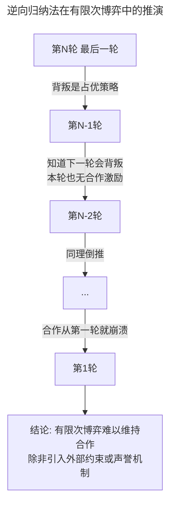
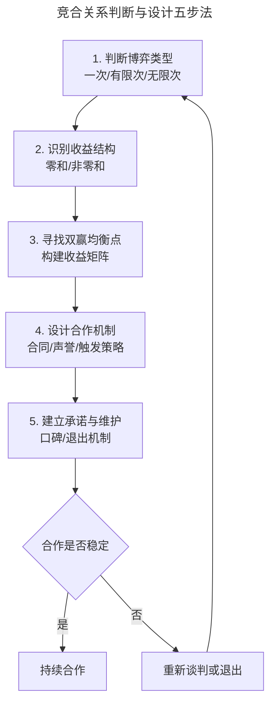
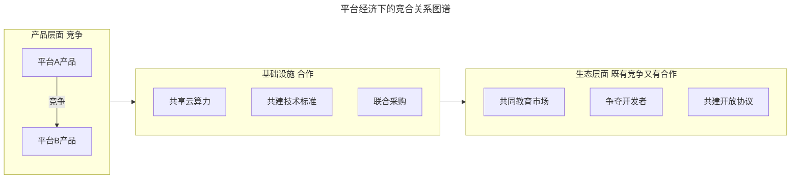

# 如何与竞争对手合作？

> **适用范围**：面向产品负责人、业务负责人、战略合作与生态拓展岗位，覆盖竞合关系（Coopetition）的判断、合作机制设计与长期维护。
>
> **更新摘要（v2 · 2026-08 更新）**：在原版有限次/无限次博弈、合纵连横、合作承诺基础上，新增 2024-2025 年苹果与谷歌 Gemini 合作、微软与 OpenAI 重组、OpenAI 与谷歌云结盟等典型案例；以 Mermaid 图与收益矩阵替代失效图片；补充平台经济下的竞合新范式。

## 一、导言

竞争与合作并非二元对立。在真实商业世界中，企业与竞争对手的关系往往呈现"既竞争又合作"的复合形态，即竞合关系（Coopetition）。一家公司可能在产品层面对某竞品寸土必争，同时在底层基础设施层面与之深度合作；也可能在某一市场互为对手，在另一市场结成联盟。

竞品分析（Competitive Analysis）若只盯着"对抗"维度，容易错过合作带来的整体利益提升机会。本文系统梳理合作的前提、博弈结构、合作机制设计与承诺维护，并结合 2024-2025 年科技巨头的真实竞合案例，提供可落地的合作策略框架。

需要强调的是：与竞争对手合作的前提，是双方对行业整体利益达成共识，避免资源浪费；而合作的可持续性，则取决于双方对承诺的长期遵守与声誉的积累。

## 二、核心方法论

### 2.1 合作的前提：识别博弈类型

合作与否，首先取决于博弈的类型与结构。

| 博弈类型 | 是否可合作 | 典型场景 | 合作机制 |
|---------|-----------|---------|---------|
| 一次博弈 | 难以合作 | 临时交易、清仓 | 第三方担保、合同约束 |
| 有限次重复博弈 | 合作难度递减 | 项目制合作、阶段性联盟 | 逆向归纳寻找均衡 |
| 无限次重复博弈 | 可形成合作均衡 | 长期生态合作、行业标准 | 声誉机制、触发策略 |
| 零和博弈 | 无法合作 | 同质化市场份额争夺 | 转化为非零和 |
| 非零和博弈 | 可合作 | 生态共建、技术标准 | 寻找双赢均衡点 |

### 2.2 逆向归纳法

逆向归纳法（Backward Induction）是分析有限次重复博弈的核心工具：先设想博弈的最后一轮，确定最后一轮的最优策略，再倒推至倒数第二轮，依次类推，直到第一轮。这一方法揭示了一个重要结论——在有限次重复博弈中，若双方都理性且知道博弈终将结束，合作往往难以维持，因为"最后一轮"的背叛激励会向前传导，导致每一轮都陷入不合作。

这一推演的实践意义是：有限期的项目合作若想稳定，必须引入合同约束、第三方担保、押金机制等外部约束，否则双方都有"最后一轮捞一把"的激励。

### 2.3 无限次重复博弈与 Folk 定理

在无限次重复博弈（或不知何时结束的博弈）中，合作可以成为均衡策略。Folk 定理（民间定理）表明：只要双方足够重视未来收益，任何"个人理性"的收益组合都可以通过某种策略维持为均衡。这解释了为什么长期合作的关系（如供应链伙伴、生态联盟）比一次性交易更稳定——因为未来的合作价值足以约束当下的背叛诱惑。

### 2.4 合纵连横的战略启示

战国时期苏秦的"合纵"与张仪的"连横"，是合作博弈与背叛的经典案例。苏秦促成六国合纵抗秦，维持了 15 年的均衡；但六国人心不齐、各怀鬼胎，最终被张仪的连横策略一一击破。这一历史案例对现代合作的启示是：

- 合作达成后，必须建立持续的协调机制，不能"一约了之"；
- 合作方之间的利益不对等，是合作破裂的隐患；
- 外部的强势对手会主动寻找合作联盟的薄弱环节进行瓦解。

## 三、关键流程

### 3.1 竞合关系判断与设计五步法

第一步判断博弈类型，是一次性、有限次还是无限次，这决定了合作的可能性；第二步识别收益结构，是零和还是非零和，零和博弈需先转化为非零和；第三步构建收益矩阵，寻找双方都愿意接受的双赢均衡点；第四步设计合作机制，包括合同约束、声誉机制、触发策略等；第五步建立承诺与维护机制，最好的承诺是口碑，最差的退出是突然背叛。

### 3.2 收益矩阵分析示例

以两家平台 A、B 是否共建行业基础设施为例：

| 平台A \ 平台B | 共建 | 不共建 |
|--------------|------|--------|
| 共建 | (8, 8) 双赢 | (3, 5) A吃亏 |
| 不共建 | (5, 3) B吃亏 | (4, 4) 各自为政 |

(共建, 共建) 是纳什均衡也是帕累托最优，双方各得 8；但若一方担心对方搭便车而选择不共建，则陷入 (4, 4) 的次优均衡。合作机制设计的目标，是让双方都有信心选择"共建"。

## 四、工具与实战

### 4.1 案例：苹果与谷歌的 Gemini 合作（2024-2025）

2025 年，苹果正式宣布与谷歌达成协议，使用谷歌的 Gemini 模型为 Siri 提供核心 AI 能力。这是一笔典型的竞合交易——苹果与谷歌在搜索、操作系统、移动生态层面是直接竞争对手，但在 AI 模型层面形成了深度合作。

**博弈结构分析**：

- 苹果的困境：AI 基础模型团队人才流失严重，自研模型进展不及预期，而 AI 能力已成为高端设备的"入场券"；
- 谷歌的收益：据报道，谷歌每年可获得约 10 亿美元以上的授权收入，同时扩大 Gemini 的分发渠道与数据飞轮；
- 双方原有的合作基础：谷歌多年来向苹果支付约 200 亿美元/年，以成为 iPhone 默认搜索引擎，双方已有深厚的合作惯性。

这一案例展示了竞合关系的核心逻辑：在能力短板明显的领域，与对手合作比自建更高效；合作的可持续性，建立在双方对整体利益的共识与长期声誉积累上。

### 4.2 案例：微软与 OpenAI 的合作重组（2025）

2025 年 10 月，微软与 OpenAI 签署新协议，深化双方的合作关系，同时也调整了合作的边界。这是科技史上规模最大的竞合关系之一。

**合作保留的关键要素**：

- OpenAI 仍为微软的前沿模型合作伙伴；
- 微软继续拥有 Azure API 的独占权，直至通用人工智能（AGI）实现；
- OpenAI 签约额外采购价值 2500 亿美元的 Azure 服务。

**合作调整的关键变化**：

- OpenAI 不再将微软作为算力供应商的优先选择，可与第三方联合开发产品；
- 微软也可独立或与第三方合作开发 AGI；
- OpenAI 推进组建公益公司（PBC）并完成资本重组，微软持股估值约 1350 亿美元。

这一案例揭示了长期合作中的动态调整机制：随着一方能力增强与战略变化，原有的独家合作需要重新平衡。双方都意识到，过度绑定反而限制了各自的发展空间。这种"既合作又保持独立"的竞合范式，是平台经济时代的常态。

### 4.3 案例：OpenAI 与谷歌云的算力合作（2025）

2025 年 6 月，OpenAI 宣布与谷歌云达成战略合作，结束微软 Azure 长达 7 年的独家算力供应关系。这一决策背后是典型的风险分散与议价能力博弈：

- OpenAI 将约 40% 的增量算力需求分配给谷歌云，采取"双供应商"策略；
- 谷歌云的 TPU v4 在 Transformer 类模型训练中，单位算力成本比 H100 低 12-15%；
- OpenAI 借此重新谈判了与微软的合作条款，获得了更有利的股权结构和数据主权。

这一案例展示了"引入第二个合作方"如何改变原有的博弈结构，提升己方议价能力。

### 4.4 平台经济下的竞合新范式

平台经济的竞合关系呈现分层结构：在产品层面是激烈竞争，在基础设施层面可能深度合作，在生态层面则既有共建又有争夺。理解这种分层结构，有助于决策者判断"哪些层面该合作、哪些层面该竞争"。

## 五、常见误区

### 5.1 将合作视为零和博弈的延续

许多团队在合作谈判中仍以"我多赚一点你少赚一点"的零和思维行事，导致合作谈判陷入僵局。合作的本质是寻找非零和解，让整体蛋糕做大。

### 5.2 忽视合作的动态性

合作关系不是一次签约就一劳永逸。微软与 OpenAI 的关系在 7 年内多次调整，苹果与谷歌的合作也随 AI 格局变化而演化。必须建立常态化的合作审视机制。

### 5.3 忽视承诺的声誉成本

破坏合作承诺的最大代价不是违约金，而是声誉损失。在信息透明的行业里，"坏事传千里"——一次背叛可能失去未来的所有合作机会。

### 5.4 忽视外部性与监管

合作若涉及行业头部企业，可能引发反垄断审查。苹果与谷歌的合作已引发监管对其是否构成排他性协议的质疑。合作设计需提前评估合规风险。

## 六、进阶延展

### 6.1 合作的承诺机制设计

合作的可维持性，取决于承诺机制的设计。常见的承诺机制包括：

| 机制类型 | 含义 | 适用场景 | 案例 |
|---------|------|---------|------|
| 合同约束 | 法律强制的合作条款 | 一次性、短期合作 | 供应链合同 |
| 押金/保证金 | 经济抵押 | 履约不确定性高的合作 | 特许经营 |
| 声誉机制 | 未来合作机会的隐性约束 | 长期、行业内的合作 | 风投圈、供应链生态 |
| 触发策略 | 一次背叛即永久报复 | 寡头市场的长期定价 | OPEC 配额 |
| 共同投资 | 沉没成本锁定双方 | 战略级合作 | 合资公司 |

### 6.2 行业生命周期与合作的演化

不同行业生命周期阶段，合作的形态不同：

| 阶段 | 主要合作形态 | 典型场景 |
|------|-------------|---------|
| 导入期 | 共同教育市场 | 联合推广、共建标准 |
| 成长期 | 分工协作 | OEM 合作、技术授权 |
| 成熟期 | 行业自律 | 价格协调、标准统一 |
| 衰退期 | 兼并收购 | 整合退出 |

### 6.3 AI 时代的竞合新变量

AI 时代的竞合关系出现了新的变量：

- **算力作为合作筹码**：算力成为类似石油的战略资源，算力合作成为竞合的新维度；
- **数据共享的边界**：联邦学习、隐私计算使"数据可用不可见"成为可能，为竞品间的数据合作提供了技术基础；
- **开源生态的竞合**：开源既是合作（共建基础设施），也是竞争（争夺生态主导权）。DeepSeek 的开源模式正是这种竞合的体现。

### 6.4 合作设计的实战清单

设计一项与竞争对手的合作方案时，可对照以下清单逐项检查：

| 检查项 | 关键问题 | 通过标准 |
|--------|---------|---------|
| 博弈类型判断 | 是一次/有限次/无限次博弈？ | 明确博弈类型与终结条件 |
| 收益结构识别 | 是零和还是非零和？ | 已构建收益矩阵 |
| 双赢均衡点 | 双方都能接受的方案是什么？ | 找到纳什均衡且帕累托有效 |
| 合作机制 | 用什么约束双方？ | 合同/声誉/触发策略至少其一 |
| 退出条款 | 合作破裂时如何退出？ | 明确退出条件与成本 |
| 合规审查 | 是否涉及反垄断风险？ | 法律团队已审查 |
| 利益分配 | 收益如何分配？ | 双方都认可且写入协议 |
| 争议解决 | 出现分歧如何处理？ | 有第三方仲裁或调解机制 |
| 持续维护 | 合作如何长期维持？ | 有定期沟通与审视机制 |

这一清单的价值在于：许多合作失败并非因为战略判断错误，而是因为执行细节遗漏。逐项检查能显著降低合作的设计风险。

### 6.5 知识锦囊：无限次重复博弈（Infinitely Repeated Game）

无限次重复博弈指博弈轮次没有明确终点的博弈。在这类博弈中，"未来的阴影"（Shadow of the Future）——即未来合作的价值——足以约束当下的行为。这是合作得以维持的根本机制：当未来足够重要时，背叛的短期收益不足以抵消长期损失。理解这一概念，是理解为什么长期合作关系比短期交易更稳定的关键。
