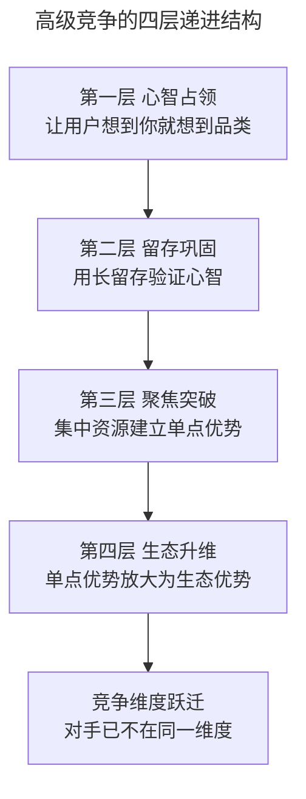
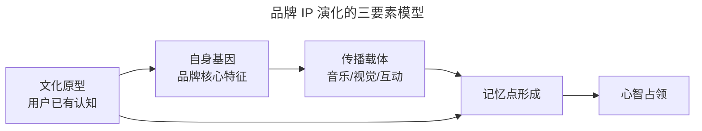
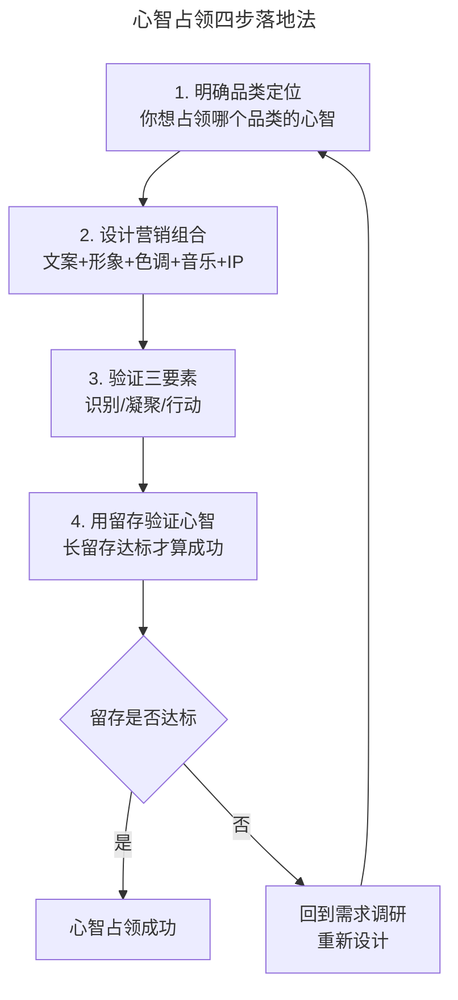
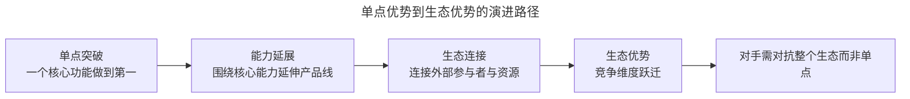

# 什么是最高级的竞争？

> **适用范围**：面向产品经理、运营经理、品牌负责人与创业者，覆盖用户心智占领、留存指标管理、聚焦战略与生态优势构建。
>
> **更新摘要（v2 · 2026-08 更新）**：在原版"占领用户心智、营销三要素、留存与聚焦"基础上，新增 2024-2025 年 AI 时代心智占领新形态、品牌 IP 演化案例、生态优势竞争范式；以 Mermaid 图替代失效图片；补充聚焦战略在 AI 时代的落地方法。

## 一、导言

大多数竞争行为停留在"你打折我也要打折""你开店在十字路口一角我就开在另一角"的层面。这种竞争的本质是模仿与对抗，难以形成持久的优势。真正高级的竞争，不以击败对手为目的，而以占领用户心智（Mind Share）为核心，通过产品留存巩固心智，通过聚焦战略积累单点优势，最终升维到生态优势的竞争。

竞品分析（Competitive Analysis）的终极价值，不是教人如何"打对手"，而是帮助决策者识别"在哪个维度竞争"以及"如何构建难以被模仿的复合优势"。本文系统梳理高级竞争的四个层级——心智占领、留存巩固、聚焦突破、生态升维，并结合 2024-2025 年的真实案例，提供可落地的竞争升维路径。

需要强调的认知前提是：最高级的竞争不是"消灭对手"，而是"让对手变得不重要"——通过占领用户心智与构建生态优势，使竞争的维度本身发生跃迁。

## 二、核心方法论

### 2.1 高级竞争的四层结构

这四层并非完全线性，而是相互支撑的循环。心智占领为留存提供认知基础，留存为聚焦提供数据反馈，聚焦为生态提供单点突破点，生态又反过来强化心智。任何一个环节薄弱，都会导致整体竞争势能的衰减。

### 2.2 心智占领的营销三要素

广告营销作为占领用户心智的主要手段，需具备三个基本功能：

| 要素 | 含义 | 关键判断标准 | 案例 |
|------|------|-------------|------|
| 识别品牌 | 一眼可识别，具备唯一性 | 不看文字能否识别品牌 | 美团袋鼠、腾讯企鹅、京东狗 |
| 凝聚信息 | 短时间内传递核心信息 | 用户能否一句话复述 | "美团 App 干啥都省钱" |
| 行动告知 | 促使用户使用、分享、传播 | 是否触发用户主动传播 | 蜜雪冰城"我爱你你爱我" |

三要素并非独立，而是层层递进：识别是基础，凝聚是核心，行动是结果。只有三者兼备，才能形成完整的心智占领闭环。

### 2.3 品牌 IP 的演化规律

品牌 IP 不是一次设计定型的，而是在与用户的互动中持续演化的。腾讯的企鹅从瘦版本到胖企鹅再到中性风格，蜜雪冰城的雪王基于文化原型嫁接组合——这些案例的共同规律是：成功的 IP 都找到了"文化原型 + 自身基因 + 传播载体"的结合点。

文化原型是用户已经熟悉并接受的元素，降低了认知门槛；自身基因是品牌的独特属性，确保 IP 不被竞品模仿；传播载体（音乐、视觉、互动形式）决定记忆的深度与传播的广度。

### 2.4 留存作为心智的验证指标

心智占领是否成功，最终需通过留存指标验证。不同产品属性对应不同的留存判断维度：

| 产品类型 | 核心留存指标 | 验证的心智维度 |
|---------|-------------|---------------|
| 游戏 | 次月留存、长留存 | 耐玩度、内容深度 |
| 生活服务 | 月活、复购率 | 需求刚性、服务依赖 |
| 社交 | 关系紧密度、互动频次 | 关系链粘性 |
| 工具 | 周活、功能使用深度 | 效率依赖、工作流嵌入 |
| 内容 | 完播率、关注转化 | 内容吸引力、兴趣匹配 |

拉新做得再好，若留存不行，说明心智并未真正占领——用户来了就走，说明产品未满足真实需求。留存才是判断产品是否成功的核心指标。

## 三、关键流程

### 3.1 心智占领的四步落地法

第一步明确品类定位，回答"用户提到哪个场景时应该想到你"；第二步设计营销组合，从文案到形象、色调、音乐、IP 形成体系；第三步用三要素验证营销方案是否完整；第四步用留存数据验证心智是否真正占领——若留存不达标，需回到需求调研重新出发。

### 3.2 聚焦战略的落地方法

聚焦是高级竞争的关键一跃。聚焦不是"只做一件事"，而是"集中优势资源到最有壁垒的方向"。落地方法包括：

| 聚焦维度 | 含义 | 判断标准 |
|---------|------|---------|
| 方向聚焦 | 锁定一个核心方向 | 是否敢于拒绝"看似不错的机会" |
| 功能聚焦 | 围绕核心功能打磨 | 是否做到该功能行业第一 |
| 设计聚焦 | 极简、清晰的产品形态 | 是否减少用户决策成本 |
| 人群聚焦 | 服务特定人群 | 是否对该人群有独到理解 |
| 愿景聚焦 | 与公司使命对齐 | 每个决策是否在使命范围内 |

聚焦的难点不在于"做什么"，而在于"不做什么"。许多团队的失败，不是因为没找到方向，而是方向太多、资源分散。阿里巴巴聚焦"让天下没有难做的生意"，腾讯聚焦"用户为本、科技向善"——这些愿景不仅是文化口号，更是决策的审视标准。

## 四、工具与实战

### 4.1 案例分析：营销三要素的实战拆解

以蜜雪冰城为例，其心智占领的营销组合可拆解为：

- **文化原型**：雪人形象，用户已有认知，无需教育；
- **自身基因**：甜蜜、亲民、低价；
- **传播载体**：《Oh Susanna》改编的洗脑旋律；
- **行动告知**：用户主动将旋律设为手机铃声、制作表情包、社交媒体传播；
- **视觉识别**：红色主色调 + 雪王形象，识别性极强。

这一组合的成功，不在于任何一个单点，而在于"文化原型 + 自身基因 + 传播载体 + 视觉识别"的体系化设计，使竞争对手无法通过模仿单点来复制效果。

### 4.2 传统企业的聚焦案例

聚焦战略并非互联网专属，传统企业的案例同样有力：

| 企业 | 聚焦方向 | 聚焦年限 | 成果 |
|------|---------|---------|------|
| 牧原集团 | 养猪 | 20 余年 | 数千亿市值 |
| 圣农集团 | 养鸡 | 近 40 年 | 行业龙头 |
| 海天味业 | 调味品 | 60 余年 | 数千亿市值 |

这些企业的共同点是：围绕核心产业构建核心竞争力，将单点优势扩展为上下游的生态优势。当对手想竞争时，竞争的不再是一头猪、一只鸡、一瓶酱油，而是围绕这些单品的整个产业链。

### 4.3 AI 时代的心智占领新形态

2024-2025 年，AI 产品的普及带来了心智占领的新形态：

- **对话式心智占领**：用户与 AI 助手的对话成为新的"广告位"，谁占据了用户与 AI 对话的首选位置，谁就占领了心智；
- **场景化心智占领**：当用户说"帮我订明天的会议室"时，能直接调用日历与会议系统的 AI 产品，比只能给建议的产品更深入心智；
- **Agent 能力作为心智锚点**：能"直接完成任务"的 AI 产品，比"提供建议"的工具更容易形成依赖。

### 4.4 孙子兵法的竞争智慧

"故曰：胜可知，而不可为。不可胜者，守也；可胜者，攻也。"这一古训对现代竞争的启示是：

- 胜利可以预见，但不能强求；
- 暂时不能取胜时，先防守等待；
- 有机会时，积极进攻。

这与聚焦战略高度一致：不分散兵力、不强行出击、待时机成熟一击制胜。

## 五、常见误区

### 5.1 将心智占领等同于广告轰炸

广告是心智占领的手段之一，但不是全部。若产品留存不行，广告做得越多，用户失望越快。心智占领需要营销组合 + 产品力的双轮驱动。

### 5.2 将聚焦等同于保守

聚焦不是"不做新东西"，而是"在新方向上也围绕核心优势展开"。聚焦的企业同样可以创新，只是创新的方向需与核心竞争力协同。

### 5.3 忽视生态优势的构建

只做单点突破而不构建生态，容易被生态型对手降维打击。单点优势是起点，生态优势才是终点。

### 5.4 静态看待竞争维度

竞争维度会随技术、市场、用户需求变化而跃迁。AI 时代，竞争的维度正从"功能"转向"结果"与"关系"，固守旧的竞争维度会导致战略失效。

## 六、进阶延展

### 6.1 从单点优势到生态优势

生态优势的构建路径可概括为：

苹果的路径是典型案例：自研硬件是单点突破，AppStore 与 iBooks 是生态连接，最终形成"硬件 + 软件 + 内容 + 服务"的生态优势。当对手想竞争时，对抗的不再是某一款 iPhone，而是整个苹果生态。

### 6.2 心智占领的量化评估

心智占领程度可通过以下指标量化评估：

| 指标 | 含义 | 评估方法 |
|------|------|---------|
| 品牌提及率 | 用户提到品类时是否想到你 | 用户调研、搜索指数 |
| 心智份额 | 在品类中的认知占比 | 品牌搜索量/品类搜索量 |
| 净推荐值（NPS） | 用户是否愿意主动推荐 | 标准化问卷 |
| 自发传播率 | 用户是否主动传播 | 社交媒体提及量 |

### 6.3 AI 时代的高级竞争新维度

AI 时代，高级竞争出现了新的维度：

- **数据飞轮竞争**：用户使用越多，AI 越懂用户，形成正向循环，构成难以逾越的壁垒；
- **Agent 能力竞争**：能直接完成任务的产品，将取代只能提供建议的工具，成为新的心智锚点；
- **负责任 AI 作为竞争维度**：在 AI 伦理日益受关注的背景下，"负责任"本身成为差异化标签与心智占领点。

这三个维度的共同特征是：它们不是单一功能层面的竞争，而是"关系"层面的竞争。数据飞轮构建的是"产品与用户的默契关系"，Agent 能力构建的是"产品与工作流的嵌入关系"，负责任 AI 构建的是"产品与社会的信任关系"。当竞争从"功能"升维到"关系"，对手要模仿的就不再是一个功能点，而是一整套用户连接与信任积累。这才是最高级竞争在 AI 时代的真正含义。

### 6.4 留存指标体系的全景构建

要验证心智占领是否成功，需建立完整的留存指标体系，而非只看单一数据点。完整的留存指标体系应覆盖以下层次：

| 留存层次 | 核心指标 | 反映的心智维度 |
|---------|---------|---------------|
| 次日留存 | 次日回访率 | 产品首次体验是否击中需求 |
| 周留存 | 7 日回访率 | 短期价值是否成立 |
| 月留存 | 次月留存率 | 需求刚性程度 |
| 季度留存 | 90 日回访率 | 长期依赖形成 |
| 年留存 | 年度回访率 | 心智份额稳定 |
| 复购/续费 | 付费用户的复购率 | 价值认可深度 |

其中，次月留存是最关键的长留存指标。产品经理不能闷头憋大招，而应尽早接近用户、与用户一起成长。只有用户留存时间长，用户价值才越高，最终营收才会越好。这是判断商业模式是否成立的核心依据。

### 6.5 知识锦囊：如何在竞争中保持平和心态

竞争中最难的不是策略，而是心态。面对对手的挑衅与市场的波动，保持平和需要三个认知：

- **长期主义**：竞争是马拉松，不是冲刺，短期的得失不决定终局；
- **聚焦本质**：不被对手的动作带偏，始终回到"用户需求是否被满足"这一本质问题；
- **接受不确定性**：商业竞争没有必胜公式，接受不确定性，才能在变化中保持判断力。

平和的心态不是消极等待，而是在清晰的战略方向上持续投入，不被短期噪音干扰。这正是"胜可知而不可为"的现代诠释。
