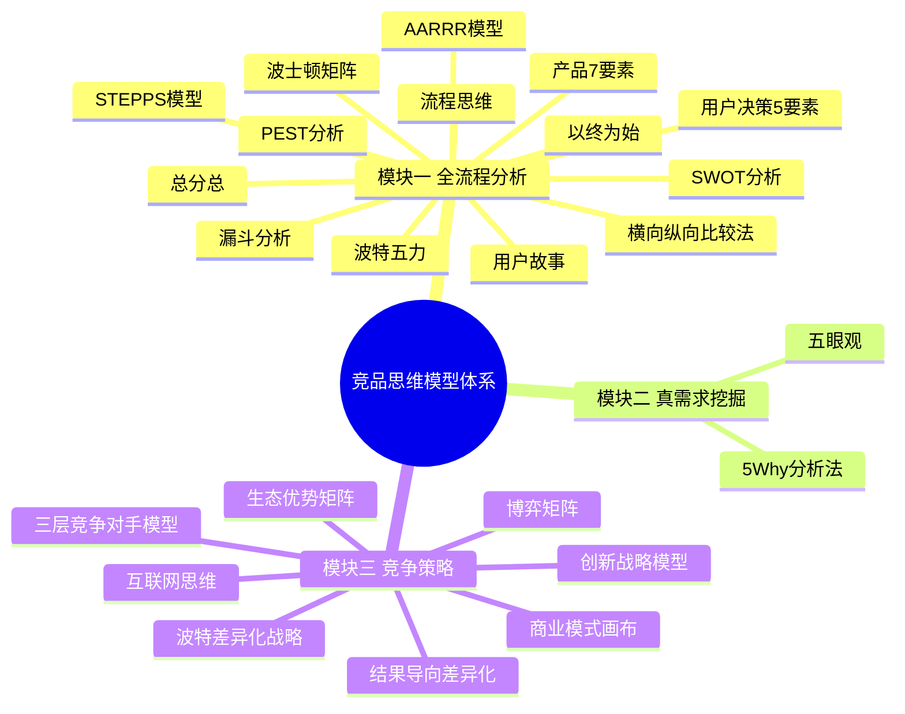
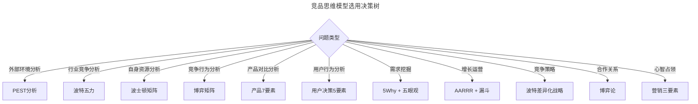
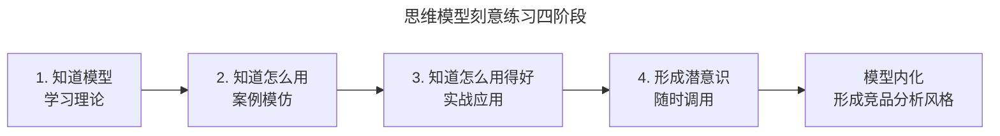

# 竞品思维提炼和总结

> **适用范围**：面向产品经理、运营经理、战略分析师与创业者，覆盖竞品思维模型体系、思维模型选用原则与刻意练习路径。
>
> **更新摘要（v2 · 2026-08 更新）**：在原版 14 个思维模型基础上，新增 AI 时代竞品分析的新模型（三层竞争对手模型、结果导向差异化、机制设计思维）；以 Mermaid 思维导图与流程图替代失效图片；补充模型选用决策树与刻意练习方法论。

## 一、导言

竞品思维不是单一的思维模型，而是一套相互支撑的思维模型体系。从竞品分析的全流程出发，涉及目标设定、对手识别、信息收集、分析方法、策略制定等多个环节，每个环节都有对应的思维工具。掌握单一模型不足以应对复杂的竞争场景，需要建立"模型库 + 选用能力 + 刻意练习"的三层能力结构。

本文系统梳理竞品分析全程涉及的思维模型，按模块归类，标注核心模型与辅助模型，并提供模型选用的决策框架与练习方法。这是一篇"元思维"性质的总结，帮助决策者在面对具体竞争问题时，快速调用合适的思维工具。

需要强调的是：知道模型、知道怎么用、知道怎么用得好，是三个层面的事情。模型本身不会自动产生洞察，刻意练习是唯一的出路。

## 二、核心方法论

### 2.1 竞品思维模型的模块化体系

竞品分析的三大模块对应三组思维模型：

模块一覆盖竞品分析的全流程，从目标设定到报告输出，是"分析阶段"的工具集；模块二聚焦真需求挖掘，是"洞察阶段"的工具集；模块三处理竞争策略制定，是"决策阶段"的工具集。三个模块形成"分析 → 洞察 → 决策"的完整链路。

### 2.2 四个核心思维模型详解

在全部思维模型中，有四个具有基础性与普适性，值得重点掌握：

| 模型 | 核心含义 | 应用场景 | 价值定位 |
|------|---------|---------|---------|
| 以终为始 | 从目的倒推路径 | 任何任务的起点 | 避免方向性错误 |
| 漏斗模型 | 多到少的转化流程 | 增长、销售、运营 | 精细化运营的基础 |
| 产品 7 要素 | 产品的结构化拆解 | 产品分析、竞品对比 | 避免遗漏关键维度 |
| 用户决策 5 要素 | 用户决策的结构化拆解 | 用户研究、需求挖掘 | 理解用户行为逻辑 |

**以终为始**：做任何事之前先明确目的，从目的倒推出发的点、定位与资源，再规划执行路径。这是避免"拿着任务就开干"的根本方法。遇到岔路时，回到最初的目的，判断哪条路径正确。

**漏斗模型**：是多到少的转化过程，本质是流程思维。无论是增长、销售、营销还是招聘，都是漏斗的变种。需重视每个环节的转化率，根据业务阶段在某一环节加大投入，前提是埋好数据采集点。

**产品 7 要素与用户决策 5 要素**：是产品与用户分析的基本结构化工具，共 12 个要素，每一个都能细分形成一个岗位。负责某一要素的从业者，需跳出要素本身，从完整链路看问题，建立整体思维方式。

### 2.3 模型选用决策树

面对具体竞争问题，如何选用合适的模型？可参考以下决策逻辑：

决策树的使用方法是：先判断问题类型，再匹配对应的模型。一个复杂问题往往需要多个模型组合使用，例如"制定新产品的竞争策略"可能需要 PEST（环境）+ 波特五力（行业）+ 产品 7 要素（产品）+ 博弈论（竞争）的组合。

## 三、关键流程

### 3.1 思维模型的刻意练习路径

四个阶段并非线性，而是循环往复。每次实战应用后，需复盘哪些模型用得有效、哪些用得失效、哪些场景需要新模型。通过持续的"学习 → 模仿 → 实战 → 复盘"，模型会逐渐内化为潜意识，达到"任何场景都能随时调用合适模型"的境界。

### 3.2 模型组合使用的典型场景

| 场景 | 推荐模型组合 | 输出 |
|------|-------------|------|
| 新市场进入决策 | PEST + 波特五力 + 商业画布 | 市场进入可行性判断 |
| 产品迭代规划 | 产品 7 要素 + 用户决策 5 要素 + 漏斗 | 迭代优先级清单 |
| 竞品价格应对 | 博弈矩阵 + 成本分析 + 收益矩阵 | 出价策略 |
| 差异化策略制定 | 企业类型矩阵 + 五维差异化 + 波特战略 | 差异化方案 |
| 合作关系设计 | 博弈论 + 收益矩阵 + 承诺机制 | 合作方案 |

## 四、工具与实战

### 4.1 模块二：真需求挖掘的两个模型

**5Why 分析法**：通过连续追问"为什么"，层层深入挖掘表面需求背后的真实需求。每一次"为什么"都是对表层解释的挑战，直到触及根本原因。

**五眼观**：源自佛学智慧，通过五个视角发现事情的本质。与 5Why 类似，都是层层递进的洞察方法，但五眼观更强调视角的多元性而非追问的深度。

挖掘真需求是产品经理的基本技能，但受限于经验与认知，并不容易掌握。这两个模型的刻意练习，能显著提升需求洞察的深度。

### 4.2 模块三：竞争策略的六个模型

| 模型 | 核心用途 | 关键输出 |
|------|---------|---------|
| 生态优势矩阵 | 评估企业与生态的关系 | 企业类型定位 |
| 商业模式画布 | 梳理商业模式九要素 | 商业模式对比表 |
| 互联网思维 | 用户/简单/数据思维 | 产品设计原则 |
| 创新战略模型 | 选择创新类型 | 创新方向决策 |
| 波特差异化战略 | 成本领先/差异化/聚焦 | 竞争战略选择 |
| 博弈矩阵 | 分析竞争与合作 | 博弈均衡点 |

### 4.3 AI 时代新增的竞品思维模型

| 新模型 | 核心用途 | 与传统模型的差异 |
|--------|---------|-----------------|
| 三层竞争对手模型 | 重新定义竞争边界 | 从"长得像的软件"扩展到"旧工作方式" |
| 结果导向差异化 | 从功能转向结果 | 差异化重心转移 |
| 机制设计思维 | 设计博弈规则 | 从"参与博弈"到"设计博弈" |
| 数据飞轮模型 | 评估数据壁垒 | 从资源优势到动态优势 |

## 五、常见误区

### 5.1 模型滥用

模型是工具，不是目的。为了显得专业而堆砌模型，会导致分析冗长而无洞察。选用模型的标准是"是否帮助解决问题"，而非"是否全面"。

### 5.2 静态使用模型

模型是对现实的简化，现实在变，模型的使用也需调整。AI 时代的竞争逻辑已与互联网时代不同，固守旧模型会错失新洞察。

### 5.3 模型替代判断

模型提供结构化思考，但不替代决策判断。最终决策需结合经验、直觉与对具体情境的理解，模型是辅助而非替代。

### 5.4 忽视刻意练习

知道模型不等于会用，会用不等于用得好。许多人的问题不是"不知道模型"，而是"没有刻意练习"，导致模型停留在认知层面，无法在实战中调用。

## 六、进阶延展

### 6.1 形成自己的竞品分析风格

掌握模型后，最终目标是形成适合自己的竞品分析风格。这需要：

- **适合自己的业务**：不同行业、不同规模的业务，适用的模型组合不同；
- **适合公司的发展阶段**：初创期、成长期、成熟期的关注点不同；
- **持续修正认知**：每次实战后复盘，拓展知识边界。

### 6.2 战略方向与思维模型的配合

战略方向是"做什么"，思维模型是"怎么想"。两者需配合使用：

| 战略方向 | 推荐模型 | 思考焦点 | 典型输出 |
|---------|---------|---------|---------|
| 外部环境分析 | PEST | 政治经济社会技术 | 环境机会与威胁清单 |
| 行业竞争分析 | 波特五力 | 行业吸引力与竞争强度 | 行业进入/退出决策 |
| 自身资源分析 | 波士顿矩阵 | 资源配置优先级 | 业务组合优化方案 |
| 竞争行为分析 | 博弈论 | 竞争与合作策略 | 出价/合作/退出决策 |
| 用户需求挖掘 | 5Why + 五眼观 | 真实需求与深层动机 | 需求优先级清单 |
| 产品对比分析 | 产品 7 要素 | 功能与体验差异 | 差异化机会清单 |

每次实战应用后，需复盘哪些模型用得有效、哪些用得失效、哪些场景需要新模型。这种复盘本身就是元认知（Metacognition）的实践——对思考过程本身的反思。只有经过持续复盘，模型才会从"书本知识"内化为"实战本能"。

### 6.3 跨学科思维的价值

竞品思维的最高境界是跨学科。博弈论来自经济学，5Why 来自精益生产，五眼观来自佛学，商业画布来自商业模式创新——最好的竞品分析师，往往是跨学科思维的实践者。拓展知识边界，不限于商业领域，是提升竞品思维的根本路径。

### 6.4 跨学科融合：从单一模型到模型生态

高阶的竞品分析师，不会将自己局限于商业模型库，而是主动跨学科汲取思维工具。博弈论来自经济学与数学，5Why 来自精益生产，五眼观来自佛学，商业画布来自商业模式创新，纳什均衡来自博弈论，鹰鸽博弈来自演化生物学。这些模型的源头各异，但在竞品分析的场景中可以形成互补。

跨学科融合的实践方法包括：

| 跨学科来源 | 可借鉴的思维模型 | 在竞品分析中的应用 |
|-----------|----------------|------------------|
| 经济学 | 博弈论、机制设计 | 竞争与合作策略 |
| 生物学 | 演化博弈、生态位 | 生态优势竞争 |
| 心理学 | 认知偏差、决策模型 | 用户决策分析 |
| 系统论 | 反馈回路、延迟效应 | 长期竞争动态 |
| 军事学 | 孙子兵法、不对称作战 | 竞争战略制定 |

跨学科融合的价值在于：当所有人都用同一套模型分析时，洞察力趋于平均；只有引入异质性的思维工具，才能发现别人看不到的竞争机会。这也是为什么最好的竞品分析师，往往有广泛的阅读兴趣与跨领域的知识积累。

### 6.5 思维模型的能力分层

思维模型的能力可分为四层：

1. **知道层**：能说出模型的名称与定义；
2. **会用层**：能在合适的场景调用模型；
3. **用得好层**：能根据情境调整模型的使用方式；
4. **创造层**：能根据新情境创造新的思维模型。

大多数从业者停留在第一层，少数达到第二层，达到第三层已是行业佼佼者，第四层则属于思想者。竞品思维的修炼，是从第一层向第四层持续攀登的过程，没有捷径，唯有刻意练习。

### 6.6 知识锦囊：元认知与思维模型

元认知（Metacognition）即"对思考的思考"，是高阶竞品思维的核心能力。在调用思维模型时，元认知帮助我们反思：我选用的模型是否合适？我是否因惯性而用了不适用的模型？我是否因信息茧房而忽视了某些维度？

元认知的实践方法包括：

- **决策日志**：记录每次竞品分析中选用的模型、分析过程与结论，定期复盘哪些判断有效、哪些失效；
- **反向检验**：主动寻找与自身结论相反的证据，检验模型是否产生了偏差；
- **多元视角**：邀请不同背景的同事审视同一份竞品分析，引入异质性视角。

元认知能力是区分"会用模型"与"用得好模型"的关键。具备元认知的从业者，能在模型失效时及时识别并调整，而非机械套用。这是竞品思维修炼的最高阶目标。
