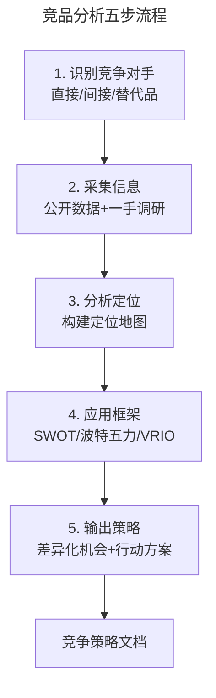
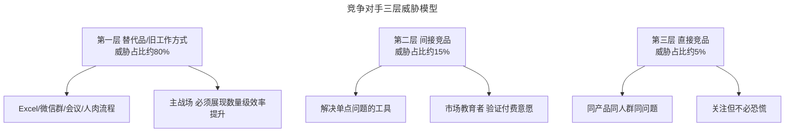
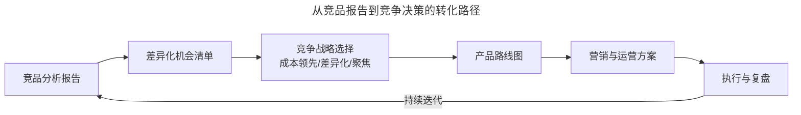

# 写一份竞品分析报告，并制定竞争策略

> **适用范围**：面向产品经理、运营经理、战略分析师与创业者，覆盖竞品分析报告的撰写流程、模板结构、数据采集与策略输出。
>
> **更新摘要（v2 · 2026-08 更新）**：在原版"结课测试"基础上，扩展为完整的 2025 版竞品分析报告模板；新增八模块报告结构、五步分析流程、数据源指南与策略输出框架；以 Mermaid 图与文字表格替代失效图片；提供可直接复用的报告模板。

## 一、导言

竞品分析报告（Competitive Analysis Report）是竞品思维落地的核心交付物。一份高质量的报告，不仅是数据的堆砌，更是从数据到洞察、从洞察到策略的完整链路。根据 2025 年 Crayon 的《竞争情报现状》报告，68% 的销售交易涉及正面竞争对手交锋，而销售团队对自身竞争准备度的平均自评仅为 3.8/10——这表明大多数团队缺乏系统化的竞品分析能力。

本文提供一套可直接复用的 2025 版竞品分析报告模板，涵盖八模块结构、五步分析流程、数据源指南与策略输出框架。报告以"假设你是一家刚起步的短视频创业公司，需与抖音、快手竞争"为案例场景，展示完整的分析过程。

需要强调的是：竞品分析不是一次性任务，而是持续的战略实践。一份好的报告，价值不在于篇幅，而在于能否支撑具体的竞争决策。

## 二、核心方法论

### 2.1 八模块报告结构

2025 版竞品分析报告采用八模块结构，每个模块都有明确的输出目标与数据源：

| 模块 | 核心内容 | 数据源 | 输出 |
|------|---------|--------|------|
| 1. 公司概览 | 成立时间、规模、融资、营收、核心高管 | LinkedIn、Crunchbase、财报 | 公司信息表 |
| 2. 产品与服务对比 | 功能矩阵、评分、定价、目标客户 | 竞品官网、G2、产品 Demo | 功能对比表 |
| 3. 定价分析 | 价格档位、折扣、合同条款 | 定价页、销售沟通 | 定价对比表 |
| 4. 营销与内容策略 | 流量、关键词、社媒、广告投放 | SimilarWeb、Google Trends | 营销画像 |
| 5. 用户感知 | 评分、好评/差评主题、NPS | G2、Capterra、Reddit | 用户口碑图 |
| 6. SWOT 分析 | 优势、劣势、机会、威胁 | 综合前五模块 | SWOT 矩阵 |
| 7. 定位地图 | 各竞品的市场位置 | 综合分析 | 定位象限图 |
| 8. 策略建议 | 自身优化方向、差异化机会 | 综合分析 | 行动方案 |

### 2.2 五步分析流程



第一步识别竞争对手，分为直接竞品（同产品同人群）、间接竞品（不同产品同需求）、替代品（不同方案解决同问题）三类；第二步采集信息，结合公开数据与一手调研，多渠道交叉验证；第三步分析定位，将各竞品映射到定位地图；第四步应用分析框架，提取战略洞察；第五步输出策略，形成差异化机会清单与行动方案。

### 2.3 竞争对手三层模型



三层模型的洞察是：最大的竞争对手往往不是"长得像的软件"，而是用户当前的旧工作方式。竞品分析若只盯着直接竞品，容易错过真正的威胁与机会。

## 三、关键流程

### 3.1 竞品信息采集维度

围绕"产品-市场-用户-运营-财务"五大维度，拆解关键信息点：

| 维度 | 关键信息 | 数据源 |
|------|---------|--------|
| 产品 | 功能、版本、用户体验、差异化点 | 竞品官网、App Store、产品 Demo |
| 市场 | 市场份额、增长率、定位 | 行业报告、QuestMobile、易观 |
| 用户 | 用户画像、满意度、迁移原因 | 用户访谈、问卷、应用商店评论 |
| 运营 | 营销动作、内容策略、活动节奏 | 社交媒体、广告投放监测 |
| 财务 | 营收、融资、估值 | 财报、Crunchbase、IT 桔子 |

### 3.2 竞品分析报告模板（2025 版）

以下为可直接复用的报告大纲：

```
一、执行摘要（1 页）
   - 分析目的与范围
   - 核心结论（3-5 条）
   - 关键建议（3 条）

二、市场概览与行业趋势
   - 行业规模与增长趋势（近 3-5 年）
   - 政策与环境影响
   - 技术变革趋势

三、竞品基础信息与定位
   - 直接竞品清单（3-5 个）
   - 间接竞品与替代品
   - 产品矩阵对比

四、数据监测与核心指标
   - 品牌声量与 SOV（声量份额）
   - 搜索指数趋势
   - 应用商店下载与评分

五、用户反馈与口碑洞察
   - 好评关键词
   - 差评关键词
   - 用户画像分析

六、SWOT 分析
   - 各竞品 SWOT 矩阵
   - 自身 SWOT 矩阵

七、定位地图与竞争格局
   - 二维定位象限图
   - 竞争空白点识别

八、策略分析与行动建议
   - 差异化机会清单
   - 短期/中期/长期行动方案
   - 风险与应对
```

### 3.3 策略输出框架

策略输出需回答三个核心问题：

| 问题 | 回答框架 | 输出 |
|------|---------|------|
| 在哪里竞争 | 选择细分市场与人群 | 目标市场定义 |
| 如何竞争 | 差异化方向与竞争战略 | 差异化方案 |
| 何时竞争 | 进入时机与节奏 | 时间表与里程碑 |

## 四、工具与实战

### 4.1 案例：短视频赛道的竞品分析框架

假设你是一家刚起步的短视频创业公司，需与抖音、快手竞争。按八模块结构展开分析：

**模块一·公司概览**：

| 公司 | 成立时间 | 核心产品 | 用户规模 | 核心优势 |
|------|---------|---------|---------|---------|
| 字节跳动 | 2012 | 抖音 | 数亿 DAU | 算法推荐、内容生态 |
| 快手 | 2011 | 快手 | 数亿 DAU | 下沉市场、社区氛围 |

**模块二·产品对比**：从内容生产、内容分发、社交互动、商业化能力四个维度做功能对比矩阵。

**模块三·定价分析**：C 端免费 + B 端广告/电商抽成是主流模式，需分析各平台的抽成比例与激励政策。

**模块四·营销策略**：分析各平台的内容运营、KOL 策略、广告投放。

**模块五·用户感知**：提炼用户好评（如"内容丰富""算法准"）与差评（如"内容同质化""沉迷"）。

**模块六·SWOT**：在前面分析基础上，构建自身与各竞品的 SWOT 矩阵。

**模块七·定位地图**：以"内容调性"与"目标人群"为两轴，绘制定位象限，识别空白点。

**模块八·策略建议**：基于空白点，提出差异化方向（如"垂直人群的深度社区""AI 辅助内容生产"等）。

### 4.2 数据源指南

| 数据类型 | 免费工具 | 付费工具 | 注意事项 |
|---------|---------|---------|---------|
| 网站流量 | SimilarWeb 免费版 | SEMrush、Ahrefs | 免费版数据有限 |
| 搜索趋势 | Google Trends、百度指数 | — | 关键词选择要精准 |
| 应用数据 | 七麦数据免费版 | Sensor Tower、data.ai | 关注下载与评分 |
| 用户口碑 | Reddit、知乎、小红书 | G2、Capterra | 注意区分水军 |
| 公司财务 | SEC EDGAR | Crunchbase Pro | 非上市公司数据有限 |
| 社媒声量 | 平台自带分析 | 声量通、Brandwatch | 多平台综合 |

### 4.3 工具使用的注意事项

- **免费工具覆盖 60-70% 的需求**，付费工具提供深度但成本较高；
- **AI 工具可处理前 20% 的基础分析**，但无法访问实时数据与专有数据库，需人工验证；
- **数据交叉验证**：单一数据源易有偏差，至少两个来源交叉验证。

## 五、常见误区

### 5.1 功能清单陷阱

最常见的误区是打开竞品网站、罗列功能清单、制作对比矩阵，试图在"多一个功能"中寻找慰藉。这种分析无法回答"你和对方解决的是不是同一类问题""你们的用户认知是否在同一维度"。

### 5.2 数据堆砌无洞察

报告不等于数据集。堆砌数据而不提炼洞察，是新手常犯的错误。每个数据点都应回答"so what"——这说明了什么？对决策有什么影响？

### 5.3 静态分析忽视动态

竞品分析不是一次性任务。市场、技术、用户需求都在变化，报告需定期更新（建议季度一次），并建立动态监测机制。

### 5.4 策略建议空洞

"加强差异化""提升用户体验"这类建议无法落地。策略建议需具体到"做什么、谁来做、何时做、预期效果"。

## 六、进阶延展

### 6.1 从报告到决策的转化

竞品分析报告的最终价值，在于支撑具体的竞争决策。转化路径包括：



### 6.2 竞争情报的持续监测

一次性的报告不足以应对快速变化的市场。建立竞争情报的持续监测机制，包括：

| 监测维度 | 频率 | 工具 |
|---------|------|------|
| 竞品产品更新 | 周度 | App Store、官网、公众号 |
| 竞品融资与人事 | 月度 | Crunchbase、IT 桔子、LinkedIn |
| 行业政策与监管 | 月度 | 政府网站、行业协会 |
| 用户口碑变化 | 周度 | 应用商店评论、社媒监测 |
| 竞品营销动作 | 周度 | 广告监测、内容追踪 |

### 6.3 AI 时代的竞品分析新工具

AI 时代，竞品分析的工具与方法正在升级：

- **AI 辅助分析**：大模型可快速完成竞品官网、财报、评论的初步梳理，但需人工验证；
- **实时数据监测**：声量通、Brandwatch 等工具提供全平台实时声量监测；
- **智能预警**：基于历史数据的异常检测，自动预警竞品重大动作。

### 6.4 竞品分析报告的质量评估标准

一份高质量的竞品分析报告，应满足以下质量标准：

| 维度 | 评估标准 | 常见问题 |
|------|---------|---------|
| 数据可靠性 | 至少两个独立来源交叉验证 | 单一来源、未验证 |
| 洞察深度 | 每个数据点都有"so what"解读 | 数据堆砌无洞察 |
| 策略可落地性 | 建议具体到行动、责任人、时间 | 空洞的"加强差异化" |
| 框架完整性 | 八模块齐全、逻辑连贯 | 模块缺失、跳跃 |
| 时效性 | 数据更新至近 3 个月 | 引用过时数据 |
| 视觉清晰度 | 表格、图表辅助理解 | 纯文字难阅读 |
| 风险评估 | 识别策略风险与应对 | 只讲机会不讲风险 |

报告撰写完成后，建议邀请未参与分析的同事做"盲读测试"——让其在 10 分钟内读完执行摘要，能否准确复述核心结论与建议。若不能，说明执行摘要的提炼还需加强。

### 6.5 知识锦囊：竞品分析的成熟度模型

竞品分析能力可分为五级成熟度：

1. **初始级**：临时、被动、无流程；
2. **可重复级**：有基本模板，但不系统；
3. **已定义级**：有标准流程与模板，定期输出；
4. **已管理级**：有量化指标与持续监测；
5. **优化级**：AI 辅助、实时监测、预测性分析。

大多数企业停留在第一二级，达到第三级已是行业前列。竞品分析的成熟度，直接决定了竞争决策的质量与速度。
