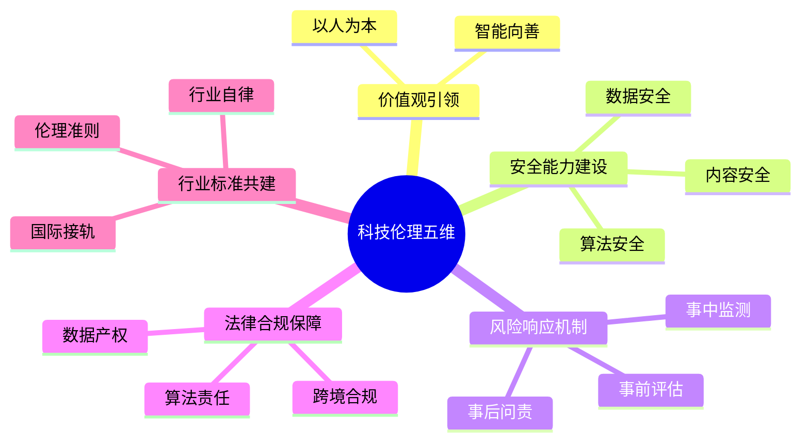
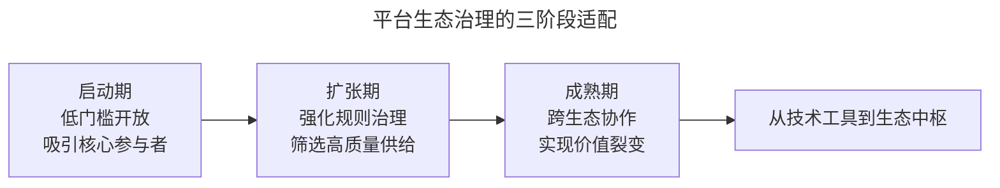
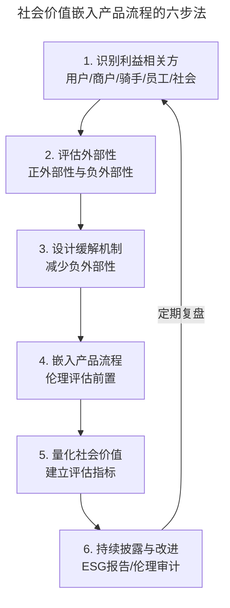
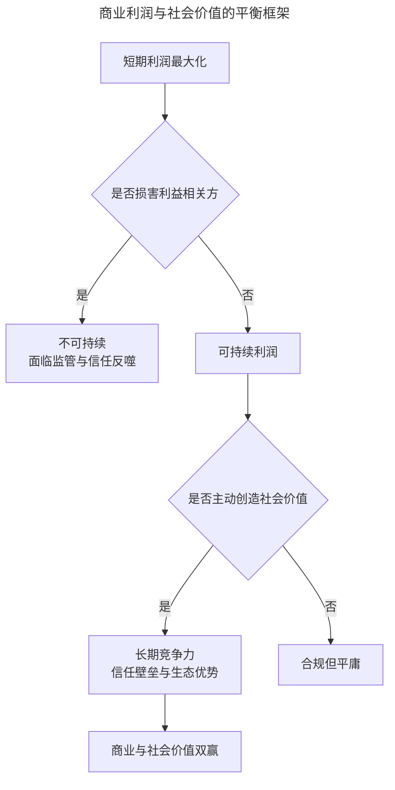

# 互联网人应不应该考虑社会价值？

> **适用范围**：面向产品经理、运营经理、平台治理岗位与创业者，覆盖科技伦理、ESG（环境、社会及管治）、平台治理与社会价值创造的实践路径。
>
> **更新摘要（v2 · 2026-08 更新）**：在原版"骑手困境、货运平台调整"基础上，新增 2024-2025 年《人工智能安全治理框架》2.0 版、腾讯与阿里 ESG 实践、平台生态治理新范式；以 Mermaid 图与文字表格替代失效图片；补充科技伦理嵌入产品流程的方法论。

## 一、导言

互联网人应不应该考虑社会价值？这不是一个道德口号式的问题，而是关乎商业模式可持续性的核心命题。2025 年外卖补贴大战中，平台、商户、骑手、消费者看似各取所需，实则陷入"多输"局面——平台亏损、商户利润下滑、骑手劳动强度激增、消费者短期低价但长期服务质量下降。这场大战深刻揭示了一个事实：忽视社会价值的商业模式，终将面临监管收紧、公众信任流失与生态崩塌的反噬。

竞品分析（Competitive Analysis）若只盯着商业维度的竞争，而忽视社会维度的外部性，分析就是不完整的。本文从骑手困境的经典案例出发，系统梳理科技伦理、ESG、平台治理的 2024-2025 年最新进展，提出社会价值嵌入产品流程的方法论，并探讨商业利益与社会价值的平衡路径。

需要强调的是：社会价值不是商业利益的对立面，而是商业长期主义的基石。每笔利润的获取，应来自服务本身对用户需求与问题的真实解决，而非对生态参与者的剥削。

## 二、核心方法论

### 2.1 社会价值的三个层次

社会价值在互联网产品中的体现，可分为三个层次：

| 层次 | 含义 | 典型表现 | 案例 |
|------|------|---------|------|
| 底线层 | 不作恶、合规经营 | 数据保护、劳动权益、内容安全 | 骑手社保、未成年人保护 |
| 责任层 | 主动改善利益相关方处境 | 司机之家、商户赋能、骑手保障 | 网络货运平台取消差价收服务费 |
| 价值层 | 用技术解决社会问题 | 公益、无障碍、绿色低碳 | 腾讯"碳寻计划"、阿里打拐系统"团圆" |

三个层次并非替代关系，而是递进关系。底线层是"必须做"，责任层是"应该做"，价值层是"可以做"。优秀的企业会从底线层逐步向价值层跃迁，将社会价值从成本转化为长期竞争力。

### 2.2 科技伦理的五维框架

2025 年 9 月发布的《人工智能安全治理框架》2.0 版，首次将科技伦理治理系统纳入 AI 安全治理整体框架，确立了"伦理先行"的核心原则。这为互联网人提供了科技伦理的结构化框架：

这一框架的核心洞察是：科技伦理不再是抽象的道德呼吁，而是嵌入技术流程的可执行要求。从产品设计、算法训练、内容分发到用户反馈，每个环节都需嵌入伦理评估。

### 2.3 ESG 的三级治理架构

2025 年，腾讯与阿里巴巴的 ESG 报告展示了平台企业的社会责任实践范式。阿里巴巴建立了三级 ESG 治理架构，采用"战略—管理—执行"递进模式：

| 层级 | 机构 | 职责 | 工作内容 |
|------|------|------|---------|
| 战略层 | 可持续发展委员会（SC） | 监督与评估 | 监督 ESG 计划的实施与成效 |
| 管理层 | 可持续发展管理委员会（SSC） | 制定与落实 | 制定 ESG 战略与目标 |
| 执行层 | ESG 工作组 | 日常执行 | 具体执行 ESG 相关工作 |

腾讯则在 2025 年 ESG 报告中公布了《腾讯负责任 AI 原则》，覆盖价值观引领、安全能力建设、风险响应机制、法律合规保障及行业标准共建五个维度。其数据中心绿色电力比例从 2024 年的 49.8% 提升至 82.9%，目标 2026 年达到 100%。

### 2.4 平台生态治理的新范式

2025 年的研究表明，平台经济治理正从"流量逻辑"转向"能力共生"。平台生态系统的治理需遵循三阶段适配原则：

这一模型的启示是：平台的社会责任不能停留在道德呼吁，而需嵌入治理架构。例如设立算法伦理委员会（由技术专家、法律学者、公众代表组成）审查 AI 应用的公平性；建立碳足迹追踪系统优化算力分配；推行数字包容计划为残障群体定制无障碍交互。

## 三、关键流程

### 3.1 社会价值嵌入产品流程的方法

第一步识别利益相关方，不仅包括直接用户，还包括受产品影响的间接群体（如骑手、商户、社区居民）；第二步评估外部性，识别产品行为对各方产生的正向与负向影响；第三步设计缓解机制，减少负外部性（如骑手限速、商户分摊成本透明化）；第四步将伦理评估嵌入产品设计与上线流程；第五步建立量化指标，衡量社会价值的产出；第六步持续披露与改进，通过 ESG 报告、伦理审计接受监督。

### 3.2 外部性评估矩阵

以网约车与外卖平台为例，外部性评估如下：

| 利益相关方 | 正外部性 | 负外部性 | 缓解措施 |
|-----------|---------|---------|---------|
| 用户 | 便捷、低价 | 数据隐私、信息茧房 | 隐私保护、内容多样性 |
| 商户 | 流量、订单 | 利润压缩、经营自主权丧失 | 透明收费、自主参与权 |
| 骑手/司机 | 收入机会 | 劳动强度、安全风险 | 限速、社保、休息机制 |
| 社会 | 就业、消费 | 交通拥堵、环境污染 | 绿色配送、错峰调度 |
| 平台 | 利润、规模 | 监管风险、声誉风险 | 合规、ESG 治理 |

## 四、工具与实战

### 4.1 案例：网络货运平台的社会价值实践

某网络货运平台在发展过程中，面临与外卖骑手类似的问题：货车司机为多赚钱而闯红灯、不走高速、超速、疲劳驾驶，甚至偷油。平台若一味追求利润，只会让行业陷入恶性循环。

**调整方案**：

- 取消作为承运商的差价模式，改为只收取服务费，让司机赚得更多；
- 司机无违法违纪行为并获得好评时，给予平台奖励；
- 建设司机之家，提供洗澡、洗衣、税务等车后市场服务；
- 将重点从"赚差价"转向"提供服务"。

这一调整的逻辑是：通过让司机赚更多钱吸引更多司机，形成规模效应；同时通过奖励机制引导合规行为，降低社会负外部性。从社会价值角度，改善了司机的工作环境与生活质量；从商业角度，建立了更可持续的盈利模式。

### 4.2 案例：2025 年外卖大战的社会价值反思

2025 年的外卖补贴大战，是社会价值缺失的典型反面教材。这场大战的负面效应远超预期：

| 维度 | 负面影响 | 数据 |
|------|---------|------|
| 平台 | 陷入补贴依赖，盈利危机 | 美团累计亏损约 224 亿元 |
| 商户 | 利润压缩，经营自主权丧失 | 85.4% 个体单店利润下滑 |
| 骑手 | 劳动强度激增，安全风险高 | 社保等权益缺乏保障 |
| 消费者 | 短期低价但服务质量下降 | 食品安全风险上升 |
| 行业 | 扼杀创新，固化垄断 | 准入门槛抬升 |

这一案例的核心教训是：商业模式若建立在对生态参与者的剥削之上，终将面临监管、舆论与市场的多重反噬。2025 年 12 月国家市场监管总局出台"新国标"，正是对这一社会价值缺失的制度性纠偏。

### 4.3 科技企业 ESG 实践案例

| 企业 | ESG 实践亮点 | 社会价值产出 |
|------|-------------|-------------|
| 腾讯 | 《负责任 AI 原则》、绿电转型、未成年人保护 | 绿电比例 82.9%、AI 安全治理 |
| 阿里巴巴 | 三级 ESG 治理、"范围 3+"减排、打拐系统"团圆" | 减排 5920 万吨、找回 5113 名儿童 |
| 字节跳动 | 内容安全、青少年模式、信息治理 | 未成年人保护、虚假信息治理 |

这些案例表明，科技企业的社会价值实践已从"道德姿态"转向"制度建设"，从"被动合规"转向"主动创造"。

### 4.4 算法伦理委员会的运作机制

AI 时代，算法伦理委员会是平台治理的重要机制。其运作方式包括：

| 环节 | 内容 | 参与方 |
|------|------|--------|
| 事前评估 | 产品设计前的伦理影响评估 | 技术专家、法律学者、公众代表 |
| 事中监测 | 算法运行中的偏差与风险监测 | 技术团队、合规团队 |
| 事后问责 | 争议内容的归因与责任界定 | 委员会、监管机构 |
| 持续改进 | 基于反馈优化算法与流程 | 全员参与 |

## 五、常见误区

### 5.1 将社会价值视为成本

许多团队将社会价值视为"额外成本"，认为会拖累商业效率。事实上，社会价值投入往往能降低长期风险、提升用户信任、增强员工归属感，是长期竞争力的来源。

### 5.2 将社会价值等同于慈善

慈善是社会价值的一种形式，但不是全部。社会价值更核心的体现，是在商业模式本身中减少负外部性、改善利益相关方处境。腾讯的"科技向善"不是捐款了事，而是将伦理嵌入 AI 治理。

### 5.3 忽视利益相关方的多元性

只关注股东利益而忽视用户、员工、商户、社区等其他利益相关方，是商业模式脆弱的根源。2025 年外卖大战中，商户与骑手的集体反弹，正是利益相关方被忽视的后果。

### 5.4 静态看待社会价值标准

社会价值的标准会随时代演进而提高。十年前可接受的做法，今天可能已引发舆论危机。企业需建立动态的社会价值审视机制，跟随社会期望的演化调整自身标准。

## 六、进阶延展

### 6.1 从商业利润到社会价值的平衡框架

商业利润与社会价值的平衡，可参考以下框架：

这一框架的核心洞察是：短期利润最大化若损害利益相关方，终将不可持续；主动创造社会价值，反而能构建长期竞争力。

### 6.2 社会价值的量化评估

社会价值需要量化才能管理。可参考的评估指标包括：

| 维度 | 指标 | 评估方法 |
|------|------|---------|
| 经济贡献 | 就业岗位、税收、商户收入增长 | 财务数据 |
| 环境贡献 | 碳减排、绿电比例、能耗效率 | ESG 报告 |
| 社会贡献 | 公益投入、无障碍覆盖、用户保护 | 第三方审计 |
| 治理贡献 | 伦理委员会、合规体系、透明度 | 治理评估 |
| 利益相关方满意度 | 商户留存、骑手满意度、用户信任度 | 调研数据 |

### 6.3 AI 时代的社会价值新议题

AI 时代，社会价值出现了新的议题：

- **AI 就业冲击**：AI 替代部分岗位后，如何为受影响人群提供再培训与新机会；
- **算法公平性**：算法偏见对特定群体的歧视风险，如何建立偏差控制机制；
- **深度伪造治理**：AIGC 滥用对公共认知与个人权益的威胁，如何建立鉴伪与责任追溯机制；
- **AI 能力普惠**：如何避免 AI 红利只流向头部企业，让中小企业与弱势群体也能受益。

### 6.4 知识锦囊：负责任 AI 的实践原则

腾讯 2025 年公布的《负责任 AI 原则》提供了可参考的实践框架，覆盖五个维度：

1. **价值观引领**：以人为本、智能向善，将价值约束融入技术流程；
2. **安全能力建设**：自主研发 AI 应用隐私保护系统、AIGC 检测与鉴伪技术；
3. **风险响应机制**：建立事前评估、事中监测、事后问责的全链条机制；
4. **法律合规保障**：明确数据产权、算法责任、跨境合规的边界；
5. **行业标准共建**：参与制定 AI 伦理标准，推动行业自律。

这一原则的核心精神是：AI 发展伴随着机遇与挑战，以负责任的方式拥抱技术创新，持续完善治理体系，主动接受反馈与监督，才能让 AI 创新行稳致远，服务于人类福祉。每一笔利润的获取，都应来自对用户需求与问题的真实解决，这才是商业与社会价值统一的根本路径。
