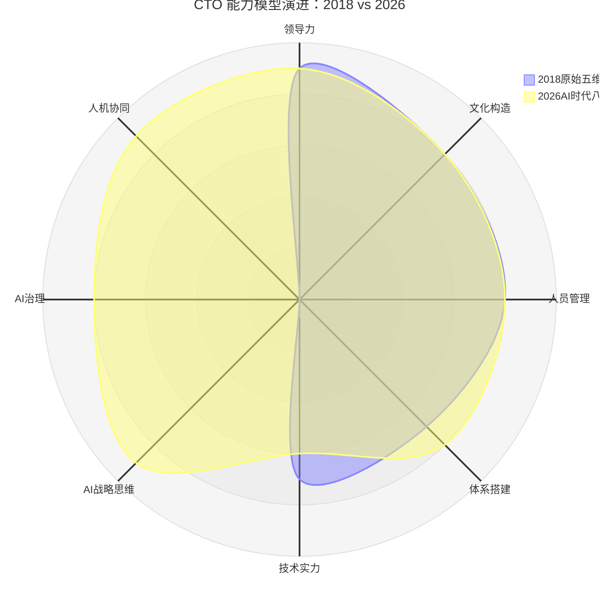
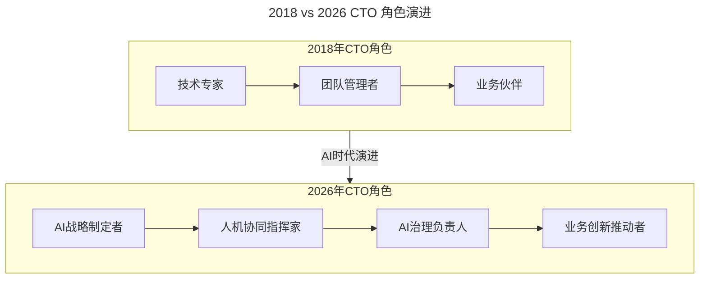

# 第1讲 | 你的能力模型决定你的职位

> **适用范围**：技术管理者（技术总监、技术 VP、首席架构师、CTO 候选人）、CEO/HR（需要发布技术高管 JD）、希望明确职业发展方向并有意培养核心能力的技术管理者。适用于技术高管岗位认知、能力模型构建、职业路径规划等场景。
>
> **更新摘要（v2 · 2026-08 更新）**：
> - 结构化升级为 6 节骨架（导言 / 核心方法论 / 关键流程 / 工具与实战 / 常见误区 / 进阶延展）
> - 整合原"AI 时代升级注解（2026）"内容，将五维能力模型升级为 AI 时代八维能力模型
> - 为全部 Mermaid 图补充 `--- title: ... ---` frontmatter，并在每张图后追加文字解读
> - 移除 4 张失效图片引用（各职位能力模型图），改用文字化描述
> - 将原"作者简介"融入导言，原"参考资料"融入进阶延展

---

## 1. 导言

### 1.1 从"就差个 CTO"说起

在投资圈里经常听到这样的话："CEO 和方案都有了，就差个 CTO 了"。技术人员听了都哈哈一笑，觉得不靠谱。但是笑过后，反思这句话，其实无论巨头公司还是初创公司，每个公司都有这个情况，有些公司真的就因为找到了合适的 CTO 崛起，有的公司因为找错了 CTO 而走上歧途，也有的 CTO 因为找错了公司而耽误了自己的时间。

究竟什么是 CTO？一个公司真的需要 CTO 么？哪些公司的职位对于技术管理者来讲真的是 CTO 的职位？同样是技术最高负责人，为什么有人叫 CTO、有人叫技术总监、技术 VP，有人叫首席架构师？他们之间的差别是什么？怎样才能成为一个合格的 CTO？

### 1.2 核心观点：职位是自己挣出来的

**"所有的职位不是别人给你的，而是你自己挣出来的"**。一个人在某一个公司一个职位 18 个月以上，基本上是获得了这个公司合伙人和其他管理者的认可，存在必合理。现存的最高技术负责人：CTO、技术 VP、技术总监、首席架构师都是合理的，一个公司最高技术负责人不一定是 CTO。

各职位之间的差异，可以从技术管理者需要的五个核心能力来区别开：**领导力、文化构造能力、人员管理能力、体系搭建能力、技术实力**。同样是最高技术负责人，在这五点能力上的强弱决定了最终自己在市场上"挣"出来的职位是什么。

### 1.3 作者简介

郭炜，易观 CTO，中国软件行业协会智能应用服务分会副主任委员，TGO 鲲鹏会北京分会董事会会长。负责构建易观技术团队、完成易观大数据采集、平台、数据挖掘等技术架构与体系；从无到有完成易观混合云的搭建、以及易观 SDK 的升级，并发布易观秒算实时计算平台。目前易观大数据平台日处理数据量 30T，272 亿条，月活用户 5.5 亿。

### 1.4 2026 年 AI 时代技术背景

2026 年，GPT-5.5 已全面商用，DeepSeek V4 开源引发全球关注，Agentic Coding（智能体编程）成为主流开发模式，Stack Overflow 2025 年调查显示 **84% 的开发者正在使用或计划在开发流程中使用 AI 编程工具**。在这个背景下，郭炜老师 2018 年提出的五维能力模型需要进行重要的时代升级。

---

## 2. 核心方法论

### 2.1 五大核心能力

#### 领导力："成事"的能力

领导力的定义有很多，管理大师德鲁克的定义是"领导力能将一个人的愿景提升到更高的目标，将一个人的业绩提高到更高的标准，使一个人能超越自我界限获得更大成就"；另一位领导力大师约翰·麦克斯威尔的定义是：领导者是知道方向、指明方向，并沿着这个方向前进的人。

而我的定义很简单：**"成事"的能力**。领导力最终是用各种各样的方法、人员、影响力、号召力、决策力将一个事情从 0 到 1 的能力，如果把事情做成 0.99，都不是领导力的体现。是否对最终结果负责，这也是所有带"O"的职位和不带"O"的职位最大的差别。

#### 文化构造能力："影响意识"的能力

文化是人类群体创造并共同享有的物质实体、价值观念、意义体系和行为方式，是人类群体的整个生活状态。对应到技术管理上，就是管理者对于大家意识的影响力，小到对于整个技术团队价值观，公司技术氛围、行为方式和状态的构造和影响能力，大到对于国内技术生态甚至国际技术生态的影响力。

文化对于公司和部门管理非常重要，它是无形之手，决定了你团队的价值观是什么，你的公司能不能招聘到高级的技术人员，在我们日常流程和管理者眼睛看不到的地方，员工是怎样工作的。

"影响意识"的能力是一个 CTO 水平高低的评判标准，也是每个"O"级别管理者能力的体现。

#### 人员管理能力："人×100"的能力

人员是一个科技企业和技术团队核心最重要的资产。如何让技术人才这样特别聪明的一群人可以高效的工作，对这些聪明人如何招、识、管、留、开，是一个技术管理者的核心技能。人员管理其中不仅仅是沟通的能力，更要是对人员素质的准确判断、员工心理、团队士气、杀伐决断、上下级管理沟通的综合能力。

从发挥人员能力的角度来看，一个好的技术人才可以做到乘以 1，一个优秀的总监可以做到乘以 10，一个卓越的 O 级别人物就要做到乘以 100。所以，人员管理的能力，简化来讲，就是管理者如何让人乘以 100 的能力。

#### 体系搭建能力："建巢、管事"的能力

体系搭建能力比较复杂，做成一个事情，不仅仅包括项目管理的能力，而且要包括从 0 开始建立选择项目管理方法、选择人员管理体系，然后再根据体系进行管理的能力。不同的公司，不同的阶段管理方法和体系都会发生一些变化，从项目管理、架构管理、到人员管理、体系管理，什么时间用什么样的管理方法，控制好质量、进度、节奏、人员是一个管理人员能力的体现。

#### 技术实力："技术肌肉"的实力

技术管理人员，技术是必不可少的。在这个维度上经常有些争论，例如"CTO 要不要是极客"、"CTO 应该不应该写代码"。我这么理解，把技术人员对比成运动员，一个人的技术能力就是他的肌肉的实力。有的人上肢力量很发达，可以举重；有的人腿部肌肉很发达，可以短跑；有的人肌肉匀称，善于马拉松。不同的技术人员、不同的职位，需要的肌肉群是不同的。没有一个人全身的肌肉都发达，也没有一个公司仅需要一种肌肉群的 CTO。

### 2.2 从五维到八维：CTO 能力模型的 AI 时代演进

原文提出的五维能力模型（领导力、文化构造、人员管理、体系搭建、技术实力）在 AI 时代依然有效，但需要扩展为**八维能力模型**，新增三个关键维度：

| 维度 | 原始定义 | 2026 年新内涵 | 重要性变化 |
|------|---------|-------------|-----------|
| 领导力 | "成事"的能力 | **成事+协同 AI 的能力** | ⬆️ 更重要 |
| 文化构造 | "影响意识"的能力 | **塑造人机协作文化** | ⬆️ 更重要 |
| 人员管理 | "人×100"的能力 | **"(人+AI)×1000"的能力** | ⬆️ 质变 |
| 体系搭建 | "建巢、管事"的能力 | **搭建 AI-Native 工程体系** | ⬆️ 质变 |
| 技术实力 | "技术肌肉"的实力 | **判断 AI 产出+架构决策+方向把控** | ➡️ 重新定义 |
| **AI 战略思维** | ❌ 新增 | 制定公司 AI 战略路线图 | 🆕 核心 |
| **AI 治理能力** | ❌ 新增 | AI 伦理、安全、合规管理 | 🆕 关键 |
| **人机协同决策** | ❌ 新增 | 人与 AI Agent 的协同决策机制 | 🆕 关键 |

图解：雷达图对比 2018 年五维模型与 2026 年八维模型。2018 模型在 AI 战略思维、AI 治理、人机协同三个维度为 0，而 2026 模型在这三个 AI 相关维度达到 8-9 分。同时技术实力维度从 7 降到 6，反映技术实现能力不再稀缺，判断力成为核心。

### 2.3 技术实力的重新定义

⭐ **2026 核心洞察**：原文将技术实力比作"运动员的肌肉"，这个比喻在 AI 时代需要重新诠释：

| 时代 | 技术实力的定义 | CTO 的角色 |
|------|---------------|----------|
| 2018 | 写代码的能力、架构设计能力、技术深度 | 技术最强的那个人（或之一） |
| 2026 | **① 判断 AI 产出质量的能力** **② 架构决策能力（特别是 AI 架构）** **③ 技术方向把控能力** **④ 识别技术 hype vs 真正价值的能力** | **技术判断力最强的人**，而非写代码最强的人 |

**具体表现**：
1. **AI 产出质量判断**：能够快速识别 AI 生成的代码是否正确、安全、可维护
2. **架构决策**：在"传统架构 vs AI-Native 架构"之间做出正确选择
3. **技术方向把控**：判断哪些 AI 技术是真正有价值的，哪些是炒作（hype）
4. **技术债务管理**：识别和管理"AI 技术债务"（如过度依赖某个 AI 模型的风险）

### 2.4 为什么"均衡型 CTO"在 AI 时代更加重要

> **原文金句**："CTO 是能力矩阵里最均衡的一个"

这一论断在 AI 时代不仅没有过时，反而**更加成立**。原因如下：

1. **AI 时代不需要"技术极客型 CTO"**
   - GPT-5.5 可以写出 90% 质量的代码
   - DeepSeek V4 可以完成复杂的系统设计和文档撰写
   - 技术实现能力已经不再是稀缺资源

2. **AI 时代最稀缺的是"整合能力"**
   - 整合：人类创意 + AI 执行能力
   - 整合：业务需求 + AI 技术方案
   - 整合：团队文化 + 人机协作模式
   - 整合：短期交付 + 长期 AI 战略

3. **AI 时代的 CTO 更像"指挥家"而非"首席乐手"**
   - 传统 CTO：可能是乐队里演奏最好的那个人
   - AI 时代 CTO：不需要演奏最好，但要知道如何让"人类乐手+AI 合成器"共同奏出最美妙的乐章

图解：2018 年 CTO 角色是线性演进的"技术专家→团队管理者→业务伙伴"，而 2026 年 CTO 角色扩展为四重身份：AI 战略制定者、人机协同指挥家、AI 治理负责人、业务创新推动者。角色维度更丰富，要求更全面。

---

## 3. 关键流程

### 3.1 四大职位的 AI 时代能力模型

根据五维能力模型，重新定义现有技术管理岗位。以下是各职位的能力侧重（原文配图为失效图片引用，已移除，用文字描述各职位能力侧重）：

#### 技术总监 → AI 时代的技术总监

技术总监要有比较强的技术基础实力和人员管理能力，主要是要能把事情完成和落地。对于小公司来讲，如果最高职位是技术总监，那么就需要技术肌肉矩阵全面的；对于大公司，技术总监意味着单项技术肌肉比较强。无论公司大小，总监级别一般都会汇报给某个业务线 VP 或者技术线 VP/CTO，因为他不是对最终结果负责的人。领导力和体系搭建能力就没有那么强，文化构造能力更要弱一些。

**⭐ 2026 升级要点**：
- ✅ **新增能力：AI 工具链管理**：管理团队使用的 AI 编程工具（Cursor、GitHub Copilot、Windsurf 等），建立 AI 代码审查标准和流程，监控 AI 生成代码的质量指标
- ✅ **新增能力：Prompt Engineering 指导**：指导团队编写高质量的提示词，建立 Prompt Library（提示词库）供团队复用
- ✅ **人员管理升级**：从"管理人"到"管理人+AI Agent 工作流"，理解每个团队成员的 AI 使用习惯和能力，合理分配"人做"和"AI 做"的任务

#### 技术 VP → AI 时代的技术 VP

技术 VP 和总监最大的差异在于体系搭建能力的增强。每一个 VP 会有一个或者多个总监来支撑，建立一套体系让技术研发高效的运转起来，体系搭建的能力甚至要高于 CTO，因为他是 CTO 的大内总管。VP 和 CTO 的最大差异是是否可以对技术的最终结果负责，不仅仅是技术本身，而是在财务、战略方向上是否具有决策力。技术 VP 一般不会直接汇报给 CEO，因为 CEO 眼里只有 0 和 1，不会接受任何理由。

**⭐ 2026 升级要点**：
- ✅ **新增能力：AI 平台工程建设**：搭建企业级 AI 开发平台（LLM Ops、Agent Ops），建立 AI 模型评估和选型标准，设计 AI 能力中台架构
- ✅ **体系搭建升级**：从传统的 CI/CD 流水线 → **CI/CD + AI Code Review + 自动化测试**；从人工代码审查 → **人机协同代码审查**（AI 初审+人工复审）；建立 AI 生成的技术债务追踪机制

#### 首席架构师 → AI 时代的首席架构师

首席架构师应该是在公司里技术最全面最强的一个人，技术肌肉和公司整个技术最匹配的人员。首席架构师可以是对商业的最终结果不负责，但是对技术整体架构、前瞻性、技术本身体系负责的人。首席架构师经常会把方案汇报给技术 VP/CTO 供选择，不会最终拍板。首席架构师的技术非常厉害，领导力和文化构造能力相对较弱。

**⭐ 2026 升级要点**：
- ✅ **新增能力：AI-Native 架构设计**：设计支持 AI 能力接入的系统架构（RAG 架构、Agent 架构、Multi-Agent 编排），评估和选择适合业务场景的 AI 模型，设计 AI 推理优化方案（缓存、量化、蒸馏）
- ✅ **技术视野升级**：不仅关注传统技术栈，还需精通：向量数据库、Embedding、Fine-tuning、RAG、Agent、Tool Use 等 AI 技术栈，理解不同 AI 技术的适用边界和局限性

#### CTO → AI 时代的 CTO

CTO 是能力矩阵里最均衡的一个，突出的能力是领导力和文化构造能力，而不是技术实力。公司小的时候，CTO 可能是公司中技术最强的那个人，但是 CTO 必须要有能力构建一个文化和体系，迅速能让比自己技术牛的人、体系搭建能力比自己强的人融入到公司，才可以让自己到更高层次上来做决策。

**⭐ 2026 升级要点**：
- ✅ **核心新增能力：AI 战略制定与治理**：制定公司 3-5 年 AI 战略路线图，决策"自建 AI 能力 vs 采购 AI 服务 vs 开源方案"，建立 AI 治理框架（数据安全、模型可解释性、算法公平性）
- ✅ **领导力升级**："整合人+AI 协同效应"的能力，能够判断哪些任务应该交给 AI，哪些必须由人来完成
- ✅ **商业决策升级**：CEO 问"要不要引入 AI"，CTO 能给出 ROI 分析和风险评估；CEO 说"全面 AI 化"，CTO 敢于说"不"并给出渐进式方案

---

## 4. 工具与实战

### 4.1 给 2026 年技术管理者的可执行建议

#### 📌 给技术总监的建议：
1. **立即行动**：本周内统计团队 AI 工具使用情况，建立 AI 工具清单
2. **技能提升**：学习 Prompt Engineering，建立团队的提示词最佳实践库
3. **流程改进**：在 Code Review 流程中加入"AI 生成代码专项检查项"

#### 📌 给技术 VP 的建议：
1. **体系建设**：Q3 前完成 AI 开发平台的选型和 POC 测试
2. **质量管控**：建立 AI 代码质量评分标准，纳入团队 KPI
3. **成本优化**：分析 AI 工具的 ROI，制定最优采购策略

#### 📌 给首席架构师的建议：
1. **架构升级**：评估现有架构的 AI 能力接入点，输出 AI-Native 改造路线图
2. **技术储备**：深入学习 RAG、Agent、Multi-Agent 等 AI 架构模式
3. **选型能力**：建立 AI 模型选型决策树，覆盖不同业务场景

#### 📌 给 CTO/准 CTO 的建议：
1. **战略规划**：制定公司 AI 战略白皮书，明确 3 年 AI 投入重点
2. **治理建设**：建立 AI 伦理委员会或指定 AI 治理负责人
3. **组织变革**：考虑设立"AI Platform Team"或"AI Center of Excellence"
4. **自我定位**：接受"我不是公司技术最强的人"这一事实，转向"我是最能整合人+AI 的人"

### 4.2 八维能力模型的自评清单

请根据以下维度给自己打分（1-10 分），找出提升方向：

| 能力维度 | 当前分数 | 目标分数 | 提升动作 |
|---------|---------|---------|---------|
| 领导力 | | 9 | |
| 文化构造能力 | | 8 | |
| 人员管理能力 | | 8 | |
| 体系搭建能力 | | 8 | |
| 技术实力（重新定义版） | | 6 | |
| **AI 战略思维** | | **9** | |
| **AI 治理能力** | | **8** | |
| **人机协同决策** | | **9** | |

---

## 5. 常见误区

### 5.1 "CTO 必须是技术最强的人"

**误区**：认为 CTO 应该写代码、技术最强，否则没有资格。

**正确认知**：如果你选择了 CTO 作为你的职业路径的话，其实你已经放弃了你是公司技术最强的那个人的成长路径。CTO 必须要有能力构建文化和体系，让比自己技术牛的人、体系搭建能力比自己强的人融入到公司，在更高层次上做决策。AI 时代尤其如此——技术实现能力不再稀缺，整合能力才是核心。

### 5.2 "CTO 要不要是极客"之争

**误区**：纠结于"CTO 要不要是极客"、"CTO 应不应该写代码"。

**正确认知**：把技术人员对比成运动员，不同职位需要不同的肌肉群。没有一个人全身的肌肉都发达，也没有一个公司仅需要一种肌肉群的 CTO。CTO 的技术肌肉通常要全身匀称的，因为他是公司里的技术肌肉教练，可以肌肉不强大，但要知道找什么样的技术肌肉团队来满足公司的需要。

### 5.3 "CTO 只对技术负责"

**误区**：CTO 只对技术本身负责，不管商业结果。

**正确认知**：CTO 要把控和技术相关的布局节奏、商业结果、公司战略、人才策略，并翻译成其他合伙人可以听懂的语言，来做"成"事。如果 CTO 只对技术着迷而对于 CEO 的融资策略、战略决策、业务布局，COO/CFO 的公司运营、财务运作没有有效建议并对结果负责的话，CTO 也很难成为公司 CEO、COO、CTO 三个重要 O 级别人物之一。

### 5.4 AI 时代的能力误区

**误区**：认为 AI 时代只需要技术实现能力，或认为 AI 会取代 CTO。

**正确认知**：AI 时代最稀缺的是"整合能力"——整合人类创意与 AI 执行、整合业务需求与技术方案、整合团队文化与协作模式。CTO 依然是那个最均衡的人，只是"均衡"的定义从"五种能力的均衡"进化成了"八种能力的均衡"，其中三种全新的能力都与 AI 相关。

---

## 6. 进阶延展

### 6.1 最后的话

郭炜老师在 2018 年提出的五维模型具有极强的前瞻性。在 AI 时代，我们不是推翻这个模型，而是在其基础上进行**时代扩展**。核心逻辑没有变——**CTO 依然是那个最均衡的人**，只是"均衡"的定义从"五种能力的均衡"进化成了"八种能力的均衡"，其中三种全新的能力都与 AI 相关。

未来的 CTO，将是**"人文素养+技术判断力+AI 战略眼光"**的三位一体者。

### 6.2 结语：模型的价值

上面用技术管理核心模型来重新定义了这几个职位。一个初级技术管理人员可以根据自己的职业发展方向有意地培养自己的能力来达到自己的目标方向；一个公司在招聘技术人员的时候也可以对号入座，构建合适的 JD 找到自己合适的人才。这个"郭氏"技术管理核心模型也是第一个版本，希望各位多给宝贵意见，促进模型本身逐步迭代，更贴近企业技术管理真实现状。

### 6.3 延伸阅读

- 系列后续文章：如何提高五方面能力的一些心得和经验（《技术领导力 300 讲》）
- TGO 鲲鹏会：https://tgo.geekbang.org

---

*本内容基于 2026 年 GPT-5.5、DeepSeek V4、84% 开发者用 AI 编程等最新技术动态编写。适用对象：技术管理者、CTO 候选人、CEO/HR。*
