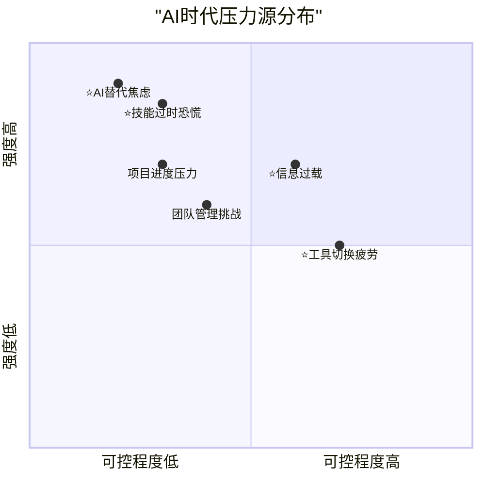
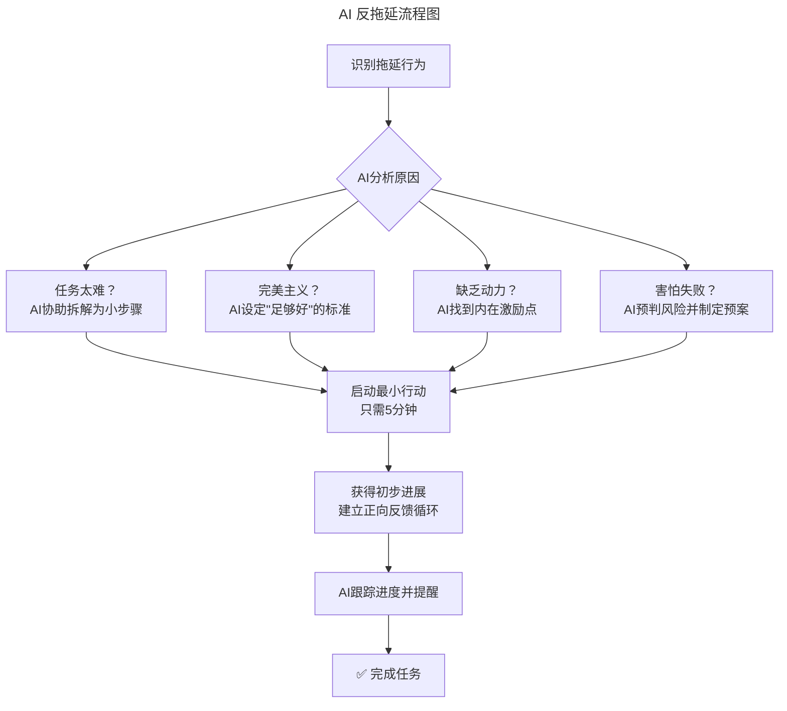
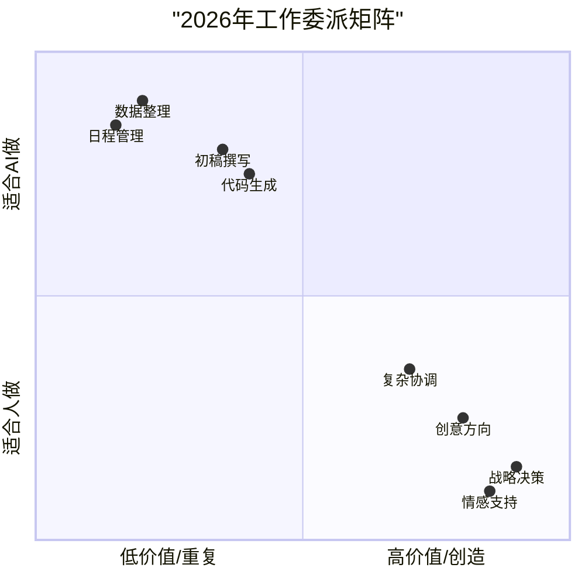
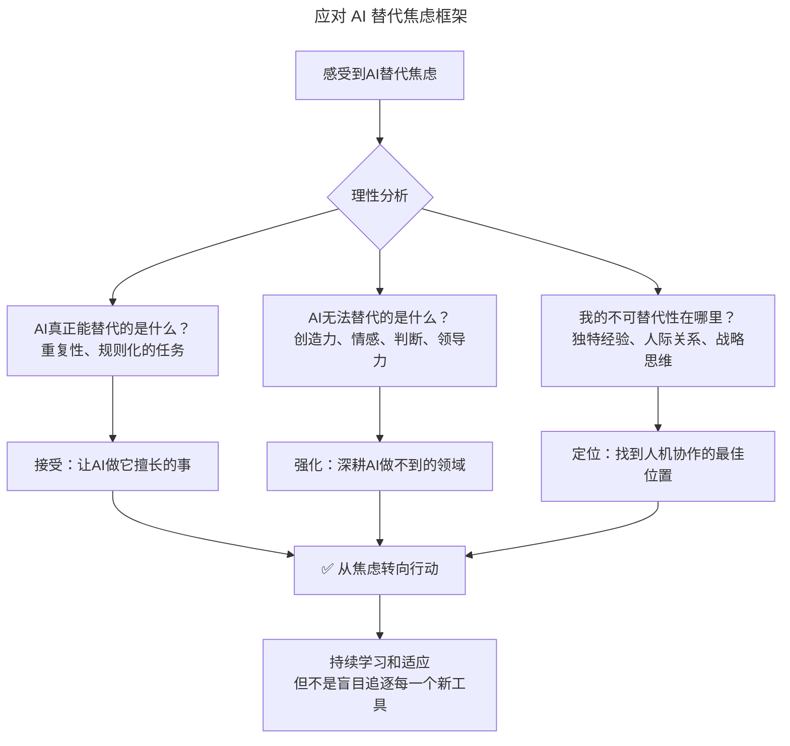

# 第107讲 | 刘俊强：消除压力的七种方法

> **适用范围**：技术管理者（一线 Tech Lead、技术总监、CTO）、团队负责人、高压环境下的工程师，以及在 AI 时代希望科学管理压力、避免成为"施压型管理者"的从业者。适用于压力管理、团队氛围建设、自我调节等场景。
>
> **更新摘要（v2 · 2026-08 更新）**：
> - 结构化升级为 6 节骨架（导言 / 核心方法论 / 关键流程 / 工具与实战 / 常见误区 / 进阶延展）
> - 整合原"AI 时代升级注解（2026）"内容，将传统七种压力应对方法升级为 AI 增强版
> - 为全部 Mermaid 图补充 `--- title: ... ---` frontmatter，并在每张图后追加文字解读
> - 保留全部 Prompt 模板、压力源分布表、AI 替代焦虑应对框架
> - 将原"作者简介"融入导言，原"思考题"融入进阶延展

---

## 1. 导言

### 1.1 压力的不可避免性

压力在工作和日常生活中是不可避免的，有些人能够在高压情况下保持冷静，并很好地完成事情，但同时有些人的抗压能力要弱些，不能够很好的应对压力所带来的影响，所以学会消除压力便至关重要。

我这里所说的压力，包括两个方面：
1. 受环境或项目进度等情况影响，自身对于现状或未来有所恐惧或担忧的心理状态，即技术管理者自身面对的压力；
2. 技术管理者的管理风格或方法，对于团队成员所造成的压力，即**施压型管理者**。

### 1.2 避免成为"施压型管理者"

首先，我们要避免成为"施压型管理者"。试想一下，你的主管把每件事情都变成一种压力，让人在恐惧和压力中完成任务或做决策，让团队成员的神经总处于紧绷状态，这样的工作氛围是极为不健康的。

通过不断的批评或威胁等工具来刺激团队完成目标，短期内可能会取得一些效果，但是我们看长远些，这种管理方法所造成的工作氛围，会让团队成员仅关注于你所关注的事务上，会追求最为安全和简单的业绩输出方式，不会敢于创新承担更多责任。**这类管理者是在消耗自己的信用，是不可持续的。**

那为何有些管理者会成为"施压型管理者"呢？主要原因在于，作为管理者所面对的压力（项目进度、团队成长等）都在挑战管理者的舒适区，身处舒适区外，会让人紧张、害怕或不知所措，从而感受到压力。当他们不能够很好地消除处理掉这些压力时，就很容易让自我的行为产生偏颇，变成"施压型管理者"。

### 1.3 七种消除压力的方法总览

要避免这种情况，就一定要简单快速地解决当前让自己感到不舒适的压力状况。七种方法是：制定计划、反复练习、避免工作中用光能量、不要拖延、不要多任务、学会委派工作、充足的睡眠。

### 1.4 作者简介

刘俊强（微信公众号：程序员精进）现任腾讯云资深架构师，曾任迅雷技术总监、某互联网公司技术副总裁，10+年以上互联网开发经验，8年以上技术管理经验。

### 1.5 2026 年 AI 时代技术背景

2026年，GPT-5.5与DeepSeek V4已深度融入工作流，84%的开发者使用AI辅助编程，Agent进入加速落地期。技术管理者的压力源发生了根本性变化，传统的压力管理方法需要升级。

---

## 2. 核心方法论

### 2.1 压力源的时代变化：传统压力源 vs AI 时代新增压力源

原文开篇就指出"压力在工作和日常生活中是不可避免的……学会消除压力便至关重要"。在2026年，这个论断不仅依然成立，而且**压力的来源和性质发生了重大变化**。



图解：AI 时代压力源分布矩阵中，AI 替代焦虑（0.2, 0.9）和技能过时恐慌（0.3, 0.85）位于"强度极高+可控程度低"的左上角区域，是 2026 年技术管理者面临的最大、最普遍、最棘手的新型压力源。

| 压力类型 | 传统时期 | ⭐2026 AI时代 | 影响程度 |
|---------|---------|--------------|---------|
| **项目进度压力** | 主要压力源之一 | 依然存在，但AI可辅助缓解 | ⭐⭐⭐ 中等 |
| **团队管理挑战** | 核心压力源 | 形态变化（远程/混合团队） | ⭐⭐⭐ 中等 |
| **⭐AI替代焦虑** | 不存在 | **全新且普遍** | ⭐⭐⭐⭐⭐ 极高 |
| **⭐技能过时恐慌** | 周期较长 | **加速到月级别** | ⭐⭐⭐⭐⭐ 极高 |
| **⭐信息过载** | 已经存在 | **指数级恶化** | ⭐⭐⭐⭐ 高 |
| **⭐工具切换疲劳** | 轻微存在 | **显著加剧** | ⭐⭐⭐ 中等 |

### 2.2 七种压力应对方法的 AI 增强框架

原文提出的七种方法（制定计划、反复练习、避免用光能量、不要拖延、不要多任务、学会委派、充足睡眠）在 AI 时代都可以被显著增强。核心方法论是：**传统方法应对传统压力源，AI 增强方法应对 AI 时代新增压力源**。

---

## 3. 关键流程

### 3.1 方法一：制定计划 → AI 智能规划

**原文要点**："面对需要在限定时间内完成的工作……通过制定计划，确定每个阶段需要哪些资源和预估时间。"

**⭐2026 AI增强版本**：

| 传统做法 | ⭐2026 AI增强做法 | 效果提升 |
|---------|------------------|---------|
| 手动拆解任务 | AI自动将大目标拆解为可执行的小任务 | 计划制定时间减少70% |
| 凭经验估算时间 | AI基于历史数据预测更准确的时间估算 | 估算准确度提升40% |
| 静态计划 | AI动态调整计划，适应变化 | 计划灵活性提升50% |
| 单一方案 | AI生成多个备选方案（Plan B/C） | 风险应对能力增强 |

**⭐ 智能规划的Prompt模板**：
```
我面临以下工作压力，需要制定一个应对计划：
当前状况：
- 待完成的工作：[列举及截止日期]
- 可用资源：[人力/时间/预算]
- 已有的约束条件：[列举]
- 我的担忧：[具体描述]

请帮我：
1. 将所有工作按照重要性和紧急程度排序（艾森豪威尔矩阵）
2. 为每项工作生成详细的执行计划（包含里程碑）
3. 识别最关键的3个风险点及应对策略
4. 建议一个合理的时间分配（包含缓冲时间）
5. 如果无法全部完成，建议优先取舍的原则
```

### 3.2 方法二：反复练习 → AI 模拟演练

**原文要点**："对于产品介绍、技术演讲以及团队动员会等非技术领域的事务……消除这类事务压力的方法便是反复练习。"

**⭐2026 AI增强版本**：

| 练习场景 | 传统做法 | ⭐2026 AI增强做法 |
|---------|---------|------------------|
| **演讲准备** | 对着镜子或同事练习 | AI作为听众提供实时反馈 |
| **汇报演练** | 默念或写逐字稿 | AI模拟领导提问并评估回答质量 |
| **面试准备** | 刷题和背答案 | AI进行多轮模拟面试并提供改进建议 |
| **谈判准备** | 想象对方反应 | AI扮演对手角色进行博弈模拟 |

### 3.3 方法三：避免用光能量 → AI 辅助精力管理

**原文要点**："一个人的身体和精力是有上限的，不要让自己和团队在工作中用光能量进而产生倦怠。"

**⭐2026 AI增强版本**——**AI时代的新挑战：数字倦怠（Digital Burnout）**：

| 倦怠类型 | 表现 | AI如何帮助预防 |
|---------|------|---------------|
| **信息倦怠** | 处理过多信息和通知 | AI过滤和优先级排序，只推送重要信息 |
| **决策疲劳** | 持续做选择导致疲惫 | AI提供建议减少决策负担 |
| **连接疲劳** | 过度的在线沟通和会议 | AI自动化常规沟通，减少不必要的同步 |
| **学习疲劳** | 追赶新技术导致认知超载 | AI个性化学习路径，聚焦最相关的内容 |

**如何面对压力并避免倦怠**：
1. 保持跟团队成员的沟通，了解他们的工作状态和感受，形成定期沟通模式；
2. 如果压力过大产生了倦怠前兆，可以尝试放慢下速度，重新考虑团队追求的整体目标以及项目目标；
3. 提供团队所需的支持和资源，通过快速会议、消息群组以及电子邮件等方式分享好消息，鼓励团队，也可以通过团队聚餐或其他放松活动来提升团队效率。

### 3.4 方法四：不要拖延 → AI 反拖延系统

**原文要点**："对于那些明显重要但看起来麻烦的事情，我们可能会选择拖啊拖……这些困难或糟心的事情不会因为我们拖延而消失。"

**⭐2026 AI增强版本**：



图解：AI 反拖延流程图先识别拖延行为，再由 AI 分析根本原因（任务太难/完美主义/缺乏动力/害怕失败），针对不同原因采取对应策略，最终都导向"启动最小行动（只需5分钟）"，通过获得初步进展建立正向反馈循环，由 AI 跟踪进度并提醒直至完成任务。

### 3.5 方法五：不要多任务 → AI 专注助手

**原文要点**："让我们工作舒适的重要的一点便是不要多任务处理事情……不同事情间的切换会让我们的大脑感受到压力。"

**⭐2026 AI增强版本**——**AI时代的多任务新形态：上下文切换成本激增**：

| 问题 | 传统环境 | ⭐2026 AI时代 | 加剧原因 |
|------|---------|--------------|---------|
| 任务切换 | 在文档间切换 | 在AI工具、代码、文档、会议间频繁切换 | 工具数量爆炸 |
| 注意力分散 | 同事打扰 | 即时消息+邮件+AI通知+社交媒体 | 数字干扰无处不在 |
| 信息碎片化 | 已经存在问题 | AI生成的大量内容需要筛选和处理 | 信息产出指数增长 |

**AI作为专注助手的解决方案**：

| AI功能 | 具体做法 | 效果 |
|--------|---------|------|
| **智能通知管理** | AI根据重要性过滤和批量处理通知 | 减少80%的无意义打断 |
| **专注模式设置** | AI在深度工作时段屏蔽非紧急通知 | 保护连续的专注时间 |
| **任务队列管理** | AI收集所有 incoming 任务并智能排序 | 不再担心遗忘重要事项 |
| **上下文快速恢复** | AI记录每个任务的进度和状态 | 减少切换时的"热身"时间 |

### 3.6 方法六：学会委派工作 → AI+人的委派矩阵

**原文要点**："作为技术管理者……工作事务是做不完的……你需要用你的知识、技能和方式去带领团队成功，而并不是要当一个全能的超级英雄。"

**⭐2026 AI增强版本**——**委派对象的革命性扩展：从"委派人"到"委派AI"**：



图解：2026 年工作委派矩阵将任务按"价值高低"和"适合谁做"两个维度定位。数据整理、日程管理等低价值重复任务适合 AI；战略决策、情感支持、创意方向等高价值任务必须人亲自做；复杂协调介于中间。管理者需识别并聚焦"高杠杆活动"。

**⭐ 委派决策树**：

| 任务特征 | 应该委派给谁 | 理由 |
|---------|------------|------|
| **规则明确、大量重复** | **AI/Agent** | 效率最高，质量稳定 |
| **需要判断但流程清晰** | **团队成员** | 培养能力，分担工作量 |
| **高价值、需要创造力** | **自己做（AI辅助）** | 核心竞争力所在 |
| **涉及人际关系和情感** | **必须亲自做** | AI完全无法替代 |

### 3.7 方法七：充足的睡眠 → AI 辅助睡眠优化

**原文要点**："充足的睡眠对于消除压力至关重要……保证充足的睡眠非常关键。"

**⭐2026 AI增强版本**——**AI时代的新睡眠杀手**：

| 睡眠障碍 | 传统原因 | ⭐2026新增原因 | AI如何帮助 |
|---------|---------|--------------|-----------|
| **入睡困难** | 思虑过多 | **睡前刷AI生成的无限内容** | AI设置"数字宵禁"提醒 |
| **睡眠质量差** | 环境因素 | **蓝光设备+信息过载刺激大脑** | AI优化睡前环境和习惯 |
| **作息不规律** | 工作加班 | **随时可用的AI工具模糊边界** | AI强制执行作息规律 |
| **早醒/多梦** | 压力焦虑 | **对AI替代的职业焦虑** | AI提供认知重构和放松指导 |

---

## 4. 工具与实战

### 4.1 AI 时代的新型压力：AI 替代焦虑

这是2026年技术管理者面临的**最大、最普遍、最棘手**的压力源。

**AI替代焦虑的表现**：

| 焦虑类型 | 内心独白 | 现实检验 |
|---------|---------|---------|
| **"我会被AI取代"** | "AI什么都能做，还要我干什么？" | AI是工具，你是决策者和连接者 |
| **"我的经验没用了"** | "花了10年积累的经验，AI一秒钟就学会了" | 经验包含隐性知识，AI难以完全复制 |
| **"跟不上变化了"** | "刚学会一个工具，又出来新的了" | 掌握核心原理比追赶工具有效 |
| **"年轻人比我强"** | "年轻人学AI更快，我没机会了" | 你的优势是判断力和经验，不是速度 |

**应对AI替代焦虑的框架**：



图解：应对 AI 替代焦虑框架通过理性分析三个问题——AI 能替代什么、AI 无法替代什么、我的不可替代性在哪里，分别导向"接受/强化/定位"三个行动方向，最终从焦虑转向行动，持续学习适应而非盲目追逐工具。

### 4.2 AI 无法替代的压力缓解方式

尽管AI可以在很多方面帮助我们应对压力，但有些核心的压力缓解方式是**AI完全无法替代**的：

| AI无法替代的方式 | 为什么重要 | 如何加强 |
|----------------|-----------|---------|
| **真实的人际连接** | 人类是社会性动物，需要真实的互动和归属感 | 定期与朋友家人面对面交流 |
| **身体活动和运动** | 身心一体，身体的释放直接影响情绪 | 保持规律的运动习惯 |
| **接触大自然** | 自然环境有独特的治愈效果 | 定期户外活动，哪怕只是散步 |
| **正念和冥想** | 与当下的连接，超越思维的宁静 | 每日练习，哪怕只有5分钟 |
| **创造性的表达** | 通过创作实现自我价值和意义感 | 培养一个非工作的兴趣爱好 |
| **帮助他人** | 利他行为带来深层的满足感和意义 | 志愿服务、mentoring 等 |

### 4.3 效果提升数据（2026 行业观察）

根据WHO 2025-2026职场心理健康调研：

- 使用AI辅助压力管理的技术管理者，**职业倦怠率降低30%**
- 系统化的工作委派（含AI）使**每周有效工作时间提升25%**
- AI辅助的睡眠优化使**睡眠质量评分平均提高20%**
- 但需要注意：**过度依赖AI应对压力会导致自我调节能力退化**

### 4.4 给技术管理者的 ⭐2026 行动建议

1. **本周行动**：使用"精力管理Prompt模板"评估自己当前的倦怠风险，制定第一周的调整计划
2. **本月目标**：建立个人的"压力应对工具箱"，包括AI辅助方法和非AI方法（各占50%）
3. **季度复盘**：回顾压力来源的变化趋势，识别AI时代的新型压力源并及时调整应对策略

---

## 5. 常见误区

### 5.1 成为"施压型管理者"

**误区**：通过不断批评或威胁刺激团队完成目标。

**正确认知**：这种管理方法短期内可能有效，但长远看会破坏工作氛围，让团队成员只追求最安全的业绩输出，不敢创新。**这类管理者是在消耗自己的信用，是不可持续的。**

### 5.2 用光能量导致职业倦怠

**误区**：面对压力时屈服于压力，一直处于高压情况下工作，用光能量。

**正确认知**：一直处于高压工作，很容易让人感觉自己对工作没有控制权，或工作输出没有被认可，产生职业倦怠。要保持自己和团队的持续战斗力，而不是一次战役便压榨光大家的精力。

### 5.3 拖延困难任务

**误区**：先处理简单事情，把困难事情拖到之后再做。

**正确认知**：这些困难或糟心的事情不会因为我们拖延而消失，而是会不断占领我们的心智，反而让人感到焦虑和压力。不要拖延任何事情。

### 5.4 多任务处理

**误区**：试图一次做几件事情。

**正确认知**：人类思维并不是为多任务而设计的，不同事情间的切换会让大脑感受到压力，让表现更差。将事情写在待办事项列表中，一次完成一个。

### 5.5 过度依赖 AI 应对压力

**误区**：所有压力都靠 AI 工具来解决。

**正确认知**：过度依赖AI应对压力会导致自我调节能力退化。应建立"压力应对工具箱"，包括AI辅助方法和非AI方法（各占50%）。真实的人际连接、运动、大自然、正念冥想、创造性表达、帮助他人是 AI 无法替代的核心缓解方式。

---

## 6. 进阶延展

### 6.1 传统方法的时间管理价值

**方法四（不要拖延）与方法五（不要多任务）**：处理事情时先处理简单或看起来不难的事情，把困难事情拖到之后做，部分压力便来自于这样的情况。把待办事项上的事情拿出来做吧。不要试图一次做几件事情，将事情写在待办事项列表中，然后一次完成一个。

**方法七（充足睡眠）**：可能有些人心比较重，一旦有压力就会一直想着，影响睡眠。这里有个非常古典但行之有效的方法可以帮助入睡，那就是看书，可以阅读跟自己工作内容相关书籍（如管理类），很快就能够让自己入睡。小说之类的书籍坚决不要在睡前阅读。

### 6.2 思考题

想想自己最近的行为，是不是属于"施压型管理者"呢？

### 6.3 2026 年核心结论

传统压力源依然存在，但 AI 时代新增了 AI 替代焦虑、技能过时恐慌、信息过载、工具切换疲劳等新型压力源。核心方法论是：**传统方法应对传统压力源，AI 增强方法应对 AI 时代新增压力源**。但请记住——真实的人际连接、运动、大自然、正念冥想、创造性表达、帮助他人是 **AI 无法替代** 的核心压力缓解方式。

### 6.4 延伸阅读

- 一对一沟通主题可参考本库《说说硅谷公司中的一对一沟通》（技术管理实践系列）→ 了解如何通过高质量沟通减轻团队管理压力
- 会议效率与沟通技巧相关文章（《技术领导力 300 讲》）→ 了解如何减少无效会议与沟通误解带来的压力

---

*本内容基于2026年6月的技术环境编写，随着AI能力演进，建议每季度回顾更新。如果你正在经历严重的压力或焦虑，请务必寻求专业心理健康支持。适用对象：技术管理者、团队负责人、高压环境下的工程师。*
