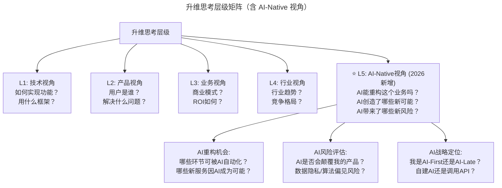

# 大咖对话 | 技术人真正需要的是升维思考

> **适用范围**：技术管理者、创业者、产品经理、架构师、希望从技术视角提升到业务与商业视角的技术从业者，以及在 AI 时代希望掌握升维思考、把握商业趋势、树立技术品牌的技术人。适用于技术管理、产品思维、创业、技术品牌建设等场景。
>
> **更新摘要（v2 · 2026-08 更新）**：
> - 结构化升级为 6 节骨架（导言 / 核心方法论 / 关键流程 / 工具与实战 / 常见误区 / 进阶延展）
> - 整合原"AI 时代升级注解（2026）"内容，将升维思考升级为 2026 年 L5 AI-Native 视角
> - 为 Mermaid 图补充 `--- title: ... ---` frontmatter，并追加文字解读
> - 移除 1 张失效图片引用（嘉宾照片），改用文字描述
> - 将原"行动清单"与"核心金句"融入进阶延展

---

## 1. 导言

### 1.1 对话嘉宾

今天与我们对话的嘉宾是七牛云创始人兼 CEO 许式伟。

许式伟曾在金山、盛大等知名互联网公司担任重要技术岗位，从事核心产品研发。2011 年，他与吕桂华一起创立七牛云，专注以数据为中心的公有云服务市场。此外，他也是国内 Go 语言实践圈子公认的 Go 语言专家，著有国内第一本 Go 语言图书《Go 语言编程》。今天我们请他来聊一聊技术人怎样提升产品思维，以及如何把握商业趋势。

### 1.2 访谈主题

本次访谈围绕四个核心问题展开：技术管理者为什么必须具备产品思维？技术人创业如何准确把握商业发展趋势？创业公司如何更好地树立技术品牌？Go 语言的发展情况如何？

### 1.3 大咖核心观点回顾

1. **产品思维 = 业务思维** - 思考用户价值，甚至商业层面（价格、营收、利润）
2. **管理者两大核心能力** - 判断力（避开无用功）+ 协调能力（高效协同）
3. **升维思考 > 换位思考** - 将个人目标与大目标强关联，需要全局视角
4. **技术人创业建议** - 忘记自己是技术人，把自己当做产品人，热爱产品才能发现真痛点
5. **技术品牌建设** - 七牛云通过 Go 语言书籍和技术分享快速建立技术品牌

---

## 2. 核心方法论

### 2.1 产品思维 = 业务思维

产品思维从本质上讲，就是业务思维，就是要去思考产品的用户价值，甚至更进一步需要考虑商业的层面，思考怎么才能卖出更高的价格或者卖更多的产品，从而产生更大的营收和利润。

技术管理者首先是一个管理者，为一个团队的前途负责，其次才是一个技术人员。**管理者最核心的能力不是团队管理能力，而是以下两点**：

1. **判断力**：如何避开错误的和没必要做的事情，集中精力到最必要和最正确的事情上，从而让团队尽量少做无用功；
2. **协调能力**：如何和其他团队进行高效协同，从而为团队构建最好的工作环境。

要达到以上两个能力，都需要以超脱技术，也超脱自己团队的全局视角看问题，即以达成大家共同目标的角度去看问题。

### 2.2 升维思考 > 换位思考

我们平时强调沟通时经常说要学会换位思考，其实真正需要的是**升维思考**。为达成自己的目标，就得将自己的目标和大目标进行强关联。归根到底就是需要比较强大的产品思维。

提升产品思维关键是要提升思考方法。从代码和架构提升到业务层，从后方的研发办公室前移到客户现场，并理解到自己所做的工作对于客户的影响面，从而真正意识到公司里每一个岗位对于完成客户需求所各自具备的重要性，从而学会收起自己的自大心理，真正尊重公司里的每一位同事。**尊重是换位思考的关键前提**。

### 2.3 技术人创业：忘记技术身份，做产品人

一个人是否懂技术对于把握商业趋势并没有明显关联性。尽可能了解行业发展趋势的唯一办法就是深入而透彻的研究这个行业。因此对于这个问题的建议是：**别把自己的技术能力当回事**。就算之前是技术大佬，也应该把自己当小白，怀着敬畏之心好好学习商业知识，认真倾听用户的声音，洞察需求的演进方向。

最最重要的是，要热爱自己做的产品。只有热爱产品的人才会没日没夜的琢磨产品的细节，才能切身感受到用户仍然未决的痛点。所谓商业发展，不就是更好的解决客户的痛点吗？

技术人创业，在思考商业发展趋势的时候，不妨先忘记自己是个技术人，要把自己看做是个产品人。技术人的视角是怎么把东西做出来，而产品人的视角是用户怎么用这个产品。当然，懂技术的产品人是有一定优势的，如果他的技术视野足够宽广的话，他就有可能先于他人发现将技术应用于新市场的机会。

### 2.4 技术品牌建设方法论

从树立技术品牌的角度看，**最关键是要先定义好公司的技术主线，并致力于成为这条主线的行业内第一的地位**。比如七牛云的技术主线就是围绕海量数据的复杂系统工程，从语言的选择，架构的选择，产品的设计和发展都围绕着这条主线。

因为大多数创业公司的产品都不是技术类产品，因此打造技术品牌会更有难度一些，但也很容易找到很多方法。**所有品牌建设方法中，参与开源社区的工作被证明是效果非常突出的一种方式**。

### 2.5 观点的 AI 时代验证

| 原始观点 | 2026 年验证 | 验证结果 |
|---------|-----------|---------|
| 产品思维 = 业务思维 | ⭐ **完全成立且更加迫切**。AI 时代技术门槛降低，**业务洞察成为真正的护城河** | ✅ 强化 |
| 判断力 + 协调能力 | ⭐ **需扩展为三维**：判断力 + 协调能力 + **AI 资源编排能力** | 🔧 扩展 |
| 升维思考 | ⭐ **从"业务升维"到"AI 升维"** | ✅ 演进 |
| 技术人创业要忘掉技术身份 | ⭐ **部分成立**。应用层创业成立；**AI Infrastructure 创业技术深度仍是核心壁垒** | ⚠️ 细分 |
| 技术品牌通过开源建立 | ⭐ **依然有效但方式变了**。最快方式是**开源 AI 项目/模型/Agent 框架** | ⚠️ 形式变化 |

---

## 3. 关键流程

### 3.1 2026 年版的"升维思考"矩阵

图解：升维思考层级矩阵从 L1 技术视角逐步升维到 L5 AI-Native 视角。大多数技术人卡在 L1-L2，优秀的管理者达到 L3-L4，**2026 年的顶尖人才必须能达到 L5**——能看到 AI 带来的结构性变革机会。L5 视角包含 AI 重构机会、AI 风险评估、AI 战略定位三个维度。

### 3.2 技术品牌建设流程：七牛云的实践

从七牛云自身的实践看来，树立一个良好的技术品牌可以帮助公司吸引更多的优秀技术人才，并进而吸引非技术类人才的加盟。要做到这一点，不仅仅需要大量的精力投入，相应的资金支持也不可或缺。

七牛云早期在产品都还没正式上线的时候就写了《Go 语言编程》这本书。一方面写书是最好的说明自己是某方面专家的方式，另一方面在那个时间点选择 Go 语言也非常能够说明我们团队的独到眼光和品味。结合一些规模较小的高端架构类技术交流会议上的密集分享，我们就快速成功打造出了七牛云这个技术品牌。

### 3.3 Go 语言的选型决策流程

我与 Go 语言的缘分始于 2007 年，但真正开始使用是 2011 年 6 月，我们离开盛大创新院创办七牛云的时候。当时我面临着第三次技术选型，我很坚决地选择了 Go 语言，因为我认为 Go 真的是一门革命性的语言。

到了 2014 年，在七牛云决定进入大数据领域时，我们再一次面临技术选型问题。从生态来说，选择 Java，或者某种 JVM 平台的语言有非常显著的优势。但我们认为未来 Go 会占领整个基础设施领域，而大数据无疑是其中极具关键意义的一个领域。所以面向现在做选型，还是面向未来做选型，这是一个问题。

最终七牛云大数据的负责人陈超决定用 Go 做 Pandora。他的理由是：**极低的学习成本，极低的心智负担**。如果用 Scala，新人入职要培训，还要担心写出糟糕的 Scala 代码。但是用 Go 新人不培训直接上岗，几次 Code Review 完后基本就能够知道怎么写出质量不错的 Go 代码了。

---

## 4. 工具与实战

### 4.1 "忘记技术人身份"的 2026 修正版

许式伟原话："别把自己的技术能力当回事"。

| 场景 | 2019 年建议 | 2026 年建议 |
|-----|-----------|-----------|
| 应用层/SaaS 创业 | ✅ 忘掉技术身份，专注产品和用户 | ✅ 依然成立，但要**懂得如何用 AI 加速产品开发和运营** |
| AI 工具/平台创业 | （未涉及） | ❌ 不能忘掉技术身份！**AI 基础设施创业的核心就是技术壁垒**（算法创新、系统架构、性能优化） |
| AI 咨询/服务创业 | （未涉及） | ⚠️ 需要"技术+商业"双重视角，纯技术或纯商业都走不通 |
| 传统行业数字化转型 | ✅ 先理解行业再谈技术 | ✅ 成立，但要用**AI 作为切入点**（如"我用 AI 帮你降本 30%"更有说服力） |

### 4.2 判断力的 AI 时代新内涵

许式伟提到"判断力 = 避开错误和不必要的事"，2026 年增加了新的判断维度：

| 判断类型 | 2019 年 | 2026 年新增 |
|---------|-------|-----------|
| 技术选型 | 这个框架适合吗？ | + 这个 AI 模型适合吗？调用成本可控吗？ |
| 需求优先级 | 这个功能值得做吗？ | + 这个功能应该由 AI 还是人类完成？ |
| 架构决策 | 这个方案可扩展吗？ | + 这个方案能支持未来 AI 能力的集成吗？ |
| 团队配置 | 需要招多少人？ | + 多少工作可以交给 AI Agent？人类团队该聚焦哪里？ |
| 投入产出比 | ROI 是多少？ | + AI 投入的 ROI（包括隐性成本：数据清洗、Prompt 调试、错误处理）？ |

### 4.3 技术品牌建设的 AI 时代策略

七牛云通过《Go 语言编程》建立品牌（2019 年策略），2026 年的快速品牌建设策略：

| 策略 | 周期 | 影响力 | 适用对象 |
|-----|------|-------|---------|
| 写技术书 | 12-18 个月 | ⭐⭐⭐ | 长期品牌积累 |
| 开源项目 | 6-12 个月 | ⭐⭐⭐⭐ | 有一定用户基数的团队 |
| **AI 开源模型/Agent** | **1-3 个月** | **⭐⭐⭐⭐⭐** | **2026 年首选！** |
| 技术博客/短视频 | 持续 | ⭐⭐⭐ | 个人 IP 建设 |
| AI Demo/Tutorial | 1-2 周 | ⭐⭐⭐⭐ | 快速获客 |

**案例**：某初创公司开源了一个垂直领域的 RAG 框架，3 个月内 GitHub 10K+ Stars，直接带来 200+ 企业客户咨询。

---

## 5. 常见误区

### 5.1 死抱技术荣誉不放

**误区**：技术人创业时，死抱着自己的技术荣誉不放，不愿把自己当小白。

**正确认知**：就算之前是技术大佬，也应该把自己当小白，怀着敬畏之心好好学习商业知识，认真倾听用户的声音，洞察需求的演进方向。不要死抱着自己的技术荣誉不放。

### 5.2 所有场景都"忘掉技术身份"

**误区**：以为"忘记技术人身份"适用于所有创业场景。

**正确认知**：对于应用层/SaaS 创业成立；但对于 **AI Infrastructure 创业（如新框架、新模型架构），技术深度仍是核心壁垒**。AI 咨询/服务创业需要"技术+商业"双重视角。

### 5.3 用技术视角替代产品视角

**误区**：只从技术视角思考"怎么把东西做出来"，忽视产品视角"用户怎么用这个产品"。

**正确认知**：技术人的视角是怎么把东西做出来，而产品人的视角是用户怎么用这个产品。提升产品思维关键是要提升思考方法，从代码和架构提升到业务层，从后方的研发办公室前移到客户现场。

### 5.4 认为懂技术就能把握商业趋势

**误区**：认为懂技术对于把握商业趋势有明显关联性。

**正确认知**：一个人是否懂技术对于把握商业趋势并没有明显关联性。尽可能了解行业发展趋势的唯一办法就是深入而透彻的研究这个行业。

---

## 6. 进阶延展

### 6.1 ⭐2026 行动清单

**对于想提升思维层级的技术人**：
- [ ] **练习"L5 思考法"**：每接到一个需求，多问一句"如果用 AI 来做这件事，会有什么不同？"
- [ ] **建立"AI Opportunity Radar"**：每周花 1 小时扫描你所在行业的 AI 应用案例，寻找灵感
- [ ] **学习一个非技术领域的知识**：如商业模型、心理学、设计思维——跨界知识是升维的基础
- [ ] **尝试"反向思考"**：如果我是 CEO/投资人/用户，我会怎么看这个问题？

**对于技术管理者**：
- [ ] **在团队中推广"升维文化"**：鼓励工程师跳出代码层面思考业务价值和 AI 可能性
- [ ] **重新设计 Review 机制**：Code Review 之外，增加"Business Value Review"和"AI Opportunity Review"
- [ ] **投资团队的"AI Literacy"**：不要求每个人成为 AI 专家，但要让每个人具备 AI 基本认知

**对于创业者**：
- [ ] **先做"Problem Fit"再做"AI Fit"**：先确认解决了真实的用户痛点，再考虑如何用 AI 增强
- [ ] **建立"Technical Moat"意识**：即使不做硬科技，也要思考什么让你的 AI 应用难以被复制（数据？场景？网络效应？）
- [ ] **用 AI 加速品牌建设**：开源一个有价值的 AI 工具/模板/Demo，快速建立技术影响力

### 6.2 核心金句（2026 版）

> **"升维思考的最高境界不是站在楼顶看风景，而是站在 AI 的角度重新想象这座楼该怎么建。"**

> **"2026 年最有价值的技术人不是写出最优代码的人，而是能回答'我们到底该不该用 AI 解决这个问题'的人。"**

> **"忘记技术身份的前提是你已经强到不需要用它来证明自己——而在 AI 时代，这种强大指的是商业洞察力而非代码能力。"**

### 6.3 延伸阅读

- 《Go 语言编程》，许式伟 著
- TGO 鲲鹏会技术管理系列文章（《技术领导力 300 讲》）

---

*本内容基于 2026 年 GPT-5.5、DeepSeek V4、84% 开发者用 AI 编程等最新技术动态编写。适用对象：技术管理者、创业者、产品经理、架构师。*
