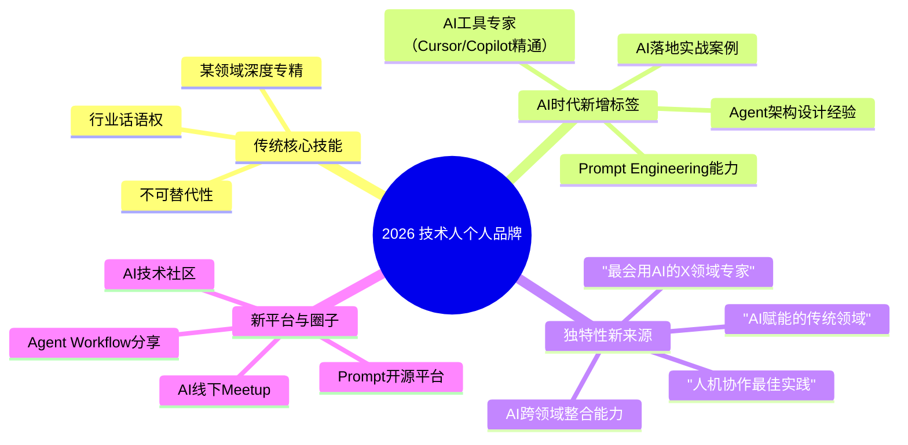

# 大咖对话 | 谢孟军：技术人如何建立自己的个人品牌

> **适用范围**：技术从业者、技术管理者、渴望提升个人影响力与品牌的技术人、开源项目维护者，以及在 AI 时代希望建立差异化个人品牌的技术专家。适用于个人品牌建设、职业影响力提升、开源与业务平衡等场景。
>
> **更新摘要（v2 · 2026-08 更新）**：
> - 结构化升级为 6 节骨架（导言 / 核心方法论 / 关键流程 / 工具与实战 / 常见误区 / 进阶延展）
> - 整合原"AI 时代升级注解（2026）"内容，将三步走战略升级为 AI 时代个人品牌新维度
> - 为 Mermaid 图补充 `--- title: ... ---` frontmatter，并追加文字解读
> - 将原"核心金句"融入进阶延展

---

## 1. 导言

### 1.1 对话嘉宾

本周作客大咖对话的是积梦智能创始人兼 CEO 谢孟军，他也是 TGO 上海分会会长。谢孟军是知名 Go 语言专家，Gopher China 创始人，著名开源框架 beego 开发者，畅销书《Go Web 编程》作者，曾就职于 Apple、盛大云。本周，我们跟他聊了聊技术人打造个人影响力那些事儿。

### 1.2 个人品牌的重要性

对技术人来讲，良好的个人品牌是非常重要的，它体现了你在别人心目中的价值、能力以及作用，是你职业生涯中的第二个自我，它影响着别人对你的看法，也能把别人对你的看法变成机会。

回到如何打造个人品牌，可以从三个方面出发：第一是个人核心技能的打造，第二是打造自己的独特性，第三是找平台+建立圈子。

### 1.3 核心观点回顾：三步走战略

1. **核心技能打造**：聚焦 + 开阔眼界
2. **独特性塑造**：多样化技能 + 兴趣爱好
3. **平台 + 圈子**：分享、建立社区

### 1.4 核心金句

> "写一篇文章爆红是眼球不是品牌；写一百篇文章篇篇有人看是积累也不是品牌；但是每年写一百篇文章坚持了七年，提起某个领域大家首先想到的就是你，这才是品牌。"

---

## 2. 核心方法论

### 2.1 个人核心技能的打造

个人核心技能是指你在某一个领域是否足够精专，是否具备足够的核心竞争力。最直接体现在你在这个工作岗位上的不可替代性程度，你的不可替代性越强，就说明你越有核心竞争力，反之亦然。间接则体现在你在公司或是这个领域中的话语权及权威性。具体打造的话，可以从**聚焦和开阔眼界**两个方面着手。

**首先是聚焦**：一定要发现并聚焦到自己最擅长的领域，然后专注这个领域，不断精进和优化自己的能力，成为该领域的专家。以 Go 语言为例，Go 其实是一个很大的技术领域，所以你需要聚焦到更小的技术方向上，比如专攻 Go 中的 API 这一技术点。然后不断的学习、不断的深挖，在这个具体方向上做到最好，同时积极参与社区，逐渐成为这方面有话语权的专家。

**其次是开阔眼界**：如果专注在一个领域或平台太久，你会发现自己的思路、格局都会受到限制。这个时候就必须向外探索，看看外面的世界，看看行业的整体情况，看看其他大牛的实践是怎样的，吸收其中的精华，再找到自己的差距。回来后，再快速地聚焦专注到自己的主攻方向，不断地精进，再外化，这样内外兼攻，快速打磨自己的核心竞争力。

### 2.2 打造自己的独特性

除了技术功底扎实外，如果想打造个人品牌，就一定要找到自己的个人特色，打造自己的独特性。

而独特性，一般由核心技能之外的多样化技能构成，比如你程序员里最会演讲的、最会写文章的、最会做 PPT 的等等，这些都是很好的标签。这样，如果公司有一个去知名技术大会分享的机会，你就可能是领导第一个想到的人。

除了多样化的技能之外，还可以多发展一些兴趣爱好，积攒几个真正能拿得出手的，比如你摄影很厉害、踢球很厉害、跑马拉松很厉害等等，这些都能给你带来不一样的标签。被打上的标签越独特，就越能让人记住，就越能加强个人品牌。

### 2.3 找平台 + 建立圈子

很多技术人给人的第一印象就是有点内向，不爱交流，我一直很建议技术人们多出来分享。**分享的好处有很多**：

- 首先，很多东西你以为已经弄明白了，其实不然，出来分享，有助于你把自己正在做的事情真正理清楚、讲清楚，这是非常重要的。
- 其次，你分享之后，别人才能给你反馈，有正向有反向，你才可能意识到自己之前走入的一些误区，也能认识到自己和行业真正顶尖水平之间的差距。
- 最后，通过分享，别人才有可能认识你，这是一个锻炼的机会，也是一个树立自己形象的机会。

因此，要想让自己的个人品牌足够大，就一定要出来分享，而且要选择一些优秀的平台，比如极客邦举办的 InfoQ、ArchSummit 等大会就是不错的选择。

### 2.4 个人品牌的 AI 时代新维度

图解：2026 年技术人个人品牌在传统核心技能（某领域深度专精、不可替代性、行业话语权）基础上，新增 AI 时代标签（AI 工具专家、Prompt Engineering 能力、Agent 架构设计经验、AI 落地实战案例）。独特性新来源包括"最会用 AI 的 X 领域专家""AI 赋能的传统领域"等，平台与圈子扩展至 AI 技术社区、Prompt 开源平台等。

---

## 3. 关键流程

### 3.1 提升自我的坚持流程

这个话题其实很大，但最重要的还是**坚持坚持再坚持**。以做 Go 语言社区为例，谢孟军已经坚持了 6、7 年了，而且还在继续坚持下去。

谢孟军写《Go Web 编程》的时候，他的儿子刚出生，每天回到家跟儿子互动完之后就差不多已经是 9、10 点了，但他会从 10 点开始写文章，一直写到 12 点睡觉，这样的生活坚持了大概一年多，直到写完这本书。包括之前写的 beego 框架，也是一直坚持了 6 年多，直到现在。

还有一个例子，之前每天都会把自己看到的 Go 语言相关的新闻、知识，整理成类似每日新闻形式的内容，然后发到社区中，一直坚持了 3 个多月，最后，这个内容演变成了现在的 GoCN 每日新闻栏目。

### 3.2 开源与业务的平衡流程

谢孟军做 beego 这个框架的时候还在盛大，当时已经在用 Go 语言写很多小系统去完成各种业务功能。但在这个过程中，遇到了很多共性的问题，一直在写很多重复的代码。于是想着是不是可以把这些共性的问题抽取、提炼出来，然后就这么做了，并把它开源了，这就是 beego 最早的一个版本，**它是从业务中诞生的**。

后来加入了苹果，虽然负责的业务方向有了调整，但还是会把 beego 中相关的、有价值的部分应用到业务中去，加快业务的发展速度。可以看到，这个开源项目是对负责的业务有帮助的。

**平衡原则**：把业余时间扑在开源项目上面，工作时间把项目中有价值的、能起到作用的部分应用到自己的业务中，两者相辅相成，这样把握两者之间的平衡会更好一些。

### 3.3 建立圈子的实践流程

通过 GoCN 社区的打造、GoCN 每日新闻的更新、Gopher China 大会、各地的 Meetup 等活动的举办等，成功的推动了国内 Go 语言社区的发展。选择 Go 语言的技术人，大多都会认识谢孟军。

---

## 4. 工具与实战

### 4.1 ⭐2026 个人品牌行动建议

1. **成为"AI+[你的领域]"的专家**
2. **在社交媒体分享 AI 实战心得**
3. **参与或创建 AI 相关的技术社区**
4. **坚持输出——品牌需要时间沉淀**

### 4.2 独特性标签的打造

- 核心技能之外的多样化技能：程序员里最会演讲的、最会写文章的、最会做 PPT 的
- 兴趣爱好标签：摄影很厉害、踢球很厉害、跑马拉松很厉害
- 自我调侃标签：如"我是 Go 语言界里面最帅的"
- 被打上的标签越独特，就越能让人记住，就越能加强个人品牌

### 4.3 分享平台的建议

要想让自己的个人品牌足够大，就一定要出来分享，而且要选择一些优秀的平台，比如极客邦举办的 InfoQ、ArchSummit 等大会就是不错的选择。

---

## 5. 常见误区

### 5.1 眼球 ≠ 品牌

**误区**：以为写一篇爆红文章就是建立了个人品牌。

**正确认知**：写一篇文章爆红，是眼球不是品牌；写一百篇文章篇篇有人看，是积累也不是品牌；但是每年写一百篇文章，坚持了七年，提起某个领域，大家首先想到的就是你，这才是品牌。

### 5.2 专注太久导致思路受限

**误区**：只专注在一个领域或平台太久，不向外探索。

**正确认知**：如果专注在一个领域或平台太久，自己的思路、格局都会受到限制。需要向外探索，看看外面的世界和行业整体情况，吸收精华后再快速聚焦回主攻方向，内外兼攻。

### 5.3 不爱交流、不愿分享

**误区**：认为技术人内向是常态，不愿意出来分享。

**正确认知**：分享的好处很多——有助于理清自己正在做的事情、获得他人反馈、认识自己的误区与差距、树立形象。要想让个人品牌足够大，就一定要出来分享。

### 5.4 不坚持、急于求成

**误区**：做个人品牌坚持不了几个月就放弃，或期望快速见效。

**正确认知**：一个人要想取得成功，最主要的就是两点：第一是充分利用好自己的时间，包括业余时间；第二就是坚持，坚持做自己喜欢的、感兴趣的事情。品牌需要时间沉淀。

---

## 6. 进阶延展

### 6.1 AI 时代个人品牌的核心洞察

谢孟军老师的"坚持"精神在 AI 时代更加宝贵。2026 年，AI 工具降低了内容生产的门槛，但真正的个人品牌依然建立在**专业深度、独特性和持续输出**之上。AI 可以帮你放大表达，但不能替代你的专业沉淀与坚持。

### 6.2 结语

就像我们写公众号，写一篇文章爆红，是眼球不是品牌；写一百篇文章，篇篇有人看，是积累也不是品牌；但是每年写一百篇文章，坚持了七年，提起某个领域，大家首先想到的就是你，这才是品牌。

### 6.3 延伸阅读

- 《Go Web 编程》，谢孟军 著
- beego 开源框架：https://github.com/beego/beego
- GoCN 社区 / Gopher China 大会

---

*本内容基于 2026 年 6 月生成。谢孟军老师的"坚持"精神在 AI 时代更加宝贵。适用对象：技术从业者、技术管理者、渴望提升个人影响力的技术人。*
