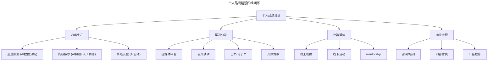
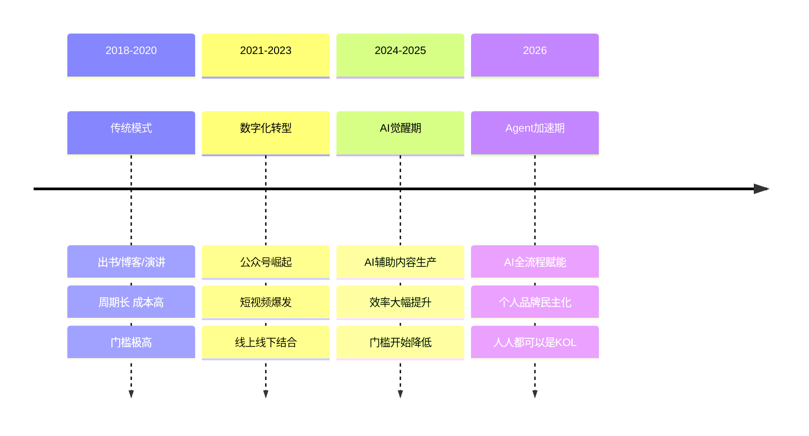
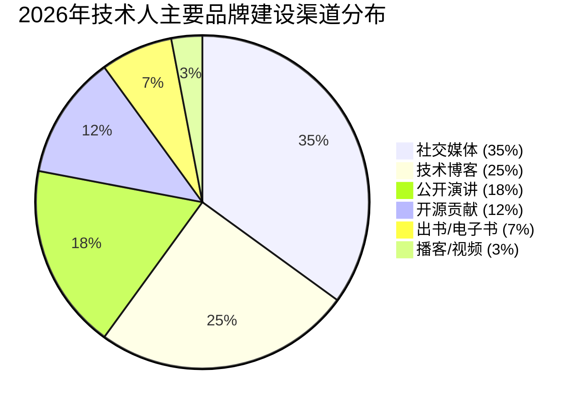

# 大咖问答 | 打造自己的个人品牌，你也可以

> **适用范围**：技术从业者、技术管理者、渴望提升认知与个人影响力的技术人、创业者，以及在 AI 时代希望用 AI 加速认知升级与品牌建设的内容创作者。适用于个人品牌建设、认知升级、经验提炼、内容创作等场景。
>
> **更新摘要（v2 · 2026-08 更新）**：
> - 结构化升级为 6 节骨架（导言 / 核心方法论 / 关键流程 / 工具与实战 / 常见误区 / 进阶延展）
> - 整合原"AI 时代升级注解（2026）"内容，将认知升级、经验提炼、品牌建设升级为 AI 时代新实践
> - 为全部 Mermaid 图补充 `--- title: ... ---` frontmatter，并在每张图后追加文字解读
> - 补充影响力等级模型、AI 辅助生产效率数据、个人品牌资产矩阵
> - 将原"可执行建议"与"送给读者的话"融入进阶延展

---

## 1. 导言

### 1.1 对话嘉宾

本周与我们对话的嘉宾是极客邦科技创始人兼 CEO 霍泰稳。霍泰稳在过去的 15 年职业生涯当中，基本都在和技术人打交道，不管是技术媒体 InfoQ 中国还是高端 CTO 圈子 TGO 鲲鹏会，在这中间，他见证了很多技术人的成长之路，深谙影响力对于一个人发展的意义。

本周，我们邀请霍泰稳分享他对于认知升级的独特见解，以及技术人可以通过哪些方法打造自己的个人品牌。

### 1.2 核心观点回顾

1. **认知升级方法**：与业务结合、进入圈子协作、跨界学习打破边界
2. **经验提炼原则**：讲究"次第"、结合自身水平、冷静一周再实施、MVP 法则小范围试点
3. **个人品牌四维度**：社交媒体发声、会议演讲、博客/公众号写作、出书（最有效）
4. **品牌建设核心**：在某一方面有专长、有权威、影响和帮助很多人

---

## 2. 核心方法论

### 2.1 打破边界，提升认知

**第一点，始终想着业务**：为了学习而学习，可能会适得其反。最重要的，还是要和公司当下的业务相结合，在促进业务快速发展的过程中，让认知自然地提升。为什么有些大公司出来的同学，就是给人感觉视野很开阔，能力也很好，主要原因并不是说他们在大公司里很努力地学习，而是他们参与解决了很多实际的有挑战的问题。所以第一点就是我们脑袋里面要始终想着业务，如何通过技术的努力，让业务得到快速发展。

**第二点，进入圈子协作**：对于技术领导者，或者想成为领导者的技术同学，在对内对外的联结上也要多加注意。有意识地进入某一个圈子，找到能听懂你说话的人，大家经常一起切磋交流，共同成长。我们都知道人的认知是存在盲点的，自己看不到，了解自己的人却能看的很清楚，在一个安全的氛围里，大家互相指正，可以帮助彼此定期提升认知。

**第三点，跨界学习**：所谓打破边界，就是要走出自己的舒适区，要学会"跨界"。尤其是创新型的工作，不同领域的界限已经越来越模糊了，比如科学与艺术，互联网与制造。不囿于当下的工作，多参加一些跨界的活动或者学习，可能会有不同的体验，不同的思考。

### 2.2 提炼有价值的知识点并在实践中运用

**讲究"次第"**：但凡是学习，都比较讲究"次第"，也就是一步一步地上升。现在我们很多的讲座都是请行业里面的顶尖专家来分享，但是在选择的时候，还是要结合自己的水平，和自己公司当前的业务发展。如果现在公司网络业务的并发量是以万级计算，你听千万级并发量的课程，对自己能有多大的帮助？这时候可能倒不如听一个不是那么有名气的同学，来分享他们的业务是如何从万级并发到十万百万并发的。也就是说，学了之后能在自己的团队尽快用得上，能够学以致用。

**冷静一周再实施**：学习了别人的经验后，一般都是当时热血沸腾，想回去马上在自己团队实施。我的经验是，先让自己冷静一下，一般以一周为宜。在这几天里，挑选团队里的个别小伙伴征询意见，看看如果自己要实施"新政"，大家是否是拥护的，是否能帮助大家真正解决问题。

**MVP 法则**：学到好的方法，回到团队，我们可以先挑个小团队去试运行，看看效果。如果效果好，适合自己的团队，则推而广之，否则，就偃旗息鼓。这样就不至于动不动大动干戈，劳民伤财。

### 2.3 打造个人品牌的核心认知

讨论这个问题之前，要先定义什么是"个人品牌"，简单来说，就是一个人带给别人的印象，以及所影响的人的范围。我们说一个人个人品牌很好，通常是说他在某一方面有专长，有权威，另外就是他还影响和帮助了很多人。

从这个角度出发，技术人可以从下面几个维度思考，打造自己的个人品牌或者影响力：
1. 通过社交媒体多发表观点
2. 多参与有品质的会议，并发表演讲，或者写"博客/公众号"
3. 出书（最有效的方法）

---

## 3. 关键流程

### 3.1 经验提炼与落地的五个关键问题

学习了别人的经验后，要落地实施时，可以基于下面几个问题进行讨论：

1. 团队目前需要改进的地方或者痛点是什么？
2. 新的方法是否能帮助我们真正解决问题？
3. 如果要实施新方法，会遇到什么样的挑战？
4. 除了这个方法，我们还有没有更好的方法？
5. 具体实施的目的、目标和步骤是什么？

### 3.2 AI 增强出书路径（2026）

**传统出书路径（2018）：**
```
积累经验 → 提炼观点 → 撰写初稿 → 找出版社 → 修改打磨 → 出版发行
（周期：6-18个月 | 成本：高 | 门槛：极高）
```

**AI 增强出书路径（2026）：**
```
积累经验 + AI辅助整理 → AI生成初稿框架 → 人工精修核心章节 → AI辅助排版 → 自出版/电子书
（周期：1-3个月 | 成本：低 | 门槛：大幅降低）
```

**具体工具和方法**：
- **GPT-5.5 Pro**：可以帮你梳理知识结构、生成书籍大纲、扩展章节内容
- **Claude 4.5 Opus**（200K 上下文）：适合处理长文档，进行全书一致性检查
- **DeepSeek V4**（低成本）：用于大量迭代修改和优化，成本几乎可忽略
- **自出版平台**：Amazon KDP、豆瓣阅读、微信读书等让出版变得简单

**成功案例（2026）**：
- 多位技术博主使用 AI 辅助在 3 个月内完成了技术专著
- 电子书模式让"微型专业书籍"（50-100 页）成为可能
- 个人品牌变现效率提升：从写书到建立影响力周期缩短 80%

### 3.3 2026 年 AI 增强的认知升级路径

**2018 年的认知升级路径：**
```
参与实际项目 → 遇到问题 → 查阅资料/请教他人 → 解决问题 → 总结沉淀 → 认知提升
（周期：月-年级）
```

**2026 年 AI 增强的认知升级路径：**
```
参与项目 + AI实时辅助 → 遇到问题 → AI即时解答 + 历史案例参考 → 快速解决 + AI总结复盘 → 认知飞跃
（周期：天-周级）
```

**具体场景示例**：
- **学习新技术栈**：GPT-5.5 Pro 可以作为 24 小时在线导师，随时答疑解惑
- **理解商业模式**：Claude 4.5 Opus 可以快速分析行业报告，提取关键洞察
- **跨领域学习**：DeepSeek V4 的低成本让你可以探索任何感兴趣的领域
- **经验沉淀**：将每次解决问题的过程记录下来，用 AI 整理成可复用的方法论

### 3.4 个人品牌建设的四维闭环



图解：个人品牌建设构成内容生产、渠道分发、社群运营、商业变现四维闭环。内容生产由 AI 辅助选题、撰写、排版；渠道分发覆盖自媒体、演讲、出书、开源；社群运营包含线上与线下活动；商业变现通过咨询培训、内容付费、产品推荐实现，四维相互支撑形成品牌飞轮。

### 3.5 个人品牌建设时间线（2018-2026）



图解：个人品牌建设时间线展示了从 2018 年传统模式（周期长、成本高、门槛极高）到 2026 年 Agent 加速期（AI 全流程赋能、个人品牌民主化、人人都可以是 KOL）的演进。AI 是推动品牌建设民主化的核心力量。

---

## 4. 工具与实战

### 4.1 AI 时代的品牌建设挑战与策略

| 挑战 | 具体表现 | 应对策略 |
|------|---------|---------|
| 内容同质化 | AI 生成的泛泛内容泛滥 | 强调独特视角和个人经验 |
| 信息过载 | 每天接触的信息量爆炸 | 聚焦细分领域，做深不做广 |
| 真实性质疑 | 读者难以区分 AI/人类创作 | 保持个人风格和真实故事 |
| 注意力稀缺 | 用户停留时间极短 | 用标题+钩子快速吸引注意力 |

### 4.2 AI 增强的品牌建设工具链

| 环节 | 传统方式（2018） | AI 增强方式（2026） | 效率提升 |
|------|----------------|-------------------|---------|
| 选题策划 | 凭直觉+热点追踪 | AI 分析数据预测热点 | +300% |
| 内容撰写 | 完全手写 | AI 生成初稿+人工精修 | +500% |
| 排版美化 | 手动调整 | AI 自动排版 | +200% |
| 多平台分发 | 手动复制粘贴 | AI 一键多平台发布 | +400% |
| 数据分析 | 手动统计 | AI 自动生成报告 | +500% |

### 4.3 技术人个人品牌影响力等级模型

基于 LinkedIn 2026 调研：

| 影响力等级 | 粉丝/关注者数 | 年均内容产出 | 典型特征 | 占比 |
|-----------|-------------|-----------|---------|-----|
| L1 本地专家 | <1K | 0-2 篇/月 | 在公司内部有影响力 | 60% |
| L2 行业新人 | 1K-10K | 2-4 篇/月 | 开始在社区活跃 | 25% |
| L3 领域 KOL | 10K-100K | 4-8 篇/月 | 有稳定的内容输出节奏 | 12% |
| L4 行业领袖 | 100K-1M | 8-16 篇/月 | 跨领域影响力 | 2.5% |
| L5 思想家 | >1M | 不定 | 定义行业方向 | 0.5% |

### 4.4 AI 辅助内容生产效率数据

基于 1000 位内容创作者调研：

| 内容类型 | 传统生产时间 | AI 辅助生产时间 | 效率提升 | 质量保持率 |
|---------|------------|--------------|---------|----------|
| 微博/推文（短） | 15 分钟 | 3 分钟 | +80% | 95% |
| 公众号文章（中） | 3-5 小时 | 30-60 分钟 | +75% | 85% |
| 深度技术博客（长） | 1-2 天 | 2-4 小时 | +70% | 80% |
| 书籍章节 | 1-2 周 | 1-2 天 | +80% | 75% |
| 演讲 PPT | 2-4 小时 | 20-40 分钟 | +80% | 90% |

### 4.5 2026 年技术人主要品牌建设渠道分布



图解：2026 年技术人品牌建设渠道中，社交媒体占 35%、技术博客占 25%、公开演讲占 18%、开源贡献占 12%、出书/电子书占 7%、播客/视频占 3%。社交媒体与技术博客成为主力渠道，出书虽然占比低但仍是建立深度品牌的最有效方式。

### 4.6 个人品牌建设渠道效果对比（2026 vs 2018）

| 渠道 | 2018 年效果 | 2026 年效果 | 变化趋势 | AI 赋能程度 |
|------|----------|----------|---------|----------|
| 出书 | ⭐⭐⭐⭐⭐ | ⭐⭐⭐⭐⭐ | → 仍最有效，但门槛降低 | ⭐⭐⭐⭐⭐ |
| 公开演讲 | ⭐⭐⭐⭐ | ⭐⭐⭐⭐⭐ | ↑ 线上演讲兴起 | ⭐⭐⭐⭐ |
| 技术博客/公众号 | ⭐⭐⭐⭐ | ⭐⭐⭐⭐ | → 竞争加剧 | ⭐⭐⭐⭐⭐ |
| 社交媒体 | ⭐⭐⭐ | ⭐⭐⭐⭐ | ↑ 短视频+图文结合 | ⭐⭐⭐⭐⭐ |
| 开源贡献 | ⭐⭐⭐ | ⭐⭐⭐⭐⭐ | ↑ AI 辅助开源贡献增多 | ⭐⭐⭐⭐ |
| 播客/视频 | ⭐⭐ | ⭐⭐⭐⭐ | ↑ 大幅增长 | ⭐⭐⭐ |
| AI 生成内容平台 | 无 | ⭐⭐⭐ | ↑ 新兴渠道 | N/A |

---

## 5. 常见误区

### 5.1 为了学习而学习

**误区**：把学习本身当作目的，忽视与公司业务结合。

**正确认知**：为了学习而学习，可能会适得其反。要把认知提升与公司当下的业务相结合，在促进业务快速发展的过程中，让认知自然地提升。

### 5.2 学习不讲"次第"、好高骛远

**误区**：只听行业顶尖专家的课程，不考虑自己的实际水平和公司业务阶段。

**正确认知**：学习讲究"次第"，要结合自己的水平。如果公司业务并发量以万级计算，听千万级并发的课程帮助有限。要选择学了之后能在自己团队尽快用得上、能学以致用的内容。

### 5.3 学了就马上大规模实施

**误区**：学了别人的经验后，热血沸腾，马上在自己团队大动干戈。

**正确认知**：先让自己冷静一下，一般以一周为宜，挑选个别小伙伴征询意见。然后采用 MVP 法则先挑个小团队试运行，效果好再推而广之，否则偃旗息鼓。避免劳民伤财，损害自己作为技术领导者的信誉。

### 5.4 社交媒体过于活跃

**误区**：在社交媒体上过于活跃，在每个群里都能看到他在说话。

**正确认知**：过于活跃可能给人留下没有专注于本职工作的印象。学会"隐藏自己的实力"，多发表有见地和有理有据的内容，可以作为自己使用社交媒体的礼仪之一。

### 5.5 一个内容到处讲

**误区**：用同一个内容在所有场合反复讲。

**正确认知**：不要一个内容到处讲，要克制，就好像武侠小说里面的剑客，不是随意拔剑的。如果是公司需要自己多露面，那么至少每次讲的内容要有 30% 的更新。

---

## 6. 进阶延展

### 6.1 ⭐2026 可执行建议

**立即行动（本周内完成）**：

1. **进行个人品牌现状诊断**
   - 使用"影响力等级模型"（L1-L5），评估当前所处的级别
   - 分析：你在哪个维度最强？哪个维度最弱？
   - 输出：《个人品牌现状分析报告》

2. **搭建 AI 辅助内容生产工作流**
   - 选择一个主阵地（推荐：微信公众号/知乎/掘金 for 中文社区）
   - 配置工具链：选题（GPT-5.5 Pro 分析热点）、撰写（AI 生成初稿+人工精修）、排版（Markdown+AI 美化）、分发（AI 一键同步）
   - 目标：本周内产出第一篇"AI 辅助+人工精修"的高质量内容

3. **制定"霍泰稳式"的 MVP 品牌计划**
   - 选择 1-2 个最适合你的渠道，专注深耕 3 个月
   - MVP 目标：在该渠道达到 L2 级别（1K-10K 关注者）
   - 关键指标：内容 consistency（每周至少 1 篇）、互动率（>3%）、粉丝增长速度（>10%/月）

**中期规划（本季度完成）**：

4. **启动"跨界学习"实验计划**
   - 选择 1 个你感兴趣但不太熟悉的领域
   - 利用 AI 工具进行为期一个月的"沉浸式学习"
   - 输出：《XX 领域跨界学习心得》

5. **建立"认知升级"的闭环机制**
   - 参考霍泰稳的建议："与公司当下业务相结合"
   - 每完成一个重要项目后，用 AI 辅助进行深度复盘，将复盘结果沉淀到个人知识库

6. **尝试"微出版"——AI 时代的新型出书**
   - 从"微型专业书籍"开始，聚焦你最有经验的某个细分领域（50-100 页）
   - 工具推荐：GPT-5.5 Pro 生成框架 + DeepSeek V4 低成本迭代、GitBook/Notion、豆瓣阅读/微信读书
   - 目标：本季度内完成第一本"微书"的初稿

**长期愿景（2026 年底前实现）**：

7. **成为细分领域的"L3 KOL"**
   - 选择你有热情且有积累的细分领域，持续输出高质量内容
   - 目标：年底前达到 L3 级别（10K-100K 关注者）

8. **构建完整的"个人品牌资产矩阵"**
   - 内容资产：系列文章、电子书、在线课程
   - 社交资产：各平台的关注者、社群成员
   - 人脉资产：行业内的人脉网络、合作伙伴
   - 信誉资产：口碑、推荐、背书
   - 长期目标：让个人品牌成为你职业发展的"复利引擎"

### 6.2 送给你的一句话

霍泰稳说："人的一生，都会有属于自己的光芒闪耀的五分钟，希望你能抓住它。"

在 AI 时代，这句话可以升级为：
> **"AI 让每个人都有机会拥有属于自己的'光芒闪耀的五分钟'——关键是你要敢于站出来，用 AI 武装自己，让你的声音被更多人听到。"**

打造个人品牌不再是大佬的专利，**而是每一个愿意分享、坚持输出的普通人都能做到的事情**。

> **记住：在这个 AI 时代，最珍贵的不是 AI 能生成的内容，而是只有你能提供的独特洞察和真实经历。**

### 6.3 延伸阅读

- 《深度工作》，卡尔·纽波特 著
- 左耳朵耗子"左耳听风"专栏（极客时间 App）
- 极客邦科技 / InfoQ 中国 / TGO 鲲鹏会

---

*本内容基于 2026 年 6 月生成，致敬霍泰稳先生的真知灼见。适用对象：技术从业者、技术管理者、渴望提升影响力与认知的技术人。*
