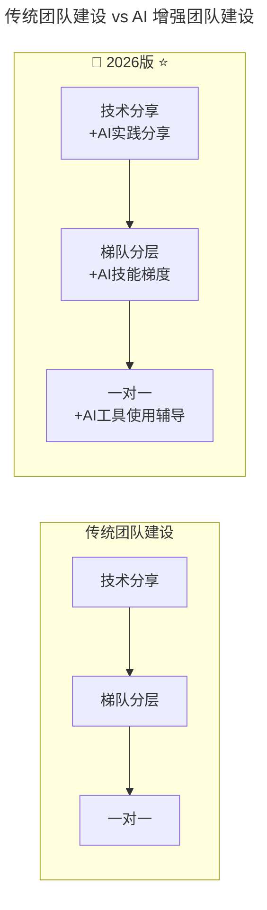
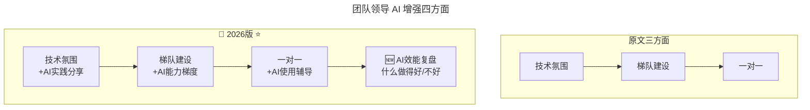

# 第132讲 | 徐函秋：转型技术管理者初期的三大挑战

> **适用范围**：即将或刚完成从工程师向技术管理者转型的技术骨干、新晋 Tech Lead / 小组 Leader / 技术经理，以及希望在转型初期少走弯路、快速建立管理能力的从业者。适用于角色转型、项目管理、团队领导等场景。
>
> **更新摘要（v2 · 2026-08 更新）**：
> - 结构化升级为 6 节骨架（导言 / 核心方法论 / 关键流程 / 工具与实战 / 常见误区 / 进阶延展）
> - 整合原上/下两篇内容与两份"AI 时代升级注解（2026）"，将三大挑战升级为 AI 时代四大挑战
> - 为全部 Mermaid 图补充 `--- title: ... ---` frontmatter，并在每张图后追加文字解读
> - 补充 AI 增强项目管理流程、出色管理者 AI 时代第五标准
> - 将原"作者简介"融入导言，原"小结"融入进阶延展

---

## 1. 导言

### 1.1 工程师生涯中必做的决定

我相信大多数程序员在工作几年，成为团队骨干后，都会面临这样的选择，就是要么继续走技术路线，坚持做研发，要么成为团队的技术管理者，承担更多技术管理的责任。

对于个人贡献者和技术管理者这两个角色，不同的场合有着不同的称呼，比如个人贡献者又叫码农、技术开发，而技术管理者又被称为 Manager、小组 Leader 等等。另外在不同的公司，这两类岗位也有着不同的等级序列，你可以选择继续做个人贡献者，走 T 序列或 P 序列，你也可以选择 M 序列，成为技术管理者。

我个人认为，不论是选择继续走技术研发路线，还是选择技术管理路线，包括在什么时间、什么阶段选择，都没有绝对的好坏，只有适合自己的才是最好的。

### 1.2 为什么选择成为技术管理者

每个人的理由可能都不一样，有人说可以管人，有人说可以提薪，有人说自己更擅长与人打交道，而我选择成为技术管理者的原因，主要有两点：

**第一，可以突破个人贡献者的天花板**。作为一名研发工程师，可能贡献最多的就是优化某个提取引擎的效率。而成为一名技术管理者以后，就可以带领团队，支持全公司精准运营的若干需求，更好地帮助公司内部业务实现增长，这是之前作为个人贡献者时很难做到的事情。

**第二，结合自身的职业规划和目标，提升个人能力**。因为对我来说，未来如果有机会，可能还想和朋友一起创业。但那个时候可能就不仅要求自己有扎实的技术功底，还需要有良好的项目管理能力、团队管理能力、沟通能力、演讲能力等等。而成为技术管理者，就可以在实践中锻炼这些能力，对个人成长有很大的帮助。

### 1.3 作者简介

徐函秋，现为小米大数据团队基础数据与用户画像组负责人，目前主要负责小米用户画像、行为标签库、ID-Mapping 等相关项目的建设与研发工作，为 MIUI、金融、新零售等小米公司核心业务提供大数据相关技术支持。加入小米公司之前曾在中科院自动化研究所担任研发工程师，并多次参加相关的国内、国际数据挖掘竞赛。

### 1.4 2026 年 AI 时代技术背景

2026 年，GPT-5.5 多模态大模型成熟商用、DeepSeek V4 开源模型性能比肩闭源方案、Stack Overflow 调查 84% 开发者日常使用 AI 编程工具、Agent 智能体进入加速落地期。徐函秋老师分享的"转型三大挑战"在 AI 时代有了全新的解决方案——AI 既是挑战的来源，也是解决挑战的工具。

---

## 2. 核心方法论

### 2.1 转型初期将面临的三类挑战

做一名优秀的技术管理者真的很不容易，可能会遇到各种各样的问题。将自己遇到的一些典型的问题总结分类为三方面。

**一、角色转型引发的矛盾**

当我还是个人贡献者的时候，我的核心竞争力可能就是扎实的工程能力、编码能力，以及对机器学习、数据挖掘等算法和使用场景的掌控能力。而成为技术管理者以后，我发现白天除了开会，还需要做跨团队交流、面试新人、与组员沟通等。因此，问题就出现了——每天面对各种事务性工作，自己的核心竞争力下降了怎么办？

除了事务性工作与技术工作的矛盾外，还有思维上的改变。之前在研发岗位上可能只需要做好自己份内的工作就足够了，但现在带领团队的话就需要不断思考，做哪些事情能够产生价值，如何做才能将价值最大化。

**二、在项目管理能力上的挑战**

一名优秀的技术领导者，需要具备良好的项目管理能力，但在实践的过程中发现了两个问题：
1. 之前作为技术骨干，可以很好的完成工作任务，甚至超预期完成任务目标。那现在要领导 15 人的团队来完成历时两个月的项目，如何能保证按时且高质量交付呢？
2. 对于安排给其他团队成员的任务，因为责任边界不明确，最终导致项目延期交付，面对这样的问题该怎么办呢？

**三、在团队领导能力上的挑战**

一名优秀的管理者必须具备良好的团队领导能力。在《技术领导之路》这本书中，对领导力的定义是，"所谓领导力，就是创造一个环境，让所有的人都可以发挥出比单干时更大的价值，并不断成长"。目前领导力方面主要遇到了三个问题：当团队成员遇到困难时，如何能及时感知并有效帮助解决？团队成员不断增加，自己却越来越累，团队例会效率越来越低怎么办？当团队成员之间发生矛盾时，如何沟通协调才能不影响团队效率？

### 2.2 2026 新增第四大挑战：AI 身份认同危机

```
🆕 挑战四：AI身份认同危机
- "我不用AI写代码，还算合格的工程师吗？"
- "我的团队用AI效率提升了，那还需要我吗？"
- "我应该学AI还是深耕专业领域？"
```

### 2.3 出色技术管理者的标准

怎样才算是一位出色的技术管理者呢？总结出四点：

1. 能明确团队的定位与目标，可以帮助团队成员更好的成长；
2. 拥有较好的项目管理意识，能带领团队及时产出高质量成果；
3. 沟通能力良好，在团队中能构建良性循环的技术氛围和工作环境；
4. 具备深厚的技术功底，关键时刻能带领团队攻坚或克服困难。

**⭐2026 新增第五标准**：
```
5. 具备AI协作和AI战略能力
   - 能设计和优化"人+AI"工作流
   - 能评估和选择合适的AI工具
   - 能帮助团队成员提升AI技能
```

---

## 3. 关键流程

### 3.1 第一个挑战的应对：明确新核心竞争力 + 全局视野

**明确新的核心竞争力**：之前做码农的时候，核心竞争力是较强的编程能力以及算法的掌握程度。但作为技术管理者，核心竞争力应该转变为综合能力，比如高效沟通能力、项目管理能力、团队建设能力，以及对技术方向的把控能力。真正重要的并不是自己又掌握了新的技术，而是能带领整个团队完成更多有挑战、有价值的项目，以项目的产出结果为导向。

目前，每天会拿出 20% 的时间与业务团队进行沟通，再花 30% 的时间与组员交流，剩余 30% 时间用来做研发工作，工作效率也较之前有所提高。

**全局的视野与思考**：用刘建国老师在《技术管理实战 36 讲》中的一段话来说，"当你还是一位工程师时，你是技术的操作者和实现者；而在成为一个越来越成熟的管理者的过程中，你越来越少地直接去实操，慢慢变成了技术的应用者"。个人贡献者更关注 How，也就是实现过程的细节与具体的解决方案，而技术管理者则需要拥有大局观，更关注 What 和 Why。

**以终为始**：经过历练，学会了"以终为始"。以前会思考团队要做哪些事情，而现在的思考方式是，年底我们应该如何汇报这一年的成果。以结果为导向，明确团队的目标，再将团队关键指标进行拆分，具体落实到每一个子任务目标上。

### 3.2 第二个挑战的应对：项目管理四步骤

以搭建精准运营平台，将营销效果提升 100% 为例。可以从四个步骤入手来梳理项目流程：

**第一步，将目标、任务进行拆解**。例如，创建 WBS，把项目工作分解成具体的、易于管理的子任务。我们一般会要求每个子任务都遵循 SMART 原则。

**第二步，分配任务**。当任务拆分到足够详细时，就可以把它分配给团队中各个指定的负责人，让各负责人对这些模块做进一步拆分，再分配给团队内相关的其他成员，并对每个子任务和结果作出时间预估。

**第三步是项目协调与追踪**。我们可以用甘特图将每个小项目以时间轴的形式排列出来，从中可以看到每一个项目的关键节点，如果项目进度出现问题，我们能够及时找到原因，从而去协调、追踪、推进。

**第四步，总结、复盘**。当项目完成之后，我们需要及时进行总结、复盘。例如，一个子项目延期了，就要找出延期的原因是什么，如何改进。

**任务分配与跟进的三点注意**：首先，需要清楚的表达这项任务的目标和分工安排，将责任落实到人，最好通过邮件进行沟通，避免出现责任不明确的问题。其次，二次核对，明确下属对该任务的理解是否与你一致。最后，我们需要定期跟进、沟通，比如组织晨会、周会等例行会议。

### 3.3 第三个挑战的应对：团队领导三方面努力

**第一，打造团队良好的技术氛围**。比如每周五组织一次技术分享，由一位组员分享自己的经验。也会成立技术兴趣小组，或定期邀请公司外的技术大咖来访交流。

**第二，关于团队梯队建设的思考和实践**。有理论提出，6 人小团队的效率最高，人数再多效率就会下降。根据这个理论，将团队的定位与方向划分为三个方面，然后从团队中挑选出技术能力强、工作年限长且有意愿担当中坚力量的组员，让其带领五至六人的小团队负责某一方面的具体工作。这样就有效地构建起了团队梯队。

**第三，一对一交流**。这一点非常重要，也是曾经历过的惨痛教训。定期与团队成员一对一交流，可以增进彼此之间的了解，使我们能够及时感知团队与团队成员目前遇到的问题。现在每个月都会与一位组员进行单独交流，每次半小时左右。

### 3.4 团队建设的 AI 增强版



图解：传统团队建设三方面（技术分享、梯队分层、一对一）在 AI 时代升级为 AI 增强版：技术分享加入 AI 实践分享、梯队分层加入 AI 技能梯度、一对一加入 AI 工具使用辅导。



图解：团队领导的 AI 增强四方面在原文三方面（技术氛围、梯队建设、一对一）基础上，新增第四方面"AI 效能复盘"——定期回顾人机协作中什么做得好、什么做得不好，持续优化团队的人机协同能力。

---

## 4. 工具与实战

### 4.1 项目管理工具

在工作中，用到的项目管理工具主要有三个：甘特图、Teambition 和 Scrum。

- **甘特图**：体现一个目标以及分解的各个子任务。
- **Teambition**：可以看到每个团队成员的工作事项与工作进程。而且还有一个好处是，在评职和提薪时，也可以从 Teambition 中看到这个人过去半年或一年的工作内容。
- **Scrum**：开发粒度可以控制到小时，相比 Teambition 以天为单位的进度，Scrum 所体现的进度非常细致。

举例来说，如果使用 Scrum，假设一个项目有 5 人共同参与，每人一天工作 8 小时，那一周大概有 200 个工时，一般情况下会制订一个为期两周时间的冲刺计划，再将计划内的阶段性目标进行拆分，把每个子任务分配给相应的组员，并评估完成时间。因为 Scrum 能具体到小时单位，所以在每天例会上就可以有效地同步每个子任务的进度。

### 4.2 AI 增强的项目管理流程

**原文四步骤**：目标任务拆解 → 分配 → 协调追踪 → 复盘

**⭐2026 新增第五步：AI 优化**
```
传统流程：拆解 → 分配 → 追踪 → 复盘
AI增强流程：拆解(AI辅助) → 分配(AI推荐) → 追踪(AI自动) → 复盘(AI生成) → 优化(持续改进)
```

各项目管理环节的 AI 帮助：

| 项目管理环节 | AI 如何帮助 |
|------------|-----------|
| WBS 分解 | AI 辅助任务拆解和工时估算 |
| 任务分配 | AI 根据成员技能和历史表现推荐分配 |
| 进度追踪 | AI 自动识别延期风险并预警 |
| 复盘总结 | AI 生成会议纪要和改进建议 |

### 4.3 AI 时代管理者的时间分配变化

| 维度 | 传统管理者 | **AI 时代管理者** |
|-----|----------|-----------------|
| 时间分配 | 20% 业务 + 30% 组员 + 30% 研发 | **10% 业务 + 30% 组员 + 10% 研发 + 20% AI 协同 + 30% 战略** |
| 核心技能 | 沟通、项目管理 | **沟通、项目管理、AI 协作、AI 战略** |
| 价值来源 | 个人产出 + 团队产出 | **个人产出 + 团队产出 + AI 放大效应** |

---

## 5. 常见误区

### 5.1 核心竞争力下降的焦虑

**误区**：成为技术管理者后，担心写代码时间越来越少、技术退化了、核心竞争力下降。

**正确认知**：作为技术管理者，核心竞争力应该转变为综合能力——高效沟通能力、项目管理能力、团队建设能力，以及对技术方向的把控能力。真正重要的并不是自己又掌握了新的技术，而是能带领整个团队完成更多有挑战、有价值的项目。

**AI 时代新认知**：
| 传统焦虑 | AI 时代的新认知 |
|---------|--------------|
| 写代码时间少了 | **审核和优化 AI 代码的能力更重要了** |
| 技术退化了 | **技术定义变了——从写代码到设计人机协作系统** |
| 核心竞争力下降了 | **核心竞争力升级为：沟通+项目管理+AI 协同** |

> 💡 **2026 核心公式**：管理者价值 = (沟通能力 + 项目管理能力) × **AI 放大系数(3-10 倍)**

### 5.2 责任边界不明确

**误区**：安排任务时没有将责任落实到具体人，导致项目延期时相互推诿。

**正确认知**：需要清楚的表达这项任务的目标和分工安排，将责任落实到人，最好通过邮件进行沟通，避免出现责任不明确的问题。同时二次核对、定期跟进。

### 5.3 团队人数越多自己越累

**误区**：团队成员不断增多，自己反而越来越累，例会效率越来越低。

**正确认知**：6 人小团队的效率最高，人数再多效率就会下降。应根据团队定位构建梯队，让技术能力强、有担当的组员带领五至六人的小团队负责具体工作，有效构建团队梯队。

### 5.4 抗拒 AI 或忽视 AI 协作

**误区**：作为技术管理者抗拒 AI 工具，或忽视 AI 协作能力的培养。

**正确认知**：2026 年的技术管理者，不是在人和 AI 之间做选择，而是学会让两者协同创造更大的价值。角色从"最强的程序员"进化为"最好的'人+AI 系统'设计师"。这不仅是转型，更是升级。

---

## 6. 进阶延展

### 6.1 给 2026 年转型者的建议

1. **不要抗拒 AI**——把它当作你的"超级助手"而非"竞争对手"
2. **建立新的自信来源**——从"我是最强的程序员"到"我能让团队+AI 产出最大"
3. **学习 AI 协作技能**——这是 2026 年管理者的必备能力

### 6.2 结语

在工程师的职业生涯中，一定会面临一个选择，或成为资深技术人，或从技术转型管理。作为技术管理者，仍然不能完全放弃技术，还是需要投入足够多的时间去了解前沿技术，关注关键技术。这样，团队的成员才会更加信任你，同时也有助于你在团队中培养出某个领域的技术能手，打造一支多元化的技术团队。

> ⭐核心理念：**2026 年的技术管理者，不是在人和 AI 之间做选择，而是学会让两者协同创造更大的价值。**

### 6.3 延伸阅读

- 《技术领导之路》—— 领导力定义参考
- 刘建国，《技术管理实战 36 讲》
- 徐函秋转型系列其他文章（《技术领导力 300 讲》）

---

*本内容基于 2026 年 6 月的技术环境编写，随着 AI 技术的快速发展，部分具体工具和建议可能需要定期更新。适用对象：技术骨干、新晋技术管理者、技术经理。*
