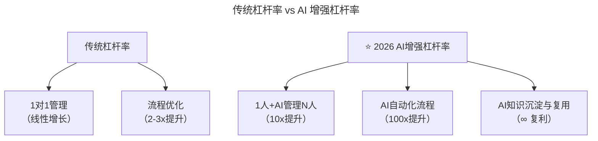
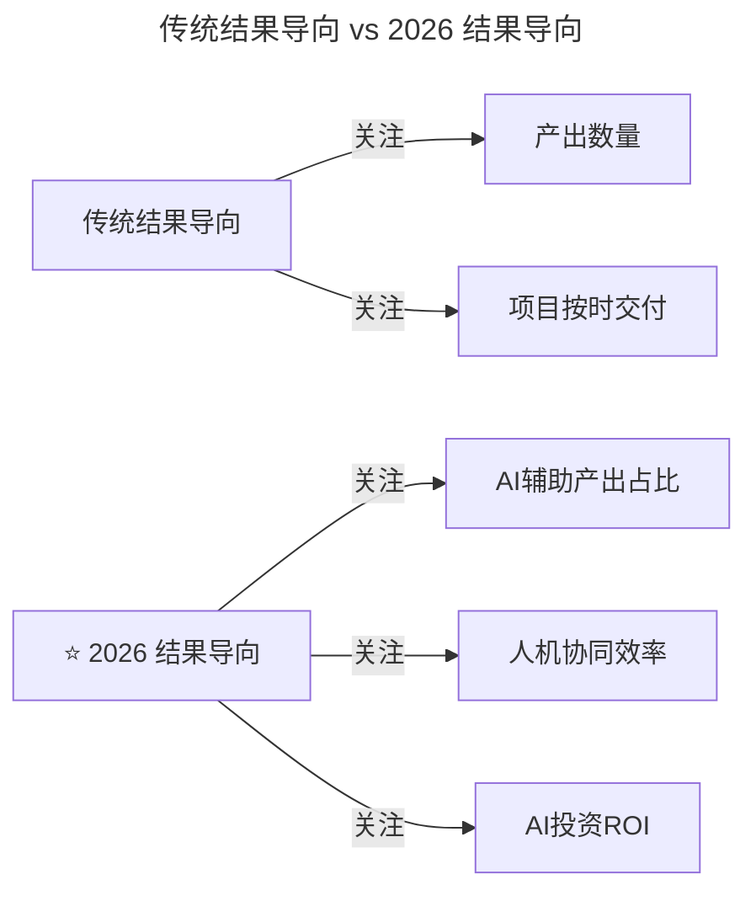

# 第156讲 | 成敏：技术人转型管理的两大秘诀

> **适用范围**：从工程师转型为技术管理者的新晋技术经理、Tech Lead、技术总监，以及希望提升管理效能、建立结果导向思维的管理者。适用于角色转型、优先级决策、项目管理、团队领导等场景。
>
> **更新摘要（v2 · 2026-08 更新）**：
> - 结构化升级为 6 节骨架（导言 / 核心方法论 / 关键流程 / 工具与实战 / 常见误区 / 进阶延展）
> - 整合原"AI 时代升级注解（2026）"内容，将两大秘诀升级为 AI 时代"超级杠杆率"与"新 KPI 维度"
> - 为全部 Mermaid 图补充 `--- title: ... ---` frontmatter，并在每张图后追加文字解读
> - 补充 AI 时代杠杆率最高的 3 件事、结果导向新维度、行动清单
> - 将原"作者简介"融入导言，原"避坑指南"融入常见误区

---

## 1. 导言

### 1.1 转型管理的第一问

很多人刚刚成为技术管理者的时候，内心大都会比较焦虑，经常会思考的一个问题就是，技术管理到底应该做什么？其实答案很简单，可以用一句话概括为：**带领技术团队，完成目标**。

这里的第一个关键点是"带领技术团队"，这是技术转型管理的同学需要适应的最大改变。一方面，你不再是一个人，而是带领着一个团队，你需要为团队包括团队成员的产出、成长等负责；另一方面，相信不少同学都会觉得时间变少了，确切地说，是做技术的时间明显变少了。而当需要做的事情变多以后，该如何选择优先级，比如应该先做技术攻坚，还是先协调资源，或者先去招人？这时就很容易迷失方向。

### 1.2 作者简介

成敏，技术领导力专栏主编，长期关注技术人成长和转型话题。

### 1.3 2026 年 AI 时代技术背景

2026 年，GPT-5.5 发布，DeepSeek V4 国产大模型崛起，84% 开发者已将 AI 编程作为日常工作方式，Agent（智能代理）进入加速落地期，人机协作成为新常态。

---

## 2. 核心方法论

### 2.1 两大秘诀总览

技术人转型管理有两大秘诀：

1. **要做杠杆率最高的事情**：作为技术管理者，要先去做杠杆率最高的事情，为你的团队负责。
2. **要以结果为导向**：这是思维上的重要改变，以前你只需做好自己份内的技术就行了，而现在你还要对结果负责。

### 2.2 杠杆率原则：做杠杆率最高的事情

在跟不少技术管理者交流后，发现"该先做什么"这个问题并没有一个标准答案，比较不同团队的规模不同，面对的环境不同，所做的业务也不同，但有一个原则是统一的，即**作为技术管理者，要先去做杠杆率最高的事情，为你的团队负责**。

**空降管理者的实战案例**：有位朋友加入了一个新团队，算是一个空降管理者，但团队的管理方式比较粗放，流程比较粗糙，也没有什么自动化的工具，导致整个团队的效率比较低。最初，他认为杠杆率更高的事情是跟团队一遍一遍地沟通，将他的想法传达给团队。但经过几轮沟通之后，他发现效果并不明显。

在经过反思之后，他意识到，空谈是无用的，关键是让大家先看到这样做的好处。于是他从自己出发，自己上手优化低效率的工具及做事流程，切实简化团队工作流程、降低重复性工作、提高团队工作效率。事实证明这样做的效果非常明显。而享受到了这样实实在在的好处后，之后再带着大家一步一步往下推进就比较容易了。

### 2.3 队长 vs 教练的角色选择

长期来看，技术管理者可能会逐渐演变成两个角色，队长或教练。有的技术管理者可能更像队长，带领团队在一线冲锋；有的技术管理者可能更像教练，关注团队的组成，关注团队的成长。

无论作何选择，大家都应该反问一下自己，这个角色是否与杠杆率最高的事情匹配？假设团队输出是一个定值，如果你是队长，可能是在定值上做加法；如果你当教练，更多的是像在定值上做乘法。当然，最终的优化目标会取决于你做加法或乘法的数值。因此，大家需要理性的分析这一点，选择最适合自己的角色。

对于管理者而言，还需要对自身有要求，最好是拥有多面手的能力，不要局限于管理或技术。你能做的事情越多，那你对杠杆率更高的事情就会有更多的选择。

### 2.4 结果导向：对结果负责

从技术转型管理的第二个关键点是"完成目标"，也就是结果导向。很多公司都强调以结果为导向，很多技术管理者在分享自己经验的时候也会强调以终为始，但在实际工作中，很多人其实并没有真正理解结果导向的意义，或者意识到了，但却找各种各样的理由松懈自己。

虽然结果不好就找客观原因（人手不够、外部团队不配合等）是一种人性的本能，但作为技术管理者，你要带领团队完成目标，就要去引导他们更进一步去思考：既然存在这些客观原因，那你为此做了什么事情？是否对此提出了你的解决方案？**积极地推动所有可能影响到结果的因素，尽力打造最好的结果，这才是结果导向的意义。**

---

## 3. 关键流程

### 3.1 结果导向的执行循环

在具体的执行过程中，可以把结果导向抽象成一个过程：

**明确目标 → 诊断问题 → 确定思路 → 细化方案 → 实施执行 → 反馈调整**，不断反复循环。

虽然这个过程已经为大众所知，但多数人在做事的过程中，还是会经常不自觉的忘记这个过程中的某些环节。

### 3.2 结果导向实战案例：教育产品交付

之前有个朋友加入了一家互联网教育公司，接手了他们的业务开发。当时，他们的产品正处在一个重要版本的开发过程中，问题是这个版本迟迟无法上线。

**第一步，明确目标**。他的目标是做好技术工作吗？不止于此，作为技术管理者，应该以结果为导向，推动产品顺利交付。

**第二步，诊断问题**。产品无法上线的原因主要来自于多团队合作导致的组织和沟通困难。教育类产品比较复杂，包括了教研、产品、交互、视觉、开发、算法、测试、渠道等等诸多不同的团队，每个团队又有自己的周期，相互协同、同步就存在很大困难。

**第三步，确定解决思路**。当时大家提出了几种思路：
- 第一，减少团队？很快被否定，正因为有不同的团队，才使得产品更加专业。
- 第二，找一个个人英雄统领？难点在于对人的要求很高，且很可能成为另一个影响产品交付的单点。
- 第三，将整个过程分解成若干个阶段，并选出一个固定角色来负责每个阶段？这就是最终选取的方案，就好像一个 4×100 米的接力赛，各阶段分别由不同的团队负责领跑，其他团队负责配合。

**第四步，细化方案、实施执行**。因为涉及的团队较多，所以需要提前约定好沟通规范、沟通工具、协商机制等，并用量化的方式来衡量每一次的交接质量，包括需求、提测、交付等。同时，还需要打出富余量，以防意外情况的发生。

**第五步，反馈调整**。为了避免因为合作框架的存在而做事死板，让整个过程保持生命力，还需要有一个复盘会议，大家坐下来一起去分析过程中做的好与不好的地方，好的地方及时沉淀，不好的地方及时改进。这样面对面的复盘会议也可以增强团队相互之间的信任。

### 3.3 AI 时代的"超级杠杆率"



图解：传统杠杆率主要通过 1 对 1 管理（线性增长）和流程优化（2-3 倍提升）实现。2026 年 AI 增强杠杆率实现质的飞跃：1 人+AI 管理 N 人（10 倍提升）、AI 自动化流程（100 倍提升）、AI 知识沉淀与复用（无限复利）。

### 3.4 结果导向的 AI 时代新维度



图解：传统结果导向主要关注产出数量和项目按时交付，而 2026 年结果导向新增三个关注维度：AI 辅助产出占比、人机协同效率、AI 投资 ROI。这要求管理者以更全面的视角衡量团队产出。

---

## 4. 工具与实战

### 4.1 杠杆率最高的 3 件事（2026 版）

| 排名 | 事情 | 传统方式 | ⭐ 2026 AI 增强 | 杠杆率 |
|------|------|---------|---------------|--------|
| **1** | 建立 AI 工具标准和规范 | 手写文档培训 | **AI 生成+自动检查** | 100x |
| **2** | 培养团队能力 | 1 对 1 带教 | **AI 导师制** | 10x |
| **3** | 决策和优先级排序 | 经验判断 | **AI 数据分析+人类决策** | 5x |

### 4.2 队长 vs 教练 → 队长+AI vs 教练+AI

```
传统角色：
├─ 队长：冲锋在前，做加法
└─ 教练：培养团队，做乘法

AI时代角色：
├─ 队长+AI：冲锋在前+AI辅助执行 = 超级队长
└─ 教练+AI：培养团队+AI个性化指导 = 超级教练

⭐ 最优解：根据团队阶段灵活切换
```

### 4.3 新的 KPI 维度

| 维度 | 定义 | 目标值 |
|------|------|--------|
| **AI 采用率** | 团队使用 AI 工具的比例 | >80% |
| **AI 效率提升** | 使用 AI 后效率提升幅度 | >30% |
| **AI 质量保障** | AI 输出的人工审核通过率 | >95% |
| **人机协作指数** | 人机配合流畅度评分 | >4.0/5.0 |

### 4.4 ⭐ 2026 行动清单

**本周行动**：

1. **识别你的"高杠杆"事项**
   - 列出你本周做的所有事
   - 标注哪些可以委托给 AI
   - 只保留必须由你做的事

2. **建立第一个 AI 工作流**
   - 选择 1 个重复性高的工作
   - 用 AI 自动化它
   - 记录节省的时间

3. **重新定义"结果"**
   - 与老板沟通：什么是最重要的结果？
   - 加入 AI 相关的 KPI
   - 每周跟踪进展

---

## 5. 常见误区

### 5.1 用客观理由松懈自己

**误区**：结果不好时，找各种客观理由（人手不够、外部团队不配合等）松懈自己。

**正确认知**：虽然这是人性的本能，但作为技术管理者，要引导团队更进一步思考：既然存在这些客观原因，那你为此做了什么事情？是否对此提出了你的解决方案？**积极地推动所有可能影响到结果的因素，尽力打造最好的结果，这才是结果导向的意义。**

### 5.2 空谈理念而不落地

**误区**：空降管理者只跟团队一遍遍沟通想法，却不落地执行。

**正确认知**：空谈是无用的，反而会因为给他们带来额外的工作量而被抵触。关键是让大家先看到这样做的好处，从自己出发优化工具和流程，让团队享受到实实在在的好处后再推动。

### 5.3 AI 时代三大避坑指南

| 坑 | 表现 | 解决方案 |
|----|------|----------|
| **微观管理 AI** | 试图控制每个 AI 输出 | 设定标准，信任 AI，人工抽检 |
| **忽视人的因素** | 只看 AI 效率数字 | 关注团队成员的感受和成长 |
| **结果短视** | 只看短期指标 | 平衡短期效率和长期能力建设 |

---

## 6. 进阶延展

### 6.1 核心结论

成敏老师的"杠杆率最高的事"+"结果导向"在 AI 时代被放大了 10 倍。**2026 年的技术管理者需要具备"AI 杠杆思维"——用 AI 放大自己的影响力，用数据驱动结果，用人性化管理团队**。记住：AI 是工具，真正的领导力来自于你对团队的关心和对结果的执着。

### 6.2 结语

技术管理不外乎这样一种循环，即明确目标、诊断问题、确定思路、细化方案、实施执行、反馈调整，重要的是做好每一步。对于从技术转型管理的同学来说，需要记住的是，管理不仅仅是一种艺术，在管理中，我们的理性思考无处不在。

### 6.3 延伸阅读

- 成敏老师技术领导力系列文章（《技术领导力 300 讲》）
- 徐函秋，《转型技术管理者初期的三大挑战》（第 132 讲）

---

*本内容基于 2026 年 GPT-5.5、DeepSeek V4、84% 开发者用 AI 编程等最新技术动态编写。适用对象：技术转型管理者、技术经理、技术总监。*
