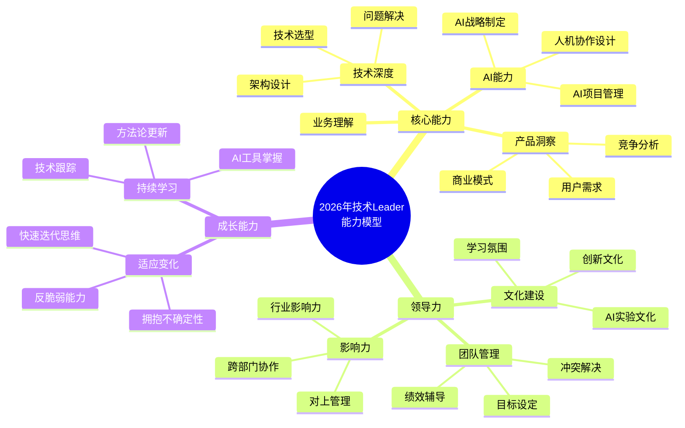
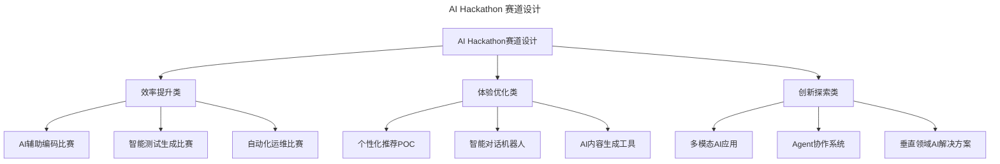
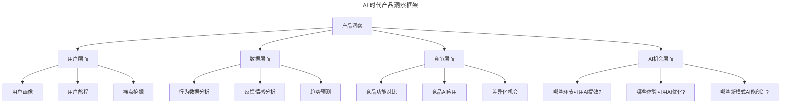
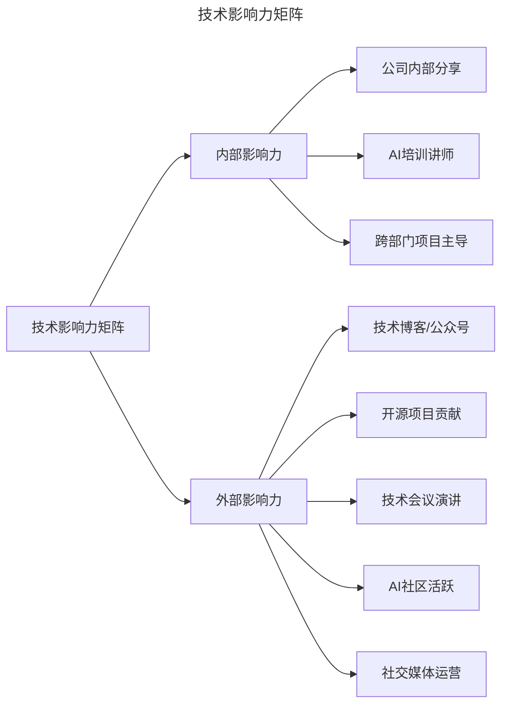
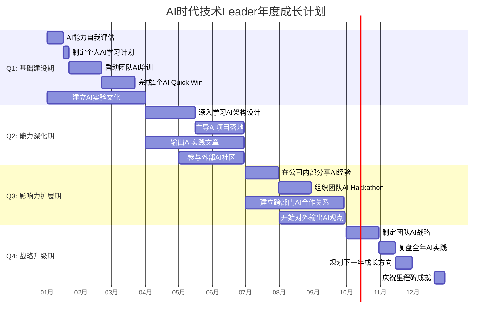

# 第80讲 | 技术Leader的持续成长

> **适用范围**：技术管理者（一线 Tech Lead、技术经理、技术总监）、技术团队负责人，以及希望在稳定阶段持续成长、带动团队发展的技术 Leader。适用于自我驱动、产品洞察、技术影响力、团队成长等场景。
>
> **更新摘要（v2 · 2026-08 更新）**：
> - 结构化升级为 6 节骨架（导言 / 核心方法论 / 关键流程 / 工具与实战 / 常见误区 / 进阶延展）
> - 整合原"AI 时代升级注解（2026）"内容，将成长路径升级为"技术洞察+AI 战略+人机协作设计+组织进化"四维模型
> - 为全部 Mermaid 图补充 `--- title: ... ---` frontmatter，并在每张图后追加文字解读
> - 补充 AI 时代产品洞察框架、技术影响力矩阵、AI 学习小组、AI Hackathon、年度成长路线图
> - 将原"作者简介"融入导言，原"结语"与"可执行建议"融入进阶延展

---

## 1. 导言

### 1.1 稳定阶段的新挑战

技术人走上管理岗位，度过初期阶段后，很有可能发现产品和技术架构已经趋于稳定，团队初具规模，业务流量也在稳步增长，整体慢慢进入一个稳定阶段。

这时，如何驱动自己保持动力，在技术和管理上进一步成长，并带动整个技术团队成长，是技术 leader 们面临的新挑战。

### 1.2 作者简介

马晋，百度网页搜索部主任研发架构师，致力于搜索引擎索引性价比、检索架构等相关方面工作，推动百度索引规模的不断成长，主导百度索引规模从数亿成长为数千亿的一系列架构升级。

（本文整理自马晋在 ArchSummit 全球架构师峰会上的分享，有删减。）

### 1.3 2026 年 AI 时代技术 Leader 成长新范式

当 84% 开发者使用 AI 编程，Agent 能替代 3-5 人团队，技术 Leader 的成长路径从"技术深度+管理能力"双轨制，升级为"技术洞察+AI 战略+人机协作设计+组织进化"四维模型——持续成长的内涵需要重新定义。

### 1.4 核心观点：你是团队的天花板

大部分情况下，技术 leader 就是团队的天花板，你的成长才能够带动身后整个团队的成长，如果你止步不前，后面同学的成长空间也会受限。

作为技术 leader，首先要保持动力，追求卓越；其次要培养产品的洞察力；最后要打造自己的技术影响力。

---

## 2. 核心方法论

### 2.1 技术 Leader 的三大成长维度

**1. 保持动力，追求卓越**

在保持动力，追求卓越这一点上，首先要保持对技术的深远追求，打造极致的用户体验。比如网页搜索团队之前做的千亿网页精细排序和索引更新实时化两个项目。

以千亿网页精细排序为例，最初的排序系统中，下层是一个召回模型，上层对召回结果做精细化排序，然而由于响应时间的问题，不可能在最顶层模块做更多的结果计算。这种影响在整个搜索中可能只占长尾的 5%，但出于技术上的追求卓越，应当把它做到更好。最终，这个项目获得了 2016 年百度的最高奖。

在技术成长的过程中，一定要保持这种追求卓越的精神和态度，而且要把这种精神传递给下面的梯队。最后是生活的动力，这是非常现实但却无法忽视的方面。现代人都面临着生活上的各种压力，但这些压力也是我们努力的动力。

**2. 产品洞察力**

产品洞察力是工程师团队比较欠缺的一块，但这又是工程师想要更进一步必须具备的能力。比较好的提升方式是多跟产品团队交流，不要抱有偏见和抵触。另外想更进一步的话，可以走出办公室，走进站长圈，多跟站长们接触交流，听听他们的想法。

**3. 技术影响力**

工程师应该更多的表达自己，不论是在公司内部还是公司外部，要主动走进公司讲堂、走进行业讲堂、拥抱开源社区。多跟团队内外的朋友分享自己的观点，以此来提升自己的技术影响力。

当你在讲台上的照片出现在媒体上、出现在内部员工群里的时候，对你自身技术品牌的打造会有极大的好处，对于提高团队凝聚力也有一定的好处，甚至招聘也会受益。

### 2.2 2026 年技术 Leader 能力模型



图解：2026 年技术 Leader 能力模型包含核心能力、领导力、成长能力三大板块。核心能力新增 AI 能力（AI 战略制定、人机协作设计、AI 项目管理）；领导力新增 AI 实验文化建设；成长能力强调 AI 工具掌握、快速迭代思维、反脆弱能力，反映 AI 时代的成长新要求。

### 2.3 推动工程师团队成长的五要素

工程师团队的成长要素，总结为以下几点：

1. 以团队带动个人
2. 技术氛围建设
3. 团队活动组织
4. 工程师文化传承
5. 团队合作障碍

其中重点分享技术氛围的建设和打破团队合作障碍这两点。

### 2.4 打破团队沟通障碍：共赢和竞争

沟通其实有各种各样的技巧，但打破团队沟通障碍最重要的还是**共赢和竞争**。所谓共赢，即目标导向，大家在共同目标下通力协作，彼此形成合力，更快更好的实现未来目标。

当然，有些事情是很难沟通和协调好的，这时候就要在内部引入一些竞争机制，多团队竞争同一个目标也是一个选择，并非坏事。而且竞争并非你死我活，最终目标还是把事情做成功。具体是选择共赢还是竞争，大家可以根据实际情况来做决定。

---

## 3. 关键流程

### 3.1 技术氛围建设

技术氛围建设可以从学习小组、技术交流、挑战比赛这三个方向着手打造。

**1. 学习小组**：大家在学校里、实验室里应该都有过学习小组的经历，这个场景在公司里同样适用，能够强制性的启发一些同学的思想和认知。百度比较成功的一次小组是机器学习小组，当时网页搜索团队有 20 人报名参加，最后坚持到底的同学都成为了机器学习方向的骨干力量。

**2. 技术交流**：现在业界的技术交流是比较频繁的。除了派团队工程师出门参加活动之外，也可以自己组织，邀请感兴趣领域的技术大牛来团队做交流。这时需要注意提前收集团队的问题，了解团队的需求，有针对性的邀请讲师。

**3. 挑战比赛**：竞争机制是非常重要的，有竞争才有趣味，才能产生结果。百度就有 Hackathon 文化，每个月末都会抽出一个周末 24 小时或更长的时间，把工程师、产品、设计等人员聚在一起组队参赛。同时还会将大家分组 PK，输赢其实并不是很重要，最重要的是让大家在实践中得到学习和成长。

就我的实践而言，小团队的组织建设，应该采取强制性的手段，每个同学必须发言、必须思考；大团队则可以以兴趣驱动，筛选出真正对于某些方向和领域感兴趣的人。

### 3.2 AI 学习小组（2026 新版）

**组织方式**：
```yaml
AI学习小组设置:
  频率: 每周1次，每次1-2小时
  
  内容规划:
    第1月: AI基础普及
      - ChatGPT/Claude等工具使用
      - Prompt Engineering基础
      - AI编程助手配置
    
    第2月: AI应用深入
      - AI在具体工作流中的应用
      - 常见问题和解决方案
      - 最佳实践分享
    
    第3月: AI项目实战
      - 小组选择一个实际问题
      - 用AI方案解决
      - 成果展示和复盘
  
  产出要求:
    - 每人至少完成1个AI实践项目
    - 输出1份AI应用指南
    - 在团队内部分享经验
```

### 3.3 AI 技术交流（2026 新版）

**邀请主题建议**：
| 主题 | 嘉宾类型 | 时长 |
|------|---------|------|
| AI 编程最佳实践 | 公司内 AI 高手 | 1 小时 |
| Prompt Engineering 进阶 | 外部专家 | 2 小时 |
| AI 项目管理经验 | 其他公司 CTO | 1.5 小时 |
| AI 伦理与安全 | 法律/伦理专家 | 1 小时 |
| AI 未来趋势展望 | 行业分析师 | 1 小时 |

### 3.4 AI Hackathon（2026 新版）



图解：AI Hackathon 赛道设计分为效率提升类、体验优化类、创新探索类三大方向。效率提升类包括 AI 辅助编码、智能测试生成、自动化运维；体验优化类包括个性化推荐、智能对话机器人、AI 内容生成；创新探索类包括多模态 AI 应用、Agent 协作系统、垂直领域 AI 解决方案。

**评审标准**：
- 创新性（30%）：是否使用了新颖的 AI 方法
- 实用性（25%）：是否能解决真实问题
- 完成度（20%）：是否做出了可演示的原型
- 技术深度（15%）：是否展示了技术能力
- 团队协作（10%）：是否有效利用了 AI 工具

### 3.5 产品洞察的 AI 时代框架



图解：AI 时代产品洞察框架在传统用户、数据、竞争三个层面基础上，新增 AI 机会层面——哪些环节可用 AI 提效、哪些体验可用 AI 优化、哪些新模式 AI 能创造。这帮助技术 Leader 看到 AI 带来的产品创新机会。

---

## 4. 工具与实战

### 4.1 用 AI 快速建立行业认知

```python
# 示例：用AI快速了解一个新领域
prompt = """
请帮我系统梳理：
1. 这个行业的核心商业模式有哪些？
2. 用户的核心痛点和需求是什么？
3. 技术在这个行业中扮演什么角色？
4. AI可以如何改变这个行业？
5. 我应该关注哪些关键指标？

请给出结构化的分析和可执行的建议。
"""
# 用GPT-5.5/Claude生成行业洞察报告
```

### 4.2 技术影响力矩阵



图解：技术影响力矩阵分为内部影响力（公司内部分享、AI 培训讲师、跨部门项目主导）和外部影响力（技术博客/公众号、开源项目贡献、技术会议演讲、AI 社区活跃、社交媒体运营）。AI 时代新增 AI 培训讲师与 AI 社区活跃两个影响力维度。

### 4.3 新的内容形式（2026）

| 形式 | 特点 | 适合场景 |
|------|------|---------|
| **AI 实战案例** | 展示真实项目经验 | 技术深度、实用性 |
| **Prompt 工程指南** | 可操作性强 | 工具使用、效率提升 |
| **AI 架构设计文档** | 系统性思考 | 架构能力展示 |
| **人机协作经验** | 前沿话题 | 领导力、管理能力 |
| **AI 伦理讨论** | 思考深度 | 价值观、社会责任 |

### 4.4 打造 AI 时代个人品牌的步骤

```
Step 1: 定位（第1个月）
- 确定你的AI专长方向（如：AI架构、Prompt工程、MLOps）
- 找到差异化定位（不要做"什么都懂"的人）

Step 2: 内容输出（第2-3个月）
- 每周写1篇AI相关的技术文章
- 分享你的AI实践经验和踩坑记录
- 记录AI工具的使用心得和最佳实践

Step 3: 社区参与（第4-6个月）
- 参与AI相关的开源项目
- 在技术社区回答AI相关问题
- 参加线上/线下的AI技术活动

Step 4: 建立声誉（6个月以后）
- 被邀请到公司内外分享AI经验
- 成为某个AI细分领域的意见领袖
- 吸引同行的关注和合作机会
```

---

## 5. 常见误区

### 5.1 对产品团队抱有偏见和抵触

**误区**：工程师团队对产品团队抱有偏见和抵触，不愿意与产品团队交流。

**正确认知**：提升产品洞察力比较好的方式是多跟产品团队交流，不要抱有偏见和抵触。想更进一步的话，可以走出办公室，走进站长圈，多跟站长们接触交流。

### 5.2 不主动表达自己

**误区**：工程师不愿意分享和表达自己，只埋头做技术。

**正确认知**：工程师应该更多的表达自己，主动走进公司讲堂、走进行业讲堂、拥抱开源社区。多跟团队内外的朋友分享自己的观点，以此提升自己的技术影响力。

### 5.3 AI 时代的人机协作障碍

| 障碍类型 | 表现 | 应对策略 |
|---------|------|---------|
| **AI 恐惧症** | "AI 会替代我" | 强调 AI 是工具，展示 AI 如何帮助个人成长 |
| **AI 怀疑论** | "AI 不靠谱" | 用 Quick Win 成果说话，让事实说服 |
| **AI 依赖症** | "什么都交给 AI" | 明确人和 AI 的边界，强调人的价值 |
| **AI 能力焦虑** | "我不会用 AI" | 提供培训和实践机会，降低使用门槛 |
| **AI 伦理担忧** | "这样做好吗" | 建立 AI 使用规范，透明化决策过程 |

### 5.4 团队沟通障碍不解决

**误区**：团队内部沟通障碍长期存在，不主动打破。

**正确认知**：打破团队沟通障碍最重要的还是共赢和竞争。所谓共赢，即目标导向，大家在共同目标下通力协作；有些事情难以协调时，可在内部引入竞争机制，多团队竞争同一个目标，最终目标还是把事情做成功。

---

## 6. 进阶延展

### 6.1 2026 年技术 Leader 成长路线图



图解：AI 时代技术 Leader 年度成长计划分四个阶段：Q1 基础建设期（AI 能力评估、个人学习计划、团队 AI 培训、Quick Win）、Q2 能力深化期（AI 架构设计、AI 项目落地、输出文章、参与社区）、Q3 影响力扩展期（内部分享、AI Hackathon、跨部门合作、对外输出）、Q4 战略升级期（制定 AI 战略、复盘、规划下一年）。

### 6.2 可执行建议（⭐2026）

**每日必做（30 分钟）**：
- [ ] 使用 AI 工具完成至少 1 项工作任务
- [ ] 浏览 1 篇 AI 相关的技术文章或新闻
- [ ] 思考 1 个可以用 AI 优化的工作环节

**每周必做（3 小时）**：
- [ ] 参加 1 次 AI 学习小组或技术交流
- [ ] 尝试 1 个新的 AI 工具或功能
- [ ] 与团队成员讨论 AI 应用进展

**每月必做（8 小时）**：
- [ ] 完成 1 个 AI 相关的深度学习或实践项目
- [ ] 输出 1 篇 AI 实践总结或技术文章
- [ ] 复盘本月 AI 应用效果，调整策略

**每季度必做（16 小时）**：
- [ ] 更新个人 AI 能力地图，识别差距
- [ ] 参加一次外部的 AI 技术会议或培训
- [ ] 评估团队 AI 成熟度，调整培养计划

**年度目标**：
- [ ] 成为团队公认的 AI Leader
- [ ] 主导至少 2 个成功的 AI 项目
- [ ] 输出至少 10 篇高质量 AI 实践文章
- [ ] 建立 1-2 个有影响力的外部连接
- [ ] 帮助至少 5 名团队成员提升 AI 能力

### 6.3 结语

技术 leader 要驱动自己保持动力，在技术和管理上进一步成长，并带动整个技术团队成长。关键是要保持对技术的卓越追求，同时不断培养自己的产品洞察力和技术影响力，让自己持续成长，并做好榜样，带动团队成员的成长。同时，可以尝试从技术氛围建设、工程师文化传承、打破团队合作障碍等方向着手，推动工程师团队的成长。

### 6.4 延伸阅读

- 马晋在 ArchSummit 全球架构师峰会上的分享
- 刘建国，《技术管理实战 36 讲》

---

*本内容基于 2026 年 AI 技术领导力实践编写，帮助技术 Leader 在 AI 时代实现持续成长。适用对象：技术管理者、技术团队负责人。*
