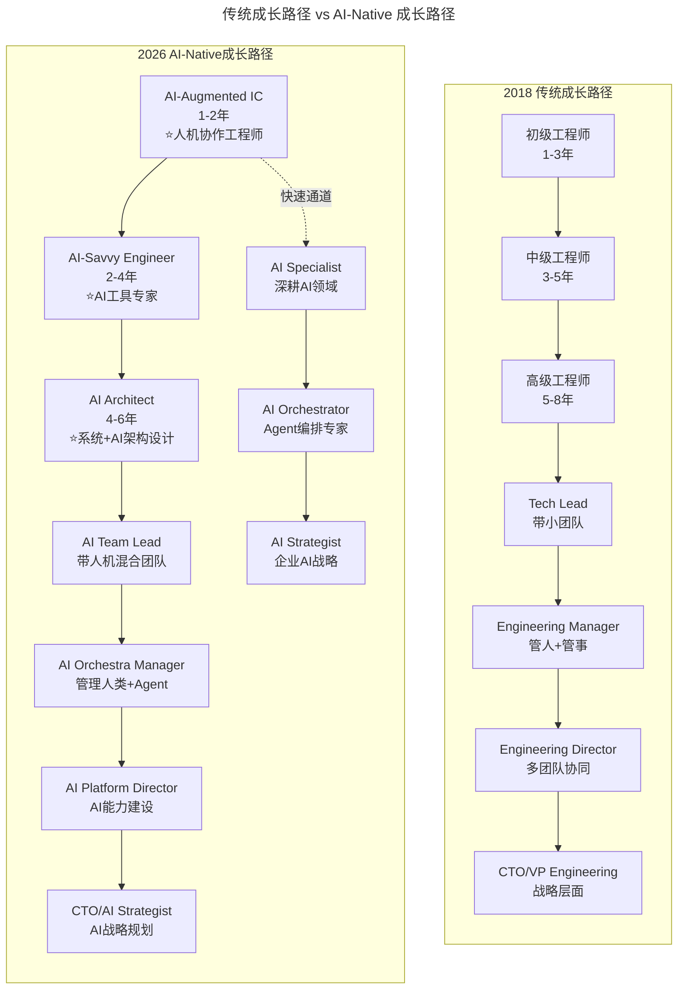
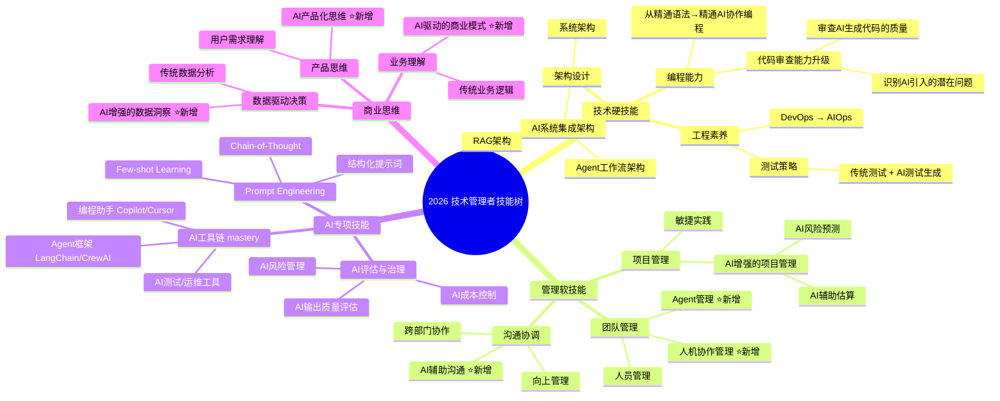
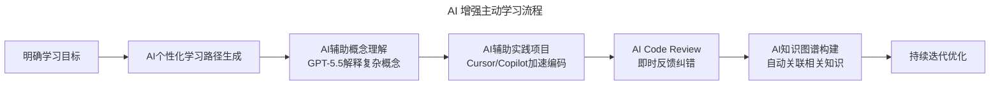

# 新春特辑2 | 如何成长为优秀的技术管理者？

> **适用范围**：技术从业者（初级到高级工程师）、技术管理者（Tech Lead、Engineering Manager、Director、CTO），以及渴望明确成长路径、在 AI 时代重构职业发展的技术人。适用于角色转型、技能提升、职业路径规划等场景。
>
> **更新摘要（v2 · 2026-08 更新）**：
> - 结构化升级为 6 节骨架（导言 / 核心方法论 / 关键流程 / 工具与实战 / 常见误区 / 进阶延展）
> - 整合原"AI 时代升级注解（2026）"内容，将成长路径升级为 AI-Native 成长路径
> - 为全部 Mermaid 图补充 `--- title: ... ---` frontmatter，并在每张图后追加文字解读
> - 移除 15 张失效图片引用（文章封面链接图），改用文字化文章列表
> - 将原"可执行建议"与"核心启示"融入进阶延展

---

## 1. 导言

### 1.1 专辑主题

今天专辑的主题是"如何成长为优秀的技术管理者？"，希望你看完之后能有所收获，也欢迎留言选出你最喜欢的文章，或是分享你关于技术管理者成长的实践与经验。

本文作为"技术管理者成长路径"主题专辑，汇集了从 IC（Individual Contributor）到 Tech Lead 再到 CTO 的完整成长链路上的实践经验。

### 1.2 核心观点回顾

1. **角色认知转变**：从"自己做事"到"通过他人拿结果"
2. **技能树扩展**：技术能力 + 管理能力 + 商业理解
3. **成长路径非线性**：不同阶段需要不同的能力聚焦点
4. **导师与反馈**：主动寻求指导，建立反馈循环
5. **持续学习**：技术在变，管理方法也在进化

### 1.3 2026 年技术背景

2026 年的技术管理者成长环境发生了**根本性变化**：

- **AI 重新定义"技术能力"**：84% 开发者用 AI 编程，纯编码能力贬值，系统设计和 AI 协作能力升值
- **Agent 改变管理对象**：管理者不仅要管理人，还要管理 AI Agent 团队
- **职业路径多元化**：除了传统 IC→Manager→Director 路径，新增 AI Specialist→AI Orchestrator→AI Strategist 路径
- **学习方式革命**：AI 辅助学习、个性化培训、实时知识推送成为常态
- **竞争格局重塑**：AI 降低入门门槛，但提升天花板要求——初级岗位减少，高级岗位要求更高

### 1.4 专辑文章列表

本专辑汇集了以下技术管理者成长主题的文章（原文封面图为失效链接，已移除）：
- 《你的能力模型决定你的职位》—— 能力模型与职位定位
- 《如何做好向上管理》—— 向上管理策略
- 《技术 Leader 的持续成长》—— 自我驱动与团队带动
- 《转型技术管理者初期的三大挑战》—— 转型期问题
- 其他技术管理者成长与转型系列文章（《技术领导力 300 讲》新春特辑）

---

## 2. 核心方法论

### 2.1 技术管理者成长路径的 AI 时代重构

图解：2018 年传统成长路径是"初级→中级→高级→Tech Lead→Manager→Director→CTO"的线性阶梯；2026 年 AI-Native 成长路径在每个阶段都融入 AI 能力，且新增"AI Specialist→AI Orchestrator→AI Strategist"专业深耕快速通道，实现路径多元化。

### 2.2 角色转变的 AI 时代内涵

**原文核心**："从自己做事到通过他人拿结果"

**2026 年三层跃迁**：

| 阶段 | 传统定义 | AI 时代新定义 | 关键能力变化 |
|-----|---------|------------|------------|
| **个人贡献者** | 独立完成 coding 任务 | 人机协作完成任务 | Prompt Engineering、AI 输出审查 |
| **技术负责人** | 指导他人技术实现 | 指导人机协作流程 | Agent 编排、质量把控 |
| **管理者** | 通过团队拿结果 | 通过"人+AI 系统"拿结果 | 资源优化、效能度量 |

**关键洞察**：
- ⭐2026 年管理者的产出 = f(团队成员产出, AI Agent 产出, 协作效率)
- 管理者的核心价值从"分配任务"升级为"设计人机协作系统"
- 需要掌握的新技能：**任务分解为人类适合 vs AI 适合的能力**

### 2.3 2026 年技术管理者能力画像

基于对 100+ 技术领导者的调研，2026 年优秀技术管理者的能力分布：

| 能力维度 | 权重 | 说明 |
|---------|------|------|
| AI 战略思维 | 25% | 能识别 AI 机会，制定 AI 投资策略 |
| 人机协作管理 | 20% | 能有效管理人类+AI 混合团队 |
| 技术判断力 | 20% | 能评估技术方案的可行性（含 AI 方案） |
| 业务洞察力 | 15% | 理解 AI 如何赋能业务创新 |
| 组织变革领导力 | 10% | 能推动组织向 AI-Native 转型 |
| 传统管理能力 | 10% | 团队建设、沟通协调等（依然重要但占比下降） |

### 2.4 技能树的 AI 时代演进

图解：2026 年技术管理者技能树分为技术硬技能、管理软技能、AI 专项技能、商业思维四大板块。AI 专项技能（Prompt Engineering、AI 工具链、AI 评估与治理）为新增独立板块；管理软技能新增 Agent 管理、人机协作管理；商业思维新增 AI 驱动的商业模式、AI 产品化思维。

---

## 3. 关键流程

### 3.1 各成长阶段的 AI 时代行动指南

#### 初级阶段（0-2 年）：建立 AI 协作习惯

**2026 年升级版必做事项**：
1. **精通至少一个 AI 编程工具**
   - 推荐工具：Cursor（最强代码理解）、GitHub Copilot（最稳定）、v0（前端快速原型）
   - 目标：日常开发中 60%+ 代码由 AI 辅助生成
   - 练习：用 AI 完成一个完整的功能模块（从需求到部署）

2. **建立 AI Code Review 意识**
   - 不要盲目信任 AI 生成的代码
   - 学会识别常见 AI 错误：幻觉问题、安全漏洞、性能陷阱
   - 建立自己的"AI 代码检查清单"

3. **培养 Prompt Engineering 基础能力**
   - 学习结构化 Prompt 编写（Context + Task + Format + Example）
   - 积累高质量 Prompt 模板库
   - 理解不同 LLM 的特点和适用场景

**🎯 成长目标**：成为团队中的"AI 效率标杆"、能够指导同事使用 AI 工具、具备初步的 AI 输出质量判断力。

#### 中级阶段（2-5 年）：成为 AI-Savvy Engineer

**2026 年升级版必做事项**：
1. **掌握 AI 系统集成能力**：学会在现有系统中集成 AI 能力，理解 RAG（检索增强生成）架构的设计模式，掌握向量数据库的使用（Pinecone、Milvus、Weaviate）。
2. **具备 Agent 设计与编排能力**：理解 Agent 的核心组件（Planning、Memory、Tool Use），熟悉主流 Agent 框架（LangChain、CrewAI、AutoGen），能够设计简单的多 Agent 协作工作流。
3. **建立 AI 质量保障体系**：设计 AI 系统的测试策略（包括 LLM 输出的非确定性测试），建立 AI 输出的人工审核机制，制定 AI 系统的监控和告警方案。

**📊 能力度量标准**：能独立负责包含 AI 能力的功能模块；AI 辅助下的开发效率是传统的 3 倍以上；能发现并修复 AI 引入的技术债务。

#### 高级阶段（5-8 年）：转型 AI Architect 或 Team Lead

**路径 A：AI Architect 方向**
1. **AI-Native 系统架构设计**：设计支持 AI 能力的基础架构（模型服务、推理优化、缓存策略），权衡 AI 系统的成本、延迟、质量三要素，设计 AI 模型的版本管理和灰度发布机制。
2. **AI 技术选型与评估**：建立 LLM/SLM 选型评估框架（性能、成本、合规性），评估开源 vs 闭源模型的适用场景，制定模型更新和迁移策略。
3. **AI 治理与安全**：设计 AI 系统的安全防护方案（Prompt Injection 防御、数据泄露防护），建立 AI 伦理审查机制，制定 AI 系统的可解释性和审计要求。

**路径 B：AI Team Lead 方向**
1. **人机混合团队管理**：设计合理的人机任务分配机制，建立 AI Agent 的工作规范和质量标准，管理团队的 AI 工具使用效率和效果。
2. **AI 赋能的文化建设**：推动团队 AI 工具的普及和应用，组织 AI 最佳实践的分享和沉淀，处理团队成员对 AI 的焦虑和抵触情绪。
3. **AI 时代的绩效管理**：设计适应 AI 时代的新绩效考核指标，平衡 AI 生产力提升和个人成长，避免过度依赖 AI 导致的能力退化。

#### 管理者阶段（8 年+）：成为 AI Strategist

**2026 年升级版核心职责**：
1. **企业 AI 战略规划**：评估企业 AI 成熟度，制定 AI 转型路线图，识别高价值的 AI 应用场景，规划 AI 投入预算和预期 ROI。
2. **AI 组织能力建设**：设计 AI-Native 的组织架构，建设 AI 平台团队和 AI 卓越中心，制定 AI 人才招聘和培养策略。
3. **AI 风险管控**：建立 AI 治理委员会和决策机制，评估 AI 技术的法律和合规风险，制定 AI 系统故障的应急预案。

### 3.2 AI 时代的学习方法革命

**传统模式**：参加培训课程 → 阅读技术书籍 → 实践应用 → 获得反馈

**2026 年 AI 增强模式**：

图解：AI 增强主动学习流程为"明确目标→AI 个性化路径→AI 辅助概念理解→AI 辅助实践项目→AI Code Review→AI 知识图谱→持续迭代"。相比传统"培训→读书→实践→反馈"的线性模式，AI 在每个环节都提供即时辅助与反馈，学习效率显著提升。

**具体实践**：
1. **AI 导师（AI Tutoring）**：使用 GPT-5.5 作为 24/7 技术问答伙伴，让 AI 扮演"魔鬼面试官"，模拟技术面试场景，用 AI 进行苏格拉底式提问。
2. **AI 驱动项目制学习**：选择真实业务场景，用 AI 辅助快速实现 MVP，在项目中遇到问题用 AI 深入探究底层原理，将项目经验沉淀为可复用的知识资产。
3. **AI 社交学习**：加入 AI 技术社区参与讨论，使用 AI 翻译和理解海外前沿技术文章，与 AI 一起撰写技术博客。

---

## 4. 工具与实战

### 4.1 ⭐2026 可执行建议

#### 初级工程师（0-2 年）

- [ ] **本周**：安装并配置 Cursor 或 Copilot，完成官方教程
- [ ] **本月**：用 AI 辅助完成一个完整的 CRUD 功能（后端+前端）
- [ ] **本季度**：积累 20 个高质量的 Prompt 模板，涵盖代码生成、调试、文档等场景
- [ ] **本年度**：在团队内部分享一次 AI 工具使用心得

#### 中级工程师（2-5 年）

- [ ] **本周**：评估当前项目的 AI 集成机会，列出 3 个可行方案
- [ ] **本月**：学习 LangChain 或 CrewAI，完成一个 Agent Demo
- [ ] **本季度**：主导一项 AI 工具在团队的推广落地
- [ ] **本年度**：成为团队公认的"AI 技术专家"

#### 高级工程师/Tech Lead（5-8 年）

- [ ] **本周**：审视团队的技术栈，制定 AI 能力建设路线图
- [ ] **本月**：设计一个人机协作的工作流程并试点
- [ ] **本季度**：建立团队的 AI Code Review 标准和规范
- [ ] **本年度**：带领团队完成一个有影响力的 AI 项目

#### 工程管理者（8 年+）

- [ ] **本周**：评估组织的 AI 成熟度，识别 Top 3 改进机会
- [ ] **本月**：制定 AI 人才培养计划，明确各级别 AI 技能要求
- [ ] **本季度**：推动一项 AI 治理政策的建立
- [ ] **本年度**：完成企业 AI 战略规划的初版

#### 通用建议（所有阶段）

1. **建立 AI 学习日志**：记录每天使用 AI 的场景、效果、心得
2. **加入 AI 实践社区**：找到志同道合的人一起学习和探索
3. **保持技术敏感度**：每周花 2 小时了解 AI 领域的最新进展
4. **平衡 AI 与传统技能**：不要因为 AI 而忽视算法、操作系统、网络等基础
5. **培养商业思维**：理解 AI 如何创造商业价值，而不只是技术炫技

### 4.2 推荐工具

| 类别 | 推荐工具 |
|------|---------|
| 代码理解/生成 | Cursor、GitHub Copilot、v0 |
| 前端快速原型 | v0 |
| Agent 框架 | LangChain、CrewAI、AutoGen |
| 向量数据库 | Pinecone、Milvus、Weaviate |

---

## 5. 常见误区

### 5.1 过度依赖 AI 的能力陷阱

| 风险类型 | 表现 | 后果 | 应对策略 |
|---------|------|------|---------|
| **基础能力退化** | 过度依赖 AI 写代码，手写能力下降 | AI 不可用时无法工作 | 定期进行无 AI 编程练习 |
| **浅层理解** | 只会用不懂原理，无法排查问题 | 遇到 AI 解决不了的问题束手无策 | 深入学习核心原理，不满足于表面使用 |
| **同质化** | 大家都用同样的 AI 工具和 Prompt | 个人竞争力下降 | 发展差异化能力（领域专长、系统设计） |
| **创新惰性** | 习惯让 AI 给方案，丧失独立思考 | 无法突破 AI 的知识边界 | 保留独立思考和创新的习惯 |

**⭐2026 黄金法则**：
> "把 AI 当作**副驾驶**，而不是**自动驾驶**。你是飞行员，负责方向判断和最终决策；AI 是导航系统和 autopilot，帮助你更高效地到达目的地。"

### 5.2 线性成长思维

**误区**：认为技术管理者成长是线性的"爬梯子"。

**正确认知**：2026 年技术管理者的成长，不再是线性的"爬梯子"，而是在 AI 重塑的职业地图上找到自己的生态位。关键不是"取代谁"，而是"如何与 AI 共生共荣"。

### 5.3 拒绝学习如何与 AI 协作

**误区**：抗拒 AI，拒绝学习如何与 AI 协作。

**正确认知**：AI 时代最大的风险不是被 AI 替代，而是**拒绝学习如何与 AI 协作**。那些主动拥抱 AI、善用 AI 放大自身价值的管理者，将在新时代获得前所未有的成长加速度。

---

## 6. 进阶延展

### 6.1 核心启示

> **"2026 年技术管理者的成长，不再是线性的'爬梯子'，而是在 AI 重塑的职业地图上找到自己的生态位。关键不是'取代谁'，而是'如何与 AI 共生共荣'。"**

原文强调的成长要素（角色转变、技能扩展、导师反馈、持续学习）在 AI 时代不仅没有过时，反而更加重要：

1. **角色转变** → 从"管理人"到"**编排人与 AI 的系统**"
2. **技能扩展** → 从"T 型技能"到"**π 型技能（双深：技术+AI）**"
3. **导师反馈** → 增加"**AI Mentor**"作为补充学习来源
4. **持续学习** → 学习速度必须**指数级提升**才能跟上 AI 发展

### 6.2 最后提醒

AI 时代最大的风险不是被 AI 替代，而是**拒绝学习如何与 AI 协作**。那些主动拥抱 AI、善用 AI 放大自身价值的管理者，将在新时代获得前所未有的成长加速度。

### 6.3 延伸阅读

- 《你的能力模型决定你的职位》—— 能力模型与职位定位
- 《技术 Leader 的持续成长》—— 自我驱动与团队带动
- 《转型技术管理者初期的三大挑战》—— 转型期问题
- 《技术领导力 300 讲》新春特辑系列

---

*本内容基于 2026 年 6 月的技术环境生成。技术管理者的成长路径会随 AI 技术演进而动态调整，建议每半年复盘一次个人成长计划。适用对象：技术从业者、技术管理者。*
