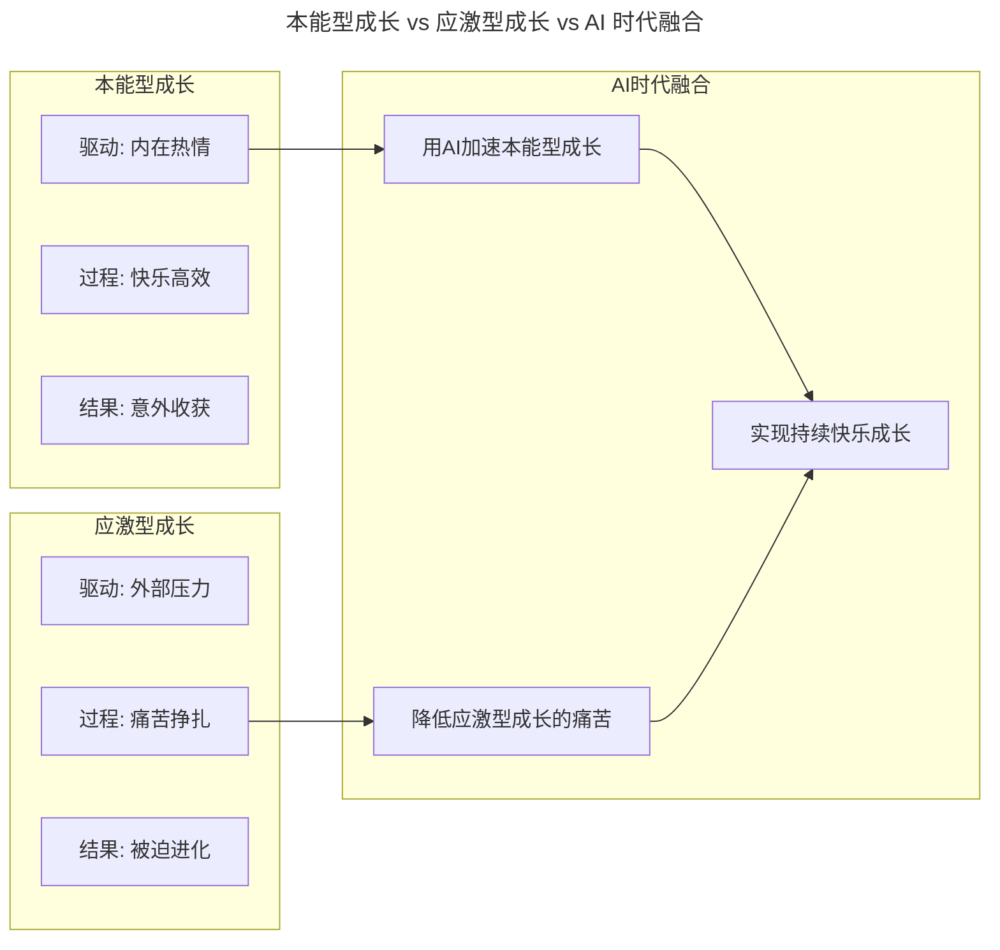
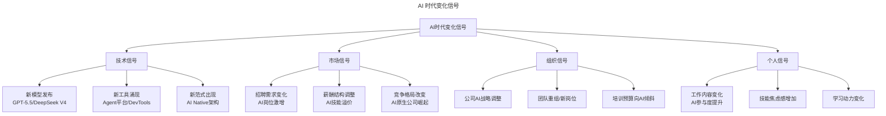
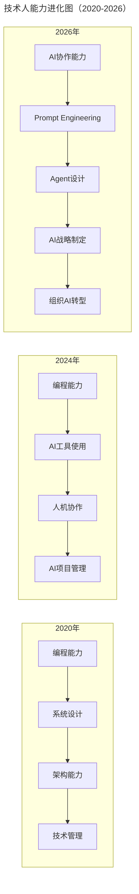
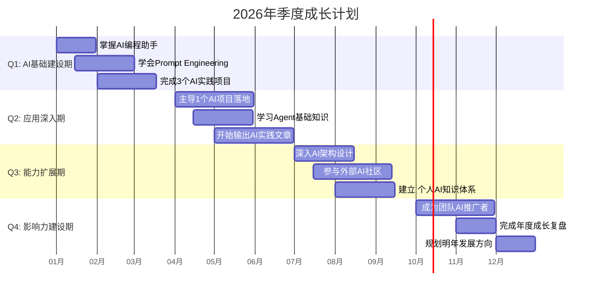
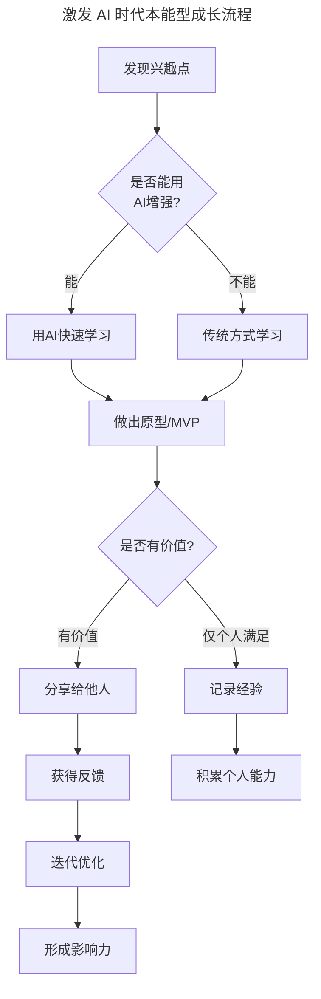

# 第150讲 | 暨家愉：技术人如何快乐的自我成长

> **适用范围**：技术从业者（初级到资深工程师）、技术管理者、创业者、面临职业成长与转型的技术人，以及在 AI 时代希望理解本能型/应激型成长、快乐成长方法论、打破舒适区的从业者。适用于个人成长、职业规划、技能升级、心态调整等场景。
>
> **更新摘要（v2 · 2026-08 更新）**：
> - 结构化升级为 6 节骨架（导言 / 核心方法论 / 关键流程 / 工具与实战 / 常见误区 / 进阶延展）
> - 整合原上下两篇与两份"AI 时代升级注解（2026）"，将本能型/应激型成长升级为 AI 时代新内涵
> - 为全部 Mermaid 图补充 `--- title: ... ---` frontmatter，并在每张图后追加文字解读
> - 补充 AI 时代成长新场景、快乐成长公式、30 天突破计划、季度路线图
> - 将原"作者简介"融入导言，原"快乐成长秘诀"融入进阶延展

---

## 1. 导言

### 1.1 技术人的两种成长类型

技术人的成长类型可以分两类，即本能型成长和应激型成长，一般来说，本能型成长的效率是较高的，但现实是，我们在多数情况下都面临着应激型成长，那我们该如何不那么痛苦地提升自己，一路升级打怪呢？

### 1.2 作者简介

暨家愉，阿里云解决方案架构师，TGO鲲鹏会会员。研究生毕业于美国伊利诺伊理工大学，曾任Teradata资深大数据专家，作为大数据Team Lead参与EMC内部首个大数据平台的设计与开发。15年作为技术合伙人从硅谷回国加入红茶移动并担任工程VP，一年时间带领技术团队完成对国内主流安卓厂商的海外漫游支持。16年底获得顺为和小米投资，联合创办小米生态链企业树米科技，专注于利用虚拟SIM技术和大数据技术，为企业搭建一站式物联网解决方案。

### 1.3 2026 年 AI 时代成长新范式

> ⭐ **2026年成长新范式**：当AI可以完成70%的编码工作，Agent能替代3-5人团队，技术人的成长路径从"深度专精"转向"AI协作+领域洞察+快速进化"——本能型成长和应激型成长的内涵需要重新定义。

---

## 2. 核心方法论

### 2.1 本能型成长

所谓本能型成长，我们可以理解为源于自己的意识、兴趣和愿望，或是你想要改变现状，渴望得到进步。

**案例1：SQL性能优化**——第一份工作在传统零售企业做技术，负责系统开发和测试。好奇心重，喜欢在测试环境对每个功能了解清楚。有次发现某功能运行特别慢，通过查代码发现一条SQL查询耗时2秒。分析后发现有更优做法，将查询稳定控制在20毫秒以内，实现指数级性能提升。又继续探索数据库 I/O、索引等影响性能的因素，从理论层面搞清楚问题根源。

**案例2：DevOps实验**——在美国工作时，因为接触云计算而充满好奇。在创业公司文化开放的环境下，申请做实验性项目，其中一个实验是利用云计算完成服务器的动态伸缩。期间遇到很多技术挑战，自学了开源 DevOps 工具和之前不熟悉的编程语言。最终这个实验项目变成一条生产线上使用的功能。

**共通点**：这两个例子的职位或职责跟这些任务没有一点相关性。SQL 性能调优正常属于 DBA，动态伸缩是运维的事。当时的作者只是遵循内心对这个事情的热情（Passion），一步步把事情做好，出发点不是为了达成 KPI 或得到技术成长，尽管结果确实达到了。

**本能型成长是最有效率的，过程也是最快乐的**，原因：
1. 你满足了自身的渴望。因为你想做，而且没有障碍，你做到了，所以你快乐。
2. 因为你真的想要做好这件事，所以你会废寝忘食地投入，用尽一切办法，自然成功的可能性也会更高。
3. 本能型成长可能带来意料之外的好处。譬如第二个例子中，因为杰出表现，老板后来给予加薪奖励。

**⭐AI时代本能型成长的新特征**：

| 特征 | 传统时代 | AI时代 |
|------|---------|--------|
| 触发点 | 个人兴趣、好奇心 | 兴趣 + AI能力放大效应 |
| 学习方式 | 查文档、问同事、试错 | AI辅助学习（快5-10倍） |
| 产出周期 | 数周或数月 | 数天或数周 |
| 影响范围 | 个人或小团队 | 可能影响整个组织 |
| 成长加速度 | 线性增长 | 指数级可能 |

### 2.2 应激型成长

对应激型成长的理解是，我们身处在某个环境中，由于外部因素的变化，导致自身不得不进行成长，以适应这些变化。

**创业案例**：创业早期，以为作为一个技术合伙人，自己的技术足够支持产品的实现就可以。事实证明，当时的认知完全不到位。作为一个技术合伙人，除了做好产品实现之外，还对很多其他技能有要求。马云老师说过"一个人走得快，一群人走得远"。技术合伙人很重要的一项能力就是搭建一个走得远的团队，包含识人和用人两方面要求。这些一切一切，都逼迫自己进行升级。

应激型成长的过程并没有本能型成长来得容易。因为：第一，这些要求来得有点突然，甚至让人措手不及；第二，应激型成长往往伴随着打破自己的舒适区。由于不是自愿发生的，应激型成长往往是一个痛苦的过程。

### 2.3 为什么应激型成长更重要

本能型成长由于受本性驱动，往往能够给我们带来更好的体验，而应激型成长则较为痛苦。那么是不是说，我们应更多地依靠本能型成长呢？答案并不是这样。**我认为应激型成长反而在个人职业生涯中扮演更重要的角色。**

**《人类简史》的例子**：当智人进入澳大利亚和美洲大陆之后，这两片大陆上许多原有的大型哺乳类动物在极短的时间内遭到了灭绝。有一种理论认为，这是由于这些原大陆上的霸主们对于新来的客人认识不足，对于他们的出没没有足够的危机意识。作为对比，在亚欧大陆上面的生物，由于随着智人的狩猎能力一起进化了数十万年，它们早已懂得了躲避危险。

外部世界的变化会要求我们必须作出相应的改变予以回应。假如没有在限定的时间里面完成应激和成长，那么面临的就是无情的失败，甚至是淘汰。

**Hadoop 架构师案例**：研究生毕业时赶上大数据热潮，在 EMC 数据湖项目第二期，EMC 加进来一位 50 多岁的架构师，对 Hadoop 生态完全没有概念。他每天拉着作者学习 Hadoop 生态相关知识，过程相当痛苦。但生活和工作的压力，让他不得不赶紧学会，不然很快就会被快速淘汰。

### 2.4 两类成长的 AI 时代对比与融合



图解：本能型成长由内在热情驱动、过程快乐高效、结果意外收获；应激型成长由外部压力驱动、过程痛苦挣扎、结果被迫进化。AI 时代融合两者——用 AI 加速本能型成长、降低应激型成长的痛苦，最终实现持续快乐成长。

### 2.5 关键策略：将应激型转化为本能型

**方法1：提前预判**
- 传统做法：等到变化发生才被动应对
- AI时代做法：每季度评估一次"哪些技能可能在6个月内变得重要？"，提前学习，用AI加速（把3个月的学习压缩到2周）

**方法2：找到乐趣**
- 传统做法：为了应付工作而痛苦学习
- AI时代做法：把"必须学"包装成"想要学"，用AI让学习过程更有趣，设定小游戏化目标

**方法3：建立正向循环**
```
本能型成长 → 取得成果 → 获得正反馈 → 更有动力 → 继续成长
     ↑                                                    ↓
     └─────────────── 形成习惯 ←──────────────────────────┘
```

---

## 3. 关键流程

### 3.1 拒绝意外：AI 时代的预见性

既然知道应激型成长的重要和无可避免，我们是不是有办法来减轻这种痛苦呢？

应激型成长痛苦的地方主要有两个：一个是在我们的预期之外，而且通常特别快；另外一个是要求我们打破自己的舒适区，做我们不擅长的事情。只要能够有效地应对这两点，就可以让痛苦减轻。

在这样一个信息过载的社会里，我们信息缺失的绝大部分原因肯定不会是因为信息的无法获取。我们应该尽可能地保持对信息的敏感度，并且通过信息进行判断，通过提早的预判，做好准备，来免除"惊喜"带来的痛苦。

**原文的信息获取渠道分类**：
1. 知识付费类平台和 APP——快速学到新技术，每节课一般只有 10-15 分钟，适合碎片时间学习
2. 网络公开课——正规大学课程，self-paced，可以更系统地学习一门技能
3. 聚合型新闻类 APP——汇聚不同来源的新闻资讯，行业分析、市场分析
4. 读书，特别是一些经典著作——"太阳底下无新事"，理解这些事对预判形势变化有帮助

**⭐AI 时代的信息获取升级**：

| 信息类型 | 传统方式 | AI增强方式 | 效率提升 |
|---------|---------|-----------|---------|
| 行业报告 | 手动搜索、阅读 | AI摘要+关键洞察提取 | 10x |
| 技术文档 | 逐页阅读 | AI问答式学习 | 5x |
| 竞品分析 | 人工对比 | AI自动分析差异 | 20x |
| 趋势预测 | 凭经验判断 | AI数据驱动预测 | 更准确 |

**⭐AI 时代的四大变化信号**：



图解：AI 时代变化信号分为四类——技术信号（新模型发布、新工具涌现、新范式出现）、市场信号（招聘需求变化、薪酬结构调整、竞争格局改变）、组织信号（公司 AI 战略调整、团队重组、培训预算倾斜）、个人信号（工作内容变化、技能焦虑感增加、学习动力变化）。保持对四大信号的敏感度，是实现预见性的基础。

### 3.2 "打破"舒适区

有了预见性之后，我们再来谈如何打破舒适区。

**认识舒适区**：舒适区本身不是一个物理空间，它更多的是在描述一个我们在熟知范围内行动的一种心理状态。我们乐于在这种既定的模式下面运作，因为这样，我们知道所有事物都是可控的，能够带给我们安全感。长期在舒适区里面生活甚至会给我们一种假象，认为自己已经很厉害了。当外界发生剧变的时候，长期处于舒适区的我们可能来不及反应。

**"打破" vs "走出"**：作者故意使用"打破"这个词，而不是"走出"。人是不需要离开舒适区的，或者说从当今社会分工的现实状况来说，为了整体社会生产更有效率，人在大部分情况下都不应该离开舒适区。举个例子，一个10年工作经验的程序员，让TA离开舒适区去当一个厨子，就是生产力的浪费。**打破舒适区的做法完全不一样**：譬如本身是服务器研发，可以选择往上下游扩充能力，去做中间件开发或前端开发，也可以选择向产品或测试转型，在有延续性的新岗位上利用研发经验延伸出不一样的思路。

**Hadoop 学习案例**：当年做大数据时，Hadoop 生态发展很快，刚对 1.0 架构有深入掌握，2.0 就开始被广泛讨论，Spark 的出现也让大家重新思考 MapReduce 的效率问题。作者凭借在 1.0 打下的基础，快速跟进学习 2.0，通过对比分析理解 2.0 设计的初衷；对于 Spark，先在 Coursera 完成 Functional Programming 课程，然后对照 MapReduce 研究 Spark 的框架和设计思路。通过新旧知识对比去学习，最终这些打破会融合原来的舒适区，给我们一个更大的舒适区。

**⭐AI 时代降低"打破"痛苦的方法**：
- 方法1：渐进式扩展——用 AI 作为"缓冲垫"，逐步扩展（Week 1 让 AI 辅助完成 20% 工作，逐步增加到 40%）
- 方法2：能力迁移法——找到新旧知识的连接点，用 AI 加速迁移（擅长 SQL → 用 AI 学写高效 Prompt；擅长调试代码 → 学调试 Prompt）
- 方法3：反向学习法——从高级场景倒推基础需求（正向学习 RAG 需 6 周，反向用 AI 搭建原型 2 天上手）

### 3.3 2026 年技术人能力进化图



图解：技术人能力进化图展示从 2020 年（编程能力→系统设计→架构能力→技术管理）到 2024 年（编程能力→AI 工具使用→人机协作→AI 项目管理）再到 2026 年（AI 协作能力→Prompt Engineering→Agent 设计→AI 战略制定→组织 AI 转型）的能力演进。2026 年能力的核心主线从"技术实现"转向"AI 协作与战略"。

---

## 4. 工具与实战

### 4.1 快乐成长公式（⭐2026）

```yaml
快乐成长公式:
  要素:
    - 兴趣驱动: 只做自己真正感兴趣的事
    - AI加速: 用AI让学习效率提升10倍
    - 正向反馈: 及时记录和分享每一个小成果
    - 社交支持: 找到志同道合的伙伴
  
  实践:
    每日:
      - 使用AI工具完成至少1项感兴趣的任务
      - 记录1个"今天学到的新东西"
    
    每周:
      - 尝试1个新的AI应用场景
      - 与朋友分享本周的AI发现
    
    每月:
      - 完成1个AI相关的side project
      - 输出1篇学习总结或经验分享
    
    每季度:
      - 复盘成长轨迹，调整方向
      - 设定下一季度的学习目标
```

### 4.2 30 天快速突破计划

```yaml
第一周: 评估与准备
  Day 1-2:
    - 完成AI能力自评（使用在线测试或自我评估表）
    - 识别当前舒适区的边界
  
  Day 3-5:
    - 选择一个要突破的方向（建议：Prompt Engineering）
    - 收集学习资源和工具
  
  Day 6-7:
    - 制定详细的学习计划
    - 找到一个可以实践的小项目

第二周: 浅尝辄止
  每天任务:
    - 学习30分钟新知识
    - 实践60分钟（用AI工具完成一个小任务）
    - 记录15分钟心得体会
  
  周末目标:
    - 能够独立完成一个简单的AI应用场景

第三周: 深入实践
  每天任务:
    - 解决一个实际工作中的问题（用AI辅助）
    - 尝试优化昨天的方案
    - 与同事分享你的发现
  
  周末目标:
    - 在工作中真正使用AI提效，量化效果

第四周: 总结与扩展
  每天任务:
    - 复盘本周的实践经验
    - 思考如何将经验推广到团队
    - 规划下一阶段的学习方向
  
  周末目标:
    - 输出一篇学习总结或实践分享
    - 设定下一个月的成长目标
```

### 4.3 季度成长路线图



图解：2026 年季度成长计划分四个阶段：Q1 AI 基础建设期（掌握 AI 编程助手、学会 Prompt Engineering、完成 3 个 AI 实践项目）、Q2 应用深入期（主导 AI 项目落地、学习 Agent 知识、输出文章）、Q3 能力扩展期（深入 AI 架构设计、参与社区、建立知识体系）、Q4 影响力建设期（成为团队 AI 推广者、年度复盘、规划明年）。

### 4.4 快乐成长的秘诀

**秘诀1：找到你的"AI热情点"**——不是所有人都对 AI 的每个方面都感兴趣。找到让你真正兴奋的点（效率控→AI工具链、创造者→AI产品开发、解决问题者→AI算法优化、帮助者→AI培训、战略家→AI战略咨询）。

**秘诀2：建立"微成就"循环**——大目标（成为AI专家）太遥远容易放弃，拆解为微目标（今天学会用AI写脚本、这周优化工作流程、这月完成AI小项目），每个微成就都记录下来。

**秘诀3：找到志同道合的伙伴**——公司内部（组建 AI 学习小组、参加技术分享）、线上社区（加入 AI 技术社群、关注 AI KOL、参与开源）、线下活动（参加 AI 会议、Hackathon、Meetup）。

---

## 5. 常见误区

### 5.1 认为应激型成长不重要

**误区**：认为主要依靠本能型成长就能达到进步最大值。

**正确认知**：应激型成长反而在个人职业生涯中扮演更重要的角色。外部世界的变化会要求我们必须作出相应的改变予以回应，假如没有在限定的时间里面完成应激和成长，那么面临的就是无情的失败，甚至是淘汰。

### 5.2 "走出"舒适区而非"打破"舒适区

**误区**：认为成长需要彻底离开舒适区，换个完全不同的工种。

**正确认知**：人是不需要离开舒适区的。10 年程序员去当厨子，对个人和社会都是生产力的浪费。**打破舒适区**是在有延续性的新岗位上利用原有经验延伸出不一样的思路，最终融合原来的舒适区，给我们一个更大的舒适区。

### 5.3 抗拒 AI 时代的应激场景

**误区**：抗拒 AI 工具的强制学习，或认为自己学不动新技术。

**正确认知**：AI 时代的应激场景（AI 工具强制学习、AI 项目失败后的反思、角色转变）虽然痛苦但有价值。被动接受→主动拥抱，这个转变本身也是成长。

### 5.4 忽视信息敏感度

**误区**：只做好技术，不关注行业和市场动态。

**正确认知**：你所处的行业发展情况、市场发展趋势，都会对你所处的公司造成影响，并间接影响到每一个人。应保持对信息的敏感度，通过提早预判来免除"惊喜"带来的痛苦。

---

## 6. 进阶延展

### 6.1 AI 时代本能型成长的新场景

**案例3：AI辅助代码审查**——发现 Code Review 效率低下，研究 AI 代码审查工具，配置适合团队的规则，集成到 CI/CD 流程。结果：Code Review 效率提升 300%、Bug 发现率提升 50%。关键点：这不是本职工作，但出于好奇和热情去做了。

**案例4：AI知识库构建**——新人入职后重复回答相同问题，用 AI 工具整理团队历史文档和问答记录，构建基于 RAG 的技术知识库。结果：新人上手时间缩短 60%、老工程师被打扰时间减少 70%。关键点：这源于对"知识管理"的热情。

### 6.2 如何激发 AI 时代的本能型成长



图解：激发 AI 时代本能型成长的流程为"发现兴趣点→判断能否用 AI 增强→用 AI 快速学习或传统学习→做出原型/MVP→判断是否有价值→分享给他人获得反馈迭代形成影响力，或记录经验积累个人能力"。

### 6.3 结语：快乐成长

> 在 AI 时代，成长不应该是痛苦的，而应该是一场充满惊喜和发现的旅程！

记住：
- **本能型成长**是最有效率的，过程也是最快乐的
- **应激型成长**在个人职业生涯中扮演更重要的角色
- 通过**提前预判**来"拒绝意外"，通过**打破舒适区**（而非走出）来实现持续成长
- 用 AI 加速本能型成长、降低应激型成长的痛苦，实现**持续快乐成长**

### 6.4 延伸阅读

- 暨家愉，TGO 鲲鹏会技术管理系列文章（《技术领导力 300 讲》）
- 《人类简史》—— 应激型成长的生物学例证
- 《微习惯》《刻意练习》—— 打破舒适区的方法论
- 本系列 AI 升级版（《技术领导力 300 讲》AI 版）

---

*本内容基于2026年AI技术生态编写，提供了一套完整的快乐成长方法论。记住：在AI时代，成长不应该是痛苦的，而应该是一场充满惊喜和发现的旅程！适用对象：技术从业者、技术管理者、创业者。*
