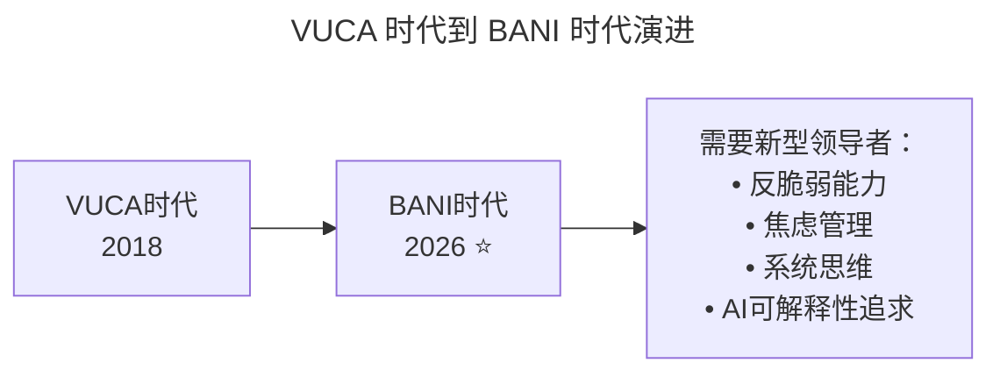
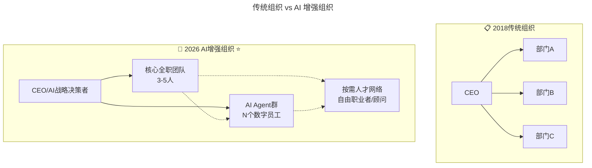

# 第63讲 | 未来组织形态带来的领导力挑战

> **适用范围**：技术领导者（技术总监、CTO、VP Engineering）、组织与人才负责人、创业者、关注组织变革与领导力发展的管理者。适用于组织变革、人才管理、领导力建设等场景。
>
> **更新摘要（v2 · 2026-08 更新）**：
> - 结构化升级为 6 节骨架（导言 / 核心方法论 / 关键流程 / 工具与实战 / 常见误区 / 进阶延展）
> - 整合原"AI 时代升级注解（2026）"内容，将 VUCA 升级为 BANI 框架，未来组织升级为 AI 增强组织
> - 为全部 Mermaid 图补充 `--- title: ... ---` frontmatter，并在每张图后追加文字解读
> - 补充 AI 时代员工需求新维度、领导者全新挑战、可执行建议
> - 将原文"分享来源"融入导言，原"延伸思考"融入进阶延展

---

## 1. 导言

### 1.1 领导力必须考虑时代背景

当我们谈论领导力的时候，一定要考虑到当前所处的时代，相比之前，如今的互联网更加垂直、个性和人性化。市面上有很多 Web1.0、工业 4.0 时代出版的管理书籍，里面涉及到术的层面的内容很多，有着各种各样的管理方法，但那些方法拿到现在已经不太好用了。大家有做管理的话，可能会发现用原来的方法管理员工，好像没那么灵了。

### 1.2 分享来源

本文整理自 TalentX 咨询公司创始人兼 CEO Tina Jiang 在 GTLC 全球技术领导力峰会上的精彩分享。

### 1.3 2026 年 AI 时代技术背景

2026 年，GPT-5.5 多模态大模型成熟商用、DeepSeek V4 开源模型性能比肩闭源方案、Stack Overflow 调查 84% 开发者正在使用或计划使用 AI 编程工具、Agent 智能体进入加速落地期。Tina Jiang 老师预测的"未来组织形态"在 2026 年已经部分成为现实——AI Agent 作为"数字员工"正在重塑组织边界和领导力内涵。

---

## 2. 核心方法论

### 2.1 VUCA 时代

有社会心理学家认为，新技术的发展速度远远超过了社会人文的发展速度，导致人们的人文观念、价值观和行为方式在新技术的革命浪潮中无所适从，很多被证明行之有效的范式和秩序正在被颠覆。

有个概念正是描述这一情况，即 **VUCA**。V 是 Volatility，代表易变性；U 是 Uncertainty，代表不确定性；C 是 Complexity，代表复杂性；A 是 Ambiguity，代表模糊性。

如今，世界已经进入 VUCA 时代。在 VUCA 中，对领导者来说，最难的就是模糊性。这种不确定的时代，企业需要适应时代要求，不断自我变革与创新，其中最难的、最深层次的变革就是组织与人的变革。对领导者的要求就是要敏锐感知影响组织与人变革的因素，洞见组织变革的趋势，使组织有前途，工作有效率，人才有活力。

### 2.2 人性与需求

关于人的变革，面对时代的差别，我们主要看的是思维。而思维又可以从**人性和需求**两个层面出发去改变。

**第一，讲思维时看人性**。传统认为人性是非黑即白的，但现在没那么容易区分了，而且善恶是动态发展的。同一个员工，可能在 A 公司工作表现不好，但跳到 B 公司后可能就截然不同。我们就流失过这样的员工，结果在那家公司表现非常好，因为那儿 Leader 信任他，同时给他空间。

**第二，讲思维时看需求**。常规来看，我们在公司里面讲需求，会先看是不是满足员工最基本的生存、舒服、安全等需求，然后再一级一级往上看。但是现在是混序的需求，作为 Leader，就需要能够鉴别员工的需求在什么地方。经济有时候不再是他们的主流需求，其他情感、归属、自我实现等方面的需求反而可能会浮现出来。

因此，我们要从人性和需求的角度出发，用动态的或生态的思维去看待人才。

### 2.3 未来的组织

除了人的因素之外，组织是领导者在这个复杂多变的时代需要去敏锐感知的另一个因素。未来的组织变革有以下特征：

- 未来组织中，工作形态及组织形式可能有一些变化，会**大幅度减少人跟人之间的关系绑定**，部门之间的边界也变得越来越模糊，**人才共享成为新常态**，大量随需而动的"云团队"不断涌现，增加了组织的敏捷性。
- 这需要人才能够拥抱变化，随时能够换部门、换老板、换任务、换同伴、换 KPI，对人的环境适应性提出了很高的要求。
- **公司外部的人才共享也将成为可能**。通过人才投标的方式，产生真正可以中标留下来的人才——头部人才，他们会拿到市场上几乎 80% 的机会。

在这样的组织形式下：
1. 未来组织最重要的职能将变成**赋能**，而不再是管理或者激励；
2. 未来的团队将偏向**小而美**，取得的成果跟团队规模没有任何关系，而是跟人才质量和人均效能有关；
3. 未来将有**全新人才的配置方式**，对领导者的能力提出更高的要求。

### 2.4 VUCA 时代的 AI 升级：VUCA → BANI

原文核心概念是 VUCA 时代（易变、不确定、复杂、模糊）。美国未来学家贾迈斯·卡西欧（Jamais Cascio）提出的 BANI 框架更能描述 AI 时代：

| VUCA | **BANI ⭐** |
|-----|-------------|
| **V**olatile（易变） | **B**rittle（脆弱）——系统看似强大但易崩溃 |
| **U**ncertain（不确定） | **A**nxious（焦虑）——信息过载导致无力感 |
| **C**omplex（复杂） | **N**on-linear（非线性）——因果关系不再清晰 |
| **A**mbiguous（模糊） | **I**ncomprehensible（不可理解）——AI 黑箱加剧认知困难 |

图解：VUCA 时代（2018）演进为 BANI 时代（2026），对领导者的要求升级为反脆弱能力、焦虑管理、系统思维、AI 可解释性追求。BANI 框架更精准地描述了 AI 时代"脆弱、焦虑、非线性、不可理解"的新特征。

### 2.5 人性与需求的 AI 时代变化

原文要点：人性非黑即白 → 动态发展；需求从马斯洛金字塔 → 混序需求。2026 年员工需求新增维度：

| 传统需求层次 | **AI 时代新增需求** |
|------------|------------------|
| 生存、安全 | **AI 不会取代我的安全感** |
| 归属、尊重 | **在 AI 协作中被需要的价值感** |
| 自我实现 | **与 AI 协同创造超越个人能力的成果** |

> 💡 **2026 Leader 必须回答的问题**："我的团队成员是否感到被 AI 威胁？我如何帮助他们建立'人机协同'而非'人机竞争'的心态？"

---

## 3. 关键流程

### 3.1 未来组织形态的 AI 时代现实

原文预测的部门边界模糊化、人才共享常态化、云团队大量涌现、赋能成为核心职能，在 2026 年这些预测已成现实，且更进一步：

图解：2018 年传统组织是"CEO 领导部门 A/B/C"的金字塔结构，2026 年 AI 增强组织是"CEO/AI 战略决策者领导核心全职团队（3-5 人）+ AI Agent 群（N 个数字员工）+ 按需人才网络"的网状结构。AI Agent 作为数字员工深度融入组织协作。

### 3.2 AI 时代领导者的全新挑战

原文提出的挑战：如何留住顶尖人才？如何影响和管理市场流动人才？

**⭐2026 新增挑战**：

| 挑战类型 | 具体表现 | 应对策略 |
|---------|---------|---------|
| **AI 角色定位** | 团队不清楚何时用 AI、何时用人 | 建立"人机分工指南" |
| **AI 产出质量** | AI 生成内容的质量控制 | 建立"AI 审核流程" |
| **团队凝聚力** | 远程+AI 协作导致人际关系疏离 | 设计"有温度"的人机协作文化 |
| **技能过时焦虑** | 员工担心被 AI 替代 | 提供"AI 赋能培训"而非"替代预警" |
| **决策透明度** | AI 参与决策的过程不透明 | 建立"AI 决策可解释"机制 |

### 3.3 头部人才与人才投标机制

举例来说，当决定做一种智能翻页器时，全职员工负责供应链、材料、软件等方向，然后由他们去市场上找到合适的顶尖的人才，于是产生了人才投标。通过这种方式会产生一些真正可以中标留下来的人才。而这些不断通过人才投标总能留下来的人才，或者总能拿到项目的人才就叫做头部人才，他们会拿到市场上几乎 80% 的机会。

这对于企业的好处在于，企业将永远能够拿到市场上更好的资源，而且不用花费大量的人力成本。

---

## 4. 工具与实战

### 4.1 给 2026 年领导者的可执行建议

#### 本周立即行动

1. 评估当前团队的"AI 成熟度"和"BANI 适应度"
2. 与核心成员一对一沟通，了解他们对 AI 的真实态度和担忧
3. 梳理工作中可以交给 AI Agent 的任务类型

#### 第一个月目标

- [ ] 建立"人机协作规范"（明确什么由人做、什么由 AI 做）
- [ ] 引入至少 1 个 AI 工具提升团队效率
- [ ] 开展一次"AI 与我们的未来"团队讨论会

#### 第一个季度目标

- [ ] 团队形成健康的"人机协作文化"
- [ ] 核心成员都具备基本的 AI 协作能力
- [ ] 建立 AI 驱动的决策支持体系

### 4.2 培养未来组织所需的能力

未来组织需要人才能够拥抱变化，随时能够换部门、换老板、换任务、换同伴、换 KPI。领导者需要帮助团队培养环境适应性，同时自身要具备留住顶尖人才、影响和管理市场流动人才的能力。

---

## 5. 常见误区

### 5.1 用旧方法管理新时代员工

**误区**：使用 Web1.0、工业 4.0 时代的管理方法管理现在的员工。

**正确认知**：市面上很多旧的管理书籍涉及术的层面的内容很多，但那些方法拿到现在已经不太好用了。大家会发现用原来的方法管理员工，好像没那么灵了。领导者需要用动态的或生态的思维去看待人才。

### 5.2 将人性看作非黑即白

**误区**：认为员工要么好要么坏，基于单一印象做判断。

**正确认知**：人性是非黑即白的传统认知已经过时，而且善恶是动态发展的。同一个员工，可能在 A 公司表现不好，但跳到 B 公司后可能截然不同，因为 Leader 信任他并给他空间。

### 5.3 只关注生存与安全需求

**误区**：认为员工需求主要是经济等生存层面的需求。

**正确认知**：现在是混序的需求。经济有时候不再是员工的主流需求，其他情感、归属、自我实现等方面的需求反而可能会浮现出来。在 AI 时代，员工还新增了"AI 不会取代我""被需要的价值感"等需求。

### 5.4 忽视 AI 时代的组织变革

**误区**：认为组织还是传统的金字塔结构，忽视 AI 带来的组织边界变化。

**正确认知**：未来组织最重要的职能将变成赋能，团队将偏向小而美，AI Agent 作为数字员工深度融入协作。领导者需要建立"人机分工指南"、设计"有温度"的人机协作文化。

---

## 6. 进阶延展

### 6.1 延伸思考

> ⭐核心理念：**2026 年的领导者，不是管理"人"，而是设计并优化"人+AI"的协作系统。**
>
> 最好的领导者不是最强的人，而是最能激发"人+AI"组合潜能的设计师。

### 6.2 未来组织的发展方向

在人才共享成为常态之后，未来组织将拥有全新人才的配置方式。当以项目制的方式工作时，除了少部分全职员工之外的大多数人都是市场流动人才，作为 Leader 需要去影响、领导他们并与他们沟通，这对领导者提出了非常大的挑战。未来组织的核心命题，从"如何管理团队"转向"如何设计人与 AI 协作系统"。

### 6.3 延伸阅读

- Tina Jiang 在 GTLC 全球技术领导力峰会上的分享
- 原文链接及更多组织变革系列文章（《技术领导力 300 讲》）

---

*本内容基于 2026 年 6 月的技术环境编写，随着 AI 技术的快速发展，部分具体工具和建议可能需要定期更新。适用对象：技术领导者、组织与人才负责人、创业者。*
