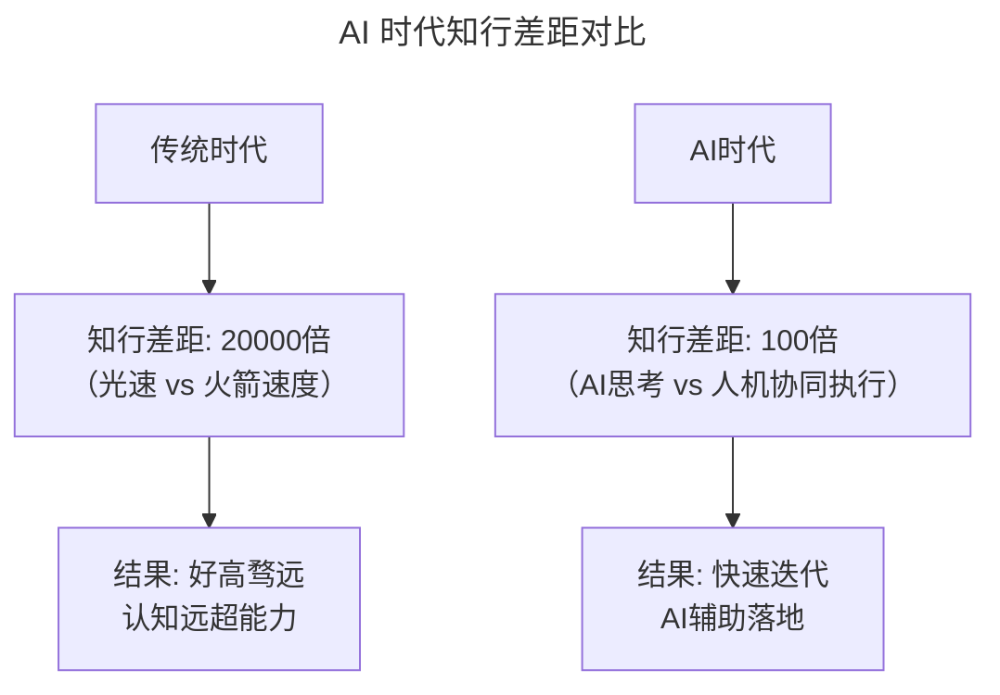
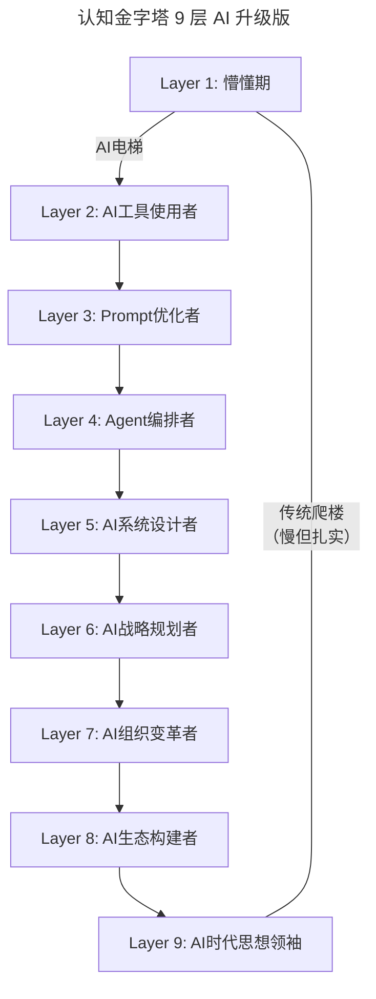
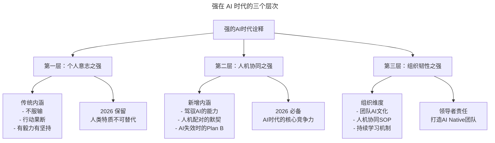
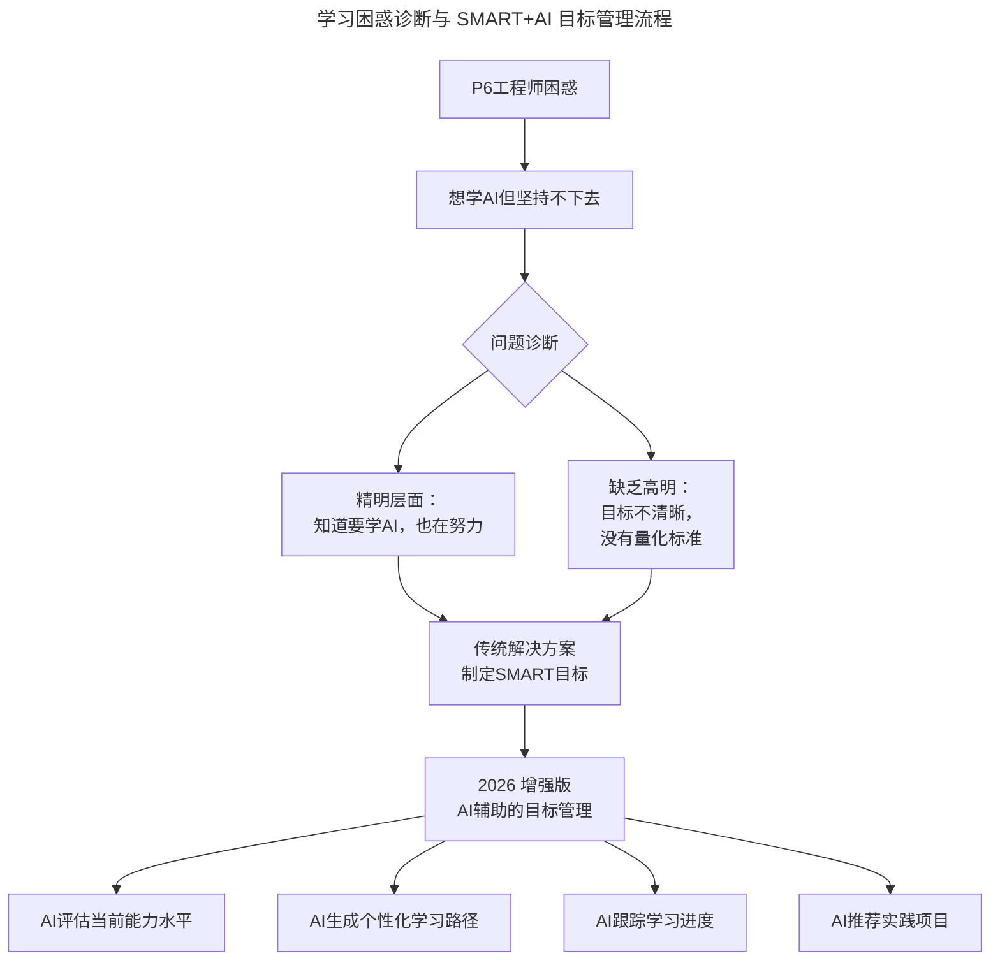
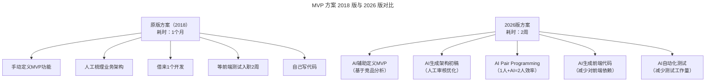
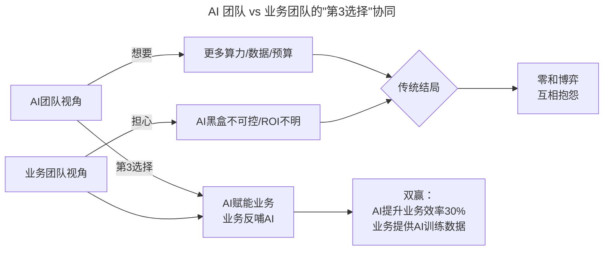
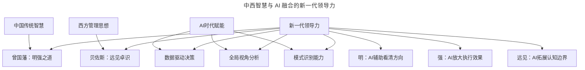
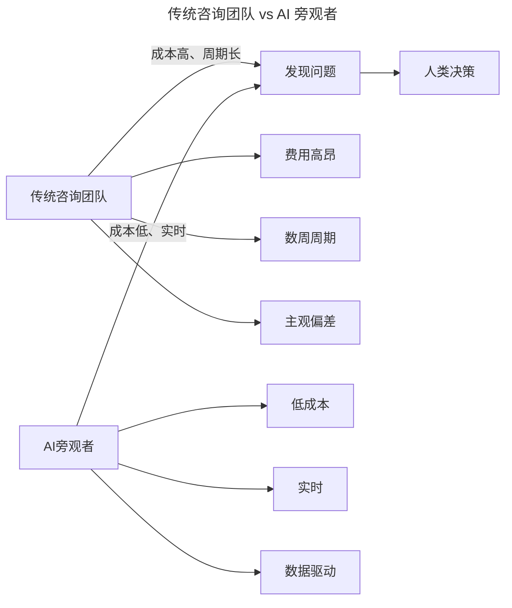

# 第106讲 | 程军：技术人的「知行合一」

> **适用范围**：技术管理者（技术总监、架构师、技术 Leader、CTO 候选人）、处于职业转型期的工程师、希望提升自我认知与领导力的技术人。适用于自我成长路径规划、领导力认知提升、人机协同团队建设、目标管理（SMART）等场景。
>
> **更新摘要（v2 · 2026-08 更新）**：
> - 结构化升级为 6 节骨架（导言 / 核心方法论 / 关键流程 / 工具与实战 / 常见误区 / 进阶延展）
> - 整合原文"知行合一""明""强"三大主题与三份"AI 时代升级注解（2026）"，重组为统一骨架
> - 保留全部 Mermaid 图并补充 `--- title: ... ---` frontmatter，每张图后追加文字解读
> - 移除 2 张失效图片引用（中间件博弈分析图、个人修行图），改用文字化描述
> - 将原"作者简介"融入导言，原"参考资料"融入进阶延展

---

## 1. 导言

### 1.1 认知与践行的差距：好高骛远的本质

先说我的观点，世界上大部分的人都是好高骛远的，字面意思就是脱离实际地追求目前不可能实现的过高、过远的目标。

至于其原因，本质是认知与践行的差距所造成的。具体可以类比人们用眼睛看远方某个目的地，和实际到达该目的地之间的差距。瞳孔成像的速度是光速即为 3×10⁸ 米/秒，而实际前往该目的地，即使你的工具是火箭，其速度最多也就是第二宇宙速度即为 11.2×10³ 米/秒，两者之间速度差距高达 **20000 倍**。

这个速度之差异，就是导致大多数人好高骛远的本质原因，也就是知与行之间无法统一。

### 1.2 认知金字塔：站得高才能看得清

假设有一个九层的认知金字塔，我们最开始懵懂的时候，其实是站在认知的第一层，这时让你去仰视这个金字塔，说出金字塔的形状，从视觉上来讲，你肯定会说这一个是三角形。但如果把金字塔同比放大，假设高达 50000 米，直冲云霄，这时你再去仰视它，肯定无法得出这是一个三角形的结论。

接着如果我再用直升机把你从一层以 1m/s 的速度慢慢送到 50000 米高，这时你再去看，会得出这还是一个三角形的结论。同一个东西，认知的不同、站的角度不同，看到的结果却不一样。

金字塔亦可类比我们中国的古塔（比如杭州的雷峰塔），我们从第 1 层到第 9 层，是需要一层一层爬上去的，不可能一下子就从第 1 层跨越到第 3 层，即使用直升机把你送上去，你的上升路径依旧是从第 1 层到第 2 层直至到第 9 层。

> **图解**：爬古塔就好比我们提升认知，你爬多快取决于你每一步的跨度有多远，而每一步的步长是有限制的，取决于你之前的认知高度，以及你在具体行动过程中运用的策略。提升的路径本身不能跳跃，只是不同方法带来的速度不一样而已。

### 1.3 作者简介

程军，现任贝壳技术总监，曾任饿了么技术总监、1 号店架构师，10 年以上互联网开发经验，8 年以上技术管理经验。

### 1.4 2026 年 AI 时代背景

2026 年，GPT-5.5 发布，DeepSeek V4 国产大模型崛起，84% 开发者已将 AI 编程作为日常工作方式，Agent（智能代理）进入加速落地期，人机协作成为新常态。在这个背景下，程军 2018 年提出的"知行合一"框架需要进行重要的时代升级——AI 恰好成为缩小"知"与"行"差距的关键工具。

---

## 2. 核心方法论

### 2.1 认知金字塔的 AI 时代重构：AI 缩小了"知"与"行"的差距



> **图解**：传统时代"知"（认知速度≈光速）与"行"（执行速度≈火箭速度）差距巨大，导致好高骛远；AI 时代通过"AI 思考 + 人机协同执行"把差距压缩到约 100 倍，使"知"与"行"变得可管理、可落地。

#### AI 如何缩短知行差距

| 维度 | 传统路径 | AI 增强路径 | 效率提升 |
|------|---------|-----------|---------|
| **学习新技术** | 读文档→实践→踩坑→掌握 | **AI 解释→AI 生成示例→实践→掌握** | 5x |
| **设计方案** | 经验积累→尝试→失败→优化 | **AI 生成方案→人类审核→快速迭代** | 10x |
| **代码实现** | 思考→编写→调试→修复 | **Prompt→AI 生成→审查→微调** | 3-5x |
| **问题排查** | 日志分析→猜测→验证→定位 | **AI 分析日志→定位根因→建议修复** | 10x |

> **2026 新公式**：传统知行差距 = 认知速度 − 执行速度 = 巨大落差；AI 时代知行差距 =（认知速度 + AI 辅助）−（执行速度 + AI 自动化）= 可管理的差距。

### 2.2 认知金字塔的 9 层 AI 升级版：AI 提供"电梯"，但仍需每层停留消化



> **图解**：AI 提供了"电梯"让你更快到达认知高层，但你仍需在每一层停下来真正消化和理解。各层能力从"会用 AI 编程工具"到"AI 时代思想引领"逐步递进，且每层都离不开对人类判断力的要求。

#### 各层特征与 AI 赋能

| 层级 | 传统特征 | AI 时代特征 | 关键能力 |
|------|---------|-----------|---------|
| **L1-L2** | 学习基础语法 | 学会用 AI 编程工具 | Copilot/Cursor 熟练度 |
| **L3-L4** | 掌握框架原理 | 能写高质量 Prompt、设计 Agent | Prompt Engineering |
| **L5-L6** | 架构设计能力 | AI 系统架构、模型选型 | 技术判断力+AI 理解力 |
| **L7-L8** | 团队管理能力 | 人机协同组织设计 | 领导力+AI 文化塑造 |
| **L9** | 行业影响力 | AI 时代思想引领 | 远见+AI 伦理洞察 |

### 2.3 "明"的三个层面：光明、高明与精明

曾国藩曾说过，"担当大事，全在'明''强'二字"。"明"字由日、月两部分组成，在甲骨文中以日、月发光表示明亮、光明，即正确的方向。对"明"的理解主要有三个层面：

- **一、明即光明（正确方向）**：因为每个人看待问题的方向与角度不同，相同的问题，每个人得出的方法与结果也会有所差异。面对问题，首先要认清正确的方向，这是关键，再坚持去执行。我们公司有一条朴素的价值观——坚持去做难而正确的事。
- **二、高明与精明（战略与战术）**：曾国藩有言"明有二端，人见其近，吾见其远，曰高明；人见其粗，吾见其细，曰精明"。高明是战略层面（看得深远），精明是战术层面（看得细致），二者高度结合才成大器——"古之成大事者，规模远大与综理密微二者缺一不可"。
- **三、当局者迷，旁观者清（跳脱视角）**：下棋的人都知道，旁观者不受胜负输赢的影响，自然脑子清醒，可以从两方棋手的角度看待问题；当局者因胜负输赢与自己息息相关，很容易看不清局势。

### 2.4 "强"的三个层次：自强、韧性与永不放弃

"强"就是指刚强、倔强、自强和坚持，强调的是意志力、毅力、定力和决心的力量。

- **天行健，君子以自强不息**：曾国藩说"从古帝王将相，无人不由自强自立做出"。关键在于决心——一种超乎寻常力量的东西。做事更多是价值驱动，认可价值后就坚持执行直到拿到结果。
- **打落牙齿和血吞**：曾国藩平生有四大堑（秀才考试被公开批评文理浅、上疏画图遭鄙夷、岳州靖港兵败遭官绅鄙夷、九江兵败被围困遭嘲笑）。面对这些难关，他从不怨天尤人，总是反求诸己，不断总结经验教训。
- **永不放弃**：丘吉尔最后的演讲只说了一句"永不放弃、绝不、绝不、绝不"；稻盛和夫说"成功和失败的不同点就是坚忍与毅力"；任正非说"经历九死一生还能好好活着，这才是真正的成功"。



> **图解**：2026 年的"强"是多维度的：既要有传统的意志力和毅力，更要有驾驭 AI 的能力和人机协同的智慧。AI 可以让强者更强，但不能替代你想变强的决心。

---

## 3. 关键流程

### 3.1 先行者"行"背后的逻辑：分类法与因时而变

咱们《技术领导力 300 讲》更新到现在已经有 130 多篇文章了。很多文章并没有告诉你背后的逻辑，不妨解读一下先行者们这么做背后的逻辑与原因。

**核心洞察**：
- **分类法**（第 5 讲《CTO 的三重境界》）：作者把 CTO 分为冲锋陷阵型、指挥若定型和引领方向型三类。这种分类法基本可以覆盖现实中绝大多数 CTO，是各个领域屡试不爽的办法。
- **因时而变、因势而变**（第 7 讲《要制定技术战略，先看清局势》）：把管理的核心收敛在人和事，只是不同时期关注的人和事的角度和深度都不一样，但万变不离其宗。
- **赏罚分明，有温度的激励**（第 18 讲《做到这四点，团队必定飞速成长》）：识人、规划路径、扶上马送一程、赏罚分明。把奖励方式与员工家庭绑定，花不多的钱，但攻了员工的心智。

> **案例补充**：大咖对话《让团队持续的 enjoy》——要让成员 enjoy 并持续做好事，其中一个非常重要的抓手就是文化。leader 不能照搬全抄，必须先自己认同，再转化为自己的东西，再传递给团队成员，这个承上启下的过程必不可少。比如 2015-2016 年系统经常宕机发生 P0 事故，团队搞了一个"作战室文化"，领导坐阵指挥，问题一一被解决，还沉淀出排查恢复 SOP 和作战工具。

### 3.2 "明"的 AI 增强流程：光明 = AI 辅助的方向判断

#### 原文案例：招聘 120 个 Go 语言开发者的困境

一位朋友在 8 月跟我倾诉，老板要求年底前招聘 120 个左右有经验的 Go 语言开发者。常见解决方案有三种：增加更多专业猎头渠道；统计收到简历到入职的转化率，提升各环节转化率；提高内推奖金。但我的建议是：首先要考虑整个上海的 Go 语言开发者容量有多大，用资源（HR+猎头）进行估算，再乘以转化率，才是理想招聘数量。如果与目标 120 人有较大差距，以上所有解决方案都无效。

过了一周他告诉我，按实际估算的结果来看，120 这个目标根本达不成。不久后问题有了新的解决思路——招一些其他语言并愿意转到 Go 的程序员。

**⭐ 2026 新案例：AI 时代的人才困境**

```
场景：老板要求3个月内团队AI成熟度达到Level 3

传统思维：
❌ 增加培训预算
❌ 强制使用AI工具
❌ 招聘AI专家

AI时代的"光明"方向：
✅ 先评估现状：当前团队AI成熟度是Level 1
✅ 用数据分析可行性：
   - Level 1→2 需要2个月（工具配置+基础培训）
   - Level 2→3 需要4个月（项目实践+文化塑造）
   - 总计需要6个月，不是3个月
✅ 与老板沟通：展示数据和路径，调整预期
✅ 寻找替代方案：先在1个试点团队达到Level 3，再推广
```

### 3.3 高明与精明的平衡流程：SMART + AI 目标管理

#### 原文案例：P6 后端研发同学的学习困惑

一位 P6 的后端研发同学说自己喜欢研究新的框架和技术，但坚持一段时间后就坚持不下去了。我问了他两个问题：学习目标达到了吗？你觉得差距有多少？他回答不上来。我认为他是精明的——知道自己想要什么，并且很努力，只是结果不如意罢了。

随后我与他制定了一个切合实际的目标，按 SMART（s=特定细分、m=可测量评估、a=可触达、r=依赖的资源、t=时间）原则细化，先制定 1 个月的目标，再分解到每周，且要可量化、可评估，同时重点考虑可依赖的已有资源。



> **图解**：面对"想学但坚持不下去"的困境，先用精明（明确努力方向）与高明（量化目标）两层诊断，再叠加 AI 辅助的目标管理——评估、生成路径、跟踪进度、推荐实践，形成闭环。

#### SMART + AI 原则

| 维度 | 传统 SMART | SMART + AI |
|------|----------|------------|
| **S (Specific)** | 明确的学习目标 | **AI 能力雷达图：标注当前水平和目标水平** |
| **M (Measurable)** | 可量化的指标 | **AI 自动追踪：代码提交中 AI 辅助占比、Prompt 质量评分** |
| **A (Achievable)** | 可达成的目标 | **AI 模拟预测：基于历史数据预测达成概率** |
| **R (Relevant)** | 与工作相关 | **AI 推荐：与当前项目最相关的 AI 技能** |
| **T (Time-bound)** | 有时间限制 | **AI 提醒：自适应调整里程碑** |

### 3.4 "以终为始"的 AI 增强流程：程军的 MVP 案例

#### 原文案例回顾

今年 5 月底，我加入现在的公司，成为本部门的 1 号员工。入职第 2 天，领导就提出了期望产品能在 1 个月内上线。当时团队除了我，什么人都没有。我的解决方案：和产品同学商量这一期 MVP 版本的产品功能；深入了解需求，整理业务架构、表结构模型并搭起系统架构；和兄弟部门借来 1 位开发；前端和测试的同学分别 2 周后入职；自己也参与代码编写。最终产品如期上线，上线一个月后达到每日 3000 单的交易量。

后来才知道领导用的是"以终为始"的方法——先确定目标，剩下是你要去考虑的。这也印证了：领导要做正确的事，作为下属的我们要把事正确地完成。



> **图解**：2018 年版依赖人工定义 MVP、梳理架构、借调资源、等待入职；2026 年版借助 AI 压缩到 2 周，实现"1 人 + AI ≈ 2 人生产力"。核心精神不变——"战号一旦吹响，炊事班也得拿着菜刀和大锅冲上去"。

#### 2026 版的 5 步解决方案（AI 增强）

| 步骤 | 原版（2018） | 2026 版 | 效率提升 |
|------|-------------|----------|---------|
| **1. MVP 定义** | 和产品同学商量 | **AI 分析竞品，自动建议 MVP 范围** | 50% |
| **2. 架构设计** | 手动整理业务架构、表结构 | **AI 生成架构草案，人工审核调整** | 70% |
| **3. 资源协调** | 借来 1 个开发 | **1 人+AI Copilot≈2 人生产力** | 100% |
| **4. 前端实现** | 等前端入职 2 周 | **AI 生成 80% 前端代码** | 60% |
| **5. 测试上线** | 手动测试 | **AI 自动化测试+AI Ops 监控** | 80% |

### 3.5 TMS 系统故障排查案例：AI 时代的"打落牙齿和血吞"

#### 原文案例回顾

在 1 号店负责 TMS 系统（物流运输管理系统）研发时，订单数据（WMS 调用 WMS 订单接收接口）过来得特别慢，基本每秒 1-2 个订单。同事"包子"（技术高手，现阿里高 P）排查了大半天未果。故障发生在周六上午 10 点，眼看要到凌晨 2 点还没修复，最后只能在可能出现问题的地方加调试代码（耗时监控），紧急上线。最终定位到核心配送单分配逻辑中一个基于内存分词索引解析和复杂 SQL 查询——SQL 运行一次要 600ms。打电话问 DBA，排查后发现是组合索引失效了。修复后一行业务代码也没改。

后来复盘才知道：Oracle 收集表数据的定时任务停了，执行计划从走联合索引变成全表扫描。整个过程持续约 13 个小时（加上同事的时间约 24 小时）。事后我们追问为什么 DBA 没有异常告警，这个锅可以甩给他们，但想一下有意义么——我们才是系统的 owner。

```
时间线对比：

传统方式（原文）：
├─ 周六10:00 故障发生
├─ 包子排查半天（日志、慢SQL、调试代码）
├─ 你加入，继续排查
├─ 周日02:00 加入更多调试代码
├─ 周日07:00 定位到SQL问题
└─ 总计：13小时+

AI增强方式（2026）：
├─ 10:05 AI自动检测到异常（APM工具）
├─ 10:10 AI分析慢查询日志，定位到可疑SQL
├─ 10:15 AI检查执行计划，发现索引失效
├─ 10:20 AI生成修复建议（重建索引）
├─ 10:25 人工审核确认，执行修复
└─ 总计：25分钟
```

> **关键点**：AI 可以加速排查，但人类的判断力和责任心不可替代。程军选择主动帮忙而不是"这不是我的系统"，这种 Owner 意识在 AI 时代更加重要——因为 AI 让边界模糊了，更需要主动跨界的"强"。

---

## 4. 工具与实战

### 4.1 协同思维与"第 3 选择"：从零和博弈到双赢

原文核心观点来自《易传》"一阴一阳谓之道"、王阳明的"知行合一"理论、曾国藩的"凡成大事，以识为主，以才为辅"、周总理的"求同存异"策略等。这些理论都由两个层面的内容构成，如阴阳、知行、识才、存异、带路等。这个世界上，很多东西都是成双成对、辩证且统一的，两者之间存在一个协同或撬动的工具。

**中间件部门 vs 业务部门的博弈案例**：
- 中间件部门刚成立，公司系统调用关系复杂，没人敢改动核心模块，排查问题困难，系统耦合严重导致需求上线拖延。
- 业务部门订单量已达 10w/天，每次发布小心翼翼，流量大时想降级不关键业务很麻烦，紧急需求不能按需发布。

从概率上说，双赢的概率是 25%，但我们认知中会觉得这事压根不可能。破解方法是双方坐下来敞开心扉移情沟通，相互了解两方对于这件事赢的标准，运用协同、知行合一等理论，重新定义新的双赢标准并通过协作执行。这样结果是业务交付更快、排查问题更快，且中间件团队感觉工作有价值并被认可——这才是协同产生的 1+1>2，持续践行甚至等于 100。



> **图解**：传统零和博弈（互相抱怨）vs"第 3 选择"（AI 赋能业务、业务反哺 AI）达成双赢——AI 提升业务效率 30%，业务为 AI 提供训练数据，双方都"enjoy"。

#### "第 3 选择"在 AI 时代的应用

1. **AI 不是替代人类，而是放大人类**：中间件团队用 AI 自动生成 SDK 文档、代码示例；业务团队用 AI 快速接入中间件，降低使用门槛。结果：双方都 enjoy。
2. **作战室文化的 AI 版本**：AI Ops 中心 + 人类专家坐镇——AI 实时监控告警、自动定位根因、生成修复建议，人类做最终决策和复杂协调。

### 4.2 贝佐斯"远见卓识"的 AI 时代诠释

亚马逊领导力准则之远见卓识的官方解释是：局限性思考只能带来局限性的结果。领导者大胆提出并阐明大局策略，由此激发良好的成果。他们从不同角度考虑问题，并广泛寻找服务客户的方式。

核心理解：领导者一定要从不同的角度去思考，不局限、不武断，并且开放、包容，可以简单概括为"远见"二字。

| 原则 | 原文解读 | 2026 新内涵 |
|------|---------|-------------|
| **局限性思考** | 只能看到局部 | **AI 可以帮你看到全局数据，但仍需人类判断优先级** |
| **大胆提出策略** | 领导者的胆识 | **大胆提出 AI 转型策略，但小步快跑验证** |
| **不同角度** | 多维思考 | **加入 AI 伦理、社会影响、人机关系等新角度** |
| **广泛寻找** | 服务客户的方式 | **用 AI 发现未被满足的客户需求** |



> **图解**：中国传统智慧（曾国藩明强之道）与西方管理思想（贝佐斯远见卓识）在 AI 时代融合，形成"明（AI 辅助看清方向）+ 强（AI 放大执行效果）+ 远见（AI 拓展认知边界）"的新一代领导力。

### 4.3 AI 时代的"超级旁观者"

原文案例：1 号店 CEO 于刚先生邀请咨询团队了解 C 端用户购买退换货体验和内部支撑系统体验。咨询团队提出了非常多的问题和优化建议。当时团队并不理解这种"太信任的体现"，认为系统已经非常好，改进空间不大。但结果证明咨询团队的建议非常有价值——从 C 端提升用户体验出发解决退换货问题，推出订单半日达服务；从内部效率出发，WMS 从人工波次改成系统自动波次+人工波次结合，TMS 优化配送路径，配送效率提升、用户投诉减少。

后来读于刚先生的《激情创业：让不可能变为可能》才明白，他当时的做法是希望找一个身在局外的团队去发现问题、去无情地暴露问题。因为局外人通常站在公司内部和用户双方角度思考，更容易跳出局限，直击要害。这就应了曾国藩的话：任事者，当置身利害之外，建言者，当设身于利害之中。

| 场景 | 当局者（团队） | 旁观者（AI） | 发现的问题 |
|------|--------------|-------------|-----------|
| **代码质量** | "我们的代码没问题" | **AI Code Analysis** | 重复代码占 30%，可重构 |
| **架构设计** | "这是最优方案" | **AI Architecture Review** | 存在单点故障风险 |
| **研发效率** | "我们效率很高" | **AI Metrics Dashboard** | Code Review 平均等待 3 天 |
| **用户体验** | "用户很满意" | **AI User Behavior Analysis** | 核心流程转化率低于行业 20% |



> **图解**：传统咨询团队"成本高、周期长、有主观偏差"；AI 旁观者"低成本、实时、数据驱动"，两者最终都归于人类决策。AI 作为客观第三方视角，成为持续、廉价的"旁观者清"机制。

### 4.4 培养"强"的日常练习

| 层面 | 行动 | 频率 |
|------|------|------|
| **个人** | 学习一个新 AI 工具或技巧 | 每周 |
| **团队** | 分享 AI 成功/失败案例 | 双周 |
| **组织** | 举办 AI Hackathon | 季度 |
| **行业** | 参与 AI 开源社区贡献 | 持续 |

---

## 5. 常见误区

### 5.1 认知层面的误区

| 误区 | 表现 | 解决方案 |
|------|------|----------|
| **好高骛远** | 刚学会用 AI 就想颠覆一切 | 从小胜开始，逐步扩大 AI 使用范围 |
| **认知假象** | 觉得自己懂了其实只是皮毛 | 深入理解 AI 原理，不只是会用工具 |
| **行而不自知** | 用 AI 但不知道为什么有效 | 定期复盘，总结 AI 使用的最佳实践 |
| **知行脱节** | 学了很多 AI 理论但不实践 | 强制自己在每个项目中都用一次 AI |

### 5.2 "明"与"强"层面的误区

| 误区 | 表现 | 解决方案 |
|------|------|----------|
| **AI 伪光明** | 盲目跟风 AI，没有明确方向 | 先想清楚"为什么用 AI"，再想"怎么用 AI" |
| **只有精明没有高明** | 陷入 AI 工具细节，忽视战略 | 每周留出"高明时间"做战略思考 |
| **拒绝 AI 旁观者** | 不相信 AI 的分析结果 | 小范围验证 AI 建议，建立信任 |
| **过度依赖 AI 判断** | AI 说什么就做什么 | AI 提供建议，人类做最终决策 |
| **伪坚强** | 表面拥抱 AI，内心抵触 | 真正尝试一次，体验 AI 带来的效率提升 |
| **AI 依赖症** | 离了 AI 就不会干活 | 保持核心技术功底，AI 是放大器 |
| **放弃太快** | AI 第一次用不好就放弃 | 给自己和 AI 3 次机会，优化 Prompt 再试 |
| **盲目坚持** | 明明 AI 不适合的场景硬要用 | 清楚 AI 的能力边界，该用手动就手动 |

---

## 6. 进阶延展

### 6.1 可执行的 2026 行动清单：知行合一 AI 版

```
Week 1-2: 知 - 学习AI工具
├─ 安装Copilot/Cursor/Windsurf
├─ 完成10个AI辅助编程练习
└─ 建立"AI能做什么/不能做什么"的认知

Week 3-4: 行 - 在项目中实践AI
├─ 用AI完成1个真实需求开发
├─ 记录AI使用的坑和心得
└─ 分享给团队成员

Month 2: 合 - 优化AI工作流
├─ 建立个人Prompt模板库
├─ 设计人机协作SOP
└─ 达成"AI辅助产出占比>50%"的目标

Month 3+: 一 - 持续进化
├─ 跟踪AI技术动态（GPT-5.5、DeepSeek V4等）
├─ 尝试Agent开发
└─ 成为团队的AI Champion
```

### 6.2 培养"明"的三个练习

1. **每周 AI 复盘**：问自己，这周 AI 帮我发现了什么我没注意到的问题？工具：AI Meeting Summary + 个人反思日志。
2. **建立"AI 旁观者"机制**：每月让 AI 分析一次团队工作方式，关注效率瓶颈、协作障碍、潜在风险，选择 1 个 AI 建议并执行。
3. **高明与精明的平衡训练**：高明练习——每月花 2 小时思考团队 6 个月后的 AI 状态；精明练习——每周用 AI 优化一个具体工作流程。

### 6.3 培养"强"的三个练习

1. **每日 AI 挑战**：每天强制自己在工作中使用一次 AI，记录用了什么工具、解决什么问题、节省多少时间，30 天后形成肌肉记忆。
2. **每周"打落牙齿"复盘**：本周 AI 使用中的失败案例是什么？如何应对？如果重来一次会怎么做？从中学会了什么？
3. **每月"自强"评估**：这个月的 AI 能力有什么提升？人机协同效率是否提高？是否遇到新的"堑"？如何克服？

### 6.4 团队认知升级三步走

1. **建立 AI 知识共享机制**：每周分享 1 个 AI 使用技巧，共享 Prompt 模板库，组织 AI Hackathon。
2. **创建"AI 成功案例库"**：记录每次 AI 带来的效率提升，量化 ROI（时间节省、质量提升），月度复盘持续优化。
3. **培养"AI 批判性思维"**：不盲信 AI 输出，建立 AI 输出审查 Checklist，定期讨论 AI 的局限性和风险。

### 6.5 核心结论

程军的"知行合一"在 AI 时代有了新的内涵——**知道 AI 能做什么 → 实际用好 AI → 持续优化人机协作**。AI 提供了"电梯"让你更快到达认知高层，但你仍需在每层停下来真正消化和理解。

同时，程军对"明"的三层解读（光明、高明精明、当局者迷旁观者清）和对"强"的解读（自强不息、打落牙齿和血吞、永不放弃）在 AI 时代不仅不过时，反而更加重要。正如贝佐斯和曾国藩的"英雄所见略同"，2026 年的领导者需要的是**中西智慧与 AI 能力的融合**。

> **程军金句**："我点上一只黄鹤楼，一直践行在路上。"2026 年，让 AI 成为你路上的伙伴，而不是替代你走路的人。记住：AI 可以让强者更强，但不能替代你想变强的决心。

### 6.6 延伸阅读

- 《第 3 选择》（史蒂芬·柯维）：关于如何培养协同思维、找到协同方式
- 《激情创业：让不可能变为可能》（于刚）：关于"当局者迷，旁观者清"与外部视角的价值
- 极客时间《技术领导力 300 讲》：第 5 讲《CTO 的三重境界》、第 7 讲《要制定技术战略，先看清局势》、第 18 讲《做到这四点，团队必定飞速成长》
- 极客时间《技术和商业案例解读》：第 89 讲亚马逊领导力准则之远见卓识
- 知识星球"小卒吾「知行合一」"（星球号 5139329）：探讨技术人认知与领导力实践
